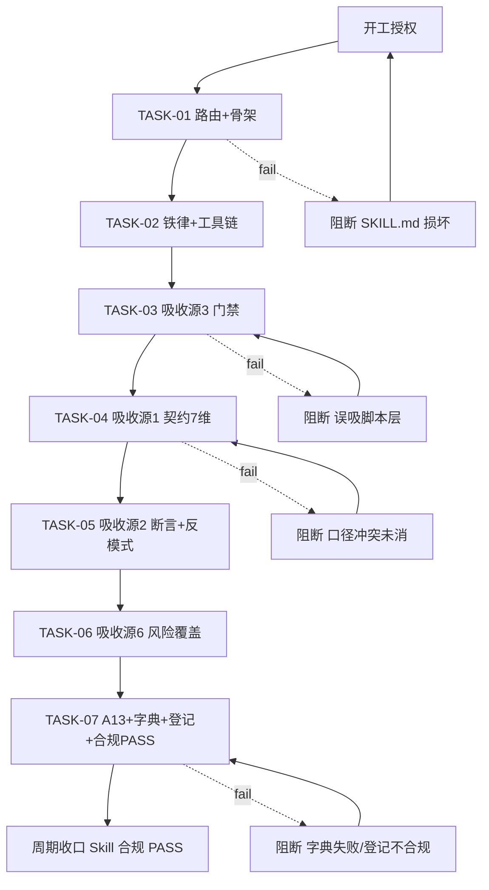

# 实施总览：从 GitHub/workbuddy 市场吸收接口用例类 skill 精华补强 apifox「接口用例」覆盖

## 1. 当前计划最终方案简要说明

- 方案一句话：从 GitHub 吸收 4 个 MIT 合规源（api-contract-test-skill、petrkindlmann/qa-skills、buer2233/ai-api-test-skill、fishzjp/qa-skills）的接口专项用例精华，新增 apifox 独立模块 `modules/debug-case.md` 作为接口用例（DEBUG_CASE）唯一权威，并把「每个有 body 接口 ≥1 非空 DEBUG_CASE」纳入项目接入硬动作 A13。
- 主落点：`apifox-cli__skillhub/` 新增 `modules/debug-case.md`；增强 `test-contract.md` / `test-case.md` / `testing-pitfalls.md` / `test-case-from-requirement.md` / `test-selection-policy.md` / `test-auth.md`；SKILL.md 路由表补「调试用例/接口用例」入口；onboarding-checklist 补硬动作 A13。
- 为什么走这条：现状接口用例只有 test-case.md 规则 T-3 一处专属规则，无独立路由、无覆盖度铁律、无批量工具链，单点补丁无法从入口解决「接口用例太少」；且你已确认「新增独立模块」；走 skill-absorption-rules 外部吸收通道（2026-08-19/2026-08-30 同型先例）。

## 2. 基本信息

- 来源对象标识：`SKILL-ABSORB-INTERFACE-CASES-20260901`
- 实施总览落点：`doc/3-实施/2026-09-01_000000_SKILL-ABSORB-INTERFACE-CASES-20260901_实施总览.md`（实施阶段创建，命名按 artifact-storage-rules）；6-review 落点：`doc/6-review/2026-09-01_000000_SKILL-ABSORB-INTERFACE-CASES-20260901_6-review.md`
- 全量顺序实施方案：`N/A + 原因（单来源对象单闭环，非新项目/多需求场景）`
- agent 理解的问题/目标：你反馈 apifox 测试用例、接口用例比单元测试少，尤其接口用例只有 1 条，要求从 github + workbuddy 的 skill 市场吸收补强。探索确认：接口用例（DEBUG_CASE）确实只有 T-3 一处专属规则；workbuddy 市场侧本环境不可查（本地 `.workbuddy/skills` 是指向本仓库的 junction，skillhub 站点不可达），可吸收源实际全在 GitHub。
- 本轮范围：8 源逐一审（已完成）→ 新增 debug-case.md → 增强 6 模块 → SKILL.md 路由 → onboarding-checklist A13 → 字典刷新 → absorption-map/source-notes 登记 → 合规 PASS/FAIL。
- 非范围：不吸收脚本层/pytest/mitmproxy/Pact 工具链；不引入源4 naodeng 非商业许可原文；不新增依赖；不改 test-strategy-rules 用例设计方法权威；不实现 apifox CLI；不动 `.workbuddy/skills` junction。
- 当前优先闭环：新增 debug-case.md + 落地 A13，让「接口用例」从路由可命中、有独立权威、有覆盖度铁律。
- 关键假设：apifox CLI `export --format apifox` 可读 `api.cases[]`、match-name 重导可写 DEBUG_CASE 处理器——已由 case-debug-case-vs-test-case.md 实测支撑，非新假设；吸收精华改写为通用形态、不绑定任何 agent。
- local 环境：Python 3（字典脚本），纯文档资产无服务依赖；仓库 Git main @ 00b905b0。
- 当前状态：探索与裁决完成，等待开工授权（未获授权前禁止任何落盘/编码）。

### 2.1 决策维度覆盖表（Plan Mode）

| 维度 | 状态 | 结论 |
| --- | --- | --- |
| 技术路线 | 已确定 | skill-absorption-rules 外部吸收通道，落点 apifox skill |
| 代码落点 | 用户已选 | 新增独立 `modules/debug-case.md`（「新增独立模块」） |
| 实现方式 | 已确定 | 三态裁决原子吸收，拒绝脚本层（接口测试必须 apifox 落地红线） |
| 吸收源与许可 | 用户已选 | 全部候选逐一审 → 4 吸收 + 3 参考 + 1 拒绝（裁决表见 §7） |
| 测试策略/样本 | 用户已选 | 纳入覆盖度铁律 + 项目接入检查（「纳入铁律+检查」） |
| 命名/注释 | 已确定 | 遵循 modules/ 惯例，中文注释，头部登记吸收来源 |
| 兼容/迁移 | 已确定 | absorption-map 追加式登记，不覆盖历史 |
| 依赖/数据/接口 | N/A | 纯文档资产，无数据库/接口变更，不新增依赖 |

### 2.2 待用户选择清单

无（3 个真实决策点已全部选定）。

### 2.3 跨会话独立执行与外部引用清单

- 新会话第一步：读 `doc/3-实施/2026-09-01_000000_SKILL-ABSORB-INTERFACE-CASES-20260901_实施总览.md`，从 CYCLE-01 TASK-01 逐个闭环。
- 中断点核验：按 TASK-01→07 顺序，每任务「实现→真实测试→6-review」闭环后才推进下一任务。
- 外部项目代码引用：吸收的是外部 skill 的规则精华（改写为通用形态），不复制可执行代码。

| ID | 外部项目 | URL | 引用用途 | 许可/边界 | 失败停止条件 |
| --- | --- | --- | --- | --- | --- |
| EXT-001 | api-contract-test-skill | github.com/Mohammad-Albaba/api-contract-test-skill | 契约 7 维/四态/基线/evidence → test-contract.md | MIT；规则精华改写不复制脚本 | 抓取失败→停 TASK-04 登记 GAP |
| EXT-002 | qa-skills(api-testing) | github.com/petrkindlmann/qa-skills | 契约与实现分离/无条件断言头/反模式 → test-case.md + testing-pitfalls.md | MIT；同上 | 停 TASK-05 登记 GAP |
| EXT-003 | ai-api-test-skill | github.com/buer2233/ai-api-test-skill | 五元组门禁/新增维护二分/失败排查 8 级 → SKILL.md + debug-case.md | MIT；只吸方法论拒脚本层 | 停 TASK-03 登记 GAP |
| EXT-004 | qa-skills(fishzjp) | github.com/fishzjp/qa-skills | 可执行性硬标准/风险反向覆盖/跨路径校验 → test-case-from-requirement + test-selection-policy | MIT；F7 设计方法选型与黑盒五法重叠跳过 | 停 TASK-06 登记 GAP |
| EXT-005 | awesome-qa-skills | github.com/naodeng/awesome-qa-skills | 只参考：风险定级依据、候选去重 | PolyForm 非商业；只改写思路不搬原文 | 只参考不落盘 |
| EXT-006 | qaskills | github.com/PramodDutta/qaskills | 只参考：pre-request 三类模式 | MIT；Postman/Pact 生态不同 | 只参考 |
| EXT-007 | agent-skills | github.com/bestdeejay-design/agent-skills | 只参考：manifest 期望状态清单 | MIT；Python 脚本定位 | 只参考 |
| EXT-008 | contract-test-generator | github.com/open-agent-skills/contract-test-generator | 拒绝：内容近乎为空 | MIT | 登记「拒绝」 |

## 3. 实施周期总览

- 单周期 CYCLE-01「接口用例专项吸收与落地」，7 个最小任务，按「路由入口→权威模块→落地动作→合规收口」垂直切片。
- CYCLE-01 执行顺序：TASK-01→TASK-02→TASK-03→TASK-04→TASK-05→TASK-06→TASK-07。
- 进入条件：本计划获用户开工授权；`modules/debug-case.md` 不存在（已确认）。
- 收口条件：7 任务全闭环；`python skill-dictionary/generate_dictionary.py` 重跑成功；absorption-map + source-notes 登记完成；`skill-execution-compliance-gate-rules` 输出 `Skill 合规:PASS`。
- 完成标志：路由表可从「调试用例/接口用例」命中 debug-case；A13 已入 onboarding-checklist；4 源吸收已登记；字典 data.js/字典.md 已刷新。
- 总体真实测试：结构断言（grep 关键词 + 内容自检）+ 字典脚本 exit 0 + 可选 `apifox export` 抽查（无凭据记环境阻断，结构断言替代）；纯文档无运行时代码，不触发测试污染红线（仍执行 scan_test_pollution 无 diff 可扫）。

## 4. 阶段计划

| 阶段 | 目标 | 只做一件事 | 产物 | 验证门槛 |
| --- | --- | --- | --- | --- |
| 阶段1 | 接口用例权威模块 | 新增 debug-case.md | 模块本体约 180 行 | 路由可命中 + 结构断言 |
| 阶段2 | 契约专项与断言增强 | 源1/源2 精华并入 test-contract / test-case | 两模块增强 | 结构断言 + 无重复 |
| 阶段3 | 用例任务门禁与风险覆盖 | 源3/源6 精华并入 SKILL.md 入口 + 4 模块 | 4 模块增强 + SKILL.md 入口 | 结构断言 + 无重复 |
| 阶段4 | 覆盖度铁律硬动作 | 新增 A13 入 onboarding-checklist | A13 节 + 不可违反规则第 7 条 | A13 可定位 |
| 阶段5 | 字典刷新与合规收口 | 重跑字典 + 登记 + PASS | data.js/字典.md + 登记 + PASS | 字典 exit 0 + 合规 |

## 5. 最小任务清单

### TASK-01 路由入口与 debug-case 骨架（阶段1）
- 只做一件事：SKILL.md 路由表补「调试用例/接口用例」入口行 + 新建 debug-case.md 骨架（头部含 owner:apifox / 何时加载 / 与 test-case.md 边界 / 引用 case study）
- 真实测试：grep `debug-case` 命中路由+模块；内容自检（骨架无占位）
- 通过标准：debug-case 在 SKILL.md ≥1 处；debug-case.md 存在且头部字段齐
- 停止/结束条件：两项过即完成，不满足则修复重跑；阻断=SKILL.md 结构损坏
- 触达文件：2

### TASK-02 debug-case 覆盖度铁律与维护流程（阶段1）
- 只做一件事：debug-case.md 写接口用例覆盖度铁律（每个有 body 接口 ≥1 非空 DEBUG_CASE）+ 创建/维护/批量工具链（重导补 body/校验空壳/与自动化用例同步）+ 字段规范（categoryId=0/type=DEBUG_CASE/ordering 副作用）
- 真实测试：grep 铁律/工具链/字段规范三节；内容自检引用 case study 第八/九节
- 通过标准：三节齐且无占位；停止/结束条件同上；阻断=与 test-case.md T-3 口径冲突
- 触达文件：1

### TASK-03 吸收源3 用例任务门禁（阶段3）
- 只做一件事：buer2233 五元组前置门禁 + 新增/维护二分并入 SKILL.md「核心共享规则」；失败排查 8 级并入 debug-case.md；不吸 pytest/mitmproxy
- 真实测试：grep 门禁/8 级排查；确认无脚本层混入
- 通过标准：SKILL.md 含「用例任务门禁」；debug-case.md 含「失败排查 8 级」；阻断=误吸脚本层
- 触达文件：2

### TASK-04 吸收源1 契约专项维度（阶段2）
- 只做一件事：api-contract-test-skill 的契约 7 专项维度（Schema 一致性/状态码错误契约/IDOR-BOLA 越权/幂等副作用/分页越界/输入边界/版本漂移）+ 四态判定 pass-drift-break + 基线只作比较不作证明 + evidence 规则并入 test-contract.md
- 真实测试：grep 7 维/四态/基线；与 test-auth.md 越权/幂等去重
- 通过标准：三项齐 + 无重复；阻断=口径冲突未消
- 触达文件：1

### TASK-05 吸收源2 契约分离与断言增强（阶段2）
- 只做一件事：petrkindlmann 的契约与实现分离 + 无条件断言响应头（content-type/cache/rate-limit）+ 反模式清单（条件性断言永不执行、不 mock DB 边界）并入 test-case.md + testing-pitfalls.md
- 真实测试：grep 响应头断言/反模式；与既有陷阱去重
- 通过标准：两落点齐 + 无重复；阻断=与既有断言速查冲突
- 触达文件：2

### TASK-06 吸收源6 风险覆盖与可执行性（阶段3）
- 只做一件事：fishzjp 可执行性硬标准（禁占位符/具体数据/异步判定时限）+ 跨路径校验（编辑/重提绕过校验）并入 test-case-from-requirement.md；风险反向覆盖门禁（Critical/High 风险被 ≥1 用例 risk_ref 覆盖）并入 test-selection-policy.md；F7 设计方法选型与黑盒五法重叠跳过
- 真实测试：grep 风险反向覆盖/异步时限/跨路径；与 test-case-design-methods 去重
- 通过标准：两落点齐 + F7 跳过已登记；阻断=与既有方法权威冲突
- 触达文件：2

### TASK-07 覆盖度铁律硬动作 A13 + 合规收口（阶段4+5）
- 只做一件事：onboarding-checklist 节点 2 新增 A13（每个有 body 接口 ≥1 非空 DEBUG_CASE，export 回读校验）+ 不可违反规则第 7 条；重跑字典；登记 4 源吸收 + 4 源参考/拒绝；输出 `Skill 合规:PASS`
- 真实测试：grep A13 + `python skill-dictionary/generate_dictionary.py` exit 0 +（有凭据时 `apifox export` 抽查 `api.cases[].requestBody.data` 非空，无凭据记环境阻断用结构断言替代）
- 通过标准：A13 可定位 + 字典 exit 0 + 登记合规 + PASS；阻断=字典失败/登记不合规
- 触达文件：5（onboarding-checklist + 6-review 记录 + data.js + 字典.md + absorption-map/source-notes）

## 6. 现状与落点

- 复用点：case-debug-case-vs-test-case.md（第八/九节批量通道 + 级联副作用）；test-case.md 规则 T-3；onboarding-checklist 既有 A1-A12 硬动作格式；test-case-generation.md 覆盖度铁律表述
- 新增文件（目录树）：
```text
apifox-cli__skillhub/modules/debug-case.md
doc/6-review/2026-09-01_000000_SKILL-ABSORB-INTERFACE-CASES-20260901_6-review.md
```
- 增强落点：SKILL.md（路由 2 行 + 用例任务门禁小节）；test-contract.md（契约专项维度节）；test-case.md（响应头断言节）；testing-pitfalls.md（反模式清单节）；test-case-from-requirement.md（可执行性+跨路径节）；test-selection-policy.md（风险反向覆盖门禁节）；onboarding-checklist（A13 节 + 不可违反规则第 7 条）

## 7. 方案选择

- 方案 A（采用）：新增独立 debug-case.md + 6 模块增强 + A13 硬动作。优点：从路由入口解决「接口用例只有 1 条」，独立权威避免 T-3 单点；有 api-folder-organization 同型先例。
- 方案 B（不采用）：只往 test-case.md/test-contract.md 补规则小节。缺点：接口用例仍无独立路由入口，痛点不从入口解决，易再退化。
- 方案 C（不采用）：对源4 naodeng 非商业大库全量吸收。缺点：PolyForm 非商业许可不兼容后续商业用途，实质正文有限。

### 吸收裁决汇总（8 源逐一审，已真实抓取原文）

| # | 候选源 | 许可 | 裁决 | 吸收原子条目 |
| --- | --- | --- | --- | --- |
| 1 | Mohammad-Albaba/api-contract-test-skill | MIT | 吸收精华 | 5（A1-A5 契约7维/四态/基线/evidence） |
| 2 | petrkindlmann/qa-skills | MIT | 吸收精华（仅 api-testing 侧） | 3（B1/B2/B4） |
| 3 | buer2233/ai-api-test-skill | MIT | 吸收精华（方法论层） | 3（C1/C2/C4） |
| 4 | naodeng/awesome-qa-skills | PolyForm 非商业 | 只参考 | 0-2（D2/D4 改写借鉴） |
| 5 | PramodDutta/qaskills | MIT | 只参考（Postman/Pact 生态不同） | 1-2（E1 为主） |
| 6 | fishzjp/qa-skills | MIT | 吸收精华（窄取） | 3（F2/F5/F8） |
| 7 | bestdeejay-design/agent-skills | MIT | 只参考（脚本工具定位） | 1（G1） |
| 8 | open-agent-skills/contract-test-generator | MIT | 拒绝（内容近乎为空） | 0 |

## 8. 实施步骤

1. TASK-01：SKILL.md 路由补「调试用例/接口用例」行 + 新建 debug-case.md 骨架
2. TASK-02：debug-case.md 写覆盖度铁律 + 创建/维护/批量工具链/字段规范
3. TASK-03：吸收源3 → SKILL.md「用例任务门禁」+ debug-case.md「失败排查 8 级」
4. TASK-04：吸收源1 → test-contract.md 契约专项维度
5. TASK-05：吸收源2 → test-case.md 响应头断言 + testing-pitfalls.md 反模式
6. TASK-06：吸收源6 → test-case-from-requirement.md + test-selection-policy.md
7. TASK-07：onboarding-checklist 新增 A13 + 重跑字典 + absorption-map/source-notes 登记 + 合规 PASS

## 9. 真实测试安排

| 任务 | 测试入口 | 通过标准 | 证据 |
| --- | --- | --- | --- |
| TASK-01 | grep `debug-case` 路由+模块；内容自检 | 命中 + 骨架齐 | EVIDENCE-01 |
| TASK-02 | grep 铁律/工具链/字段规范三节 | 三节齐 + 无占位 | EVIDENCE-02 |
| TASK-03 | grep 门禁/8 级排查；无脚本层 | 两落点齐 + 无脚本 | EVIDENCE-03 |
| TASK-04 | grep 7 维/四态/基线 | 三项齐 + 无重复 | EVIDENCE-04 |
| TASK-05 | grep 响应头断言/反模式 | 两落点齐 + 无重复 | EVIDENCE-05 |
| TASK-06 | grep 风险反向覆盖/异步时限/跨路径 | 两落点齐 + F7 跳过登记 | EVIDENCE-06 |
| TASK-07 | grep A13 + 字典 exit 0 +（可选 apifox export） | A13 可定位 + 字典 exit 0 + 登记合规 + PASS | EVIDENCE-07 |

- 免测理由：TASK-07 的 apifox export 抽查在无凭据时记「环境阻断」并退化结构断言（本地连接红线不强行登录）；其余为文档资产，真实测试=结构断言+内容自检+字典运行，不写运行时代码，不触发测试污染红线。

## 10. 图形化执行路径（复杂任务必填：7 任务、跨 8 文件、跨 2 领域）


- 边界说明：每任务未闭环不得进下一任务；阻断边指向重做或回滚；TASK-04/05/06 均有「与既有权威去重」检查点。
- 图片资产决策：`N/A + 原因（纯文档吸收任务，无 UI/原型/截图/视觉对比需求，流程用 Mermaid 表达即可，不触发 imagegen）`。

## 11. 任务完成条件总表（AC-*）

| AC | 描述 | 任务 |
| --- | --- | --- |
| AC-01 | 路由可从「调试用例/接口用例」命中 debug-case.md | TASK-01 |
| AC-02 | debug-case.md 含覆盖度铁律 + 创建/维护/批量工具链/字段规范 | TASK-02 |
| AC-03 | SKILL.md 含用例任务门禁；debug-case.md 含失败排查 8 级；无脚本层 | TASK-03 |
| AC-04 | test-contract.md 含契约 7 维 + 四态 + 基线语义 | TASK-04 |
| AC-05 | test-case.md 含无条件响应头断言；pitfalls 含反模式清单 | TASK-05 |
| AC-06 | test-case-from-requirement 含可执行性+跨路径；test-selection-policy 含风险反向覆盖；F7 跳过登记 | TASK-06 |
| AC-07 | onboarding-checklist 新增 A13 + 不可违反规则第 7 条；字典 exit 0；登记 4 吸收 + 4 参考/拒绝；合规 PASS | TASK-07 |

## 12. 风险与阻断项

- 风险1：与既有权威重复 → 每任务带去重检查点，重叠条目（源6 F7、源2 反模式）显式跳过/登记
- 风险2：非商业许可 → 源4 只参考不原文搬运
- 风险3：脚本层污染 → 源3/5/7 脚本层只登记不吸收，符合「接口测试必须 apifox 落地」红线
- 风险4：apifox CLI 无凭据 → A13 的 export 抽查退化结构断言并记环境阻断，不强行登录
- 依赖：Python 3（字典脚本）；无其他

## 13. 数据库变更 SQL

`N/A + 原因（skill 文档资产改造，无数据库变更）`。

## 14. 自审结论

- 覆盖度：8 源逐一审、14 条原子条目逐条裁决；AC-01~07 覆盖全部任务
- 周期：单周期 CYCLE-01，7 任务归属唯一，顺序明确
- 闭环：每任务含实现→真实测试→6-review，无「先连续实现再统一测试」
- 占位词：无 TBD/TODO；落点均到文件/节
- 图文一致性：Mermaid 节点与任务/阻断一一对应；图片资产 N/A 已写原因
- 用户确认：3 决策点已选定（全部候选逐一审/新增独立模块/纳入铁律+检查）；开工授权待确认

## 执行附录

- 关键命令：字典刷新 `python skill-dictionary/generate_dictionary.py`；结构断言 `grep -n "debug-case\|覆盖度铁律\|契约专项维度\|A13" apifox-cli__skillhub/SKILL.md apifox-cli__skillhub/modules/*.md`；可选抽查 `apifox export --format apifox --output x.json`（需已有凭据）
- 清理/回滚：文档追加式修改，回滚 = `git checkout -- <改动文件>`（实施阶段仅在用户明确授权下执行）；新增文件可删重建
- 最大推进边界：实施阶段只完成 CYCLE-01 的 7 任务闭环即收口；不额外优化、不扩散其他 skill、不自动 commit（提交须用户当轮显式授权）

## 追踪附录

- 追踪链：`SRC（8 源抓取）→ DEC（裁决表）→ AC-01~07 → CYCLE-01 → TASK-01~07 → 文件/节 → TEST（结构断言+字典）→ EVIDENCE-01~07`
- 每任务证据写入 `doc/6-review/2026-09-01_000000_SKILL-ABSORB-INTERFACE-CASES-20260901_6-review.md`