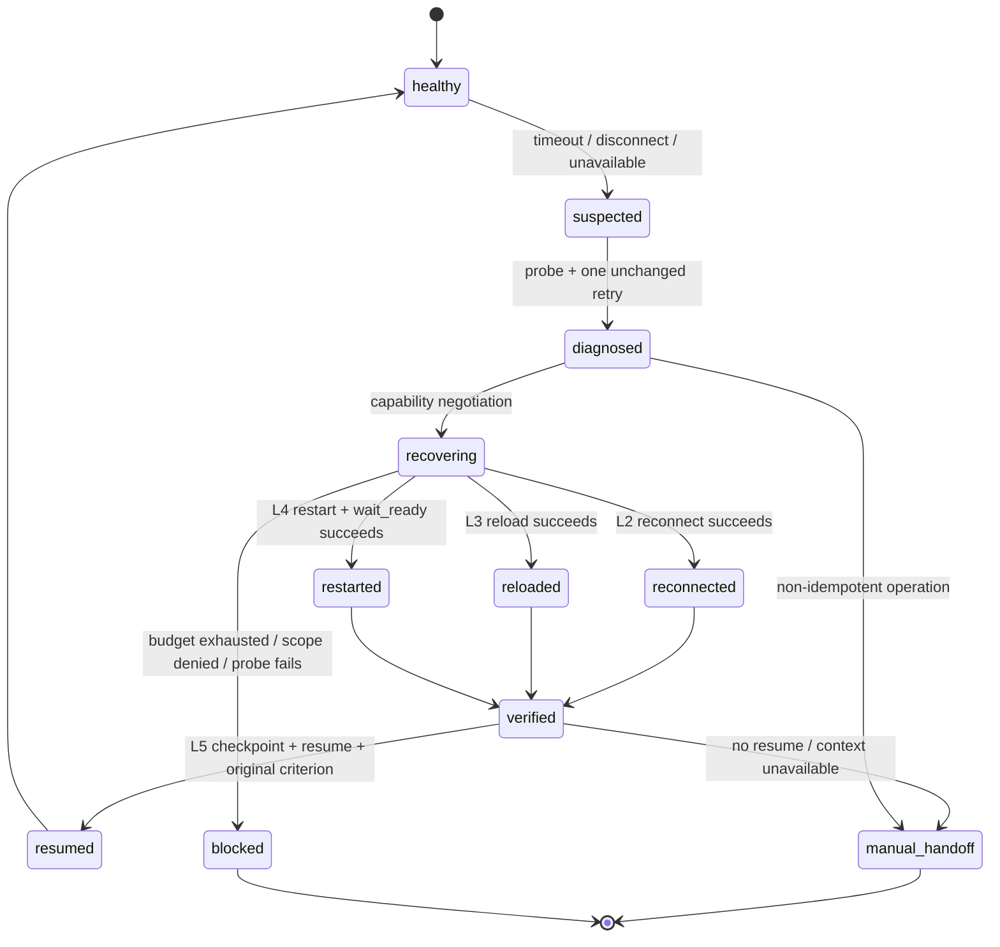

# Agent Runtime Recovery Rules

本 skill 是厂商无关的运行期自恢复唯一 owner。它把 MCP、插件、浏览器会话、工具服务和智能体宿主视为可恢复组件；平台差异只能通过 adapter 声明，规则正文不得假定 Codex、Claude、Cursor 或任意具体宿主命令。

## 触发与边界

触发信号包括 timeout、EOF、连接 reset、transport unavailable、插件进程异常退出、宿主健康探针失败、工具响应无法解析以及恢复后能力丢失。进入后先保存最小脱敏证据，再执行一次不变健康探针和一次不变复验。

本 skill 负责运行期 `probe -> reconnect -> reload -> restart -> resume`。`mcp-installation-rules` 负责安装/注册/配置，`plugin-installation-rules` 负责安装/启用，`execution-failure-learning-rules` 负责失败分类、既有案例预检和 candidate/active 生命周期；相邻 skill 只能引用本 skill 的恢复结果，不复制恢复动作。

禁止以下动作：猜测进程名或 CLI 参数；没有 capability 声明就重载/重启；用 UI 点击、强杀任意同名进程或删除配置冒充宿主恢复；自动重放未知幂等性的写操作；把工具恢复误报为任务续接；跨 local 配置连接 test、staging、pre、release 或 production 环境。

`task-plan-rehydration-rules` 通过 `PROJECT_CURRENT.md` 和 `update_plan` 重建悬浮任务列表，只属于展示层 rehydration，不是本 Skill 的 L5 checkpoint/resume。它不能把 `restarted`、`manual_handoff` 或未知执行结果提升为 `resumed`，也不能恢复执行授权。

## 能力等级

adapter 必须声明组件、版本、作用域、支持的操作、权限边界、副作用、回滚和验证入口。能力等级是上限，不是保证：只有动作成功且健康验证通过才可推进状态。

| 等级 | 能力 | 允许承诺 |
| --- | --- | --- |
| L0 | 观测、诊断、人工交接 | 只报告状态，不执行恢复动作 |
| L1 | 健康探针 | 判断组件是否可达、协议是否可用 |
| L2 | reconnect / rebind transport | 恢复现有会话连接，不重启组件 |
| L3 | reload 隔离组件或插件 | 重载明确归属的组件，保持宿主不变 |
| L4 | restart 指定组件或宿主并 wait_ready | 恢复进程级可用性，不能自动承诺续接任务 |
| L5 | checkpoint、resume、原成功标准复验 | 只有完整验证后才可承诺任务自动续接 |

未声明能力默认为 L0。`restart` 没有 `resume` 时，结果最多为 `restarted`，随后必须 `manual_handoff` 或由调用方重新提供上下文。

## 状态机

状态只能单向推进，除 `suspected -> healthy` 的探针恢复外不得回退。`manual_handoff` 表示需要人或上层 agent 重新确认；`blocked` 表示规则拒绝继续或预算耗尽，两者都不能被描述为成功恢复。

## 固定恢复流程

1. 记录 `recovery_id`、失败类别、组件和原成功标准；检查当前任务是否拥有组件作用域。
2. 读取 adapter capability；执行一次健康探针和一次不变复验。复验失败后不得无变化循环重试。
3. 仅按能力从低到高选择一层动作：L2 reconnect、L3 reload、L4 restart；每层最多一次，动作之间重新探针。
4. 恢复后执行 `wait_ready`、协议能力探测和最小健康调用。验证失败进入 `blocked` 或 `manual_handoff`。
5. 只有 L5 adapter 能读取检查点、验证恢复 token、恢复上下文，并用原成功标准验证最小重放；通过后才进入 `resumed`。
6. 将脱敏结果交给上层调用方；终态为 `blocked` 或 `manual_handoff` 时，必须同时生成遵循 `../artifact-delivery-gate-rules/references/task-blocker-closure-contract.md` 的唯一 `BLK-*` 事实。失败案例由 `execution-failure-learning-rules` 按 owner casebook 规则处理。

## 并发、预算和冷却

- 同一 `lock_key = platform_id/component_id/scope` 只允许一个恢复操作（single-flight）；其他调用等待结果，不重复重启。
- 默认每次故障只允许一次探针、一次不变复验、每个恢复层一次动作；预算、锁和冷却必须跨进程持久化。
- 同一组件成功或失败后默认冷却 10 分钟；冷却内重复故障直接复用最近结果或进入人工交接。
- adapter 可缩小预算，不得扩大全局上限；预算耗尽必须 `blocked`。
- 任何动作超出授权 scope、操作非本任务组件、或组件指纹在恢复前后不一致且无法解释时立即停止。

## 幂等性与续接

调用方必须把原操作标为 `read_only`、`idempotent`、`idempotent_with_key` 或 `non_idempotent`。只有前三类可以在 L5 经过恢复后自动重放；`non_idempotent` 只能查询目标状态、记录不确定结果并转 `manual_handoff`。重放必须使用原请求的幂等键或等价去重凭据，且仍满足原成功标准。

悬浮任务列表中的 `in_progress` 只表示中断前展示状态，不证明原操作未执行或可以重放。恢复后必须先查询真实磁盘、测试和目标系统状态，再按上述幂等性分类处理。

检查点只保存脱敏控制信息，不保存完整 prompt、响应、凭据、业务数据、图片或原始用户输入。最小字段与校验规则见 [adapter-contract.schema.json](references/adapter-contract.schema.json)。

## 通过与停止标准

通过：adapter capability 真实可探测；健康探针、恢复动作、`wait_ready` 和原成功标准验证均通过；锁/预算/冷却生效；没有越权或非幂等重放。

停止：无 adapter、能力声明与实际行为不一致、local 配置缺失、恢复后健康检查失败、检查点过期/损坏、写操作幂等性未知、预算/冷却冲突或宿主 API 未提供安全续接 hook。停止时输出结构化 `manual_handoff`/`blocked` 原因和共享阻断事实，不得伪称完成。

## 参考文件

- [recovery-state-machine.md](references/recovery-state-machine.md)：状态、事件、预算和终态约束。
- [adapter-contract.schema.json](references/adapter-contract.schema.json)：adapter 与 checkpoint 的机器契约。
- [platform-capability-matrix.md](references/platform-capability-matrix.md)：不同组件类型的能力准入和降级矩阵。
- [execution-failure-casebook.md](references/execution-failure-casebook.md)：本 owner 的脱敏案例模板和生命周期边界。
