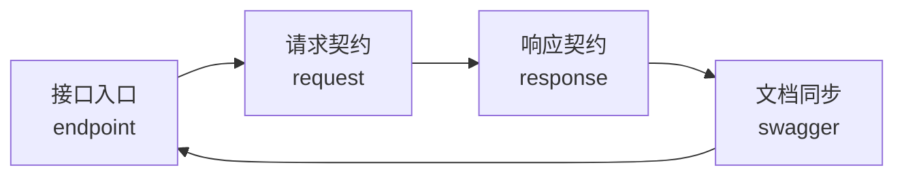

# 接口契约规则（api-contract-rules）

只在判断"接口入口、请求参数、响应结构、Swagger/OpenAPI 文档这一整条接口契约链路"时使用本 skill。
如果当前问题是异常分类、重试降级、错误处理路径、swag/ YAML 文档产物生成或业务规则本身，请转交相邻 skill。

**本 skill 由 `api-endpoint-rules`、`api-request-rules`、`api-response-rules`、`api-swagger-rules` 四个 skill 合并而来（2026-08-20），按接口生命周期分四阶段路由，规则语义与合并前保持一致。**

## 统一硬约束（全生命周期生效）

- **强制 POST + JSON body**：所有 API 接口强制使用 POST 请求，JSON 作为 body；不允许 GET/PATCH/PUT/DELETE，不使用 path 参数（`:id`/`{id}`）和 query 参数。
- **禁止弱类型容器**：请求与响应解析必须使用明确结构体（DTO），禁止 `map[string]interface{}`、`any`、`json.RawMessage` 作为绑定/解析入口。
- **响应四字段**：成功响应和错误响应都必须包含状态码、状态、消息、数据四个字段。
- **以 `package-structure-rules` 为基准**：不使用 handler 包名，使用 Catalog 返回的 controller/router 唯一源码位置。
- **文档同步**：接口路径、请求模型、响应模型与 Swagger/OpenAPI 文档必须同步；同一项目只保留一套主方案。

## Skill 作用与适用场景

- 统一接口契约设计：入口职责、请求结构、响应格式、文档同步。
- 按接口生命周期路由：入口（endpoint）→ 请求（request）→ 响应（response）→ 文档（swagger）。
- 防止把请求结构、响应格式、错误处理和文档维护混入错误层级。
- 要求路径命名语义清晰、通过路径区分操作类型（如 /orders/get、/orders/del、/orders/add）。
- 要求接口文档最小必填项齐全、调试入口可用、生产环境默认关闭或受控开放。

## 自动触发信号

- 新增接口或路由；修改 controller、router 入口代码。
- 调整路径命名、HTTP 方法或接口设计；使用非 POST 请求类型。
- 新增或修改 body 结构、请求 DTO、请求模型、参数校验器。
- 新增或修改返回体、统一响应包装器、错误响应、分页结构、兼容字段、版本字段。
- 新增或修改 Swagger/OpenAPI 框架、注解、调试入口、分组 tag、环境开关。
- 接口代码已改但文档或注解没有同步。
- 不确定某段逻辑该放接口入口、请求层、响应层还是文档层。

## 生命周期路由（四阶段）

### 阶段 1：接口入口（endpoint）

判断"接口入口该怎么定义、落在哪层、路径怎么命名、HTTP 方法怎么选"时命中本阶段。

- 进入后先读 `references/endpoint-responsibility.md`，判断入口层职责边界。
- 涉及路径命名和方法语义，读 `references/path-and-method-semantics.md`。
- 对照接口与反例，读 `references/endpoint-examples.md`。
- 约束：Go 路由函数中批量路由注册必须使用代码块 `{ ... }` 收口；路由 path 注册处硬编码；不使用通用路由包装器隐藏接口声明；接口注释放注册语句上一行。

### 阶段 2：请求契约（request）

判断"请求参数该放在哪里、怎么表达、怎么校验"时命中本阶段。

- 进入后先读 `references/request-shape-boundaries.md`，判断 JSON body、DTO 边界。
- 涉及参数必填、可选和格式校验，读 `references/parameter-validation-rules.md`。
- 对照正反例，读 `references/request-examples.md`。
- 约束：所有参数通过 JSON body 传递；统一在 controller 中使用 ShouldBindJSON 绑定；请求解析用明确 DTO，字段通过 `json` tag 显式声明。

### 阶段 3：响应契约（response）

判断"接口应该怎么返回、成功响应怎么包、错误响应怎么表达、分页和兼容字段怎么放"时命中本阶段。

- 进入后先读 `references/response-shape-baseline.md`，确定响应整体结构。
- 涉及分页、错误、兼容字段，读 `references/response-variants.md`。
- 对照正反例，读 `references/response-examples.md`。
- 约束：成功响应和错误响应都包含状态码、状态、消息、数据四字段；响应解析用明确 DTO。
- 问题上升到异常处理流程时，停止停留在响应层并转交 `error-handling-rules`。

### 阶段 4：文档同步（swagger）

判断"后端 HTTP API 是否需要 Swagger/OpenAPI、如何接入、如何同步、如何开放调试入口"时命中本阶段。

- 进入后先读 `references/baseline-and-scope.md`，确认接入基线与最小交付。
- 涉及代码与文档同步，读 `references/sync-and-annotation-rules.md`。
- 涉及暴露策略与安全边界，读 `references/exposure-and-security.md`。
- 约束：只要项目存在需要联调/调试的后端 HTTP API，默认要求统一 Swagger/OpenAPI 方案；接口文档包含最小必填项；生产环境默认关闭或受控开放。
- 文档产物维护（生成/更新/刷新/补齐 swag、导出 OpenAPI/Swagger/Apifox YAML 到 swag/ 目录）转交 `swag-openapi-maintainer-rules`。

## 进入后先做什么

1. 先确认当前问题属于接口契约的哪个阶段：入口 / 请求 / 响应 / 文档。
2. 按生命周期路由进入对应阶段，读取该阶段 references。
3. 确认所有接口强制 POST + JSON body，不使用 path/query 参数。
4. 确认请求与响应解析使用明确 DTO，禁止 map/any/RawMessage。
5. 确认成功响应和错误响应都包含状态码、状态、消息、数据四字段。
6. 确认接口代码、请求模型、响应模型与 Swagger/OpenAPI 文档同步。
7. 先查询 `package-structure-rules` Catalog 的 `router`、`controller`，不使用 handler 包名。

## 权责边界与不负责事项

- 只负责接口契约（入口/请求/响应/文档），不代替 `error-handling-rules` 设计异常分类和重试降级。
- 不负责 `swag/` 目录下 OpenAPI/Swagger YAML 文档产物生成，转交 `swag-openapi-maintainer-rules`。
- 不代替业务层判断复杂业务规则是否成立。
- 不把鉴权、租户、trace 等请求头问题混入参数模型设计。
- 不把 Swagger/OpenAPI 页面调试本身当成功能验证结论。
- 不把日志字段、trace 透传、重试降级等横切策略塞进响应结构。
- 必须遵循 `package-structure-rules` 约定，不使用 handler 包名。

## 需要暂停并确认的条件

- 当前接口语义不清，无法判断资源对象和操作动词。
- 设计会影响既有接口契约或旧路径兼容性。
- 一个入口打算同时承载多个不相干业务动作。
- 当前仓库已混用两套及以上 Swagger/OpenAPI 方案，无法判断主方案。
- 生产环境希望开放 Swagger UI 但没有保护措施。
- 请求/响应结构涉及旧客户端兼容或版本演进。
- 接口代码、请求模型、响应模型与文档冲突严重。

## 执行通过 / 驳回标准

- 通过：接口入口职责清晰、路径命名语义明确且含操作类型、强制 POST + JSON body、请求/响应解析使用明确 DTO、响应含四字段、文档同步且调试入口可用、使用 Catalog 返回的 controller/router 而不使用 handler、Go 批量路由注册已用代码块收口。
- 驳回：使用非 POST 请求类型或 path/query 参数、请求/响应解析使用 map/any/RawMessage、响应缺四字段、controller 承担过多业务逻辑、使用 handler 包名、代码已改但文档未同步、同一项目混用多套 Swagger/OpenAPI、生产环境裸开 Swagger UI。

## 执行结果归档要求

- 如果本次定义了新接口契约、调整了关键字段或改变了校验/响应/兼容策略，将结论记录到 `analysis/` 或 `doc/6-review/`。
- 归档内容至少包含接口目标、阶段结论、路径命名、POST 语义、字段落点、兼容影响。
- 如果只是沿用现有清晰模式且无争议，可以不单独归档。

## references 读取规则

- 入口阶段：默认读 `references/endpoint-responsibility.md`；路径与 POST 语义读 `references/path-and-method-semantics.md`；正反例读 `references/endpoint-examples.md`。
- 请求阶段：默认读 `references/request-shape-boundaries.md`；校验表达读 `references/parameter-validation-rules.md`；正反例读 `references/request-examples.md`。
- 响应阶段：默认读 `references/response-shape-baseline.md`；错误/分页/兼容读 `references/response-variants.md`；正反例读 `references/response-examples.md`。
- 文档阶段：默认读 `references/baseline-and-scope.md`；同步规则读 `references/sync-and-annotation-rules.md`；暴露安全读 `references/exposure-and-security.md`。
