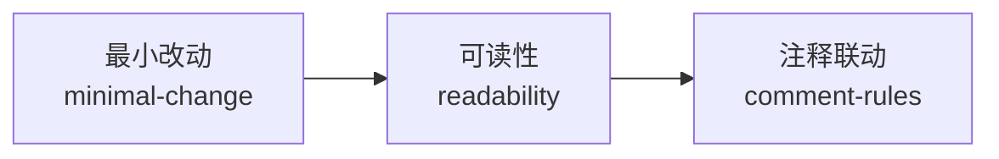

# 代码质量规则（code-quality-rules）

只在判断"本次到底该改多少、改到哪里、当前实现是否清晰自然容易接手"时使用本 skill。
如果当前争议是项目风格、注释颗粒度、目录归位或测试规范，请转交相邻 skill。

**本 skill 由 `code-minimal-change-rules` 与 `code-readability-rules` 合并而来（2026-08-20），按"最小改动"与"可读性"双主线路由，规则语义与合并前保持一致。**

## 统一硬约束（双主线生效）

- **改动聚焦**：本次改动与当前目标直接相关，范围可解释，无明显无关修改。
- **简单优先**：大多数代码默认不需要封装或抽象接口；只有存在真实复用、边界隔离、复杂度下降或多实现替换证据时才允许新增封装 / 接口层。
- **代码分解与文件行数约束**：单个代码文件超过 200 行时，拆分为多个 diamond 文件并存放在同级目录；一个目录只做一件事，逻辑过多则拆分为多个同级文件存放。
- **目录业务逻辑单一性**：一个同级目录只能包含一种业务逻辑，若拆解后仍归为两种及以上业务，即使很小也必须拆分到不同目录。
- **函数与代码块长度**：单个代码块或函数不得超过 80 行，超出则拆分为多个函数。
- **参数与返回值控制**：函数参数和返回值均不得超过 2 个，否则改用结构体传参或返回。
- **副作用可见**：写库、发请求、改状态、发事件、写文件、触发异步任务的函数必须在名称、调用位置或职责层级上暴露副作用；查询型函数默认不改状态。
- **结构化解析**：业务方法禁止直接用 JSON 字符串 key 取字段，必须经 DTO/对象解析层访问；Go 接入第三方 API 默认使用结构体解析响应，禁止长期使用 map + key 硬编码。
- **注释联动**：本轮改动位点必须联动 `comment-rules`（位置颗粒度分区 + 补齐闸门分区）完成注释检查与补齐，最小改动不等于跳过注释。**特别注意：小改动（修 Bug、改需求、删逻辑）容易在注释中留下"修复了什么""改了什么"的历史记录，必须交由 `comment-rules` 的"改动历史不进注释"闸门拦截，确保改动历史写入 `doc/` 对应文档，注释只描述当前状态。同时遵循"默认无注释"原则：语义自明的字段赋值、函数调用替换、变量重命名等不加解释性注释，注释仅在不自明或存在风险时添加。**

## 双主线路由

### 主线 1：最小改动（minimal-change）

控制"本次到底该改多少、该改到哪里"时命中本主线。

- 进入后先读 `references/minimal-change-general.md`，明确允许的改动范围与"假设-目标-验证"最小闭环。
- 边界不清时读 `references/minimal-change-boundaries.md`。
- 判断越界时读 `references/minimal-change-examples.md` 对照正反例。
- 核心约束：
  - 收缩本次改动范围，阻断顺手重构、顺手统一风格、顺手清理大段旧代码的越界行为。
  - 编码前必须写清假设、边界和成功标准；不确定项先澄清，不得带着模糊假设直接实现。
  - 简单处理默认直接写最小具体实现；当前只有一个稳定实现时，不要顺手补接口层、接口实现对或无明确收益的依赖注入包装。
  - 新增 helper、service、factory、adapter、interface、wrapper、manager 等封装前，必须先证明它能减少重复、隔离真实边界、降低复杂度或承接多个真实实现；证明不了就直接写在当前最小落点。
  - 默认不抽象接口。只有已经存在真实第二实现、稳定跨边界契约、插件/外部适配边界，或测试替身能显著降低验证成本时才允许；不能把"以后可能会用""为了 mock""面向接口编程"作为唯一理由。
  - 对高复用通用代码执行保守策略：最近修改超过 7 天时，默认新增能力，不直接改旧行为。
  - 最小改动 ≠ 打补丁：修复 Bug 时不得以"最小改动"为由在表层加特判/吞异常/对坏数据兜底来绕过根因；较大重构按 `bug-fix-proposal-rules` 先提方案确认。
  - 完成后复查是否混入无关重构、无关格式化、无关命名调整、无关清理。
  - 当"删除某代码 / 功能 / 模块"是本轮明确目标时，执行**彻底删除（remove 语义）**：同步清理调用点、测试、配置与文档提及，禁止创建 `xxxv2` 类"删除版本"备份，禁止在记忆或文档中写入"已删除 / 禁止使用"残留描述；细则见 `references/code-removal-discipline.md`。此条与"阻断顺手清理旧代码"互补：前者防少删（被要求删的要删干净），后者防多删（没被要求删的别删）。

### 主线 2：可读性（readability）

判断"当前实现是否清晰、自然、容易接手"时命中本主线。

- 进入后先读 `references/readability-general.md`，确认可读性底线。
- 涉及函数拆分、步骤组织、控制流安排时读 `references/function-structure-rules.md`。
- 涉及函数或方法的参数顺序、数量控制、单参数与结构体参数取舍时读 `references/function-signature-rules.md`。
- 判断局部变量、包级变量与常量的定义位置时读 `references/definition-placement-rules.md`。
- 判断写法优劣或做正反例对照时读 `references/readability-examples.md`。
- 核心约束：
  - 保持函数结构清晰、逻辑顺序自然；控制单个函数或模块的复杂度，避免隐式跳转和过深嵌套。
  - 抽象应优先形成"深模块"：用简单接口隐藏真实复杂度；仅转发、仅改名或仅包一层的浅封装默认降低可读性。
  - 线性流程代码（中间件、handler、pipeline、初始化等）默认"单主线从上到下"表达；只有真正复杂（有分支、递归、需真实复用或需独立测试）时才拆函数，一次性、无分支、约 5 行以内的取值/赋值逻辑就地内联。
  - 职责清晰不等于"每个职责都必须独立函数"；极短局部检查、判空、匹配器取用等单调用点、无副作用逻辑优先留在当前函数内。
  - 在"每个函数必须带 doc 头模板"的项目里，函数数量本身就是注释成本：正确杠杆是"少拆一次性小函数"，而不是"把注释写短"。
  - 单个代码文件超过 200 行时，必须拆分为多个 diamond 文件并存放在同级目录；一个同级目录只能包含一种业务逻辑，若拆解后仍归为两种及以上业务，即使很小也必须拆分到不同目录；一个目录只做一件事，逻辑过多则拆分为多个同级文件存放。
  - 单个代码块或函数不得超过 80 行，超出则拆分为多个函数，保持主流程清晰自然。
  - 函数参数和返回值均不得超过 2 个，否则改用结构体传参或返回；Go 函数签名默认单行参数。
  - 同一函数不要同时承担 query 与 command 职责；确因事务一致性必须合并时，名称必须体现命令语义并分段。
  - 在已有文件中新增函数时默认追加到文件末尾，不插入已有函数中间。
  - 业务逻辑内部函数默认不要对入参做防御性字符串清洗，输入规范化应在请求解析、DTO 校验等边界层完成一次。
  - 在路由文件中接口数量较少（如 <= 10）时，禁止为"复用"引入 route struct + 批量注册抽象层，优先显式逐条注册。
  - 如果改善可读性会明显扩大改动范围，暂停并交还主线 1 判断。

## 自动触发信号

- 新增业务代码、服务方法、控制器逻辑、工具函数。
- 修改已有复杂逻辑、修复 Bug。
- 为测试补最小支撑代码、为联调补最小必要适配。
- 编写脚本或任务流程代码需要控制步骤可读性。
- 单个代码文件超过 200 行，或单个代码块/函数超过 80 行，或函数参数/返回值超过 2 个需要代码分解重构。
- 准备新增 helper、wrapper、factory、manager、adapter、interface 或单实现包装。
- 发现查询型函数暗中改状态、业务方法用 JSON key 取值、第三方 API 用 map 硬编码解析。

## 进入后先做什么

1. 先确认本次任务唯一目标和成功标准（改到什么算完成）。
2. 显式写出当前实现依赖的关键假设；存在不确定项先澄清再编码。
3. 列出必须改动的文件、方法和模块，标出不属于当前目标的潜在顺手改动。
4. 识别当前实现主流程，找出过深嵌套、职责混杂、命名模糊、控制流跳跃和过密表达的位置。
5. 检查写库、发请求、改状态、发事件等副作用是否从命名和位置可见。
6. 对计划新增的封装和接口做必要性复核：没有真实收益的必须收回。
7. 检查代码分解与可读性规则：目标文件超过 200 行时拆分为多个 diamond 同级文件；检查同级目录是否仅含一种业务逻辑，跨业务必须分目录；单个代码块或函数超过 80 行时拆分为多个函数；函数参数或返回值超过 2 个时改用结构体传参或返回。
8. 标记本轮改动位点，联动 `comment-rules` 完成注释检查与补齐。

## 默认执行流程

1. 主线 1：先读 `references/minimal-change-general.md`，收缩范围，再用最少代码实现目标。
2. 主线 2：再读 `references/readability-general.md`，保证主流程直观；函数拆分/步骤组织读 `references/function-structure-rules.md`。
3. 判断越界或写法优劣时，分别读 `references/minimal-change-examples.md` / `references/readability-examples.md`。
4. 对所有新增封装和接口抽象做必要性复核，没有真实复用、真实边界、明显复杂度下降或多实现替换需求的必须收回。
5. 完成后复查是否混入无关改动，并按成功标准执行最小验证闭环。
6. 最后联动 `comment-rules`：用位置颗粒度分区判断注释必要性/位置/颗粒度，再用补齐闸门分区完成改动位点补齐闸门，不扩散到无关历史代码。

## 权责边界与不负责事项

- 只负责最小改动与可读性，不替代 `code-style-consistency-rules` 处理项目风格一致性。
- 不替代 `comment-rules` 决定中文注释的颗粒度和写法。
- 不替代 `naming-rules` 单独决定业务术语命名。
- 不替代测试类 skill 决定如何组织测试资源和验证范围。
- 不把复杂业务编排、领域判断或数据访问直接塞进 controller。

## 需要暂停并确认的条件

- 当前需求想顺手修历史问题；当前 Bug 修复想顺手重构整个模块。
- 本次改动已经扩散到多个互不相干的目标。
- 为了"代码更规范""方便以后扩展"计划把能直写的简单逻辑封装成 helper/manager/factory/wrapper/adapter，但没有真实收益。
- 用户明确要求扩大改动范围，但尚未确认额外影响和回归风险。
- 计划直接修改"最近修改超过 7 天"的高复用通用代码旧行为，但尚未确认兼容影响。
- 为了提升可读性必须做大范围重构，或拆分将引发跨模块接口重排。
- 用户更关心快速止血，不接受当前阶段做结构梳理。

## 执行通过 / 驳回标准

- 通过：改动与当前目标直接相关，范围可解释，无明显无关修改；关键假设与成功标准明确；主流程清晰、关键分支可追、函数职责相对单一、副作用可见；新增封装和接口抽象均能说明真实收益（简单接口隐藏真实复杂度的深模块）；代码文件超过 200 行已拆分为同级 diamond 文件；同级目录仅含一种业务逻辑，目录职责单一；单代码块与函数不超过 80 行；函数参数和返回值均不超过 2 个（超出已改用结构体）；改动位点注释补齐已联动完成；同语义能力优先复用既有公共工具，无重复封装。
- 驳回：出现顺手优化、顺手重构、顺手统一风格、顺手清理整片旧代码等越界行为；简单场景无真实收益却强行新增接口层、接口实现对、helper、factory、manager、adapter 或仅转发/仅改名/仅包一层的浅封装；查询型函数暗中写库/发请求/改状态导致副作用不可见；业务方法用 JSON 字符串 key 取值；代码文件超过 200 行未拆分为同级 diamond 文件；同一目录混杂两种及以上业务逻辑；单个代码块或函数超过 80 行未拆分；函数参数或返回值超过 2 个未改用结构体；以"最小改动"为由跳过改动位点注释补齐；直接修改"最近修改超过 7 天"的高复用通用代码旧行为；已存在公共工具却重复封装同语义函数。

## 执行结果归档要求

- 如果明确排除了某些不应在本次处理的事项，或为了控制可读性主动放弃某些重构点，将结论记录到 `analysis/` 或 `doc/6-review/`。
- 归档内容至少包含本次目标、刻意不处理项、排除原因、可读性问题保留原因和后续建议。
- 如果本次范围没有争议且无额外排除项，可以不单独归档。

## references 读取规则

- 最小改动主线：默认读 `references/minimal-change-general.md`；边界不清读 `references/minimal-change-boundaries.md`；越界判断读 `references/minimal-change-examples.md`。
- 可读性主线：默认读 `references/readability-general.md`；函数结构读 `references/function-structure-rules.md`；函数签名与参数取舍读 `references/function-signature-rules.md`；定义位置读 `references/definition-placement-rules.md`；正反例读 `references/readability-examples.md`。
- 本轮涉及删除代码 / 功能 / 模块时，读 `references/code-removal-discipline.md`。
