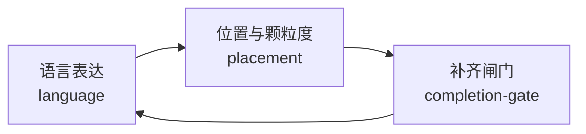

# 代码注释规则（comment-rules）

只在判断"注释怎么写、该不该写、写在哪、写多细、本轮改动位点是否补齐"时使用本 skill。
如果当前问题是 Swagger/OpenAPI 接口文档注解，请转交 `api-contract-rules`；如果是文档说明而不是代码注释，按对应文档规范处理。

**本 skill 由 `chinese-comment-rules`、`comment-placement-granularity-rules`、`comment-completion-gate-rules` 三个 skill 合并而来（2026-08-20），按注释职责三分区路由，规则语义与合并前保持一致。**

## 统一硬约束（全注释生效）

- **注释必须中文**：除标准协议字段、标准关键字、第三方 SDK/API 固定字段名、第三方固定错误原文外，禁止英文注释主句；第三方错误原文需补一行中文解释。
- **不写无效注释**：不写空话、口号式注释、重复代码字面的注释、大段设计文档。
- **默认无注释，仅语义不自明时加注释**：代码修改的默认状态是"不需要注释"。简单字段赋值、函数调用替换、变量重命名、显而易见的逻辑变更等，不需要添加解释性注释。仅在代码的意图无法从命名和上下文中自然推断、存在非直观的业务约束、存在安全隐患或容易误用的边界时，才需要加注释。判断标准是"换人视角"：一个了解当前代码库但不了解本次改动背景的同事，能否仅从代码本身理解其意图。
- **只写结论，不写过程**：注释回答"这是什么、做什么用"，不回答"为什么这样、不做会怎样"，也不写"我怎么试出来的、对比过哪些方案、实测数据是多少、历次改了什么"。原因、权衡、决策推理与后果推演属于提交信息、PR 描述或 `doc/` 文档，写进代码注释就是把一次性的过程沉淀成了永久维护负担。
- **注释分两层，只有函数注释写完整**：
  - **函数/方法注释**：唯一的完整层——函数整体说明（做什么）+ `[参数]` + `[返回]` + `最近修改时间`（含本次改动的一句话简单说明，如 `2026-09-09 新增, MoonPay 卖币独立接入`）。细则见 `references/comment-function-metadata.md`。
  - **其余所有位置**（字段、属性、结构体字面量、代码块内某一行、步骤编号注释、补丁位点注释等）：**只写一句话说明其作用或目的**，不套用函数注释的完整格式，不加 `[参数]`/`[返回]`/`最近修改时间`，也不写"为什么要加"这类原因说明。**"最近修改时间 + 简单说明"的格式仅适用于函数注释**，不得平摊到其他位置。
- **单条注释默认一行，禁止论证式块注释**：说明性注释（不含函数头 `[参数]`/`[返回]`/`最近修改时间` 元信息块与编号步骤注释）默认只占一行。出现以下任一形态即判定为论证式块注释，必须**直接删除**（过程信息不做"缩短后保留"）：
  - 反事实推演：`只…不…则…`、`只…不…会让…`、`如果不…就会…`、`否则…`、`一旦…就…` 组成的后果推演链。
  - 多行因果展开：用两行及以上解释"为什么要这样写""为什么不能那样写"。
  - 多行背景前置：先铺垫业务背景或历史，再给出结论。
- **说明性注释只留目的，过程一律删除，不设折中形态**：凡说明性内容只有一种合格形态——**说明这段代码的作用或目的**（行内如 `// 创建并注册交易所moonpay`；函数头即函数整体说明）。任何解释"为什么这样做、不这样做会怎样"的过程内容**直接删除**，包括看起来重要的跨模块耦合约束（如"moonpay 注册必须与 onramper 侧 `excludedRamps` 同批上线，只注册不排除会…"）。**不设"压成一行 + 文档锚点"的中间态**——约束由同批上线的工程行为、提交说明与 `doc/` 承载，代码里不留过程痕迹。正反例见 `references/comment-examples.md` 的"耦合约束正反例"。
- **改动历史不进注释，进 doc/ 文档**：Bug 修复、需求变更、小逻辑调整、删除逻辑等任何改动，其来龙去脉（原来怎样、为什么改、改了什么）必须写入 `doc/` 下对应的 Bug 主文档、需求文档或实施文档，严禁写入代码注释。代码注释只描述"当前代码是什么、做什么用"，不解释"为什么这样写"，也不记载"这次改了什么"。`最近修改时间` 行是唯一允许在注释中承载本次改动说明的位点（一句话，如 `新增, MoonPay 卖币独立接入`），且必须保持单行覆盖式维护，不得在注释中额外展开改动叙述。
- **覆盖式维护，禁止追加式堆积**：同一个函数/字段被反复修改时，重写原有注释使其描述当前状态，不得逐次往上追加新段落或新的"最近修改时间"行。改动历史统一压缩到**唯一一行** `最近修改时间`，其余位置不承载历史。
- **前端与后端同等**：`.vue`/`.tsx`/`.jsx`/`.ts`/`.js`/`.html`/`.css`/`.scss`/`.less` 前端文件中的业务注释、格式化注释、条件说明、补丁说明同等纳入检查。
- **改动位点补齐才可收口**：任一关键注释缺失，不得给出"通过"或"可提交"结论。

## 注释职责三分区（路由）

### 分区 1：语言表达（language）

判断"这里的注释该不该用中文、中文应该怎么写"时命中本分区。

- 进入后先读 `references/comment-language-boundary.md`，判断哪些内容应中文表达、哪些保持原样。
- 改写为自然简洁中文时，读 `references/chinese-comment-patterns.md`。
- 对照正反例或判断表达是否空泛，读 `references/comment-examples.md`。
- 语言确定后，注释是否保留、放哪、写多细转分区 2；改动位点补齐与闸门转分区 3。

### 分区 2：位置与颗粒度（placement）

判断"这条注释该不该写、该放哪里、该写多细"时命中本分区。

- 进入后先读 `references/comment-placement.md`，判断注释应放在哪里最有效。
- 控制"写多细、写多少"时，读 `references/comment-granularity.md`。
- 对照正反例或排查旧注释偏移时，读 `references/comment-examples.md`。
- 职责：判断注释必要性、块注释/边界/风险/字段注释放置、颗粒度治理、过期注释治理、超过 5 行代码块的步骤注释就近落位、跨层映射结构体字面量逐字段或逐字段组中文注释。
- 若已识别出"改动位点补齐、函数头元信息或步骤编号闸门问题"，立即转分区 3。

### 分区 3：补齐闸门（completion-gate）——【强制，消费 PASS/FAIL】

判断"本轮改动位点注释是否补齐、能不能通过收口"时命中本分区。**本分区输出 PASS/FAIL 契约，由 `code-change-finalization-gate-rules` 消费；语义不可丢失。**

- 进入后先读 `references/comment-completion-priority.md`，确认补注释优先范围（`git` 已改动未提交位点，staged + unstaged）与改动位点闸门。
- 核对函数头元信息时，读 `references/comment-function-metadata.md`。
- 核对方法体步骤编号时，读 `references/comment-step-numbering-gate.md`。
- 对照正反例时，读 `references/comment-examples.md`。

**补齐闸门强制项（保留原 comment-completion-gate-rules 全部语义）：**

1. **补注释优先范围**：优先 `git` 已改动且未提交的代码位点（staged + unstaged）；未补齐前不得扩散到未改动历史代码。
2. **改动位点补齐**：本轮新增或修改的函数/方法/关键步骤入口/字段处理位点逐一检查；结构体字面量字段赋值（配置/启动/数据库/服务依赖/运行缓存/交易/风控/请求响应 DTO/第三方 SDK/跨层映射）**默认不加注释，仅在字段名语义不足以表达意图时才需要注释**。判断标准：字段名本身已清晰说明用途（如 `UserID: user.ID`、`Amount: req.Amount`）时不加注释；字段名包含缩写、序号、通用词（如 `Type`/`Flag`/`Status`）且无法从上下文推断具体含义时，才加注释。
3. **前端必注释位点**：工具函数/格式化函数/转换函数/事件处理、复杂样式块、条件渲染、异步数据加载与分页、兼容兜底空值保护补丁逻辑；无独立函数时在改动点就近补一条中文意图注释；仅 import 排序/空行/纯格式化无语义变化时可不新增。
4. **步骤编号**：函数/方法体、闭包体、连续控制流代码块按非空行计数超过 5 行（至少 6 行）时，必须块内就近顶层编号步骤注释；至少写 `1.`；多步骤 `1.` `2.` `3.`；子步骤 `1.1` `1.2`；嵌套超长代码块独立判断；禁止集中写在函数开头；禁止只出现子编号缺顶层编号；流程型普通注释必须改写为编号步骤注释。
5. **函数头元信息**：新增或修改的函数/方法必须补函数头注释；顺序固定 `[参数]` → `[返回]` → `最近修改时间`（最后一行）；无参数/返回写 `无`；签名由测试框架固定的 `TestXxx`/`BenchmarkXxx`/`TestMain` 免写 `[参数]`/`[返回]`，改写「验证什么、判据防什么、有无副作用」；`最近修改时间` 格式北京时间 `yyyy-MM-dd HH:mm:ss`，必须含本次改动的一句话简单说明；签名/流程/分支/返回值/关键调用任一变化必须更新；仅格式化无语义变化可不更新。
6. **函数注释核对清单**：最终收口前必须输出（文件路径、函数/方法名、是否具备 `[参数]`/`[返回]`/`最近修改时间`、是否含一句话改动说明）；不涉及函数时输出"函数位点 0 个"；任一项缺失禁止"已完成/可提交/已通过"结论。
7. **字段/结构体字面量注释核对清单**：输出（文件路径、结构体或对象名、字段范围、是否跨层映射或关键配置、字段名语义是否自明、是否有语义不自明的裸露字段）；不涉及时输出"字段/结构体字面量位点 0 个"；`LogConfig{}`/`Config{}`/服务实例初始化/数据库连接/交易订单/风控参数/运行缓存状态/请求响应 DTO/第三方 SDK 参数对象默认**不要求逐字段注释**，仅检查字段名语义不自明的裸露字段。
8. **补丁逻辑注释（一句话作用说明）**：补丁逻辑入口上方补就近中文注释，**一句话说明这段代码的作用或目的即可**（如 `// 未终态订单跳过对账`）；不要求"做了什么 + 为什么"两层信息，也不写原因说明；禁止"修复问题/兼容处理/优化逻辑"空泛描述；函数头补齐不能替代补丁位点的就近注释；纯格式化/重命名无语义变化可不加。
9. **中间阶段预检**：本轮首次代码改动后立即触发一次"中间阶段注释预检"并输出缺口清单，不得把注释检查全部延后到最终收口。

## 自动触发信号

- 任何新增或修改代码都必须触发一次改动位点注释补齐检查。
- 本轮首次代码写入完成后，必须立即触发一次中间阶段注释预检。
- 用户要求"补充注释/只补注释/注释完善/补下注释/加注释"——即使用户只发"补充注释"四个字也必须触发。
- 新增或修改函数/方法，需要补齐或更新函数头元信息。
- 在原有函数/方法内新增或调整补丁分支、兜底逻辑、兼容逻辑。
- 方法体出现步骤流程（含单步骤）或多个流程型普通注释。
- 代码块超过 5 行非空代码/注释行，需确认步骤注释已落在对应代码块内部。
- 实现自审、测试前验证或可提交收口前，需确认注释达到闸门标准。
- 不确定注释该不该写、该放哪、该写多细。
- 代码评审指出注释位置不对、注释过长（论证式块注释）、字段注释缺失或注释过量。
- 需要清理与当前实现不一致的旧注释。

## 进入后先做什么

1. 先定位本轮新增或修改的代码位点。
2. 本轮首次代码改动后，先执行一次中间阶段注释预检并输出缺口清单。
3. 判断当前问题属于哪个分区：语言表达 / 位置颗粒度 / 补齐闸门。
4. 若是补注释请求，先定位 `git` 未提交改动（staged + unstaged）锁定优先处理清单。
5. 按分区读取对应 references，输出结论或补齐清单。
6. 最终收口前输出改动位点注释补齐结论、缺失项清单、函数注释核对清单、字段/结构体字面量注释核对清单、补丁注释核对清单和阻断原因。

## 权责边界与不负责事项

- 只负责注释规则（语言/位置/补齐闸门），不代替 `api-contract-rules` 处理 Swagger/OpenAPI 接口文档注解。
- 不为了"必须中文"硬翻译通用保留字、协议字段名或标准术语标识。
- 不把糟糕命名、复杂结构和错误抽象都靠注释硬解释。
- 不保留已经与实现脱节的旧注释。
- 不要求为了过闸门而给未改动历史代码无差别补注释。
- 不允许用"函数头已经补了"掩盖方法体步骤编号缺失。

## 需要暂停并确认的条件

- 代码本身可以通过重命名或小重构解决理解问题。
- 现有注释和实现冲突，但代码行为还未确认。
- 为了通过评审而临时补大量无效注释。
- 方法体流程混乱到需要先做结构调整，再决定如何编号。
- 术语翻译存在争议，贸然中文化会导致歧义。
- 注释打算解释一大段明显应拆函数的流程。

## 执行通过 / 驳回标准

- 通过：注释语言满足"必须中文（除标准协议字段/第三方固定错误原文外）"；注释只出现在真正需要解释的位置；颗粒度不过粗不过碎；注释只描述当前实现的目的与结果，未夹带方案对比、实测数据、历史演进或自辩式论证；说明性注释默认单行且只写目的，无论证式块注释与过程推演，未采用"压成一行 + 文档锚点"的折中形态；同构语句组内无插入的多行块注释；函数头 `最近修改时间` 唯一一行且未堆叠历史；本轮改动位点全部完成注释补齐；新增或修改的函数/方法均有 `[参数]`/`[返回]`/`最近修改时间` 且顺序正确、`最近修改时间` 与本轮一致且含一句话改动说明；方法体步骤流程已至少使用 `1.` 并就近落位（多步骤补齐 `1.` `2.` `3.`，子步骤 `1.1` `1.2`）；结构体字面量字段映射中语义不自明的字段已注释、语义自明的字段未添加冗余注释；补丁位点已补一句话作用/目的说明；前端语义改动文件至少含 1 条相关中文意图注释；中间阶段预检已执行；最终已输出三类核对清单且无缺口；过期/错位/误导性注释已清理或列入清单。**整体原则：默认不加注释，加注释必有理由。**
- 驳回：注释混杂英文残句/机翻/空泛口号；注释逐行复述代码或位置错乱；出现论证式块注释（多行反事实推演 / 多行因果展开 / 多行背景前置）；写入过程注释（原因、权衡、后果推演、耦合约束），或用"压成一行结论 + 文档锚点"的折中形态保留过程信息；在注册列表、初始化列表、路由表等同构语句组内插入多行块注释；函数头夹带方案对比、实测数据、采样记录、历史演进叙述或"为什么这样做是对的"式论证；并列堆叠多行 `最近修改时间` 把函数头写成变更日志；同一位置的注释靠追加新段落维护而非覆盖重写；本轮任一改动位点未补齐注释；存在步骤流程却无编号步骤注释；只写子编号不写顶层编号；多个编号集中写在函数开头；新增/修改函数缺 `[参数]`/`[返回]`/`最近修改时间` 或顺序不符或时间未更新/无一句话说明；**为语义自明的字段映射添加了冗余注释**（如 `// 用户 ID` 跟在 `UserID: user.ID` 后面）；补丁位点缺一句话作用/目的说明；前端语义改动文件缺相关中文意图注释；未进行中间阶段预检；未输出三类核对清单；跨层映射结构体字面量语义不自明的字段裸露；旧注释过期仍保留。

## 执行结果归档要求

- 一般不要求单独归档；若涉及团队统一注释约定变化，可记录到 `analysis/` 或评审记录。
- 如某条关键注释承载重要边界说明，应保证在评审中可追溯。

## references 读取规则

- 语言分区：默认读 `references/comment-language-boundary.md`；改写表达读 `references/chinese-comment-patterns.md`；正反例读 `references/comment-examples.md`。
- 位置分区：默认读 `references/comment-placement.md`；颗粒度读 `references/comment-granularity.md`；正反例读 `references/comment-examples.md`。
- 补齐闸门分区：默认读 `references/comment-completion-priority.md`；函数头元信息读 `references/comment-function-metadata.md`；步骤编号读 `references/comment-step-numbering-gate.md`；正反例读 `references/comment-examples.md`。
