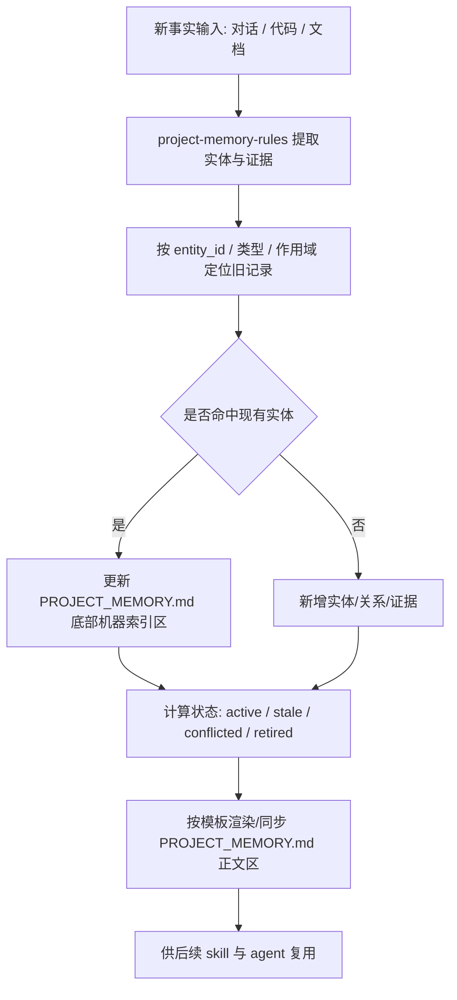
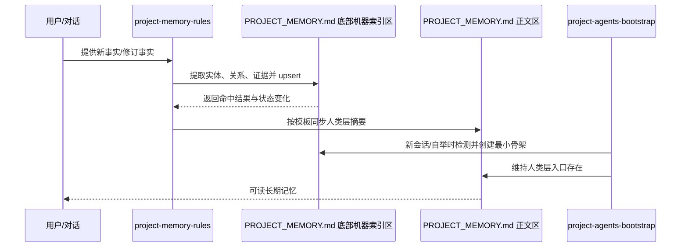

# project-memory-rules 双层知识库升级

## 0. 文档信息

- 需求标题: `project-memory-rules 双层知识库升级`
- 版本与状态: `v0.2 / 已整理 / 待评审`
- 需求来源:
  - 当前仓库 `project-memory-rules/SKILL.md`
  - 当前仓库 `project-memory-rules/agents/openai.yaml`
  - 当前仓库 `project-memory-rules/references/project-memory-template.md`
  - 当前仓库 `project-agents-bootstrap/SKILL.md`
  - 本轮对话中已确认方向: `单文件双区结构 + 本地优先且预留扩展点`
- 修订记录:

| 版本 | 日期 | 变更原因 | 责任人 |
| --- | --- | --- | --- |
| v0.1 | 2026-07-03 | 首次整理 `project-memory-rules` 双层知识库升级需求 | Codex |
| v0.2 | 2026-07-03 | 将机器结构化索引方案从独立文件调整为 `PROJECT_MEMORY.md` 底部机器索引区 | Codex |

## 1. 引言

### 1.1 文档目的

本文档用于定义 `project-memory-rules` 从“单一事实记录型 skill”升级为“单文件知识库型项目记忆 skill”时要做什么、约束什么、做到什么算需求闭环。本文档描述目标能力、边界、数据模型与交付要求，不直接展开实现细节。

### 1.2 产品范围

- 需求目标: 让 `project-memory-rules` 在继续只维护根目录 `PROJECT_MEMORY.md` 的前提下，把该文件升级为“人类阅读区 + 机器索引区”的单文件知识库，支持实体、关系、证据、上下文、状态生命周期和持续更新。
- 背景动因:
  1. 当前 skill 只擅长把单条事实写入 `PROJECT_MEMORY.md`，对关系、来源证据、上下文检索和失效更新支持不足。
  2. 后续多个 skill 都会依赖长期记忆，单纯 Markdown 词条难以支撑稳定复用、冲突消解和自动联动。
  3. 用户已明确选择“单文件双区结构 + 本地优先、预留扩展点”方向，希望升级后更接近知识库式项目记忆，而不是继续停留在独立指标记录。
- 本次纳入范围:
  - 升级 `project-memory-rules` 的规则、提示词、模板和参考资料。
  - 新增 `PROJECT_MEMORY.md` 底部机器索引区设计。
  - 补齐与 `project-agents-bootstrap` 的单文件双区检测与创建联动。
  - 规划迁移、验证与后续扩展接口。
- 明确排除范围:
  - 当前轮不接入外部向量库、图数据库或远程 MCP 存储。
  - 当前轮不实现跨仓库统一记忆服务。
  - 当前轮不把 `PROJECT_MEMORY.md` 替换成纯 YAML/JSON 文件。

### 1.3 术语与缩写

| 术语 | 定义 |
| --- | --- |
| 人类层 | `PROJECT_MEMORY.md` 中面向人工阅读的长期记忆正文区 |
| 机器层 | `PROJECT_MEMORY.md` 底部受管的机器索引区，使用标准 YAML 代码块承载结构化索引 |
| 实体 | 可长期复用的记忆对象，如术语、规则、字段、模块、脚本、流程节点 |
| 关系 | 实体之间的连接，如依赖、产出、引用、映射、别名 |
| 证据 | 支撑某条记忆成立的真实来源，如代码路径、文档路径、对话确认 |
| 上下文 | 某条记忆适用的范围、场景、阶段、模块、来源对象 |
| 生命周期状态 | `active`、`deprecated`、`stale`、`conflicted`、`retired` 等状态 |

### 1.4 参考资料

- `project-memory-rules/SKILL.md`
- `project-memory-rules/agents/openai.yaml`
- `project-memory-rules/references/project-memory-template.md`
- `project-agents-bootstrap/SKILL.md`
- `artifact-storage-rules/references/path-map.yaml`
- `artifact-storage-rules/references/update-policy.md`

### 1.5 文档导读

- 第 2 章说明当前现状、角色与约束。
- 第 3 章定义升级后的功能需求、质量要求和落点约束。
- 第 4 章给出验证方式、风险与阻断项。
- 第 5 章记录附录与变更跟踪。

## 2. 产品概览

### 2.1 产品视角

当前 `project-memory-rules` 的核心能力是“从对话和代码中抽取明确事实，并写回根目录 `PROJECT_MEMORY.md`”。从当前仓库真实文件看，现状存在以下限制:

1. `project-memory-rules/SKILL.md` 仍以“单文档、单词条、单次回写”为主，缺少实体关系、证据链、上下文检索和冲突状态模型。
2. `project-memory-rules/agents/openai.yaml` 的默认提示词只覆盖“抽取、合并并更新 `PROJECT_MEMORY.md`”，没有机器层索引区概念。
3. `project-memory-rules/references/project-memory-template.md` 仅提供 Markdown 词条模板，没有结构化 schema、类型系统、关系类型和检索策略说明。
4. `PROJECT_MEMORY.md` 当前只有人类阅读正文，没有稳定的底部受管机器索引区。
5. `project-agents-bootstrap/SKILL.md` 当前只统一编排 `AGENTS.md`、`CLAUDE.md`、`PROJECT_MEMORY.md`、`PROJECT_STYLE.md`，但尚未约定如何在 `PROJECT_MEMORY.md` 内补齐机器索引区。

### 2.2 产品功能摘要

升级后应至少具备以下高层功能:

1. 维持 `PROJECT_MEMORY.md` 作为唯一长期记忆主文件。
2. 在 `PROJECT_MEMORY.md` 底部新增固定受管的机器索引区。
3. 以“实体 + 关系 + 证据 + 上下文 + 生命周期”组织长期记忆。
4. 支持先更新机器索引区、再渲染/同步人类阅读区。
5. 支持同一事实的稳定标识、冲突消解和失效刷新。
6. 为未来外部记忆系统预留扩展字段，但当前保持本地自包含。
7. 与 `project-agents-bootstrap` 联动，自动检测、创建和更新机器索引区。
8. 为后续 skill 提供可复用的检索与更新约定。

### 2.3 约束条件

- 保持现有 UTF-8 中文规则，标题、章节名、字段名继续默认中文。
- Windows 下普通仓库命令仍优先 Git Bash / bash；若必须使用 PowerShell，写文件必须明确 UTF-8。
- 不得破坏现有基于 `PROJECT_MEMORY.md` 的使用方式，升级后旧调用路径仍应可工作。
- 机器层先采用 repo-local 单文件方案，不引入外部服务依赖。
- 结构化索引不得退化为随意自由文本，必须有稳定 schema。

### 2.4 用户与角色特征

| 角色 | 关注点 |
| --- | --- |
| 主 agent | 能否稳定抽取、复用、更新长期记忆，避免重复侦察 |
| 子 agent / 并行 agent | 能否读取统一结构化上下文，减少记忆冲突 |
| skill 维护者 | 能否清楚维护 schema、模板、提示词与联动规则 |
| 仓库使用者 | 能否继续直接阅读 `PROJECT_MEMORY.md`，无需关注底部受管索引区 |

### 2.5 假设与依赖

- 本次升级默认以当前仓库内 skill 体系为主要使用方。
- `PROJECT_MEMORY.md` 将继续保留并长期存在，且仍是唯一长期记忆主文件。
- 底部机器索引区由 skill 自动维护，不要求人工手写维护。
- 后续若接入外部存储，只能在当前字段体系上做扩展，不推翻单文件结构。

### 2.6 需求分配与波次

- 当前优先闭环: 完成“单文件双区结构 + 本地优先 + 扩展预留”的需求定义，并拆出实施总览与实施周期。
- 预期后续波次:
  - 波次 1: 定义机器索引区 schema 和引用资料。
  - 波次 2: 升级 `project-memory-rules` 与 `project-agents-bootstrap`。
  - 波次 3: 做迁移、自测、字典刷新和文档同步。

## 3. 需求定义

### 3.1 外部接口需求

- `project-memory-rules` 对外仍以“维护长期项目记忆”为职责，不改变用户命中方式。
- 根目录长期记忆入口继续只保留 `PROJECT_MEMORY.md`。
- `PROJECT_MEMORY.md` 内部必须固定为“人类阅读区 + 底部机器索引区”的双区结构。
- `project-agents-bootstrap` 需能识别并在需要时创建/补齐 `PROJECT_MEMORY.md` 底部机器索引区。
- 其他 skill 读取长期记忆时:
  - 人类展示与总结优先参考 `PROJECT_MEMORY.md`
  - 结构化检索、去重、状态判断优先参考 `PROJECT_MEMORY.md` 底部机器索引区

### 3.2 功能需求

| ID | 标题 | 需求陈述 | 触发条件/输入 | 输出/结果 | 异常分支 |
| --- | --- | --- | --- | --- | --- |
| REQ-FUNC-001 | 单文件双区记忆结构 | 系统必须继续只维护 `PROJECT_MEMORY.md` 一个长期记忆主文件，并在其底部新增固定受管的机器索引区。 | 命中 `project-memory-rules` 或聚合 md 编排 | 单文件内人类阅读区与机器索引区协同存在 | 若机器索引区缺失则自动补齐最小骨架 |
| REQ-FUNC-002 | 结构化实体模型 | 系统必须在机器层中定义实体、关系、证据、上下文、生命周期和检索提示等核心字段。 | 写入或更新长期记忆 | 记忆条目具备稳定结构 | 若字段不足以表达事实，则阻断写入并要求补齐 schema |
| REQ-FUNC-003 | 证据优先更新 | 系统必须先基于代码/文档/对话证据更新机器索引区，再同步渲染或回写人类阅读区。 | 新事实出现或旧事实修订 | 先更新机器区，再更新正文区 | 若证据冲突，则标记 `conflicted` 或 `stale`，不得直接覆盖 |
| REQ-FUNC-004 | 稳定身份与去重 | 系统必须基于 `entity_id`、类型、作用域、别名和来源实现稳定定位，不得因表述变化重复新增平行主词条。 | 同类事实再次出现 | 更新原实体或新增关系 | 若身份无法确定，则进入待补证据分支 |
| REQ-FUNC-005 | 生命周期管理 | 系统必须支持 `active`、`deprecated`、`stale`、`conflicted`、`retired` 等状态，并支持状态迁移。 | 旧事实失效、冲突、停用 | 结构化状态更新并同步人类层 | 状态不明确时不得伪造为 `active` |
| REQ-FUNC-006 | 引用资料补齐 | 系统必须新增并维护实体类型、关系类型、索引区 schema、抽取流程、检索模式、冲突与失效规则等参考文档。 | 维护 skill 资产 | `references/` 下形成成套资料 | 若只有正文无 references，视为升级不完整 |
| REQ-FUNC-007 | 提示词与行为升级 | 系统必须更新 `agents/openai.yaml` 与 `SKILL.md`，让 agent 明确知道先更新机器索引区、再同步人类阅读区。 | 命中 skill | 提示词、流程与归档规则一致 | 若提示词仍只指向普通 Markdown 词条更新，视为未升级 |
| REQ-FUNC-008 | 自举联动 | 系统必须让 `project-agents-bootstrap` 在编排长期记忆时支持 `PROJECT_MEMORY.md` 底部机器索引区的检测、创建与最小同步。 | 新会话首轮、自举补齐、聚合 md 指令 | 自举时单文件双区结构可落盘 | 若仅处理 `PROJECT_MEMORY.md` 正文而忽略机器索引区，视为联动缺失 |
| REQ-FUNC-009 | 扩展点预留 | 系统必须在机器层 schema 中预留外部接入字段，如 `external_refs`、`retrieval_provider`、`vector_doc_id`、`graph_node_id`。 | 未来需要外部记忆扩展 | 当前字段保留但可为空 | 当前轮不得依赖这些外部字段才能运行 |
| REQ-FUNC-010 | 迁移与兼容 | 系统必须给出现有 `PROJECT_MEMORY.md` 向“单文件双区结构”过渡的策略，不要求一次性重写全量历史内容，但必须定义逐步迁移口径。 | 升级旧仓库 | 迁移策略、刷新规则、失败回退策略明确 | 若迁移失败，不得破坏已有 Markdown 主文档 |

### 3.3 质量需求

| ID | 类别 | 要求 |
| --- | --- | --- |
| REQ-QUAL-001 | 一致性 | `PROJECT_MEMORY.md` 的人类阅读区与底部机器索引区必须能互相回指，同一实体不能出现无说明的双重真相。 |
| REQ-QUAL-002 | 可维护性 | `references/` 至少补齐 schema、类型、流程、检索、冲突五类资料，避免知识只藏在 `SKILL.md`。 |
| REQ-QUAL-003 | 向后兼容 | 旧仓库只读 `PROJECT_MEMORY.md` 的场景必须继续可用。 |
| REQ-QUAL-004 | 本地可运行 | 当前轮能力不得依赖外部数据库、远程向量服务或私有 MCP 才能工作。 |
| REQ-QUAL-005 | 可追踪性 | 机器层每条有效记忆必须可回指至少一条真实证据来源。 |

### 3.4 合规与边界

- `PROJECT_MEMORY.md` 继续是唯一长期记忆主文件，不新增第二个根级长期记忆文件。
- 底部机器索引区属于 `PROJECT_MEMORY.md` 的受管内嵌区，不视为并行“人工主文档”。
- 不允许把猜测、未验证结论直接写入机器层并同步到人类层。
- 不允许因为要预留外部扩展，就把当前实现做成必须联网的方案。

### 3.5 数据与实现约束

- 计划修改/新增落点如下:

```text
PROJECT_MEMORY.md                                 # 唯一长期记忆主文件，正文区 + 底部机器索引区

project-memory-rules/
├── SKILL.md                                      # 升级为单文件双区记忆工作流
├── agents/
│   └── openai.yaml                               # 更新默认提示词与写入顺序
└── references/
    ├── project-memory-template.md                # 重写双区模板与渲染口径
    ├── memory-index-schema.md                    # 新增，底部机器索引区 schema 说明
    ├── memory-entity-types.md                    # 新增，实体类型定义
    ├── memory-relation-types.md                  # 新增，关系类型定义
    ├── memory-extraction-workflow.md             # 新增，抽取/合并/回写流程
    ├── memory-retrieval-patterns.md              # 新增，检索与命中规则
    └── memory-conflict-and-staleness.md          # 新增，冲突与失效处理

project-agents-bootstrap/
├── SKILL.md                                      # 补齐单文件双区自举联动
└── scripts/
    └── bootstrap_agents.sh                       # 在需要时初始化/检查机器索引区
```

- 数据库变更 SQL: `无`

### 3.6 图形化需求表达

#### 流程图



#### 时序图



#### 关键映射表

| 关注对象 | 当前状态 | 升级后要求 |
| --- | --- | --- |
| 长期记忆入口 | 只有 `PROJECT_MEMORY.md` 正文区 | `PROJECT_MEMORY.md` 单文件双区协同 |
| 词条组织方式 | 单词条 Markdown | 实体、关系、证据、上下文、生命周期 |
| 提示词 | 只强调合并 `PROJECT_MEMORY.md` | 明确“机器索引区优先、正文同步” |
| 自举编排 | 不处理机器索引区 | 支持索引区检测、创建、补齐 |
| 外部扩展 | 无保留字段 | 仅预留字段，不引入依赖 |

## 4. 验证

### 4.1 验证策略

| 验证对象 | 验证方式 |
| --- | --- |
| 单文件双区落点 | 检查 `PROJECT_MEMORY.md` 是否存在且底部机器索引区可被稳定维护 |
| schema 完整性 | 通过引用资料检查实体、关系、证据、上下文、状态字段是否齐全 |
| 技能提示词一致性 | 对照 `SKILL.md` 与 `agents/openai.yaml`，确认工作流一致 |
| 自举联动 | 通过 `project-agents-bootstrap` 自举路径核对是否覆盖底部机器索引区 |
| 迁移兼容性 | 使用旧 `PROJECT_MEMORY.md` 样本演练增量写入，不破坏既有词条 |

### 4.2 可验收标准映射

| 需求 ID | 验收口径 |
| --- | --- |
| REQ-FUNC-001 | 单文件双区命名、定位和职责定义清楚，且未新增第二个长期记忆根文件 |
| REQ-FUNC-002 | 新 schema 文档明确列出核心对象与字段 |
| REQ-FUNC-003 | 规则文档明确“机器索引区优先、正文同步”的顺序 |
| REQ-FUNC-004 | 去重与身份规则有稳定键定义 |
| REQ-FUNC-005 | 生命周期状态集合与状态迁移口径明确 |
| REQ-FUNC-006 | `references/` 至少新增五类资料且职责清晰 |
| REQ-FUNC-007 | skill 正文与 agent prompt 同步升级 |
| REQ-FUNC-008 | `project-agents-bootstrap` 文档和脚本计划覆盖底部机器索引区 |
| REQ-FUNC-009 | schema 中保留扩展字段，但当前实现仍可本地独立运行 |
| REQ-FUNC-010 | 文档内给出迁移与失败回退策略 |

### 4.3 风险与阻断项

| 类型 | 说明 | 缓解方式 |
| --- | --- | --- |
| 单文件复杂度风险 | 人类正文与机器索引共处一个文件 | 采用固定底部受管章节和 YAML 代码块，降低解析歧义 |
| 结构过度设计 | 机器层字段过多导致维护负担增大 | 首轮只保留最小必要字段，外部扩展字段可空置 |
| 提示词漂移 | `SKILL.md`、模板、agent prompt 口径不一致 | 以 schema 与 workflow references 为共同锚点 |
| 自举遗漏 | 仅更新 `project-memory-rules`，未联动 bootstrap | 将 bootstrap 联动列为显式需求项与实施周期项 |

### 4.4 待确认项与下一步

- 待确认项:
  - 底部机器索引区标题是否固定使用 `## 机器索引区`；当前默认采用该标题。
  - 人类层与机器层的“最终权威顺序”是否固定为“机器层先写、人类层展示”；当前默认采用该顺序。
- 下一步:
  - 进入 `doc/3-实施/` 的实施总览与实施周期拆分。
  - 正式开工前补齐独立验收标准文档。

## 5. 附录

### 5.1 正文图示索引

- 流程图: 第 3.6 节 `flowchart`
- 时序图: 第 3.6 节 `sequenceDiagram`

### 5.2 图片素材清单

- 本需求当前无外部图片资产。

### 5.3 变更追踪

- 2026-07-03: 首次将 `project-memory-rules` 升级方向从“单文档词条式记忆”收口为“知识库式记忆”。
- 2026-07-03: 将机器层方案从独立 `PROJECT_MEMORY_INDEX.yaml` 调整为 `PROJECT_MEMORY.md` 底部机器索引区。
