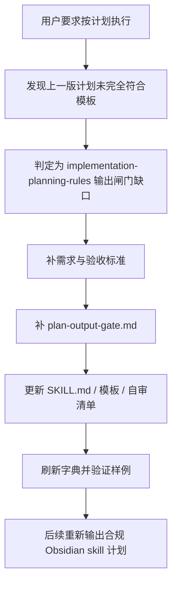
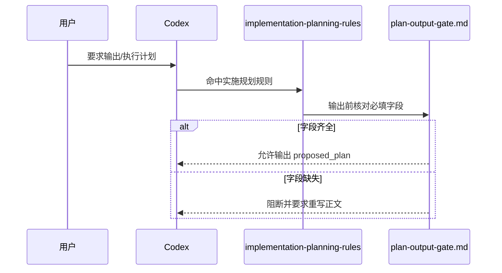

# 实施计划 Skill 合规闸门优化

## 0. 文档信息

- 需求标题: `实施计划 Skill 合规闸门优化`
- 版本与状态: `v0.1 / 已确认`
- 需求来源: 用户要求“按照计划执行”，前序计划审查确认上一版 Obsidian skill 计划未完全符合 `implementation-planning-rules` 的完整模板要求。
- 责任人: Codex

| 版本 | 日期 | 变更原因 | 责任人 |
| --- | --- | --- | --- |
| v0.1 | 2026-07-04 | 首次整理计划输出合规闸门优化需求 | Codex |

## 1. 引言

### 1.1 文档目的

本文档定义 `implementation-planning-rules` 需要补强的计划输出合规闸门，解决 Plan Mode 下计划正文容易被压缩为通用工程计划、遗漏仓库级实施模板字段的问题。本文档说明要做什么和做到什么算完成，不展开具体代码补丁细节。

### 1.2 产品范围

- 需求目标: 让计划类输出在 `<proposed_plan>` 等外层协议下仍强制满足仓库级实施计划模板，缺字段时必须先重写，不能输出半合规计划。
- 背景动因: 现有 `implementation-planning-rules` 已写明模板要求，但缺少足够明确的输出前字段矩阵和阻断动作，导致计划仍可能缺少阶段计划、每步验证点、自审结论等必填项。
- 本次纳入范围:
  - 补强 `implementation-planning-rules/SKILL.md` 的 Plan Mode 输出前闸门。
  - 新增 `implementation-planning-rules/references/plan-output-gate.md`。
  - 更新 `plan-structure-template.md` 和 `plan-review-checklist.md`，让模板和自审清单显式引用输出闸门。
  - 刷新 skill 字典产物并记录验证。
- 明确排除范围:
  - 不重写所有需求类 skill。
  - 不修改 Codex 的 Plan Mode 系统协议。
  - 不实施 Obsidian 项目知识库 skill。
  - 不改变 Git 提交流程。

### 1.3 术语与缩写

| 术语 | 定义 |
| --- | --- |
| Plan Mode 输出闸门 | 在输出 `<proposed_plan>` 前执行的字段完整性和结构合规检查。 |
| 通用工程计划壳 | 以 `Summary`、`Key Changes`、`Public Interfaces`、`Test Plan`、`Assumptions` 等小节作为主体的简版计划结构。 |
| 仓库级实施模板 | `implementation-planning-rules/references/plan-structure-template.md` 定义的完整实施计划结构。 |

### 1.4 参考资料

- `implementation-planning-rules/SKILL.md`
- `implementation-planning-rules/references/plan-structure-template.md`
- `implementation-planning-rules/references/plan-review-checklist.md`
- `skill-evolution-rules/references/gap-signals.md`

## 2. 产品概览

### 2.1 产品视角

本仓库的计划类任务由 `implementation-planning-rules` 承接。当前规则已经要求完整字段，但 Plan Mode 最终输出还受 `<proposed_plan>` 外层协议影响，模型可能把正文压缩为简版计划。该优化应在现有 skill 内补硬闸门，而不是新增独立 skill。

### 2.2 产品功能摘要

1. 在 `implementation-planning-rules` 中明确：Plan Mode 输出前必须读取并执行 `plan-output-gate.md`。
2. 定义完整计划、受限计划、阻断计划三类输出的必填字段。
3. 定义硬失败结构：通用工程计划壳、缺阶段计划、缺最小任务、缺真实测试、缺任务完成 / 停止条件等。
4. 要求缺字段时先重写计划正文，不允许把 `<proposed_plan>` 当成已收口。
5. 将新增闸门纳入模板和自审清单。
6. 用上一版 Obsidian skill 计划作为回归样例，验证闸门能识别缺口。

### 2.3 约束条件

- 只允许本地文件修改和本地脚本验证。
- 修改 skill 资产后必须刷新 `skill-dictionary/data.js` 与 `字典.md`。
- 不得覆盖当前工作树中已有的无关改动。
- 所有新增或修改文件保持 UTF-8。

### 2.4 用户与角色特征

| 角色 | 诉求 |
| --- | --- |
| 用户 / 维护者 | 计划输出稳定符合仓库规则，不需要每次人工指出缺字段。 |
| Codex / agent | 有明确的输出前检查清单和失败恢复动作。 |
| 后续实施者 | 能拿到决策完整、字段齐全、可直接执行的计划。 |

### 2.5 假设与依赖

- 当前问题属于 skill 闸门缺失，而不是 Obsidian skill 的业务需求缺口。
- 现有 `implementation-planning-rules` 仍是正确承接点。
- 本地 Python 能运行现有校验脚本和字典生成脚本。

## 3. 需求定义

### 3.1 外部接口需求

本需求不新增 HTTP、CLI 或数据库接口。对 agent 可见的接口为 skill 文档规则和 reference 文件。

### 3.2 功能需求

| ID | 标题 | 需求陈述 | 触发条件 / 输入 | 处理规则 | 输出 / 结果 | 异常分支 |
| --- | --- | --- | --- | --- | --- | --- |
| REQ-FUNC-001 | Plan Mode 输出前闸门 | `implementation-planning-rules` 必须要求 Plan Mode 输出前执行字段完整性检查。 | 当前环境处于 Plan Mode 或最终回复使用 `<proposed_plan>`。 | 读取 `plan-output-gate.md`，按计划类型检查必填字段。 | 缺字段时不得输出最终计划，必须重写。 | 若只能形成受限计划，必须显式写阻断原因和升级条件。 |
| REQ-FUNC-002 | 通用计划壳硬失败 | 通用工程计划壳必须被判为不合格。 | 正文主结构使用 `Summary` / `Key Changes` / `Test Plan` 等。 | 判定未使用仓库模板。 | 立即按 `plan-structure-template.md` 重写。 | 不得解释为“简化版计划”。 |
| REQ-FUNC-003 | 必填字段矩阵 | 新增 reference 必须列出正式计划、受限计划、阻断计划的必填字段。 | 输出任何计划。 | 按矩阵逐项核对。 | 字段齐全后才允许收口。 | 字段缺失时列出缺口并补齐。 |
| REQ-FUNC-004 | 自审联动 | 模板和自审清单必须显式引用输出闸门。 | 编写或审查计划。 | 将 `plan-output-gate.md` 纳入输出前检查。 | 计划自审可追溯到统一闸门。 | 不得只在 `SKILL.md` 中口头提醒。 |
| REQ-FUNC-005 | 回归样例验证 | 必须用上一版 Obsidian skill 计划样例验证闸门有效。 | 规则修改完成后。 | 检查样例中缺少阶段计划、每步验证点、自审结论等。 | 测试记录写明样例被判为不合格的原因。 | 若无法识别缺口，规则未达标。 |

### 3.3 质量需求

- 可维护性: 新增闸门集中在一个 reference 文件，避免规则散落。
- 可验证性: 每条合规要求都能在样例计划中找到对应检查点。
- 最小改动: 不新增独立 skill，不迁移目录。

### 3.4 合规与边界

- 修改 skill `description` 或 `##` 级标题后必须刷新字典。
- 计划输出规则不得绕开 `implementation-planning-rules` 的既有模板。
- 本需求不允许连接非 local 环境。

### 3.5 数据与实现约束

本需求不涉及数据库变更。

新增文件清单:

```text
implementation-planning-rules/
└── references/
    └── plan-output-gate.md # Plan Mode 与 <proposed_plan> 输出前字段核对闸门

doc/
├── 2-需求/
│   └── 2026-07-04_023433_实施计划Skill合规闸门优化.md # 需求主文档
├── 3-实施/
│   └── 2026-07-04_023433_实施计划Skill合规闸门优化_实施总览.md # 实施计划总览
├── 5-tests/
│   └── 2026-07-04_023433_实施计划Skill合规闸门优化/
│       └── README.md # 验证记录
├── 6-审查/
│   └── 2026-07-04_023433_实施计划Skill合规闸门优化_当前改动总审查.md # 当前改动审查
└── 7-验收/
    └── 2026-07-04_023433_实施计划Skill合规闸门优化_验收标准.md # 前置验收标准
```

### 3.6 图形化需求表达





## 4. 验证

### 4.1 验证策略

- 文档检查: 检查需求、验收、实施、测试、审查记录是否落盘。
- 静态检查: 运行 skill 校验脚本和字典生成脚本。
- 样例回归: 用上一版 Obsidian skill 计划作为不合格样例，验证新闸门能列出缺口。

### 4.2 可验收标准映射

| 需求 | 验收入口 | 通过标准 |
| --- | --- | --- |
| REQ-FUNC-001 | `plan-output-gate.md` | 存在 Plan Mode / `<proposed_plan>` 输出前检查流程。 |
| REQ-FUNC-002 | `SKILL.md` 与 `plan-structure-template.md` | 通用工程计划壳被明确列为硬失败。 |
| REQ-FUNC-003 | `plan-output-gate.md` | 正式计划、受限计划、阻断计划均有字段矩阵。 |
| REQ-FUNC-004 | 模板与自审清单 | 两处均引用输出闸门。 |
| REQ-FUNC-005 | 测试 README | 记录上一版样例缺口识别结果。 |

### 4.3 风险与阻断项

- 风险: 字段要求过多导致简单计划变长。
- 风险: 如果只补 reference 而不补入口流程，agent 可能仍不读取。
- 阻断项: 字典生成脚本失败或新增 reference 未被主流程引用。

## 5. 附录

### 5.1 核心逻辑与判定规则

| 逻辑主题 | 判定规则 |
| --- | --- |
| 正式计划 | 必须包含基本信息、实施周期、阶段计划、最小任务、落点、实施步骤、每步验证点、风险、必要 SQL、自审结论。 |
| 受限计划 | 必须包含不可正式规划原因、前置缺口、建议流转顺序、升级条件和禁止实施说明。 |
| 阻断计划 | 必须包含阻断条件、缺失证据、恢复路径和不得执行说明。 |
| 通用计划壳 | 只要主结构退化为通用工程摘要，即判定未使用本模板。 |

### 5.2 正文图示索引

- 流程图: 第 3.6 节。
- 时序图: 第 3.6 节。

### 5.3 变更追踪

- 2026-07-04: 首次建立实施计划 skill 输出闸门优化需求。
