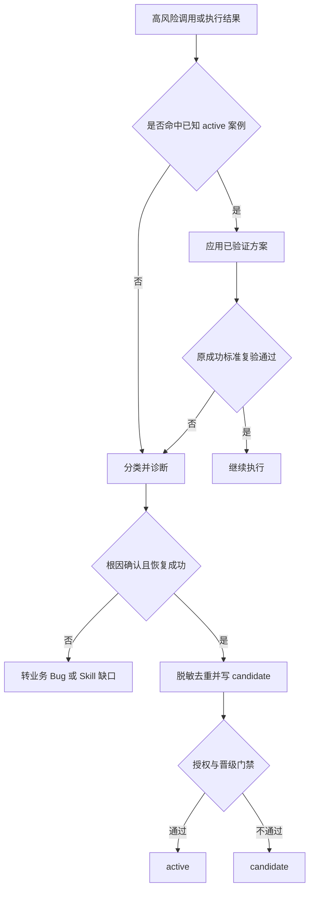
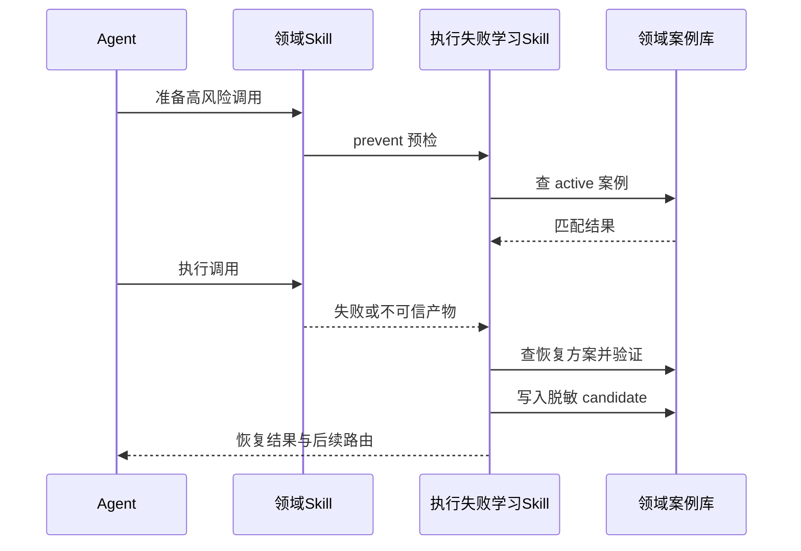

# 执行失败持续学习与主动预防

## 0. 文档信息

- 版本与状态：v1.0 / 已确认
- 需求来源：本轮用户确认的执行计划
- 主要读者：Skill 维护者、Agent 编排者、测试与审查人员
- 修订记录：2026-07-12，建立跨领域执行失败学习与主动预防闭环

## 1. 目标与范围

本需求为 Agent 增加执行期错误学习能力：在高风险调用前主动检索已验证案例，发生非预期失败后快速复用恢复方案，恢复成功后自动沉淀脱敏 candidate，并在证据和授权满足时晋级为 active。

纳入范围：新增 `execution-failure-learning-rules`；统一案例状态、字段、路由、去重、脱敏和验证门禁；接入 `imagegen`、Windows/WSL、认证 URL、浏览器、MCP、插件安装和 Obsidian CLI 等高风险领域。

排除范围：产品业务 Bug、需求缺口、普通错误处理设计、test/prod 连接、后台守护程序、未经授权自动激活案例、一次性或未验证 workaround。

## 2. 功能需求

### REQ-FUNC-001 自动触发

当模型、CLI、API、浏览器、MCP、安装器、生成器或验证入口出现非预期失败，或退出成功但输出/产物不满足成功标准时，必须触发执行失败学习规则。

### REQ-FUNC-002 高风险域预防

对已注册 owner Skill 的高风险调用，执行前按环境、版本、调用阶段、参数和错误特征匹配 active 案例；精确匹配时应用已验证方案，模糊匹配时不得强行套用。

### REQ-FUNC-003 快速恢复

失败后必须先分类和查找已有案例；同一失败假设最多无变化重试一次，之后必须改变诊断路径或输入处理方式，并使用原输入和原成功标准复验。

### REQ-FUNC-004 持续沉淀

根因确认且恢复方案复验成功后，自动将脱敏案例写入唯一 owner 的 candidate 区；缺少 owner 案例库时转交 `skill-evolution-rules`，不得临时创建无归属案例库。

### REQ-FUNC-005 晋级门禁

candidate 只有在根因、复验、唯一归属、去重、脱敏和复用价值均满足，且得到当前轮 Skill 维护授权后，才能晋级 active；新方案替代旧方案时建立 `superseded_by` 关系。

### REQ-FUNC-006 边界隔离

业务 Bug 交给 `bug-*`，Skill 结构缺口交给 `skill-evolution-rules`，跨项目稳定知识交给 `obsidian-knowledge-flow`；任何凭据、私有 prompt、完整响应、业务数据和未经脱敏路径不得进入案例库。

## 3. 状态与流程





## 4. 约束与验收映射

| 需求 | 验收标准 | 验证入口 |
| --- | --- | --- |
| REQ-FUNC-001/002 | 已知高风险调用可预检，未知非预期失败可触发 | 前向行为测试 |
| REQ-FUNC-003 | 无变化重试受限，恢复使用同输入和同成功标准 | Windows/CLI 模拟失败 |
| REQ-FUNC-004/005 | 新案例自动进入 candidate，未授权不得 active | 临时案例库验证 |
| REQ-FUNC-006 | 业务 Bug、敏感信息和无 owner 案例被正确隔离 | 负向与脱敏测试 |

## 5. 非功能要求与风险

- 可靠性：案例不匹配、版本变化或冲突时宁可不复用，不得静默套用。
- 安全性：只允许 local 环境取证和验证；候选写入前完成脱敏扫描。
- 可维护性：每个案例只有一个 owner，状态和字段统一，领域 Skill 保留事实正文。
- 风险：预检范围过大会增加上下文成本，因此 v1 只覆盖注册的高风险域；案例库缺失时不自动扩张目录。

## 6. 目录落点

```text
execution-failure-learning-rules/              # 执行失败学习元 Skill
imagegen/references/error-casebook.md          # 生图 owner 案例库
windows-wsl-execution-rules/references/command-failure-recovery.md  # Windows owner 案例库
authenticated-url-routing-rules/references/execution-failure-casebook.md  # URL owner 案例库
agent-browser/references/execution-failure-casebook.md              # 浏览器 owner 案例库
mcp-installation-rules/references/execution-failure-casebook.md    # MCP owner 案例库
plugin-installation-rules/references/execution-failure-casebook.md # 插件 owner 案例库
obsidian-knowledge-flow/references/cli-failure-casebook.md         # Obsidian CLI owner 案例库
```

## 7. 当前状态

- 需求状态：已确认，可进入前置验收与实施。
- 开工授权：本轮用户已明确“按照计划执行”，允许 subagent 并行。
- Git 授权：本轮未提出提交或推送，不得写入 Git 历史。
