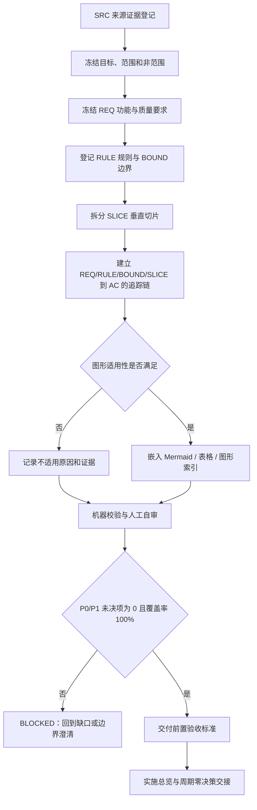
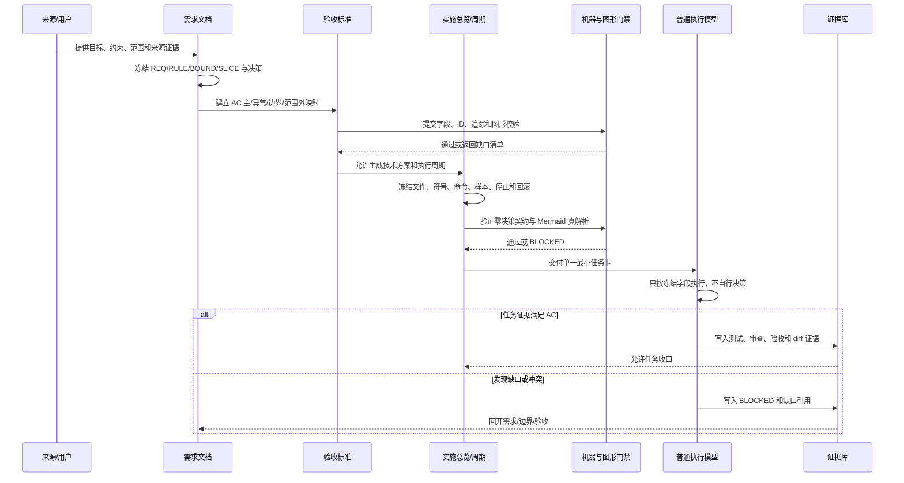

# 需求与实施文档极致完备化

## 0. 文档信息

| 字段 | 内容 |
| --- | --- |
| `doc_id` | `REQ-DOC-20260712-033322` |
| 需求标题 | 需求与实施文档极致完备化 |
| 版本与状态 | `v1.0 / 已确认 / 可进入前置验收` |
| 编制日期 | 2026-07-12 |
| 主要读者 | 需求分析者、实施规划者、测试人员、审查人员、普通执行模型、Skill 维护者 |
| 需求来源 | `SRC-USER-001`、`SRC-PLAN-001`、`SRC-TPL-REQ-001`、`SRC-TPL-AC-001`、`SRC-TPL-PLAN-001`、`SRC-RULE-001` |
| 对应验收标准 | `doc/7-验收/2026-07-12_033322_需求与实施文档极致完备化_验收标准.md` |
| 当前优先闭环 | 周期 01 / 任务 01-01：建立需求主文档与前置验收标准的共同事实源 |
| Git 状态约束 | 本需求不授权提交、推送、合并或重写历史 |

### 0.1 来源证据登记

| 来源 ID | 来源类型 | 事实或约束 | 在本文中的用途 |
| --- | --- | --- | --- |
| `SRC-USER-001` | 用户要求 | 需求、实施总览和实施阶段计划必须极致详细、完整、图形化，且可交给较低推理能力模型执行 | 冻结目标、质量门槛和零决策契约 |
| `SRC-PLAN-001` | 已批准实施计划 | 先建立跨域完备性契约，再升级需求链、实施链、交付闸门和机器验证 | 冻结实施顺序与周期边界 |
| `SRC-TPL-REQ-001` | 现有模板 | 需求文档采用 SRS 映射结构，必须有流程图和时序图 | 冻结需求文档最小结构 |
| `SRC-TPL-AC-001` | 现有模板 | 验收标准必须表达前置条件、输入、预期、异常、边界、范围外，并提供流程图和决策表 | 冻结验收标准结构 |
| `SRC-TPL-PLAN-001` | 现有模板 | 实施计划必须包含方案说明、范围、周期、阶段、最小任务、真实测试和停止条件 | 冻结下游实施交接字段 |
| `SRC-RULE-001` | 仓库规则 | 文档使用 UTF-8；需求、验收、实施分目录维护；图表与正文一致；不提交 Git 历史 | 冻结归档、编码和协作约束 |

## 1. 当前问题与最终目标

### 1.1 问题陈述

需求、实施总览和实施阶段计划在历史实践中容易被压缩成“摘要式计划”：有目标但没有来源证据，有任务但没有明确文件/符号落点，有测试名称但没有真实入口，有图形但没有语义索引，有风险但没有停止条件。高推理模型可以在聊天上下文中补足这些缺口，普通执行模型却只能按文档中已经冻结的事实行动，因而会出现自行猜测默认值、遗漏异常分支、扩大范围、重复实现、无法验收或无法回滚等风险。

### 1.2 最终目标

建立一套强制的文档完备性契约，使每份新建或被修改的需求、实施总览、实施周期和前置验收文档都具备：

1. 可独立阅读的来源、目标、范围、约束和术语上下文。
2. 可逐条执行的 `REQ`、`RULE`、`BOUND`、`SLICE`、`AC` 标识和双向追踪链。
3. 已冻结的业务决策、技术决策、默认值、优先级、异常策略、兼容策略和回滚策略。
4. 面向普通模型的零决策执行契约：文档外不得再补业务或技术决策。
5. 与正文一致、按语义适用性生成的流程图、时序图、状态图、决策表、追踪矩阵等图形化表达。
6. 可由机器校验、Mermaid 真解析和低推理模型演练验证的完成标准。

### 1.3 成功定义

当且仅当以下条件同时满足，本文定义的规则升级才算完成：

| 条件 | 可验证证据 |
| --- | --- |
| 文档不依赖聊天上下文 | 低推理模型演练中的 `unresolved_decisions` 为 0，且执行者可只读文档完成任务分解 |
| 需求到验收可追踪 | 所有 P0/P1 `REQ`、`RULE`、`BOUND`、`SLICE` 均映射至至少一个 `AC`，反向不得存在孤立 `AC` |
| 图文一致 | 适用图形全部嵌入 Markdown，Mermaid CLI 真解析成功，图中节点与正文 ID/术语一致 |
| 机器可判定 | UTF-8、元数据、标题顺序、ID 唯一性、引用有效性、禁用占位词和覆盖率检查全部通过 |
| 失败可停止和回滚 | 每个最小任务拥有完成、停止、阻断、回滚条件；不满足条件时禁止进入下游周期 |

## 2. 范围与边界

### 2.1 本轮纳入范围

| 范围 ID | 纳入内容 | 交付要求 |
| --- | --- | --- |
| `BOUND-IN-001` | 需求入口、需求缺口、边界、拆分、变更和验收标准的文档完备性 | 统一字段、ID、来源、追踪和回填规则 |
| `BOUND-IN-002` | 实施总览、实施周期和最小任务执行卡的文档完备性 | 明确方案、周期 DAG、阶段、任务、测试、审查、验收和停止条件 |
| `BOUND-IN-003` | 需求文档与实施文档职责边界 | 需求冻结“做什么/为什么/做到什么”，实施冻结“怎么做/改哪里/怎么验证” |
| `BOUND-IN-004` | 普通模型零决策交接契约 | 禁止执行时自行选择遗漏的业务或技术口径 |
| `BOUND-IN-005` | 图形适用性和真解析门禁 | 根据语义强制图形类型，并验证 Mermaid 可真实渲染 |
| `BOUND-IN-006` | 机器校验、低推理模型演练、回滚与阻断 | 形成可重复的前置验收证据 |

### 2.2 明确非范围

| 范围外 ID | 排除内容 | 排除理由 |
| --- | --- | --- |
| `BOUND-OUT-001` | 产品业务代码、API、数据库表、页面和运行时逻辑 | 本轮先建立文档契约，不改变产品行为 |
| `BOUND-OUT-002` | 修改 Codex/模型系统协议或模型权重 | 只能通过仓库 Skill 和文档规则约束执行行为 |
| `BOUND-OUT-003` | 批量迁移所有历史需求、实施和验收文档 | 避免造成无关大范围改动；历史文档在被修改时再升级 |
| `BOUND-OUT-004` | 自动提交、推送、合并、发布或生产环境验证 | 当前轮未获得 Git 写历史和非 local 环境授权 |
| `BOUND-OUT-005` | 用正则或人工阅读冒充 Mermaid 真解析 | 不能证明图形语法真实可渲染 |
| `BOUND-OUT-006` | 用高推理模型自评代替低推理模型演练 | 无法证明普通执行模型可以零决策执行 |

## 3. 决策冻结

以下决策是本需求的冻结事实；下游实施者不得重新选择。若未来必须改变，必须创建变更记录、重算追踪、重新验收并使受影响的实施计划失效待重开。

| 决策 ID | 冻结决策 | 影响对象 | 变更门槛 |
| --- | --- | --- | --- |
| `DEC-001` | 需求、实施、验收继续使用 Markdown，统一 UTF-8 和仓库既有换行策略 | 全部文档 | 需同步更新编码、工具链和验收口径 |
| `DEC-002` | 需求文档是业务行为唯一事实源；实施文档不得改写业务规则 | `REQ`、业务状态、角色和验收 | 需重新确认产品意图 |
| `DEC-003` | 实施总览是技术方案唯一事实源；实施周期和任务卡只能细化，不得另起技术方案 | `SLICE`、任务、代码落点 | 需重新评审架构和依赖 |
| `DEC-004` | 每条可观察要求必须有稳定 ID，ID 不因排版调整而重编号 | `REQ/RULE/BOUND/SLICE/AC` | 只能追加新 ID，废弃需保留状态和替代关系 |
| `DEC-005` | P0/P1 未决项为 0 才允许进入实施；P2 可延期但必须有 owner、截止时间和影响说明 | 下游入口 | P2 升级为 P0/P1 时立即阻断 |
| `DEC-006` | “不适用”必须写明原因与证据，不得用空白、`待定`、`后续再看`代替 | 所有条件字段 | 无证据时判定文档未收口 |
| `DEC-007` | 图形按语义适用性强制生成，并在文档内嵌 Mermaid 源码；外部图片只作补充 | 图形、索引、资产 | Mermaid 解析失败即阻断 |
| `DEC-008` | 普通模型执行时不允许创造默认值、排序、错误码、回滚动作、文件落点或测试样本 | 执行卡和实施周期 | 任一未冻结项转为阻断 |
| `DEC-009` | 每个最小任务独立完成“实现/真实测试/审查/验收”闭环后才能进入下一任务 | 实施周期 | 不能用周期末统一测试替代 |
| `DEC-010` | 任何验收失败、来源冲突、图文冲突或环境越权均进入阻断并保留证据 | 验收和交付闸门 | 仅责任人重新确认后解除 |

## 4. 术语、角色与职责

### 4.1 术语定义

| 术语 | 定义 | 反例 |
| --- | --- | --- |
| 需求文档 | 冻结业务目标、用户、范围、行为、约束、异常和可观察结果的主文档 | 把文件名、函数名、SQL 实现写成业务事实源 |
| 实施总览 | 将稳定需求转换为技术方案、依赖图、周期排序、风险和全局回滚的技术主文档 | 只列几条“改后端、补测试” |
| 实施周期 | 在一个清晰阶段目标下组织有顺序的最小任务，并定义进入/收口条件 | 跨多个目标的水平模块清单 |
| 最小任务 | 只承载一个垂直切片目标，能独立实现、测试、审查、验收和停止的执行单元 | 同时改多个无关模块并统一到周期末验收 |
| 零决策契约 | 执行者只能执行已冻结决策，发现缺口必须停止并回报，不得自行补全 | “按经验选择合适默认值” |
| 追踪覆盖率 | 下游 `AC` 可回指上游 `REQ/RULE/BOUND/SLICE` 且上游均有验收证据的比例 | 只有一张孤立需求-验收表 |
| 真解析 | 使用锁定版本的 Mermaid CLI 或等效官方解析器真实编译图形源码 | 只检查代码块首行是否为 Mermaid |

### 4.2 角色职责边界

| 角色 | 负责 | 不负责 |
| --- | --- | --- |
| 需求分析者 | 采集来源、冻结业务规则、定义范围和验收可观察结果 | 不决定函数、文件、依赖和具体测试命令 |
| 实施规划者 | 选择并记录技术方案、文件/符号落点、周期 DAG、测试入口和回滚 | 不擅自改变已确认业务行为 |
| 执行模型 | 按实施任务卡执行已冻结动作，生成证据并在缺口时停止 | 不补业务默认值、技术方案、优先级或范围 |
| 测试/验收人员 | 依据 `AC` 验证主/异常/边界/范围外并记录证据 | 不以“看起来正确”替代可执行验证 |
| 审查人员 | 检查职责边界、追踪完整性、图文一致性、风险和规则合规 | 不在审查阶段偷偷改需求或实现 |
| Skill 维护者 | 维护模板、字段矩阵、机器校验和触发联动 | 不代替来源业务方做未确认决策 |

### 4.3 需求与实施文档职责分界矩阵

| 主题 | 需求文档必须冻结 | 实施文档必须冻结 | 禁止重复或冲突 |
| --- | --- | --- | --- |
| 目标与价值 | 为什么做、用户结果、成功指标 | 不重复解释业务价值，只回指需求 | 不能在实施文档改业务目标 |
| 功能行为 | 触发、输入、处理规则、输出、异常 | 映射到组件/服务/调用链的实现路径 | 不能在实施文档新增业务分支 |
| 范围边界 | 纳入、排除、兼容、权限边界 | 代码改动边界和不触达目录 | 不能以技术便利扩大范围 |
| 数据口径 | 字段含义、来源、合法范围、脱敏要求 | schema/DTO/查询和迁移落点 | 不能只在实施文档发明字段含义 |
| 非功能 | 可量化性能、安全、可靠性、可观测指标 | 测量工具、样本、门槛和测试入口 | 不能以“性能好”代替指标 |
| 验收 | 用户可观察的通过条件 | 自动化测试和证据产生方式 | 不能把 build/lint 当唯一验收 |
| 回滚 | 用户行为和数据安全上的回退结果 | 代码、配置、迁移、开关和命令级回滚 | 两者必须指向同一结果 |

## 5. 功能需求与规则要求

### 5.1 需求级要求（`REQ-*`）

| ID | 标题 | 强制陈述（shall） | 输入/触发 | 结果 | 异常处理 |
| --- | --- | --- | --- | --- | --- |
| `REQ-DOC-001` | 独立可读 | 每份新建或被修改的需求、实施总览、实施周期和前置验收文档必须包含足以脱离聊天上下文执行的背景、目标、范围、术语、约束和当前状态 | 创建或修改文档 | 读者可独立理解任务 | 缺少上下文时阻断落盘 |
| `REQ-DOC-002` | 来源登记 | 每条关键结论必须关联 `SRC-*`，并记录来源类型、事实和用途 | 录入需求、方案或验收规则 | 结论可回溯到来源 | 无来源的推断不得标记为已确认 |
| `REQ-DOC-003` | 决策冻结 | P0/P1 业务与技术决策必须显式记录决策 ID、选择、理由、影响和变更门槛 | 需求确认或实施规划 | 执行者无需重新选择 | 决策冲突转阻断 |
| `REQ-DOC-004` | ID 追踪 | 需求、规则、边界、切片和验收项必须使用稳定唯一 ID，支持跨文档双向追踪 | 添加、修改或拆分条目 | 追踪矩阵覆盖率 100% | 重复、孤立或悬空 ID 判失败 |
| `REQ-DOC-005` | 行为完整 | 每条功能需求至少说明触发、输入、前置、处理规则、输出、异常、幂等/并发（适用时）和可验收结果 | 新增功能或行为变化 | 主、异常和边界可判定 | 不能以“按现有逻辑”占位 |
| `REQ-DOC-006` | 质量可量化 | 性能、安全、可靠性、可用性、可观测性和兼容性要求必须给出指标、测量口径、数据来源和阈值 | 非功能要求 | 测试可二值判定 | 缺指标则降为未决项 |
| `REQ-DOC-007` | 图形适用 | 按图形适用性矩阵生成并嵌入必要图形，图形节点必须能回指正文 ID | 存在流程、时序、状态、条件组合或依赖 | 复杂逻辑可扫描理解 | 图文冲突或真解析失败即阻断 |
| `REQ-DOC-008` | 零决策交接 | 交付给普通模型的实施周期和任务卡必须列出文件、符号、命令、样本、预期、禁止区、回滚和停止条件 | 进入实施阶段 | 普通模型只需执行 | 任一执行选择未冻结则暂停 |
| `REQ-DOC-009` | 职责隔离 | 需求文档与实施文档必须分别维护业务事实源和技术事实源，交叉引用但不复制冲突规则 | 需求/方案变更 | 只有一个真相源 | 发现双重真相源必须先修文档 |
| `REQ-DOC-010` | 变更传播 | 影响范围、默认值、行为、验收或实施顺序的变更必须回开受影响文档并重算追踪 | 需求变更、技术变更或验收变更 | 下游状态准确 | 未重算不得继续实施 |
| `REQ-DOC-011` | 失败可停止 | 每个阶段和最小任务必须定义进入、完成、停止、阻断和回滚条件 | 实施计划编制 | 失败时有明确退出路径 | 无停止条件视为不可执行 |
| `REQ-DOC-012` | 证据化验收 | 每条 `AC-*` 必须指定环境、前置、动作、预期、证据、判定人和失败路由 | 编写前置验收标准 | 验收结论可复现 | 只有文字描述不得放行 |

### 5.2 规则级要求（`RULE-*`）

| ID | 强制规则 | 违反时处理 |
| --- | --- | --- |
| `RULE-DOC-001` | Markdown 文件使用 UTF-8、末尾换行和仓库既有 `.editorconfig`/`.gitattributes` 约束 | 编码检测失败即阻断 |
| `RULE-DOC-002` | 关键文档元数据至少包含 `doc_id`、`doc_type`、`schema_version`、`status`、`version`、`source_ids`、`updated_at` | 缺字段不得进入验收 |
| `RULE-DOC-003` | 禁止空字段、无理由 `N/A`、`待定`、`后续再看`、`按经验`、`适当`、`若干`等不可执行占位词 | 机器校验和人工审查均失败 |
| `RULE-DOC-004` | 需求域、实施域、验收域按 `artifact-storage-rules` 目录职责落盘；同一来源对象不创建平行主入口 | 路径或主入口冲突阻断 |
| `RULE-DOC-005` | 新增或修改文档必须保留变更记录，记录日期、原因、影响 ID、作者和验收状态 | 变更不可追踪时阻断 |
| `RULE-DOC-006` | 图、表、正文、验收标准使用同一术语、状态和 ID，不得出现只在图中存在的关键分支 | 先修文档再推进 |
| `RULE-DOC-007` | 追踪矩阵必须同时支持上游到下游和下游到上游查询；覆盖率低于 100% 不通过 | 阻断交付 |
| `RULE-DOC-008` | 实施总览、实施周期和最小任务必须按“周期 01 → 任务闭环 → 周期收口 → 周期 02”顺序执行 | 禁止跨周期抢跑 |
| `RULE-DOC-009` | 真实测试必须有入口、依赖环境、样本/数据来源、动作、预期和通过标准；build/lint/静态阅读不算真实测试 | 缺项即不通过 |
| `RULE-DOC-010` | 任何非 local 连接信息、真实凭据、敏感数据和不可脱敏外部产物不得进入验证证据 | 立即停止并清理敏感内容 |

## 6. 普通模型零决策执行契约

### 6.1 执行者允许做什么

普通模型只能按照已批准实施周期和最小任务卡执行以下动作：读取指定文件、定位指定符号、按已冻结规则修改指定内容、运行指定 local 命令、记录指定证据、执行指定回滚或停止动作。

### 6.2 执行者禁止做什么

普通模型不得自行决定业务默认值、错误码、状态转换、权限范围、排序优先级、API 字段、数据库字段、文件路径、函数名、第三方依赖、测试样本、环境连接、兼容策略、回滚步骤或“合理的简化方案”。

### 6.3 缺口处理协议

当任务卡、需求或实施总览存在任何未冻结项时，执行者必须：

1. 停止当前任务，不做猜测性修改。
2. 输出 `BLOCKED`，引用缺口对应的 `REQ/RULE/BOUND/SLICE/AC` 或 `SRC`。
3. 说明已经读取的文档、发现的冲突、影响文件和需要谁确认。
4. 不得把猜测写回需求或实施文档，除非获得明确确认并创建变更记录。
5. 等待文档更新后重新读取，重新执行任务前置检查。

### 6.4 任务卡强制字段

| 类别 | 必须冻结的字段 |
| --- | --- |
| 目标 | 一个垂直切片目标、所属周期、前置依赖、下一任务依赖 |
| 落点 | 目录树、文件路径、模块、符号/段落、允许改动范围、禁止改动范围 |
| 行为 | 对应 `REQ/RULE/BOUND`、输入、输出、异常、兼容和回滚结果 |
| 测试 | local 环境、入口命令、样本/数据来源、预期输出、失败判定 |
| 证据 | 需要保留的日志、截图、报告、diff、测试编号和验收 ID |
| 停止 | 完成条件、停止/结束条件、阻断条件、恢复路径和责任人 |

## 7. 图形适用性矩阵

| 语义对象 | 最低图形 | 强制条件 | 必须关联 ID |
| --- | --- | --- | --- |
| 有明确开始、分支、重试、结束 | Mermaid `flowchart` | 需求、验收、复杂实施周期必填 | `REQ`、`RULE`、`AC` 或 `SLICE` |
| 有两个及以上参与者和调用顺序 | Mermaid `sequenceDiagram` | 外部接口、跨模块、失败恢复流程必填 | 参与者关联的 `REQ/SLICE` |
| 有状态、迁移、终态和非法迁移 | state diagram 或状态转移表 | 状态机、生命周期、审批流必填 | 状态相关 `REQ/RULE` |
| 有三个及以上条件组合 | 决策表 | 优先级、互斥条件、默认分支必填 | 条件相关 `RULE/AC` |
| 有实体、字段、关系和约束 | ER 图或数据关系表 | 新表、字段、唯一/外键关系必填 | 数据相关 `REQ/SLICE` |
| 有模块、服务、依赖或边界 | 系统边界图/依赖 DAG | 实施总览和跨模块周期必填 | `BOUND/SLICE` |
| 只有一条线性文字操作且无分支 | 表格或编号步骤 | 允许不画图，但必须记录“不适用原因” | 对应 `REQ/AC` |

图形使用规则：

- 图形源码直接嵌入 Markdown，不以不可追踪的截图替代源码。
- 图形标题、节点、参与者和状态必须使用正文同名术语；关键节点必须写出 ID 或在索引中关联 ID。
- 图形不能引入正文、追踪矩阵和验收标准不存在的新行为；如需新增行为，先更新需求。
- 图形不能只依赖颜色或图标表达通过/失败，必须使用文字和形状同时表达。

## 8. 需求主流程与交接时序

### 8.1 文档完备化主流程

### 8.2 来源到执行模型的时序

## 9. 垂直切片与追踪契约

### 9.1 需求垂直切片

| SLICE ID | 切片目标 | 上游约束 | 交付物 | 独立完成条件 |
| --- | --- | --- | --- | --- |
| `SLICE-DOC-001` | 来源、元数据和目录基线 | `REQ-DOC-001/002`、`RULE-DOC-001/002/004` | 需求主文档、验收标准、来源登记 | 可独立读取且路径/编码/元数据通过校验 |
| `SLICE-DOC-002` | 决策、职责和零决策交接 | `REQ-DOC-003/008/009`、`DEC-001..010` | 决策表、职责矩阵、任务卡字段契约 | 普通模型演练无未决 P0/P1 |
| `SLICE-DOC-003` | ID 追踪和验收映射 | `REQ-DOC-004/012`、`RULE-DOC-007` | 双向追踪矩阵、AC 文档 | 上游/下游覆盖率 100% |
| `SLICE-DOC-004` | 图形适用与真解析 | `REQ-DOC-007`、`RULE-DOC-006` | flowchart、sequenceDiagram、图形矩阵 | Mermaid CLI 真解析且术语一致 |
| `SLICE-DOC-005` | 失败、回滚和变更传播 | `REQ-DOC-010/011`、`RULE-DOC-005/010` | 风险表、阻断表、回滚契约、变更记录 | 失败路径可停止且可恢复 |

### 9.2 主追踪矩阵

| `REQ` | 关联 `RULE` | 关联 `BOUND` | 关联 `SLICE` | 关联 `AC` | 证据要求 |
| --- | --- | --- | --- | --- | --- |
| `REQ-DOC-001` | `RULE-DOC-001/002/003` | `BOUND-IN-001/002` | `SLICE-DOC-001` | `AC-DOC-001/002/003` | UTF-8、元数据、独立阅读记录 |
| `REQ-DOC-002` | `RULE-DOC-005` | `BOUND-IN-001` | `SLICE-DOC-001` | `AC-DOC-004` | 来源表和引用可回读 |
| `REQ-DOC-003` | `RULE-DOC-003` | `BOUND-IN-002/003` | `SLICE-DOC-002` | `AC-DOC-005/006` | 决策冻结表、无未决项报告 |
| `REQ-DOC-004` | `RULE-DOC-007` | `BOUND-IN-001/002/006` | `SLICE-DOC-003` | `AC-DOC-007/008` | 双向追踪报告、重复/孤立 ID 负向证据 |
| `REQ-DOC-005` | `RULE-DOC-003/006` | `BOUND-IN-001` | `SLICE-DOC-003` | `AC-DOC-009/010/011` | 主/异常/边界场景证据 |
| `REQ-DOC-006` | `RULE-DOC-009` | `BOUND-IN-001/002` | `SLICE-DOC-003` | `AC-DOC-012` | 指标、样本、阈值和测试报告 |
| `REQ-DOC-007` | `RULE-DOC-006` | `BOUND-IN-005` | `SLICE-DOC-004` | `AC-DOC-013/014` | Mermaid 真解析和图文索引 |
| `REQ-DOC-008` | `RULE-DOC-008/009` | `BOUND-IN-002/004` | `SLICE-DOC-002` | `AC-DOC-015/016` | 普通模型演练、任务卡字段报告 |
| `REQ-DOC-009` | `RULE-DOC-004/006` | `BOUND-IN-003` | `SLICE-DOC-002` | `AC-DOC-017` | 职责边界冲突负向测试 |
| `REQ-DOC-010` | `RULE-DOC-005/007` | `BOUND-IN-006` | `SLICE-DOC-003/005` | `AC-DOC-018/019` | 变更影响矩阵和重算记录 |
| `REQ-DOC-011` | `RULE-DOC-008/009/010` | `BOUND-IN-006` | `SLICE-DOC-005` | `AC-DOC-020/021` | 停止、阻断、回滚证据 |
| `REQ-DOC-012` | `RULE-DOC-007/009` | `BOUND-IN-001/006` | `SLICE-DOC-003/005` | `AC-DOC-022/023` | 可复现验收记录和失败路由 |

### 9.3 追踪不变量

1. `REQ/RULE/BOUND/SLICE/AC` ID 在当前项目范围内唯一；废弃 ID 不复用。
2. 每个 P0/P1 `REQ` 至少有一个 `AC`，每个 `AC` 至少回指一个上游条目。
3. 每个 `SLICE` 只能归属一个实施周期，并拥有独立测试、审查、验收、完成和停止字段。
4. 图形中的关键节点必须能通过图形索引回指一个正文 ID；正文关键分支不得只存在于图形。
5. 变更后必须重新计算受影响的追踪边和验收状态，原“通过”状态在重验前自动失效。

## 10. 非功能要求、风险与阻断

### 10.1 非功能要求

| ID | 维度 | 要求 | 测量口径 |
| --- | --- | --- | --- |
| `NFR-DOC-001` | 可读性 | 文档正文、表格和图形可被不依赖作者口头解释的工程人员阅读 | 独立阅读演练无关键澄清问题 |
| `NFR-DOC-002` | 可验证性 | 所有完成条件可由命令、脚本、报告或二值人工检查验证 | 每条 `AC` 有验证入口和证据 |
| `NFR-DOC-003` | 完整性 | 适用字段、分支、边界和异常不得遗漏；不适用项需原因和证据 | 机器字段矩阵和人工审查均通过 |
| `NFR-DOC-004` | 可维护性 | 规则集中在模板/质量 profile/门禁，业务文档只记录事实和引用 | 不产生同义平行规则 |
| `NFR-DOC-005` | 安全性 | 文档和验证证据不得包含 token、密码、私钥、真实敏感数据或生产连接 | 脱敏扫描无命中 |
| `NFR-DOC-006` | 可回滚 | 规则升级误伤旧文档时能回退本周期变更并保留失败证据 | 回滚演练成功且无历史破坏 |

### 10.2 风险登记

| 风险 ID | 风险 | 触发信号 | 缓解 | 残余风险 |
| --- | --- | --- | --- | --- |
| `RISK-DOC-001` | 详细度过高导致文档难以扫描 | 读者无法定位当前结论 | 使用目录、索引、表格、图形和正文摘要+附录 | 内容维护成本增加 |
| `RISK-DOC-002` | 字段复制造成多处真相源 | 同一规则在需求和实施文档不一致 | 采用职责矩阵和单向回指 | 变更传播仍需严格执行 |
| `RISK-DOC-003` | 图形与正文漂移 | 图中节点无对应 ID 或术语 | 图形索引、真解析、变更后重验 | 图形维护需要额外时间 |
| `RISK-DOC-004` | 普通模型误把缺口当默认值 | 执行记录出现“自行决定” | 零决策契约、阻断模板、低推理演练 | 人工仍需检查报告 |
| `RISK-DOC-005` | 机器校验过度阻断历史文档 | 未修改历史文件被批量报错 | 仅新建/被修改文档强制 schema v1 | 历史文档完整性不一致 |
| `RISK-DOC-006` | Mermaid 工具链不可用 | CLI 安装、浏览器或字体失败 | 锁定版本、local 验证、失败即记录阻断 | 需要维护工具运行环境 |

### 10.3 阻断条件

| 阻断 ID | 阻断条件 | 立即动作 | 恢复条件 |
| --- | --- | --- | --- |
| `BLOCK-DOC-001` | P0/P1 未决业务或技术决策 | 停止实施规划，回到需求缺口/边界确认 | 决策有来源、owner 和变更记录 |
| `BLOCK-DOC-002` | 需求、实施、验收存在冲突 | 标记所有受影响文档待重开 | 统一事实源并重算追踪 |
| `BLOCK-DOC-003` | Mermaid 真解析失败或图文不一致 | 不允许验收通过 | 修复源码/依赖并重新解析 |
| `BLOCK-DOC-004` | 普通模型演练仍需自行选择 | 停止执行并回报缺口 | 任务卡冻结缺失字段后重演练 |
| `BLOCK-DOC-005` | 连接到非 local 环境或泄露敏感信息 | 立即终止验证并清理证据 | 仅用 local 和脱敏样本复验 |
| `BLOCK-DOC-006` | 机器校验器、字典生成器或证据入口失败 | 保留失败输出，不得无变化重试冒充通过 | 按失败学习规则改变诊断路径并复验 |

## 11. 验证策略与变更传播

### 11.1 验证层级

| 层级 | 验证对象 | 必须证明 |
| --- | --- | --- |
| L1 文档静态 | 编码、元数据、标题、字段、占位词、ID、链接 | 文档结构可解析且字段齐全 |
| L2 追踪一致 | `SRC→DEC→REQ/RULE/BOUND/SLICE→AC` | 上下游覆盖 100%，无孤立项 |
| L3 图形真解析 | Mermaid flowchart/sequenceDiagram 及适用图形 | 源码真实可编译，节点和正文一致 |
| L4 执行演练 | 低推理模型读取实施周期/任务卡 | 无关键澄清、无自行决策、失败可阻断 |
| L5 负向与回滚 | 缺字段、冲突、越权环境、解析失败、回滚 | 失败被拒绝且恢复路径可执行 |

### 11.2 变更传播矩阵

| 变更类型 | 必须回开 | 必须重算 | 原验收状态 |
| --- | --- | --- | --- |
| 目标、范围、角色或业务行为变化 | 需求、验收、实施总览、受影响周期 | `REQ/RULE/BOUND/SLICE/AC` 和周期顺序 | 失效待重验 |
| 技术方案、依赖、文件或符号变化 | 实施总览、受影响周期、验收入口 | `SLICE/AC` 与测试证据 | 失效待重验 |
| 指标、阈值、样本或测试入口变化 | 验收标准、实施周期、测试说明 | `AC`、证据和通过标准 | 失效待重验 |
| 图形节点、分支或参与者变化 | 所属主文档、图形索引、验收 | 图形 ID 和相关 `REQ/AC` | 失效待重验 |
| 目录或命名变化 | 资产存储规则、所有引用文档 | 路径链接和来源索引 | 失效待重验 |

## 12. 本需求的实施交接约束

本需求本身只负责定义规则升级目标和验收契约，后续实施必须按以下垂直顺序推进：

1. `SLICE-DOC-001`：建立来源、元数据、目录和共同事实源。
2. `SLICE-DOC-002`：建立决策冻结、职责边界和普通模型零决策契约。
3. `SLICE-DOC-003`：建立 ID、双向追踪和验收映射。
4. `SLICE-DOC-004`：建立图形适用性、Mermaid 源码和真解析门禁。
5. `SLICE-DOC-005`：建立风险、阻断、回滚和变更传播。

每个切片必须在自己的实施周期/最小任务内完成真实测试、实现审查和前置验收后，才允许推进下一个切片。实施文档必须回指本文 `REQ-DOC-*`、`RULE-DOC-*`、`BOUND-*`、`SLICE-DOC-*`，但不得在实施阶段重新选择业务口径。

## 13. 自审结论

| 检查项 | 结论 | 证据 |
| --- | --- | --- |
| 来源、目标、范围、非范围 | PASS | 第 0、1、2 节；`SRC-*`、`BOUND-IN/OUT-*` |
| 决策冻结 | PASS | 第 3 节；`DEC-001..010` |
| 需求/规则/边界/切片/验收 ID | PASS | 第 5、9 节；`REQ-*`、`RULE-*`、`BOUND-*`、`SLICE-*`、`AC-*` |
| 普通模型零决策契约 | PASS | 第 6 节 |
| 需求与实施职责边界 | PASS | 第 4.3、12 节 |
| 图形适用性与 Mermaid 图 | PASS | 第 7、8 节，含 flowchart 与 sequenceDiagram |
| 追踪表 | PASS | 第 9.2 节，覆盖 `REQ→RULE→BOUND→SLICE→AC` |
| 风险、阻断、回滚、变更传播 | PASS | 第 10、11 节 |
| 依赖聊天上下文 | PASS | 目标为低推理模型演练 `unresolved_decisions=0` |

## 14. 变更记录

| 版本 | 日期 | 变更原因 | 影响 ID | 责任人 | 验收状态 |
| --- | --- | --- | --- | --- | --- |
| `v1.0` | 2026-07-12 | 周期 01 / 任务 01-01：建立需求与验收共同事实源，固化极致完备性和零决策交接规则 | 全部 `REQ/RULE/BOUND/SLICE/AC` | Codex | 待前置验收 |
