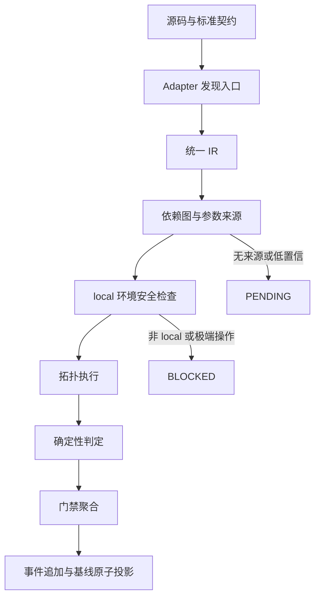
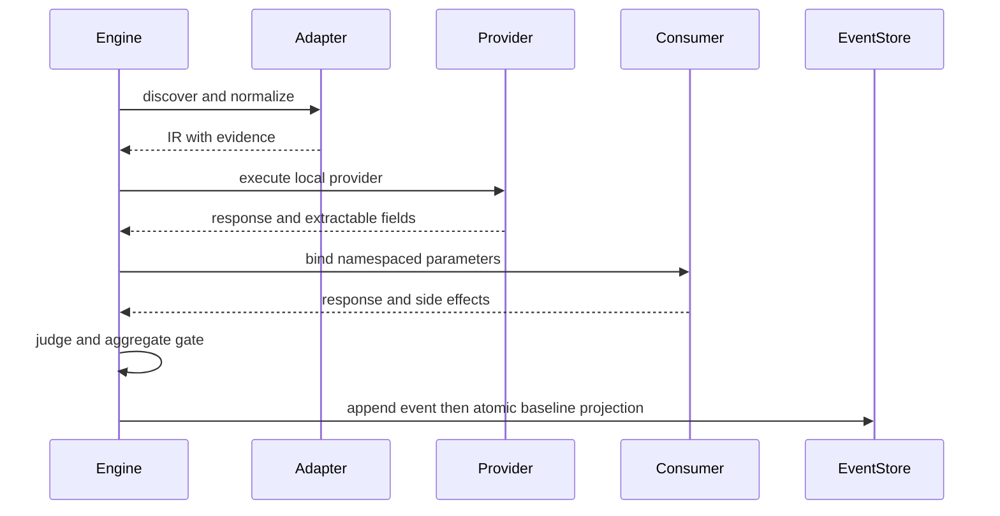

# 通用上线测试引擎完善需求

## 文档信息

| 字段 | 冻结内容 |
| --- | --- |
| `doc_id` | `REQ-RT-20260712-001` |
| 主要读者 | Skill 维护者、实施模型、测试人员、审查人员 |
| 当前优先闭环 | `SLICE-RT-001`：统一契约、发现、参数解析、执行、判定和基线回写 |
| 对应验收 | [前置验收标准](../7-验收/2026-07-12_180240_通用上线测试引擎完善需求_验收标准.md) |
| 对应实施总览 | [实施总览](../3-实施/2026-07-12_180240_通用上线测试引擎完善需求_实施总览.md) |
| 图片资产决策 | N/A + 原因：本轮表达的是规则、流程和时序；证据：正文包含 Mermaid 流程图和时序图。 |

## 决策冻结

图片资产决策：N/A + 原因：本轮表达的是规则、流程和时序；证据：正文包含 Mermaid 流程图和时序图。

| 决策 ID | 决策 | 冻结理由 | 影响 |
| --- | --- | --- | --- |
| `DEC-RT-001` | 使用 adapter 将不同协议映射到统一入口 IR | 降低技术栈差异对执行器的影响 | `REQ-RT-001`、`REQ-RT-002` |
| `DEC-RT-002` | 参数采用 `service.operation.location.field` 命名空间 | 防止不同接口的同名字段串用 | `REQ-RT-003`、`REQ-RT-004` |
| `DEC-RT-003` | 依赖边使用证据评分，低于阈值不得自动执行 | 防止模型猜测接口关系 | `REQ-RT-004`、`RULE-RT-002` |
| `DEC-RT-004` | 运行时只接受 local 配置；业务写入和真实第三方副作用按 local 授权执行 | 满足本地联调红线且覆盖真实上线风险 | `REQ-RT-005`、`BOUND-RT-001` |
| `DEC-RT-005` | 极端破坏性操作在执行前硬阻断 | 防止测试工具损坏环境 | `REQ-RT-006`、`RULE-RT-004` |
| `DEC-RT-006` | 结果只允许 `PASS/EXPECTED_FAIL/FAIL/PENDING/BLOCKED` | 保证门禁状态唯一可计算 | `REQ-RT-007` |
| `DEC-RT-007` | 事件先追加、基线后原子投影 | 防止进程中断污染长期资产 | `REQ-RT-008`、`RULE-RT-005` |

## 需求来源与证据台账

| 来源 ID | 来源事实 | 证据位置 | 结论 |
| --- | --- | --- | --- |
| `SRC-USER-RT-001` | 用户要求任何项目自动扫接口、查参数、建关联并准确测试 | 当前任务说明 | 建立通用测试引擎能力 |
| `SRC-PLAN-RT-001` | 已确认八周期实施计划 | 上一轮正式计划 | 采用周期化垂直切片 |
| `SRC-BASELINE-RT-001` | 现有 Skill 只有扫描、计划和骨架生成 | `project-release-test-rules/scripts/generate_release_test_plan.py` | 需要补齐运行时引擎 |

## 目标与非目标

### 目标

| 需求 ID | 目标 |
| --- | --- |
| `REQ-RT-001` | 自动发现 REST/OpenAPI、GraphQL、gRPC、WebSocket、SOAP、JSON-RPC、消息、CLI、定时任务和事件处理器入口。 |
| `REQ-RT-002` | 为每个入口生成带协议、schema、鉴权、副作用、证据和置信度的统一 IR。 |
| `REQ-RT-003` | 自动获得 query/path/header/cookie/body/message/cli/env 参数，并保留来源链。 |
| `REQ-RT-004` | 根据显式关系、字段类型、格式、模型关系和 provider 响应推断依赖图，并按拓扑顺序执行。 |
| `REQ-RT-005` | 在 local 配置下执行 HTTP、RPC、消息、CLI 和任务入口，允许真实业务写入及第三方副作用。 |
| `REQ-RT-006` | 在执行前阻断删库、删表、TRUNCATE、破坏性 DROP、项目/源码删除和基础设施摧毁等极端操作。 |
| `REQ-RT-007` | 按确定性传输、协议、schema、断言、副作用、清理顺序判定结果并计算上线门禁。 |
| `REQ-RT-008` | 以追加事件和原子投影方式复用参数、场景、依赖、结论和历史证据。 |

### 非目标与边界

| 边界 ID | 非目标/边界 | 处理 |
| --- | --- | --- |
| `BOUND-RT-001` | 禁止连接 test、staging、pre、release、prod 配置 | 输出 `ENV_BLOCKED`，不发送请求 |
| `BOUND-RT-002` | 未支持协议或无法确认入口 | 输出 `UNSUPPORTED_ADAPTER` 或 `DISCOVERY_INCOMPLETE`，不得伪造 PASS |
| `BOUND-RT-003` | 不修改被测项目业务代码、数据库 schema 或生产部署 | 记录范围外，不进入本需求实现 |
| `BOUND-RT-004` | 不自动提交 Git 历史 | 由当前轮授权单独决定，本需求不授权 |

## 功能需求与规则要求

| 规则 ID | 要求 | 必须结果 |
| --- | --- | --- |
| `RULE-RT-001` | adapter 必须输出入口、参数位置、schema、鉴权、证据、完整度和版本 | 缺字段即 `DISCOVERY_INCOMPLETE` |
| `RULE-RT-002` | 依赖候选必须记录来源、评分、理由和人工 override | 低置信边为 `PENDING` |
| `RULE-RT-003` | 参数解析优先级固定为 reusable、provider、local DB/cache、example、fixture、rule | 每个参数有唯一命名空间和 trace |
| `RULE-RT-004` | safety denylist 在任何网络或进程执行前检查 | 命中即 `SAFETY_BLOCKED` |
| `RULE-RT-005` | 先写 append-only run event，再以锁和原子替换更新 baseline | 中断后旧 baseline 可恢复 |
| `RULE-RT-006` | P0 必测入口任一非 PASS 时最终门禁为 FAIL；P1/P2 失败或阻断且无 P0 时为 PARTIAL | 门禁结果唯一 |
| `RULE-RT-007` | 未知业务语义只能为 PENDING，不得由模型改写为 PASS | 结论可审计 |

## 非功能要求、风险与阻断

| 类别 | 要求/阈值 | 测试入口 | 失败处理 |
| --- | --- | --- | --- |
| 可重复性 | 相同源码指纹、配置指纹和样本产生相同 IR 与判定 | `TEST-RT-001` | `BLOCKED` 并保留差异 |
| 安全 | secret、token、密码、私钥、连接串原值不得写入报告或 baseline | `TEST-RT-002` | 立即停止并隔离证据 |
| 恢复 | 进程中断、锁竞争、磁盘失败不破坏旧 baseline | `TEST-RT-003` | 回滚到旧版本 |
| 兼容 | 现有十个 CLI 子命令行为保持兼容 | `TEST-RT-004` | 兼容包装回退 |
| 可观测 | 每个入口有 run id、adapter、请求摘要、判定和证据引用 | `TEST-RT-005` | 缺证据不得放行 |

## 普通模型零决策执行契约

| 执行字段 | 冻结值 |
| --- | --- |
| 环境 | 只读取 local 配置；环境来源缺失时停止 |
| 文件/符号 | 按实施周期任务卡的精确落点执行，不得新增未列文件 |
| 参数 | 只能使用参数来源链；无来源时输出 `PARAM_UNRESOLVED` |
| 测试 | 使用任务卡给出的命令、样本、断言和失败预期 |
| 停止 | 命中非 local、secret、极端操作、未决 P0/P1 或测试失败时停止 |
| unresolved_decisions | `0`；任何缺口必须转 `BLOCKED`，不得自行补默认值 |

## 追踪契约

`SRC-RT-*` 必须先回指 `DEC-RT-*`、`REQ-RT-*`、`RULE-RT-*` 和 `BOUND-RT-*`；每条需求回指 `AC-RT-*`，每条验收回指 `CYCLE-RT-*`、`TASK-RT-*`、`TEST-RT-*` 和 `EVIDENCE-RT-*`。任何孤立、重复或悬空 ID 都是阻断。图片资产决策为 N/A，原因和证据见文档信息。

## 需求主流程

图形目的：定义从发现到门禁和基线回写的唯一主路径。关联 ID：`REQ-RT-001` 至 `REQ-RT-008`、`RULE-RT-005`。

## 需求时序

图形目的：明确 provider、consumer、判定器和基线之间的交互顺序。关联 ID：`REQ-RT-003`、`REQ-RT-004`、`REQ-RT-007`、`REQ-RT-008`。

## 主追踪矩阵

| 需求/规则 | 验收 | 实施周期 | 测试 | 证据 |
| --- | --- | --- | --- | --- |
| `REQ-RT-001`、`REQ-RT-002` | `AC-RT-001` | `CYCLE-RT-01`、`CYCLE-RT-03` | `TEST-RT-001` | `EVIDENCE-RT-001` |
| `REQ-RT-003`、`REQ-RT-004` | `AC-RT-002`、`AC-RT-003` | `CYCLE-RT-04`、`CYCLE-RT-05` | `TEST-RT-002` | `EVIDENCE-RT-002` |
| `REQ-RT-005`、`REQ-RT-006` | `AC-RT-004`、`AC-RT-005` | `CYCLE-RT-06` | `TEST-RT-003` | `EVIDENCE-RT-003` |
| `REQ-RT-007`、`RULE-RT-006` | `AC-RT-006`、`AC-RT-007` | `CYCLE-RT-07` | `TEST-RT-004` | `EVIDENCE-RT-004` |
| `REQ-RT-008`、`RULE-RT-005` | `AC-RT-008`、`AC-RT-009` | `CYCLE-RT-02`、`CYCLE-RT-08` | `TEST-RT-005` | `EVIDENCE-RT-005` |

## 变更与阻断记录

| 版本 | 日期 | 变更 | 影响 ID | 状态 |
| --- | --- | --- | --- | --- |
| v1.0 | 2026-07-12 | 将现有骨架重定义为可插拔通用上线测试引擎 | `REQ-RT-*`、`RULE-RT-*` | confirmed |
