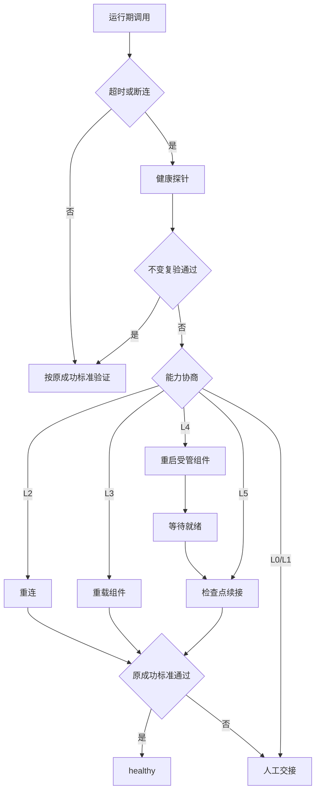
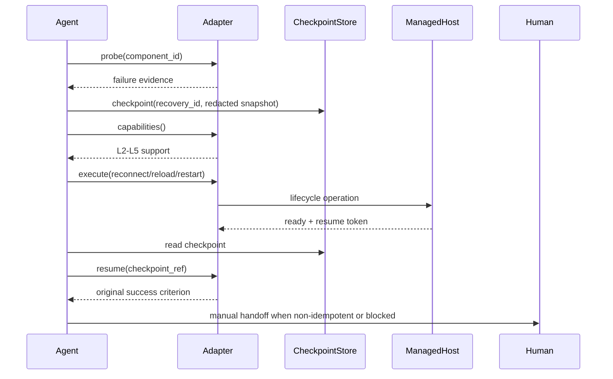

# 统一智能体运行期自恢复规则

## 文档信息

- 需求标题：统一智能体运行期自恢复规则。
- 复杂度等级：L4；依据是跨平台生命周期控制、任务检查点、并发恢复、权限边界和不可逆写入保护。
- 维护责任：运行期规则维护者；评审角色为智能体编排、平台适配、测试和安全审查人员。
- 交付状态：已确认，可进入前置验收与实施规划；正式编码仍以实施周期进入条件为准。
- 版本基线：v1.0；本轮用户确认统一 agent 规则并授权按计划执行。

## 当前计划最终方案简要说明

建立厂商无关的 `agent-runtime-recovery-rules` 规则层，以能力协商驱动 MCP、插件、浏览器会话和智能体宿主的重连、重载、重启与任务续接。规则层不猜测进程名或平台命令；只有真实 adapter 声明并通过 local 验证的 L5 能力，才允许在宿主重启后自动续接任务。

关联决策：`DEC-ARR-001` 选定“统一协议 + 平台 adapter”方案；`DEC-ARR-002` 将非幂等写入限制为状态核验后人工续接。

## 需求来源与证据台账

| ID | 来源类型 | 原文/事实摘录 | 责任人与时间 | 证据路径 | 结论 |
| --- | --- | --- | --- | --- | --- |
| `SRC-ARR-001` | 用户需求 | MCP 可能超时、断开，需要 agent 自行重载插件或重启软件，避免阻断任务目标。 | 用户，2026-07-12 | 本轮对话 | 触发自动恢复需求 |
| `SRC-ARR-002` | 用户边界修订 | 规则不能绑定 Codex，必须让统一 agent 智能体使用。 | 用户，2026-07-12 | 本轮对话 | 采用厂商无关 adapter |
| `SRC-ARR-003` | 仓库规则 | 文档需维护 `SRC -> DEC -> REQ/RULE -> AC -> CYCLE -> TASK -> TEST -> EVIDENCE`。 | 仓库维护规则，2026-07-12 | `AGENTS.md` | 采用全链追踪 |

## 决策冻结

| ID | 候选 | 选定方案 | 排除原因、影响面与回滚 | 决策证据 |
| --- | --- | --- | --- | --- |
| `DEC-ARR-001` | 平台专用命令；统一能力协议；人工恢复 | 统一能力协议并由平台 adapter 实现 | 平台专用命令无法跨 agent 兼容；回滚为 L0 人工交接；影响 MCP/插件/宿主恢复路由 | `SRC-ARR-001`,`SRC-ARR-002` |
| `DEC-ARR-002` | 自动重放全部请求；只读/幂等重放；全部人工 | 只读或显式幂等调用可重放，非幂等只核验状态 | 自动重放写入可能重复副作用；回滚为停止并人工续接；影响检查点与验收 | `SRC-ARR-003` |
| `DEC-ARR-003` | 强制重启；能力声明后分级恢复 | 能力声明后按 L0-L5 分级恢复 | 无生命周期 API 时强制重启越权；回滚为阻断；影响安全与兼容 | `SRC-ARR-002`,`SRC-ARR-003` |

## 目标与非目标

### 目标

- `REQ-ARR-001`：在运行期超时、EOF、连接重置、插件失效或宿主不可用时，agent 必须进入统一诊断与恢复状态机，并保留原任务成功标准。
- `REQ-ARR-002`：同一组件并发故障必须使用单飞锁、预算和冷却窗口，恢复操作最多由一个执行者发起。
- `REQ-ARR-003`：具备 L5 adapter 的平台在宿主重启后必须读取检查点、验证恢复令牌并以原成功标准完成任务续接。

### 非目标与边界

- `BOUND-ARR-001`：不新增安装、升级或删除 MCP/插件的能力；原因是其变更审批与运行期恢复不同，证据为 `SRC-ARR-003`。
- `BOUND-ARR-002`：不连接 test、staging、production 或 release 环境；原因是本仓库只允许 local 验证，证据为 `AGENTS.md`。
- `BOUND-ARR-003`：没有真实生命周期 API 的平台不允许强杀进程、模拟 UI 点击或伪造 L5；原因是无法验证组件归属与续接安全，证据为 `DEC-ARR-003`。
- 图片资产决策：N/A；原因是本需求描述协议、状态和依赖，Mermaid 图可表达全部结构；证据为无用户截图、无 UI 交付物、无位图验收项。

## 角色、权限与责任

| 角色 | 允许动作 | 禁止动作 | 责任 |
| --- | --- | --- | --- |
| `agent-orchestrator` | 创建脱敏检查点、调用已注册 adapter、读取恢复结果 | 修改 adapter 白名单、扩大 scope、重放未知写入 | 维持任务成功标准与停止边界 |
| `platform-adapter` | 声明 capabilities、执行已授权 probe/reconnect/reload/restart/resume | 隐式执行未声明动作、操作其他任务组件 | 提供真实生命周期 API、版本和回滚证据 |
| `human-operator` | 批准 P2 adapter、处理非幂等写入和人工续接 | 绕过审计直接标记 L5 | 处理阻断、审批和异常升级 |
| `auditor` | 审查日志、证据和脱敏结果 | 修改运行态或授权范围 | 验证可追踪性和合规性 |

权限矩阵以 `RULE-ARR-001` 为准：agent 只能操作当前任务拥有且 adapter 已声明的组件；跨任务、跨用户或非 local 组件均拒绝。

## 功能需求与规则要求

### `REQ-ARR-001` 失败识别与分级恢复

- 来源与验收：`SRC-ARR-001` -> `AC-ARR-001`、`AC-ARR-002`。
- 触发与输入：MCP/插件/宿主调用返回 timeout、EOF、connection reset、unavailable，或退出码为 0 但输出不满足原成功标准；输入包括 `task_id`、`component_id`、失败类别、请求摘要散列和原成功标准。
- 处理规则：先做一次健康探针和一次不变复验；再按 L2 reconnect、L3 reload、L4 restart、L5 resume 顺序协商；每层一次，预算耗尽进入 `blocked`。
- 输出与副作用：返回 `diagnosed/reconnecting/reloading/restarting/resumed/blocked/manual_handoff` 状态；写入脱敏检查点和恢复证据，不写入凭据或完整请求。
- 异常与边界：探针失败、能力声明过期、组件归属不明或 scope 越权时立即停止；不得把恢复动作标记为成功。
- 权限、兼容与观测：仅受管 adapter；L0-L4 平台保持工具级恢复兼容，L5 需要任务续接 hook；记录 `recovery_id`、adapter 版本、预算和停止原因。
- 回滚：删除本次临时检查点、释放单飞锁、恢复到 `manual_handoff`；不修改安装配置。
- 不允许自行决定：重试次数、幂等分类、scope、成功标准不得由执行模型临时改写。

### `REQ-ARR-002` 检查点与并发控制

- 来源与验收：`SRC-ARR-003` -> `AC-ARR-003`、`AC-ARR-004`。
- 触发与输入：进入 `suspected` 或任务即将调用高风险 adapter；输入为脱敏任务阶段、工作区指纹、组件标识、恢复策略和 TTL。
- 处理规则：原子写入检查点；按 `component_id + task_id_hash` 加单飞锁；TTL 默认 10 分钟；崩溃残留不得直接视为健康。
- 输出与副作用：生成短期 `checkpoint_ref` 和 `resume_token`；只保存摘要散列、状态和证据索引。
- 异常与边界：锁已存在则读取正在执行的恢复结果；过期、损坏或敏感扫描失败则拒绝续接。
- 权限、兼容与观测：检查点可被同一任务的受管 agent 读取；跨任务读取拒绝；记录版本化 schema 和脱敏规则版本。
- 回滚：恢复失败删除临时 token，保留脱敏失败证据；不回滚用户业务数据。
- 不允许自行决定：TTL、锁键、保存字段和保留期必须遵循 schema，不得扩展敏感字段。

### `REQ-ARR-003` 任务续接与非幂等保护

- 来源与验收：`DEC-ARR-002` -> `AC-ARR-005`、`AC-ARR-006`。
- 触发与输入：L5 adapter 报告宿主重启完成，提供恢复令牌和启动就绪探针。
- 处理规则：读取检查点、验证 token、恢复任务上下文；只读或有显式幂等键的操作可重放；非幂等操作只查询目标状态并转人工。
- 输出与副作用：仅当原成功标准再次通过时输出 `resumed/healthy`；否则输出 `manual_handoff` 或 `blocked`。
- 异常与边界：令牌无效、版本不兼容、状态指纹不一致或目标状态未知时停止续接。
- 权限、兼容与观测：L5 只对 adapter 声明的同一宿主生效；记录恢复前后指纹、原成功标准判定和人工交接原因。
- 回滚：终止续接，不重复发起原调用；保留脱敏审计证据供人工处理。
- 不允许自行决定：不得将未知操作视为幂等，不得用“恢复连接”替代“任务完成”。

### `RULE-ARR-001` 能力等级与安全预算

| 等级 | 能力 | 可承诺结果 | 缺失时路由 |
| --- | --- | --- | --- |
| L0 | 观测与人工交接 | 不执行动作 | `manual_handoff` |
| L1 | 健康探针 | 仅确认状态 | `diagnosed` |
| L2 | reconnect | 恢复 transport | `reconnecting` |
| L3 | reload | 恢复插件/隔离组件 | `reloading` |
| L4 | restart + wait_ready | 恢复受管组件可用性 | `restarting` |
| L5 | checkpoint + resume | 恢复并续接任务 | `resumed` |

### `RULE-ARR-002` 失败学习与案例边界

执行失败案例由 `execution-failure-learning-rules` 分类和脱敏；本规则只提供恢复状态、证据字段和 owner 路由。业务 Bug 转 `bug-*`，安装/启用转对应安装 skill；未验证 candidate 不得变为 active。

## 数据与外部契约

| 字段 | 类型/约束 | 来源与保留 | 脱敏/兼容 |
| --- | --- | --- | --- |
| `recovery_id` | UUID，必填，单次恢复唯一 | 恢复编排器，TTL 30 天审计索引 | 不含用户数据；schema v1 向后兼容 |
| `task_id_hash` | 字符串，SHA-256，必填 | 任务上下文，TTL 30 天 | 不保存原 task id |
| `component_id` | adapter 白名单标识，必填 | capability registry | 禁止绝对路径和凭据 |
| `idempotency_class` | `read_only/explicit_idempotent/non_idempotent/unknown` | 调用契约 | unknown 只能人工交接 |
| `checkpoint_ref` | 短期 opaque token | local 检查点存储，TTL 10 分钟 | 不可推导密钥 |
| `original_success_criterion` | 结构化判定摘要 | 当前任务契约，随任务销毁 | 不存完整 prompt/响应 |

外部 adapter 接口：`capabilities()`、`probe()`、`execute(operation, scope)`、`wait_ready()`、`resume(checkpoint_ref)`。接口错误统一返回 `unsupported`、`unauthorized`、`busy`、`not_ready`、`state_mismatch`；未知错误进入 `blocked`。

## 状态、流程与时序

图形目的：表达失败到恢复或人工交接的状态边界；关联 ID：`REQ-ARR-001`,`RULE-ARR-001`,`AC-ARR-001`。

图形目的：说明 agent、adapter、检查点和人工角色的调用顺序；关联 ID：`REQ-ARR-002`,`REQ-ARR-003`,`AC-ARR-003`,`AC-ARR-005`。

## 非功能要求、风险与阻断

| ID | 要求 | 指标/证据 | 失败处理 |
| --- | --- | --- | --- |
| `REQ-ARR-NFR-001` | 安全 | 敏感字段扫描 0 命中；越权 scope 100% 拒绝 | `blocked` 并删除 token |
| `REQ-ARR-NFR-002` | 并发 | 同组件同任务只产生 1 个恢复执行者 | 读取已有结果，禁止第二次动作 |
| `REQ-ARR-NFR-003` | 可用性 | L5 恢复后必须通过原成功标准 | 未通过转人工，不宣称续接 |
| `REQ-ARR-NFR-004` | 可观测 | 每次恢复具备 recovery_id、adapter 版本、证据和停止原因 | 记录脱敏审计索引 |

外部 platform adapter L5 依赖是硬阻断：平台必须提供真实 checkpoint 持久化、启动续接 hook、能力探针、生命周期操作和 token 验证；缺任一项只能交付 L0-L4，不得标记自动续接完成。阻断 ID：`GAP-ARR-L5-001`。

## 需求拆分与实施顺序

图形目的：表达垂直切片的依赖顺序和独立闭环边界；关联 ID：`SLICE-ARR-001` 至 `SLICE-ARR-005`。

| 切片 | 主需求 | 文件/符号边界 | 依赖 | 独立验收 |
| --- | --- | --- | --- | --- |
| `SLICE-ARR-001` | `REQ-ARR-001`,`RULE-ARR-001` | `agent-runtime-recovery-rules/SKILL.md`、状态机参考 | 无 | `AC-ARR-001`,`AC-ARR-002` |
| `SLICE-ARR-002` | `REQ-ARR-002` | checkpoint schema、锁与 wrapper | `SLICE-ARR-001` | `AC-ARR-003`,`AC-ARR-004` |
| `SLICE-ARR-003` | `REQ-ARR-003` | adapter contract、L5 registry | `SLICE-ARR-002` | `AC-ARR-005` |
| `SLICE-ARR-004` | `RULE-ARR-002` | local stub 与故障注入测试 | `SLICE-ARR-003` | `AC-ARR-006` |
| `SLICE-ARR-005` | `REQ-ARR-NFR-*` | 路由、文档、审查、验收证据 | `SLICE-ARR-004` | `AC-ARR-007` |

## 普通模型零决策执行契约

- `unresolved_decisions`: 无 P0/P1 未决项；L5 外部平台能力是实施进入条件，不是由执行模型猜测的默认能力。
- 普通模型必须按 `DEC-ARR-001` 至 `DEC-ARR-003` 执行，不得新增平台专用命令、扩大授权 scope 或改变幂等分类。
- 缺少 adapter、local fixture、原成功标准或脱敏证据时，状态必须为 `blocked`；停止条件见 `AC-ARR-007`。
- 每个实施任务必须按“实现 -> 真实测试 -> 审查 -> 验收”闭环；证据 ID 由实施文档登记，禁止只写人工阅读或 build 通过。

## 追踪契约

### 主追踪矩阵

| 来源/决策 | 需求/规则 | 验收 | 实施周期 | 任务 | 测试 | 证据 |
| --- | --- | --- | --- | --- | --- | --- |
| `SRC-ARR-001`,`DEC-ARR-001` | `REQ-ARR-001`,`RULE-ARR-001` | `AC-ARR-001`,`AC-ARR-002` | `CYCLE-ARR-01` | `TASK-ARR-01`,`TASK-ARR-02` | `TEST-ARR-01`,`TEST-ARR-02` | `EVD-TASK-ARR-01-IMPL`,`EVD-TASK-ARR-01-TEST`,`EVD-TASK-ARR-01-REVIEW`,`EVD-TASK-ARR-01-ACCEPT` |
| `SRC-ARR-003`,`DEC-ARR-002` | `REQ-ARR-002`,`RULE-ARR-002` | `AC-ARR-003`,`AC-ARR-004` | `CYCLE-ARR-02` | `TASK-ARR-03` | `TEST-ARR-03` | `EVD-TASK-ARR-03-IMPL`,`EVD-TASK-ARR-03-TEST`,`EVD-TASK-ARR-03-REVIEW`,`EVD-TASK-ARR-03-ACCEPT` |
| `SRC-ARR-002`,`DEC-ARR-003` | `REQ-ARR-003`,`REQ-ARR-NFR-003` | `AC-ARR-005`,`AC-ARR-006` | `CYCLE-ARR-02` | `TASK-ARR-04` | `TEST-ARR-04` | `EVD-TASK-ARR-04-IMPL`,`EVD-TASK-ARR-04-TEST`,`EVD-TASK-ARR-04-REVIEW`,`EVD-TASK-ARR-04-ACCEPT` |
| `SRC-ARR-002`,`DEC-ARR-003` | `REQ-ARR-NFR-004` | `AC-ARR-007` | `CYCLE-ARR-04` | `TASK-ARR-06` | `TEST-ARR-06` | `EVD-TASK-ARR-06-IMPL`,`EVD-TASK-ARR-06-TEST`,`EVD-TASK-ARR-06-REVIEW`,`EVD-TASK-ARR-06-ACCEPT` |

## 附录：术语、反例与图片决策

| 术语 | 定义 | 易混点 | 关联 |
| --- | --- | --- | --- |
| L4 restart | 重启受管组件并等待就绪，仅承诺工具可用 | 不等于任务续接 | `RULE-ARR-001` |
| L5 resume | 检查点、令牌和原成功标准全部通过后的任务续接 | 不等于进程重启成功 | `REQ-ARR-003` |
| 非幂等 | 重复执行可能产生额外副作用的操作 | unknown 不能默认幂等 | `DEC-ARR-002` |

反例：平台只提供“启动新进程”而无 checkpoint、token 和 resume hook 时，不能标记 L5；平台 scope 指向其他任务时，必须拒绝；原请求可能重复写入时，只能查询目标状态。

图片资产决策：N/A；原因是无图片输入、无视觉设计和无位图交付物；证据为 `SRC-ARR-001` 至 `SRC-ARR-003` 与本需求的 Mermaid 图完整覆盖。

## 验证、风险与交接

| 验证类型 | 入口 | 样本与断言 | 失败预期 | 清理/回滚 |
| --- | --- | --- | --- | --- |
| 协议与检查点契约测试 | `python -X utf8 doc/5-tests/2026-07-12_203429/agent-runtime-recovery-rules/test_agent_runtime_recovery.py` | scope_hash、TTL、损坏 JSON、状态终态、能力契约；9/9 | 任一断言失败即 `blocked` | 删除临时检查点 |
| local adapter E2E | `python -X utf8 doc/5-tests/2026-07-12_205724/agent-runtime-recovery-rules/test_recovery_engine_fixture.py` | local L0/L2/L3/L4/L5、动作序列、非幂等、缺 L5；18/18 | 非幂等重放、未验证 criterion 返回 resumed | 终止 fixture，删除 temp |
| 文档校验 | `python -X utf8 artifact-delivery-gate-rules/scripts/validate_engineering_docs.py --profile requirement --doc <本文件> --root F:\luode-skills` | front matter、图、表、ID、N/A 证据 | 非零退出码停止交付 | 修正文档后重新校验 |

## 自审结论

- `REQ/RULE -> AC -> CYCLE -> TASK -> TEST -> EVIDENCE` 已在主追踪矩阵双向登记。
- L5 外部 platform adapter 依赖、阻断与降级明确；无平台专用默认命令。
- 图、表、正文术语一致；图片资产明确 N/A 并给出原因与证据。
- 需求状态为 confirmed；未授权执行模型不得跳过验收标准和实施周期。
