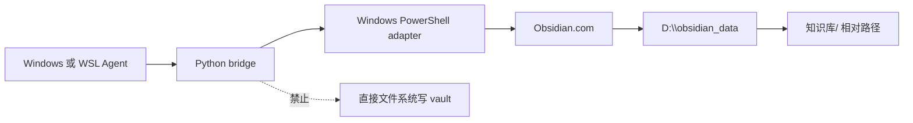

# Obsidian 知识流跨 Windows 与 WSL CLI 桥接

## 文档信息

图片资产决策：N/A + 原因：跨宿主关系可由 Mermaid 完整表达，未产生视觉验收所需位图 + 证据：SRC-OBS-001、DEC-OBS-001。

| 字段 | 内容 |
| --- | --- |
| 来源 | 用户批准的《Obsidian 知识流跨 Windows / WSL CLI 桥接实施计划》 |
| 当前优先闭环 | WSL 通过 bridge 对固定 vault 写入并从双端读回 smoke note |
| 图片资产决策 | N/A + 原因：本需求用 Mermaid 描述跨宿主流程，未产生需要视觉比对的位图 + 证据：计划第 12.1 节 |

## 决策冻结

| ID | 冻结决策 | 不允许的替代 |
| --- | --- | --- |
| DEC-OBS-001 | Python bridge 调用 Windows PowerShell adapter，最终只调用官方 Windows Obsidian CLI | WSL 安装第二套 CLI、常驻 RPC |
| DEC-OBS-002 | 唯一 vault 根为 `D:\obsidian_data`，笔记路径以 `知识库/` 开头 | 把 `D:\obsidian_data\知识库` 当作嵌套 vault |
| DEC-OBS-003 | 应用不可达时只隐藏启动一次、最多等待 15 秒并只重试一次 | 杀死用户进程、无限重试 |
| DEC-OBS-004 | vault 笔记操作保持 CLI-only | Python、UNC 或 `/mnt/d` 文件 API fallback |

`unresolved_decisions: 0`。

## 需求来源与证据台账

| ID | 来源或事实 | 结论 |
| --- | --- | --- |
| SRC-OBS-001 | 用户要求 Windows Agent 与 WSL Agent 双端支持 | 必须提供统一公开 bridge 入口 |
| SRC-OBS-002 | WSL 没有原生 `obsidian`，但可使用 Windows interop | WSL 缺 CLI 不能单独判定阻断 |
| SRC-OBS-003 | 当前 Windows CLI 在应用未运行时无法连接 | adapter 必须实现一次启动恢复 |
| SRC-OBS-004 | 现有规则和 `distill_vault.py` 使用冲突 vault 模型 | 必须冻结唯一根与 selector 解析规则 |

问题：现有知识流没有可靠的 WSL→Windows Obsidian CLI transport，且 vault 根模型、路径身份与失败语义不统一。

## 范围与边界

| 范围 | 包含 | 排除 |
| --- | --- | --- |
| REQ-OBS-001 | `doctor/search/read/create/append/open/project-context` allowlist、UTF-8 JSON transport、Windows/WSL host 识别 | 任意 CLI 子命令透传 |
| REQ-OBS-002 | 动态解析唯一注册 vault selector、`知识库/` 相对路径安全校验 | root probing、嵌套 vault 写入 |
| REQ-OBS-003 | 隐藏启动一次、结构化错误码、读回验证、长正文分块 | 杀用户进程、无限重试 |
| BOUND-OBS-001 | 项目本地四件套继续由普通文件工具维护 | 用 Obsidian 替代项目本地记忆 |

范围外：macOS、原生 Linux Obsidian、远程 vault、同步服务、非 local 环境连接，均为 N/A + 原因：已冻结为本需求非范围 + 证据：DEC-OBS-001/004。

## 功能需求与规则要求

| ID | 规则 | 可观察结果 |
| --- | --- | --- |
| RULE-OBS-001 | 生产入口只接受 allowlist operation 与 schema v1 | 非法 operation 返回 `INVALID_ARGUMENT`，不执行 CLI |
| RULE-OBS-002 | path 为 vault 相对路径，禁止 `..`、盘符、UNC、NUL 与非法字符 | 越界 path 返回 `PATH_OUTSIDE_KNOWLEDGE` |
| RULE-OBS-003 | `vaults verbose` 仅允许一个根匹配 `D:\obsidian_data` | 零个或多个分别返回稳定 vault 错误码 |
| RULE-OBS-004 | create/append 使用 UTF-8 临时 JSON，finally 删除；成功必须 readback | 日志无正文，`verified=true` 才成功 |
| RULE-OBS-005 | Linux、UNC、Git Bash WSL 路径归一为相同 `wsl://` project ID | 同一项目没有重复实体 |

## 非功能要求、风险与阻断

| ID | 契约或风险 | 防护与失败标准 |
| --- | --- | --- |
| REQ-OBS-004 | Windows Obsidian 应用和 `Obsidian.com` 为唯一运行宿主 | 找不到 CLI 返回 `CLI_NOT_FOUND` |
| REQ-OBS-005 | WSL 必须通过允许的 `powershell.exe`/`pwsh.exe` interop | interop 缺失返回 `WSL_INTEROP_UNAVAILABLE` |
| RISK-OBS-001 | 中文、换行与超过 10 KB 正文被 shell 损坏 | JSON 文件、1800 字符分块、hash/readback 断言 |
| RISK-OBS-002 | 临时文件或日志泄漏正文 | finally 清理、错误响应脱敏；任一泄漏停止任务 |

## 流程图

图形目的：说明 `REQ-OBS-001` 到 `AC-OBS-005` 的唯一 CLI-only 调用边界。关联 ID：REQ-OBS-001、RULE-OBS-003、AC-OBS-005。



## 时序图

图形目的：约束应用恢复和 vault selector 解析顺序。关联 ID：DEC-OBS-003、RULE-OBS-003、AC-OBS-003。

```mermaid
sequenceDiagram
  participant Agent
  participant Bridge
  participant Adapter
  participant CLI
  Agent->>Bridge: operation + UTF-8 request
  Bridge->>Adapter: JSON request
  Adapter->>CLI: version
  alt app unavailable
    Adapter->>Adapter: hidden start once; wait <=15s
    Adapter->>CLI: version retry once
  end
  Adapter->>CLI: vaults verbose
  Adapter->>CLI: resolved selector operation
  Adapter-->>Bridge: structured response
  Bridge-->>Agent: verified result or stable code
```

## 普通模型零决策执行契约

1. 先创建并验证契约文档，不写 bridge 代码。
2. `TASK-OBS-02` 只实现 Python 参数、host 与身份归一，不做真实 vault 写入。
3. `TASK-OBS-03` 只实现 Windows adapter 与 fake CLI 契约测试。
4. 仅当 `CYCLE-OBS-01` 的每个任务各自完成实现、真实测试、审查和验收后，才进入下一周期。
5. 出现多 selector、interop 不可用、应用启动一次后不可达、读回不一致或需要文件 API fallback 时立即停止。

## 追踪矩阵

| SRC | DEC | REQ/RULE | AC | CYCLE/TASK | TEST | EVIDENCE |
| --- | --- | --- | --- | --- | --- | --- |
| SRC-OBS-001 | DEC-OBS-001 | REQ-OBS-001、RULE-OBS-001 | AC-OBS-001、AC-OBS-002 | CYCLE-OBS-01/TASK-OBS-02 | TEST-OBS-001~005 | EVD-TASK-OBS-02-* |
| SRC-OBS-003 | DEC-OBS-003 | REQ-OBS-003、RULE-OBS-003 | AC-OBS-003 | CYCLE-OBS-01/TASK-OBS-03 | TEST-OBS-006、011 | EVD-TASK-OBS-03-* |
| SRC-OBS-004 | DEC-OBS-002、004 | REQ-OBS-002、RULE-OBS-002/004 | AC-OBS-004、005 | CYCLE-OBS-01/TASK-OBS-01 | TEST-OBS-008、012 | EVD-TASK-OBS-01-* |

## 追踪契约

每个 `SRC/DEC` 均映射到 `REQ/RULE`，每个 `REQ/RULE` 均映射到 `AC`，每个 `AC` 均由 `CYCLE/TASK`、`TEST` 与 `EVD-*` 承接。任何孤立 ID、未决 P0/P1 或矩阵缺链均阻断 `TASK-OBS-01` 验收。

## 验收与实施链接

- 验收标准：`ACCDOC-OBS-20260713`。
- 实施总览：`IMPLDOC-OBS-20260713`。
- 当前实施周期：`CYCLE-OBS-01`。
