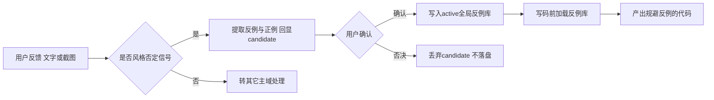
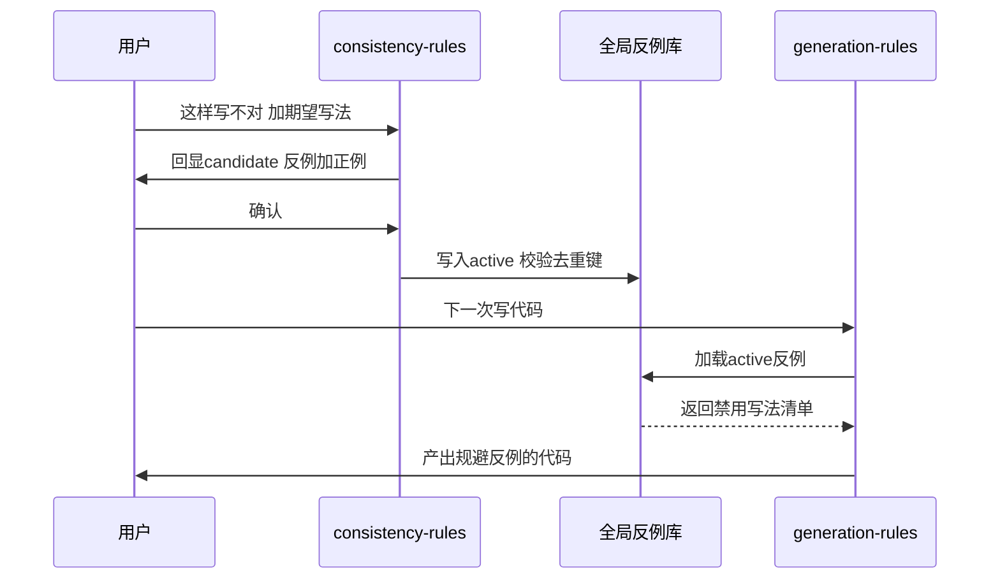

# 需求主文档：代码风格体系反馈驱动持续迭代

结论：补充代码生成前的局部风格延续和接口实现参考规则；影响：所有后续代码生成和接口实现任务；范围：规则资产、实施文档和验收证据；非范围：业务代码和外部接口；变化：稳定上下文只做必要替换，接口实现必须参考既有样例；完成标准：新增规则可被契约和写后闸门执行；术语说明：局部风格指当前文件、同目录或同模块的稳定写法；验证状态：需求增量、测试、审查和最终验收均已通过。

## 1. 文档信息

- 来源对象标识：代码风格体系反馈驱动持续迭代
- 需求主 ID：REQ-STYLE-FB-20260713-001
- 基线提交：214fdbd
- 对应验收标准文档：`doc/7-验收/2026-07-13_174006_代码风格体系反馈驱动持续迭代_验收标准.md`
- 对应实施总览：`doc/3-实施/2026-07-13_174006_代码风格体系反馈驱动持续迭代_实施总览.md`
- 需求复杂度评估：L2（跨三个 skill 的行为链改造，含截图输入分支与全局生命周期，需流程图与时序图表达）。
- 文档状态：confirmed。
- 图片资产决策：N/A —— 本需求全部落点为 Markdown 规则文件，主流程与时序均由 Mermaid 表达，无界面原型或截图基线证据需求，故不涉及位图资产。

## 2. 需求来源与证据台账

- SRC-STYLE-FB-01：用户本轮口述需求原文——「当用户说出或给出截图告知不能这么写、这个风格不对、这个写法不对、这样写不行时，应把用户不喜欢的写法更新到 skill 作为错误示例，以后都不允许这样实现代码，并给出用户喜欢的写法作为正例；持续自动更新 skill，让 agent 最终写出用户喜欢风格的代码」。
- SRC-STYLE-FB-02：现状探索结论——三件套 `project-style-rules`、`code-generation-style-rules`、`code-style-consistency-rules` 均无「从用户反馈自动沉淀正反例」闭环，仅有团队手工追加 bullet 的约定。
- SRC-STYLE-FB-03：可复用参照——`execution-failure-learning-rules/references/case-template.md` 已提供 candidate→active 生命周期、去重键、唯一 owner 结构。
- SRC-STYLE-FB-04：用户本轮新增要求——当修改上下文存在非常统一的编码风格时，新增内容必须保持同样风格且不得加入多余代码；实现接口时必须参考项目中已有该接口实现的代码风格。

| 来源 ID | 类型 | 证据位置 | 用途 |
| --- | --- | --- | --- |
| SRC-STYLE-FB-01 | 用户需求 | 本轮对话原文 | 定义目标与三项关键决策 |
| SRC-STYLE-FB-02 | 现状探索 | code-style-consistency-rules/references/ | 确认改造落点与空白 |
| SRC-STYLE-FB-03 | 参照结构 | execution-failure-learning-rules/references/case-template.md | 复用生命周期与去重键 |
| SRC-STYLE-FB-04 | 用户需求 | 本轮对话原文 | 定义局部风格延续、接口实现参考和最小新增内容 |

## 3. 目标与非目标

- 目标：为代码风格三件套建立「用户反馈（文字或截图）→ 提取反例与正例 → 用户确认 → 全局写入 active → 写码前加载并规避」的闭环，使 agent 逐步减少重复触犯用户已纠正的风格。
- 增量目标：补充 `code-generation-style-rules` 对局部统一编码风格和既有接口实现风格的识别、契约记录与写后检查，避免在稳定上下文中引入额外代码或陌生结构。
- 非目标（明确不做）：
  - 不新建独立 skill（用户已否决）。
  - 不改 `project-style-rules` 的核心职责，只补一条边界说明。
  - 不做无确认的自动写入（用户已选确认后生效）。
  - 不实现截图 OCR 或读图解析引擎，读图理解沿用模型原生多模态能力。
  - 不改 `skill-dictionary/generate_dictionary.py` 脚本本身。

## 4. 功能需求

- REQ-01：`code-style-consistency-rules` 必须在用户以文字给出风格否定信号（「不能这么写」「这个风格不对」「这个写法不对」「这样写不行」等语义）时命中反馈捕获流程。
- REQ-02：`image-redbox-focus-rules` 命中截图且截图属代码写法纠正时，必须把控制权路由到 `code-style-consistency-rules` 的反馈捕获流程。
- REQ-03：捕获流程必须从反馈中提取一条「反例（用户不喜欢的写法）+ 正例（用户喜欢的写法）+ 一句话规则」，先以 candidate 形态回显给用户，不落盘。
- REQ-04：用户确认后，条目必须以 active 形态写入全局反例库 `code-style-consistency-rules/references/user-style-feedback-library.md`，跨项目、跨会话永久生效。
- REQ-05：`code-generation-style-rules` 必须在写码前加载全局反例库，将 active 反例纳入本轮风格契约的「禁用写法」，并在写后闸门驳回命中反例的写法。
- REQ-06：重复反馈命中同一去重键时，只更新出现次数与确认时间，不新增正文条目。
- REQ-07：当当前文件、同目录或同模块存在高度统一的代码结构时，新增代码必须沿用该局部结构，只替换完成当前目标所需的名称、字段和必要说明。
- REQ-08：当本轮实现已有接口时，必须优先查找同文件、同目录/模块或同语言项目中已经实现该接口的样例，并沿用其结构、命名、注释、错误处理和测试风格。

## 5. 业务规则与优先级

- RULE-01（P0）：写入前置确认——candidate 只在当轮对话回显，仅 active 落盘，避免误提取污染全局库。
- RULE-02（P0）：去重键采用「语言/技术栈 | 场景 | 反例签名」三元组，同键合并计数。
- RULE-03（P1）：作用域为全局 skill 级，反例库落在 `code-style-consistency-rules/references/`；项目专属偏好仍走 `PROJECT_STYLE.md`，两者边界隔离。
- RULE-04（P1）：改动触及三个 skill 的 `description` 与 `##` 标题，收口必须重跑 `skill-dictionary/generate_dictionary.py`。
- RULE-05（P0）：局部稳定写法优先于个人偏好、外部模板和无关全局重构；统一代码区段不得加入无需求代码。
- RULE-06（P0）：接口实现必须记录参考实现；无参考实现时必须记录降级依据，候选冲突无法收敛时停止并记录 GAP。

## 6. 数据与外部契约

- 全局反例库数据结构：单条 style case 含 id、status、语言/技术栈、适用范围、去重键、来源、反例代码块、正例代码块、一句话规则、首次记录、确认时间、出现次数。
- 外部依赖：本机 Python（跑 `validate_engineering_docs.py`、`generate_dictionary.py`）、Git Bash。
- 无数据库表变更，无对外接口变更：本需求不涉及任何数据库或 HTTP/RPC 契约（原因：改造对象为 Markdown 规则文件；证据：第 8 节决策冻结落点全为 `.md`）。

## 7. 风险、假设、依赖与阻断

| ID | 条目 | 说明 | 处置 |
| --- | --- | --- | --- |
| BOUND-01 | 职责重叠风险 | 全局反例库与 `PROJECT_STYLE.md` 可能被误用为同一职责 | RULE-03 边界隔离 |
| BOUND-02 | 误提取风险 | candidate 若落盘会污染全局库 | RULE-01 确认后生效 |
| BOUND-03 | 库膨胀风险 | 去重失效导致条目堆积 | RULE-02 三元组去重键 |
| GAP-01 | strict 追踪脚本局限 | `--strict` 硬编码旧来源对象 ID，对本对象跨文档追踪无法覆盖 | 采用对应 profile 非 strict 校验并如实标注 |

- 依赖：本机 Python 与 bash 可用。
- 阻断：若 `validate_engineering_docs.py` 或 `generate_dictionary.py` 不可用，转 `execution-failure-learning-rules` 路由，不无脑重试。

## 8. 决策冻结

- DEC-01：作用域=全局 skill 级（用户本轮拍板）。落点：`code-style-consistency-rules/references/user-style-feedback-library.md`。
- DEC-02：落地方式=改造现有三件套，不新建 skill（用户本轮拍板）。
- DEC-03：生效时机=确认后生效（candidate→active，用户本轮拍板）。
- DEC-04：反例库条目结构复用 `execution-failure-learning-rules` 的 case 字段风格。
- DEC-05：新增局部风格与接口实现规则归属 `code-generation-style-rules`，不新建独立 skill。
- DEC-06：局部风格证据顺序固定为当前文件 > 同目录 > 同模块 > `PROJECT_STYLE.md`。
- DEC-07：接口实现参考顺序固定为同文件 > 同目录/模块 > 同语言项目样例；冲突时选择最近且稳定的多数写法。
- DEC-08：局部风格不得删除正确性、安全、兼容、错误处理或接口契约要求的必要代码；必要例外必须记录在风格契约中。
- unresolved_decisions：无（三项关键决策已由用户在本轮全部冻结，无悬而未决的 P0/P1 决策）。

## 9. 普通模型零决策执行契约

- 执行模型只按已冻结决策 DEC-01 至 DEC-04 落地，不得自行改变作用域、落地方式或生效时机。
- 反例库文件路径、条目字段、去重键三元组、触发信号词表均由本需求与实施文档冻结，执行模型不得自行增删默认值。
- 遇落点与基线不一致、符号缺失、校验失败时，执行模型必须停止并记 GAP，不得猜测替代路径。
- 免测边界：仅纯文档、纯注释、纯排版不改变运行行为的改动可标免测；本需求各改动均改变 agent 运行时行为，不满足免测条件。

## 10. 追踪矩阵

| REQ | 关联 RULE | 关联 AC | 落点文件 |
| --- | --- | --- | --- |
| REQ-01 | RULE-01 | AC-01 | code-style-consistency-rules/SKILL.md |
| REQ-02 | RULE-03 | AC-05 | image-redbox-focus-rules/SKILL.md |
| REQ-03 | RULE-01 | AC-01 | style-feedback-workflow.md |
| REQ-04 | RULE-02 | AC-02 | user-style-feedback-library.md |
| REQ-05 | RULE-04 | AC-03 | code-generation-style-rules/SKILL.md |
| REQ-06 | RULE-02 | AC-04 | user-style-feedback-library.md |
| REQ-07 | RULE-05 | AC-06、AC-08 | code-generation-style-rules/SKILL.md、local-context-and-interface-style.md |
| REQ-08 | RULE-06 | AC-07、AC-08 | style-priority.md、style-contract-template.md |

## 11. 垂直切片与追踪契约

- SLICE-01：反馈捕获与确认写入（REQ-01、REQ-03、REQ-04、REQ-06 → AC-01、AC-02、AC-04）。
- SLICE-02：写码前加载与规避（REQ-05、REQ-07、REQ-08 → AC-03、AC-06、AC-07、AC-08）。
- SLICE-03：边界、截图路由与合规收口（REQ-02 → AC-05）。
- 追踪契约：每个 SLICE 必须能反向回指到 REQ 与 SRC；AC 的判定见验收标准文档。

图形目的：描述用户风格反馈从捕获到全局生效再到写码规避的主流程。
关联 ID：REQ-01、REQ-03、REQ-04、REQ-05。

图形目的：描述一次反馈从捕获、确认、写入到下次写码规避的时序。
关联 ID：REQ-03、REQ-04、REQ-05。

