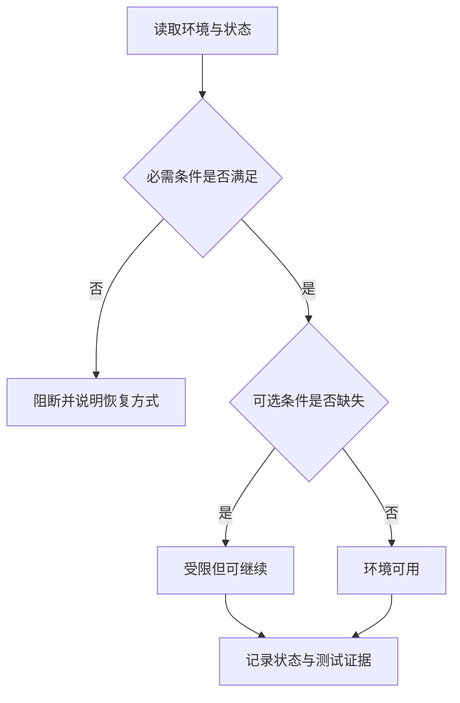
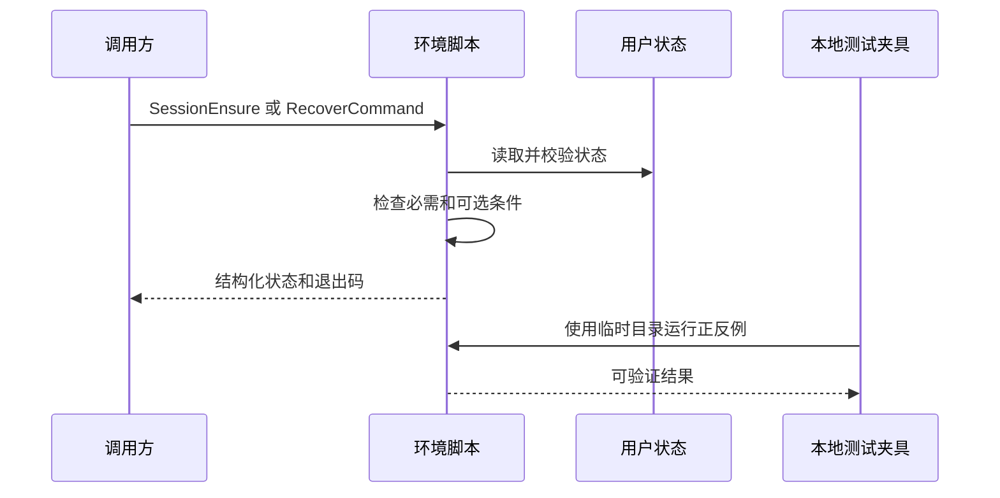

# Windows PowerShell 环境可靠性升级

这次要让 Windows PowerShell 环境检查更可靠：真正缺少必需条件时才阻断；只是少了可选工具时，仍允许继续工作，并把限制说清楚。所有验证会在本机临时目录完成，不安装软件、不改真实终端设置。

## 目标与范围

- 目标：修正会话环境检查、命令恢复、状态记录、Terminal/profile 回滚和不同 shell 的工具可见性判断。
- 本次覆盖：`windows-powershell-environment-rules`、必要的 UTF-8 profile 交接、相邻规则边界和本地测试资产。
- 不覆盖：业务项目代码、真实包安装、管理员提权、WSL 原生工具安装、浏览器和第三方接口。
- 当前优先闭环：可选工具缺失不得让 `SessionEnsure` 一直处于失败状态。

## 文档信息

| 字段 | 内容 |
| --- | --- |
| 来源 | SRC-PSENV-001：用户批准执行环境可靠性升级计划 |
| 决策 | DEC-PSENV-001：保留现有入口，不新增独立 Skill |
| 当前状态 | active；正式代码实施中 |
| unresolved_decisions | 无；未确认包源映射不猜测、不写入 manifest |

## 决策冻结

- 采用 `RequiredOnly` 作为 SessionEnsure 默认策略；Core 与 Extended 只能显式请求。
- `ready` 与 `degraded` 都允许当前调用继续；只有必需条件失败才是 `blocked`。
- Windows Terminal、profile 和状态变更必须保存 hash 与备份；安装的软件不自动卸载。
- Scoop、Chocolatey 没有经过验证的精确映射时写为 `N/A + 原因 + 证据`：原因是不能猜包；证据是 manifest 只保留已确认的 Winget 映射。

## 普通模型零决策执行契约

- 执行模型必须读取 manifest 选择策略，不得在脚本中硬编码工具清单。
- 遇到未知命令必须记录 candidate；只有同时获得精确 source 与 PackageId 才能尝试恢复。
- 运行测试必须使用临时 state、profile、Terminal 和假包管理器；不得使用真实用户配置。
- 任何 hash 不一致的 rollback 都必须返回拒绝结论，不能覆盖用户新改动。

## 需求来源与证据台账

| 标识 | 来源 | 已确认结论 |
| --- | --- | --- |
| SRC-PSENV-001 | 用户批准的实施计划 | 要继续完善现有环境 Skill，不新建 Skill |
| DEC-PSENV-001 | 当前脚本与本机状态 | 可选 7z/tlrc 缺失曾使 marker 处于未完成状态 |
| DEC-PSENV-002 | 本地回归夹具 | 假包管理器可验证精确 source 与 PackageId |

## 目标与非目标

| 类型 | 内容 |
| --- | --- |
| 目标 | 环境结论准确、写入可回滚、测试不碰真实用户设置 |
| 非目标 | 为所有包管理器补猜测性映射、真实下载、管理员提权 |

## 功能需求与规则要求

| REQ | 输入 | 处理规则 | 输出 | 异常、权限、兼容、观测 |
| --- | --- | --- | --- | --- |
| REQ-PSENV-001 | SessionEnsure 与策略 | 分开计算必需和可选失败 | ready/degraded/blocked JSON | 必需失败阻断；PS5/PS7 均可解析；记录 marker |
| REQ-PSENV-002 | manifest、命令和包源 | 只接受精确 source/package ID | 单次安装与版本探针 | 无映射时 candidate；无管理员绕过；记录 case |
| REQ-PSENV-003 | Terminal/profile/journal | 先备份和 hash，再写入 | 可验证 Apply 或安全拒绝 rollback | 漂移不覆盖；JSONC 保留无关文本；记录证据 |

## 业务规则与优先级

| 优先级 | 规则 | 例外 |
| --- | --- | --- |
| P0 | 必需 PowerShell/UTF-8 失败时不得宣称环境可用 | 当前任务可回到 Git Bash 主路由，但 PowerShell 专项仍 blocked |
| P1 | 可选工具失败时只 degraded | 明确请求该工具时再进入 RecoverCommand |
| P2 | Terminal 不可用不阻断 SessionEnsure | 明确 Apply 且要求设默认 profile 时才停止 |

## 数据与外部契约

- 输入：JSON-compatible YAML manifest、用户级 state JSON、Windows Terminal JSONC、PowerShell profile 文件。
- 输出：schemaVersion 2 的 JSON result、marker、journal、failure case 与 discovered tool 状态。
- 外部条件：浏览器、第三方接口、真实下载均为 `N/A + 原因 + 证据`；原因是本轮只使用本地 fixture，证据见 TEST-PSENV-001 至 TEST-PSENV-009。

## 风险、假设、依赖与阻断

| 类型 | 内容 | 处理 |
| --- | --- | --- |
| 风险 | JSONC 整体序列化会丢失注释 | 使用最小文本补丁并回读验证 |
| 风险 | 子进程不能刷新父进程 PATH | 返回 restartRequired 和解析路径 |
| 假设 | 本机有 PowerShell 5.1、PowerShell 7、Git Bash | 测试先探测；缺失项按环境适用性记录 |
| 阻断 | 必需 profile probe 或 manifest schema 无法通过 | 停止正式放行并记录结构化 issue |

## 追踪矩阵

| SRC/DEC | REQ/RULE | AC | CYCLE/TASK | TEST | EVIDENCE |
| --- | --- | --- | --- | --- | --- |
| SRC-PSENV-001 | REQ-PSENV-001、RULE-PSENV-001 | AC-PSENV-001 | CYCLE-01/TASK-PSENV-03 | TEST-PSENV-002 | Session marker 通过证据 |
| DEC-PSENV-001 | REQ-PSENV-002、RULE-PSENV-002 | AC-PSENV-002 | CYCLE-03/TASK-PSENV-07 | TEST-PSENV-007 | 假 Scoop 参数日志 |
| DEC-PSENV-002 | REQ-PSENV-003、RULE-PSENV-004 | AC-PSENV-004 | CYCLE-02/TASK-PSENV-05、06 | TEST-PSENV-003 至 005 | JSONC、WhatIf、rollback 输出 |

## 追踪契约

`SRC -> DEC -> REQ/RULE -> AC -> CYCLE -> TASK -> 文件/符号 -> TEST -> EVIDENCE` 必须双向可查。任何孤立稳定 ID、未决 P0/P1 或无证据通过结论都阻断正式验收。

## 图片资产决策

图片资产决策：N/A + 原因：本任务只表达脚本状态、命令和依赖关系，Mermaid 已能准确表达。证据：没有 UI、截图、视觉对比或空间布局产物。

## 需求规则

| 标识 | 规则 | 完成结果 |
| --- | --- | --- |
| RULE-PSENV-001 | 必需条件与可选条件分开判断 | 可选工具缺失时输出受限结论，不阻断继续工作 |
| RULE-PSENV-002 | manifest 是策略、命令和精确包源的唯一来源 | 不再把 Winget ID 直接交给其他包管理器 |
| RULE-PSENV-003 | 状态、退出码和机器输出一致 | 调用方能区分可继续、阻断、忙碌和内部失败 |
| RULE-PSENV-004 | 写入必须先预检且可以安全回滚 | 不覆盖用户后续修改，不整份重写 JSONC |
| RULE-PSENV-005 | 命令恢复必须区分软件缺失和 shell PATH 不可见 | Git Bash、CMD、PowerShell 和 WSL launcher 不误判 |
| RULE-PSENV-006 | 测试完全隔离 | 测试不会改真实 profile、Terminal、包或执行策略 |

## 适用流程

图形目的：说明本次从环境检查到安全收口的主流程。关联 ID：RULE-PSENV-001 至 RULE-PSENV-006。

## 交互时序

图形目的：说明脚本、状态文件和验证脚本的职责顺序。关联 ID：RULE-PSENV-002、RULE-PSENV-003、RULE-PSENV-006。

## 完成标准

- `SessionEnsure` 在可选工具缺失时返回可继续状态。
- manifest、状态、journal 和输出结构有明确 schema。
- `WhatIf` 不产生写入或安装。
- JSONC、profile 和回滚均有隔离测试。
- 不使用真实包下载、UAC、浏览器或第三方接口。

## 执行附录

- 来源：用户批准的“Windows PowerShell 环境 Skill 可靠性升级实施计划”。
- 代码落点：`windows-powershell-environment-rules/`、`windows-encoding-rules/` 与对应 `doc/5-tests/` 当轮目录。
- 测试环境：本机 PowerShell 5.1、PowerShell 7、Git Bash、临时状态目录和假包管理器。
- 最大推进边界：只完成规则、脚本、测试、审查和验收，不执行 Git 提交或推送。

## 追踪附录

| 需求规则 | 验收标准 | 实施任务 | 证据 |
| --- | --- | --- | --- |
| RULE-PSENV-001 | AC-PSENV-001 | TASK-PSENV-03 | SessionEnsure 状态机回归 |
| RULE-PSENV-002 | AC-PSENV-002 | TASK-PSENV-02、07 | manifest 与精确包源回归 |
| RULE-PSENV-003 | AC-PSENV-003 | TASK-PSENV-03 | JSON 输出与退出码回归 |
| RULE-PSENV-004 | AC-PSENV-004 | TASK-PSENV-04、05、06 | WhatIf、JSONC、rollback 回归 |
| RULE-PSENV-005 | AC-PSENV-005 | TASK-PSENV-07、08 | Git Bash/WSL 分流回归 |
| RULE-PSENV-006 | AC-PSENV-006 | TASK-PSENV-09 | 临时目录隔离检查 |
