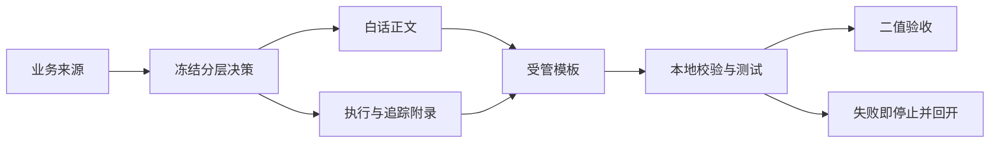
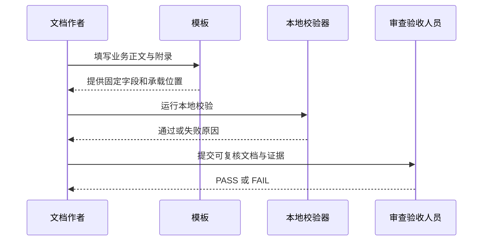

# 白话文档生成分层契约增强

结论：为受管文档建立可检查的白话正文与附录分层规则。影响：业务读者、文档作者、执行人员和审查人员能更快定位各自需要的信息。范围：统一新建或再次修改文档的摘要字段、术语说明、附录位置和模板覆盖。非范围：不批量翻新历史文档，不改变产品功能。变化：文档先给出易懂结论，再在附录保留操作与追踪细节。完成标准：全部受管入口可生成该结构，且本地校验能拒绝缺失或错位内容。术语说明：受管文档指由仓库规则生成或维护的文档；附录分层指把操作细节和追踪信息放在正文之后。验证状态：需求已确认，等待后续实现与验收验证。

## 文档信息

| 字段 | 内容 |
| --- | --- |
| 需求等级 | L2；跨越需求、验收、实施、Bug、测试、审查、架构、交付和报告类文档 |
| 目标读者 | 业务读者、文档作者、普通执行模型、研发、测试和审查人员 |
| 当前状态 | 已确认，可进入前置验收和实施规划 |
| 来源需求 | 业务读者需要先读懂结论；现有检查不足以保证白话正文完整 |
| 来源文件 | 本文、对应验收标准和实施总览共同构成唯一来源链 |
| 历史兼容 | 未被修改的历史文档不批量迁移；后续新建或修改时才迁移 |
| 图片资产决策 | N/A + 原因：本需求只表达文档结构、追踪关系和执行顺序；证据：流程与时序关系可由 Mermaid 和表格完整表达，未涉及 UI、截图或外观基线 |

## 图片资产决策

图片资产决策：N/A + 原因：本需求只表达文档结构、追踪关系和执行顺序，不需要 UI、截图或外观基线；证据：本文件的流程图、时序图和表格已完整表达所有关系。

## 需求来源与证据台账

| 来源 ID | 类型 | 已确认事实 | 采用方式 |
| --- | --- | --- | --- |
| `SRC-USER-PLAIN-001` | 用户确认 | 白话化需要继续优化，并要求按实施计划执行 | 建立本需求、验收标准和实施总览 |
| `SRC-REVIEW-PLAIN-001` | 现状检查 | 现有校验仅保证 H1 后有中文，不能保证影响、范围、变化和完成标准完整 | 增加固定摘要槽位和负向校验 |
| `SRC-CONTRACT-PLAIN-001` | 现有契约 | 现有正文和附录已分层，但术语解释、全量模板和正文泄漏约束不完整 | 保留兼容策略并增强契约、模板和校验器 |
| `SRC-RULE-PLAIN-001` | 仓库规则 | 来源文档必须使用 UTF-8、双向追踪、流程图和时序图，并注明图片决策 | 作为本文档、验收标准和实施总览的硬门槛 |

## 目标与非目标

### 当前问题

当前文档虽有白话开场，但不同模板对业务正文、执行附录和追踪附录的承载位置不一致。作者仍可能只写一段中文却遗漏影响范围、非范围和完成结果，也可能把命令、稳定编号和追踪信息混入面向业务读者的正文。

### 目标与成功定义

让每个受管文档的新版本均可先回答“为什么做、影响谁、做与不做什么、会产生什么结果、怎样算完成”，并让后续执行者在固定附录位置查到命令、样本、追踪和证据。成功以对应验收标准的全部适用项二值通过为准。

### 本轮范围

| 范围 ID | 纳入内容 | 结果 |
| --- | --- | --- |
| `BOUND-PLAIN-IN-001` | 白话正文的固定信息槽位与术语首次解释规则 | 每份受管新文档有一致、可读、完整的开场正文 |
| `BOUND-PLAIN-IN-002` | 执行附录与追踪附录的职责及末尾位置 | 技术操作和机器追踪不再与业务正文混写 |
| `BOUND-PLAIN-IN-003` | 受管模板的全量同步和模板注册表 | 每个入口都能直接生成符合契约的结构 |
| `BOUND-PLAIN-IN-004` | 校验器、单元测试和历史兼容回归 | 缺字段、术语未解释和正文泄漏能被稳定拒绝 |
| `BOUND-PLAIN-IN-005` | 字典、合规、审查和最终验收收口 | 规则资产变更具备可复核证据 |

### 明确非范围

| 范围 ID | 排除内容 | 原因与证据 |
| --- | --- | --- |
| `BOUND-PLAIN-OUT-001` | 批量迁移既有历史文档 | 保持既有文档兼容；依据 `SRC-CONTRACT-PLAIN-001` 的渐进迁移规则 |
| `BOUND-PLAIN-OUT-002` | 产品业务代码、数据库、外部 API 和浏览器页面 | 本需求只改变文档生成与验证能力；依据 `SRC-USER-PLAIN-001` |
| `BOUND-PLAIN-OUT-003` | 使用主观 NLP 分数评判通俗程度 | 采用可复现的固定字段、术语和位置规则，避免不可解释的放行结果 |
| `BOUND-PLAIN-OUT-004` | Git 提交、推送或历史重写 | 当前用户未授权 Git 历史写入；仓库规则明确禁止自动提交 |

## 决策冻结

| 决策 ID | 冻结决策 | 选定原因 | 回滚边界 |
| --- | --- | --- | --- |
| `DEC-PLAIN-001` | 业务正文固定表达结论、影响对象、范围、非范围、变化、完成标准、术语说明和验证状态 | 能覆盖现状检查发现的所有缺口，且字段可机械验证 | 仅可通过新需求变更并同步验收、模板与测试后调整 |
| `DEC-PLAIN-002` | 执行附录承载环境、步骤、命令、样本、日志、SQL 与接口报文；追踪附录承载稳定 ID、证据和矩阵 | 让业务正文保持可读，同时保留执行精度 | 若证明现有文档类型已有等价承载章节，只允许登记映射，不迁移历史内容 |
| `DEC-PLAIN-003` | 采用模板注册表覆盖所有受管入口 | 防止只修改少数模板后出现未同步入口 | 注册表或测试失败时停止模板扩散，回到契约和覆盖清单 |
| `DEC-PLAIN-004` | 历史文档不批量迁移；新建或再次修改时迁移 | 控制无关改动，保持历史兼容 | 不允许以新规则反向判定未修改历史文档失败 |
| `DEC-PLAIN-005` | 可读性用结构契约和正反例校验，不使用主观评分 | 保证本地可复验、错误可定位 | 若发现固定字段无法表达真实业务结论，新增字段前必须补来源和验收 |

## 功能需求与规则要求

| 需求 ID | 触发与输入 | 处理规则与输出 | 异常、权限、兼容与可观测性 | 验收回指 |
| --- | --- | --- | --- | --- |
| `REQ-PLAIN-001` | 作者创建或修改任一受管文档 | 生成单段白话正文，包含 `DEC-PLAIN-001` 的全部信息槽位；首次技术术语紧随中文解释 | 缺槽位、空解释或多段开场必须拒绝；历史未修改文档按 `DEC-PLAIN-004` 兼容 | `AC-PLAIN-001`、`AC-PLAIN-002` |
| `REQ-PLAIN-002` | 正文需要出现技术操作或追踪信息 | 将操作信息写入执行附录，将稳定 ID、矩阵和证据写入追踪附录；两类附录均位于正文之后 | 非末尾附录、正文泄漏或重复通用附录必须拒绝；不改变已有专用附录名称 | `AC-PLAIN-003`、`AC-PLAIN-004` |
| `REQ-PLAIN-003` | 维护受管模板 | 以注册表列出需求、验收、实施、Bug、测试、审查、最终验收、架构、项目设计、交付和工作报告入口，并逐项提供分层位置 | 注册表漏项、模板缺正文或附录落点必须失败；仅限规则资产，不影响产品运行权限 | `AC-PLAIN-005` |
| `REQ-PLAIN-004` | 运行文档校验 | 校验器验证摘要字段、术语说明、正文泄漏、附录位置和历史兼容；测试提供正反例 | 本地 Python 命令失败即停止当前任务；测试不得连接 test、staging 或 production | `AC-PLAIN-006`、`AC-PLAIN-007` |
| `REQ-PLAIN-005` | 规则资产完成变更 | 执行字典刷新、合规审计、实现审查和最终验收，并记录证据 | 任一必需门禁失败不得放行；不适用验证按原因和依据记录 | `AC-PLAIN-008` |

### 业务规则与优先级

| 规则 ID | 规则 | 优先级与例外 |
| --- | --- | --- |
| `RULE-PLAIN-001` | 正文优先服务业务读者，技术精度不得以牺牲可读性为代价 | 当正文与附录信息冲突时，以冻结决策和追踪附录为准，并回开正文修正 |
| `RULE-PLAIN-002` | 一份文档只允许一个末尾通用附录；已有专用执行或追踪附录保持原名和职责 | 新模板必须显式给出承载位置；未修改历史文档不补建 |
| `RULE-PLAIN-003` | 每个适用要求必须映射验收、周期、任务、测试和证据 | 纯文档任务的运行时功能测试为 N/A，但仍必须做本地结构和链接校验 |
| `RULE-PLAIN-004` | 任何 P0/P1 来源、范围、兼容或验收冲突立即停止实施 | 不允许由执行者自行选择默认文案、术语定义或兼容策略 |

## 数据与外部契约

本需求不新增数据库、接口、持久化数据或外部服务调用。N/A + 原因：交付物仅为 Markdown、YAML、Python 校验器、测试和生成字典；证据：`BOUND-PLAIN-OUT-002` 与 `REQ-PLAIN-004` 已将验证限定为 local 工作区。

## 非功能要求、风险与阻断

| ID | 风险或质量要求 | 触发证据 | 处理与停止条件 |
| --- | --- | --- | --- |
| `GAP-PLAIN-001` | 字段设计导致已有模板无法保留原结构 | 模板注册表映射到多个无法承载字段的入口 | 停止模板修改，补充映射决策并回开 `DEC-PLAIN-002` |
| `GAP-PLAIN-002` | 校验规则误伤未修改历史文档 | 历史兼容回归失败 | 停止放行，修正新建/修改范围判定后同输入复验 |
| `GAP-PLAIN-003` | 术语解释规则造成假阳性或漏检 | 正反例无法稳定区分解释与未解释 | 停止校验器扩展，先冻结术语标记格式和测试样本 |
| `ROLLBACK-PLAIN-001` | 新校验器阻断范围超出受管文档 | profile 或注册表覆盖出现非目标入口 | 回滚当前最小任务的规则、测试和模板改动，不影响历史文档 |

## 图形化需求表达

图形目的：说明从业务来源到白话正文、附录、机器校验与最终证据的主流程。关联 ID：`SRC-USER-PLAIN-001`、`DEC-PLAIN-001`、`REQ-PLAIN-001` 至 `REQ-PLAIN-005`、`AC-PLAIN-001` 至 `AC-PLAIN-008`。

异常覆盖：任何正文缺字段、术语未解释、附录位置错误、模板漏项或兼容回归失败均进入停止节点，不允许降级为人工猜测。

图形目的：说明作者、校验器和验收人员之间的交接时序。关联 ID：`REQ-PLAIN-001`、`REQ-PLAIN-004`、`AC-PLAIN-006`。

## 追踪契约

### 追踪矩阵

| 来源 | 决策 | 需求/规则 | 验收 | 周期/任务 | 测试 | 证据 |
| --- | --- | --- | --- | --- | --- |
| `SRC-USER-PLAIN-001` | `DEC-PLAIN-001` | `REQ-PLAIN-001`、`RULE-PLAIN-001` | `AC-PLAIN-001`、`AC-PLAIN-002` | `CYCLE-PLAIN-01` / `TASK-PLAIN-01` | `TEST-PLAIN-001` | `EVIDENCE-PLAIN-001` |
| `SRC-CONTRACT-PLAIN-001` | `DEC-PLAIN-002`、`DEC-PLAIN-004` | `REQ-PLAIN-002`、`RULE-PLAIN-002` | `AC-PLAIN-003`、`AC-PLAIN-004` | `CYCLE-PLAIN-01` / `TASK-PLAIN-02` | `TEST-PLAIN-002` | `EVIDENCE-PLAIN-002` |
| `SRC-REVIEW-PLAIN-001` | `DEC-PLAIN-003`、`DEC-PLAIN-005` | `REQ-PLAIN-003`、`REQ-PLAIN-004` | `AC-PLAIN-005` 至 `AC-PLAIN-007` | `CYCLE-PLAIN-02`、`CYCLE-PLAIN-03` | `TEST-PLAIN-003` 至 `TEST-PLAIN-005` | `EVIDENCE-PLAIN-003` 至 `EVIDENCE-PLAIN-005` |
| `SRC-RULE-PLAIN-001` | `DEC-PLAIN-005` | `REQ-PLAIN-005`、`RULE-PLAIN-003` | `AC-PLAIN-008` | `CYCLE-PLAIN-03` / `TASK-PLAIN-06` | `TEST-PLAIN-006` | `EVIDENCE-PLAIN-006` |

## 普通模型零决策执行契约

- `unresolved_decisions`：无。所有范围、兼容策略、附录职责、历史处理、验证口径和停止边界由本文冻结。
- 执行者只能处理实施总览中当前周期的当前任务；不得自行新增受管类型、改变固定摘要字段、批量迁移历史文档或弱化失败断言。
- 发现文件不存在、模板职责冲突、校验不能稳定判断、local 命令失败或追踪无法闭环时，必须新增相应 `GAP-*` 记录并停止，等待上游需求决策。

## 验证与交接

| 验证项 | local 入口 | 样本与断言 | 失败预期与清理 |
| --- | --- | --- | --- |
| 来源文档结构 | `python artifact-delivery-gate-rules/scripts/validate_engineering_docs.py --profile requirement --doc doc/2-需求/2026-07-14_003130_白话文档生成分层契约增强.md --root .` | 本文 UTF-8、前置元数据、流程图、时序图、追踪表均通过 | 任一缺失返回非零；只删除本任务新建文档后重建，不触碰历史文档 |
| 未来契约回归 | `python -m unittest artifact-delivery-gate-rules.tests.test_validate_engineering_docs` | 正例通过；缺字段、术语未解释、正文泄漏和历史兼容反例失败 | 测试失败停止当前最小任务；不连接任何非 local 环境 |

## 附录

### 执行附录

- 后续实施仅允许修改规则资产、模板、校验器、单元测试和字典生成物；不修改产品代码、数据库或外部服务。
- 本需求的运行时功能测试：N/A + 原因：本阶段只建立来源文档，不改变程序运行行为；证据：`BOUND-PLAIN-OUT-002`。
- 回滚方式：删除本需求新增的三份来源文档即可恢复到本任务前状态；后续每个最小任务各自回滚自己的文件集。

### 追踪附录

| 证据 ID | 产生时机 | 保存位置 | 关联对象 |
| --- | --- | --- | --- |
| `EVIDENCE-PLAIN-001` | 来源文档 profile 校验 | 当前任务命令输出 | `REQ-PLAIN-001` 至 `REQ-PLAIN-005` |
| `EVIDENCE-PLAIN-002` | 验收标准 profile 校验 | 当前任务命令输出 | `AC-PLAIN-001` 至 `AC-PLAIN-008` |
| `EVIDENCE-PLAIN-003` | 实施总览 profile 校验 | 当前任务命令输出 | `CYCLE-PLAIN-00` 至 `CYCLE-PLAIN-03` |
