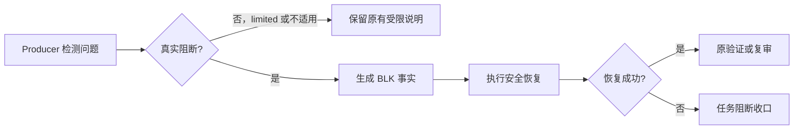
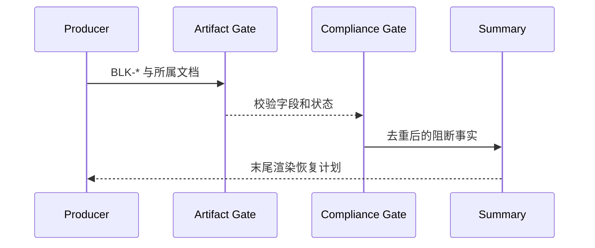

# 任务阻断收口与恢复计划

结论：本需求建立统一的任务阻断收口能力。影响：审查、验收和失败任务会向用户给出可执行恢复计划。范围：规则、模板、校验器和本地测试。非范围：业务服务和非本地环境。变化：统一阻断事实与最终回复。完成标准：全部验收场景通过。术语说明：阻断记录用于关联原因、恢复动作和重入验证。验证状态：实施中。

## 文档信息

本需求让任务在审查、验收、验证或失败恢复不能继续时，向用户明确说明“任务已阻断”，并交付可以执行和验证的恢复计划。图片资产决策：N/A；原因：该需求仅描述规则和文字收口；证据：流程与时序均可由 Mermaid 表达。

## 需求来源与证据台账

| 来源 | 结论 | 关联 |
|---|---|---|
| SRC-BLK-001 用户指令 | 阻断结尾必须明确状态并给解决计划 | REQ-BLK-001 |
| DEC-BLK-001 已确认计划 | 共享契约是唯一字段真相源 | RULE-BLK-001 |
| DEC-BLK-002 已确认策略 | 安全、可逆恢复自动执行；越权时交接 | RULE-BLK-003 |

## 目标与非目标

| 类型 | 内容 |
|---|---|
| 目标 | 所有真实阻断在最终状态区明确展示原因、影响、恢复计划和重入点。 |
| 目标 | 审查、验收、失败、运行时、功能验证和 Bug 验证使用同一 `BLK-*` 事实。 |
| 非目标 | 不把 `limited` 或 `not_applicable` 写成任务阻断。 |
| 非目标 | 不通过新增平行 Skill 或任意全局重试次数解决问题。 |

## 功能需求

| ID | 输入与处理规则 | 输出、异常与兼容 | 验收 |
|---|---|---|---|
| REQ-BLK-001 | 任一 producer 判定 `blocked` 或 `manual_handoff`。 | 最终回复末尾输出任务阻断收口；无阻断时禁止出现。 | AC-BLK-001 |
| REQ-BLK-002 | producer 生成 `BLK-*`。 | 字段必须有状态、阶段、证据、尝试、影响、计划、验证和重入点。 | AC-BLK-002 |
| REQ-BLK-003 | 同输入复验和安全恢复均已用尽。 | 停止无变化重试；越权、幂等性未知和外部依赖转人工交接。 | AC-BLK-003 |
| REQ-BLK-004 | 审查、验收或验证文档进入真实阻断。 | 文档门禁检查共享章节和字段；缺失时阻断交付。 | AC-BLK-004 |
| REQ-BLK-005 | `limited`、`not_applicable` 或 P2/P3。 | 保持既有受限或建议语义，不生成阻断收口。 | AC-BLK-005 |

## 业务规则与优先级

- RULE-BLK-001：`artifact-delivery-gate-rules/references/task-blocker-closure-contract.md` 是唯一字段真相源。
- RULE-BLK-002：按“根因错误码 + 关联证据”去重；同根因只保留一套恢复计划。
- RULE-BLK-003：恢复步骤最多三项，每项明确 owner、前置条件、完成判据和验证入口。
- RULE-BLK-004：状态仅为 `completed`、`limited`、`blocked`、`manual_handoff`；后两者触发任务阻断收口。
- RULE-BLK-005：最终回复由 `reasoning-summary-structure-rules` 渲染，`skill-compliance-gate-rules` 仅校验。

## 非功能要求、风险与阻断

| 风险 | 处理 | 回滚 |
|---|---|---|
| 不同 Skill 自行扩展字段 | 只允许引用共享契约并由门禁测试。 | 回退本轮新增的 producer 规则。 |
| 受限状态被误报为阻断 | 明确三态负例并加入单测。 | 恢复既有 `limited` 文案。 |
| 运行时虚报恢复成功 | 仅根据 adapter 真实能力和健康检查转换状态。 | 保持 `manual_handoff`。 |

## 流程图

图形目的：说明 REQ-BLK-001 至 REQ-BLK-005 的阻断收口流程。关联 ID：REQ-BLK-001、REQ-BLK-002、REQ-BLK-003、REQ-BLK-004、REQ-BLK-005。

## 时序图

图形目的：说明共享契约、门禁和最终回复的职责边界。关联 ID：RULE-BLK-001、RULE-BLK-005。

## 追踪矩阵

| 上游 | 需求/规则 | 验收 | 实施 | 测试证据 |
|---|---|---|---|---|
| SRC-BLK-001 | REQ-BLK-001, REQ-BLK-002 | AC-BLK-001, AC-BLK-002 | CYCLE-BLK-001 | TEST-BLK-001 |
| DEC-BLK-002 | REQ-BLK-003 | AC-BLK-003 | CYCLE-BLK-003 | TEST-BLK-003 |
| DEC-BLK-001 | REQ-BLK-004, REQ-BLK-005 | AC-BLK-004, AC-BLK-005 | CYCLE-BLK-002 | TEST-BLK-002 |

## 决策冻结

DEC-BLK-001：共享契约是唯一字段真相源。DEC-BLK-002：只自动执行安全、可逆且已获授权的恢复动作；其余恢复转人工交接。

## 垂直切片与追踪契约

每个 `TASK-BLK-*` 必须同时回指一个 `REQ-BLK-*`、`AC-BLK-*` 和 `TEST-BLK-*`；N/A：无数据库、接口或迁移；原因：本需求不改变业务数据或 API；证据：实施总览文件落点仅覆盖规则资产。

## 普通模型零决策执行契约

实现者必须先创建共享契约，再依次接入最终收口、失败恢复和各类 producer；每个最小任务完成后运行对应真实测试、审查和验收。权限、外部服务、不可逆动作或幂等性未知均不得自动越过，必须保留为 `manual_handoff`。

## 附录：术语

- `BLK-*`：可追踪的阻断事实，不等同于普通建议。
- `恢复验证`：执行原测试、复审、重验或最小健康检查后证明可重新推进的证据。
- `N/A`：不适用项，必须同时写原因和证据。
