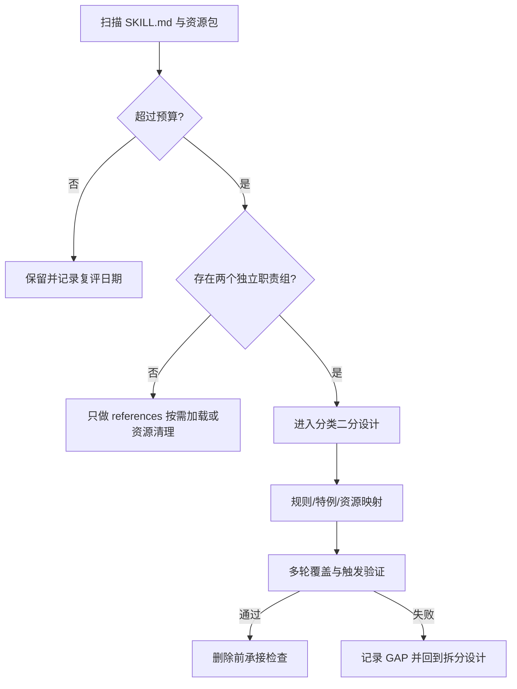
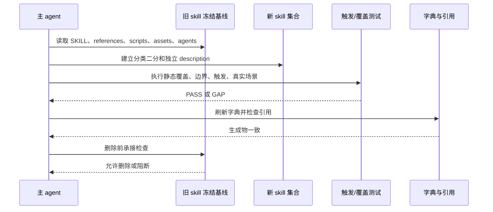

# 需求：Skill 体积治理与职责拆分

结论：先建立统一体积预算和候选分级，再用通用入口验证职责拆分的静态、触发和删除前后边界；影响：后续代理加载规则时减少截断和职责抢占；范围：候选盘点、预算、拆分顺序、迁移验证、测试入口和旧 skill 下线门禁；非范围：本轮不修改真实 skill 资产、不删除旧目录、不刷新字典；变化：把“文件大”与“职责应拆”分开判断，并将入口路径越界纳入失败门禁；完成标准：形成可直接执行的候选清单、优先顺序、拆分边界和验证闭环；术语说明：skill 指可被代理自动命中的规则单元，fixture 指当前测试时间戳目录内的离线样本；验证状态：候选矩阵和通用测试入口已完成实现、审查与验收，真实 skill 拆分仍未开始。

## 文档信息

| 字段 | 内容 |
|---|---|
| 来源对象 | `SRC-SKILL-SPLIT-20260716` |
| 用户目标 | 分析最需要拆分的 skill，并按计划文档规则给出极致完整方案 |
| 当前状态 | `in_progress`，周期 01 的当前闭环已完成并收口，后续 skill 资产拆分仍未开始 |
| 当前仓库基线 | `40cae893706639eb2323328f84b70b1c3aba66d9` |
| 当前统计 | 正式注册 84 个 skill、磁盘 111 个 skill 目录、扩展种子 27 个；正式 84 个中 10 个 `SKILL.md` 超过 16,000 B、4 个超过 24,000 B；报告哈希为 `76A73A61AD843EDDFD6C62F9846F2C8AD8FBBA588278EA963F507CA3D26DA062` |

## 需求来源与证据台账

| 证据 ID | 来源 | 已确认事实 | 作用 |
|---|---|---|---|
| `EVIDENCE-SKILL-BASELINE-20260716` | 本地递归资源盘点、MD5、字节和行数交叉校验 | `project-agents-bootstrap` 为 70,027 B / 481 行；`implementation-planning-rules` 为 39,147 B / 209 行；`agent-browser` 为 36,228 B / 837 行 | 冻结体积风险 |
| `EVIDENCE-SKILL-BUNDLE-20260716` | `SKILL.md` 与 references 资源包统计 | `implementation-planning-rules` 全量文本包约 116,685 B；`project-release-test-rules` 约 100,574 B；`agent-browser` 约 89,591 B | 冻结合并读取风险 |
| `EVIDENCE-SKILL-ROLE-20260716` | 各 skill description、H2、references 清单 | bootstrap、compliance、release-test、agent-browser、2D asset 均存在可并列职责组 | 冻结拆分候选 |
| `EVIDENCE-SKILL-HISTORY-20260716` | `skills拆分.md`、2026-04 拆分测试样本、近期实施文档 | 现有规则要求分类二分、映射 100%、多轮触发验证和删除前承接检查 | 冻结验证门禁 |
| `EVIDENCE-SKILL-CODEGRAPH-20260716` | CodeGraph `status`、`query`、`explore` | 索引 197 个文件、1,831 个节点、4,233 条边；release-test engine 有独立 storage、runner、discovery、report 等模块 | 辅助判断资源与模块边界 |

## 目标与非目标

### 目标

- `REQ-SKILL-SIZE-001`：建立 `SKILL.md`、单个 reference 和默认文本包的体积预算。
- `REQ-SKILL-SPLIT-001`：只对存在两个以上可独立触发职责组的 skill 进入拆分。
- `REQ-SKILL-SPLIT-002`：优先按分类二分，不按文件大小机械切碎。
- `REQ-SKILL-SPLIT-003`：原规则、特例、references、scripts、assets 和 agents 100% 可追溯。
- `REQ-SKILL-SPLIT-004`：拆分后完成静态覆盖、边界路由、自动触发和真实场景演练。
- `REQ-SKILL-SPLIT-005`：旧 skill 只有在删除前承接检查通过后才允许删除。

### 非目标

- 不在本轮直接改任何真实 skill、字典、AGENTS 或 CLAUDE 规则资产；允许 `TASK-SPLIT-01-01` 的统计脚本/报告、`TASK-SPLIT-01-02` 的候选矩阵/计划文档，以及 `TASK-SPLIT-01-03` 的测试入口、fixture 和 README 作为当前计划证据资产落盘。
- 不把仅仅资源多、但触发职责单一的 `imagegen`、`windows-wsl-execution-rules`、`implementation-review-rules`、`autonomous-execution-rules` 强行拆分。
- 不把 `references`、脚本缓存、`.pyc` 或许可证文件的体积问题伪装成职责拆分问题。
- 不在当前任务边界内删除旧 skill 或刷新生成字典；后续动作仍须按周期依赖和当前轮授权推进。

## 决策冻结

| 决策 ID | 冻结结论 | 选择原因 | 影响范围 | 状态 |
|---|---|---|---|---|
| `DEC-SKILL-SIZE-BUDGET-20260716` | `SKILL.md` 建议上限 16,000 B，20,000 B 进入拆分评估，24,000 B 为硬警戒；单 reference 建议上限 12,000 B、16,000 B 复评；默认文本包建议上限 48,000 B、64,000 B 必须按需加载或拆分 | 直接约束合并读取被截断的风险，同时保留资源多但职责单一 skill 的复评空间 | 全仓 skill 统计、候选分级和后续拆分 | 已冻结 |
| `DEC-SKILL-SPLIT-BINARY-20260716` | 每一轮先按并列职责做一次分类二分；仅当某一组仍过载时递归二分 | 保持独立触发边界，避免按 reference 机械碎片化 | P0/P1 候选和后续复评项 | 已冻结 |
| `DEC-SKILL-SPLIT-ORDER-20260716` | 先做预算与候选冻结，再按 `project-agents-bootstrap`、`skill-compliance-gate-rules`、`project-release-test-rules`、`agent-browser`、`2d-asset-design` 顺序推进，MCP 与 planning 仅条件复评 | 控制面规则先稳定，避免后续触发和字典入口在拆分过程中反复漂移 | CYCLE-SPLIT-01 至 CYCLE-SPLIT-08 | 已冻结 |
| `DEC-SKILL-SPLIT-DELETE-GATE-20260716` | 旧 skill 只有在规则/特例/资源映射 100%、多轮测试、引用清理和删除前承接检查全部通过后才允许删除 | 防止先删入口造成规则丢失和无法回滚 | 旧 skill 下线与字典刷新 | 已冻结 |
| `DEC-SKILL-SPLIT-PLAN-ONLY-20260716` | 当前轮允许完成 `CYCLE-SPLIT-01` 的三个任务：统计、候选矩阵和通用测试入口证据；仍不修改真实 skill 资产、不删除旧目录、不刷新字典、不写 Git 历史 | 用户已明确授权按冻结计划继续执行；授权范围仍止于周期 01 的测试与计划证据 | 当前任务的文件、测试、审查、验收和停止边界 | 执行中 |

- `unresolved_decisions: []`；当前不存在需要普通执行模型自行补齐的 P0/P1 决策。

## 功能需求与规则要求

| 需求 ID | 规则要求 | 优先级 | 通过条件 |
|---|---|---:|---|
| `REQ-SKILL-SIZE-001` | `SKILL.md` 建议控制在 16,000 B 内，超过 20,000 B 进入拆分评估，超过 24,000 B 视为硬警戒；单个 reference 建议不超过 12,000 B，超过 16,000 B 需继续拆细或记录不可拆证据；默认文本包建议不超过 48,000 B，超过 64,000 B 需改为按需加载或拆 skill | P0 | 预算脚本和报告能对全仓 84 个 skill 给出一致分类 |
| `REQ-SKILL-SPLIT-001` | 进入拆分必须同时满足体积/加载风险与两个以上独立职责组 | P0 | 每个进入项都能写成独立 description、边界、验证和停止条件 |
| `REQ-SKILL-SPLIT-002` | 每轮先做分类二分；只有新组仍过载才递归二分 | P0 | 计划中每轮记录类别集合、A/B 分组和停止条件 |
| `REQ-SKILL-SPLIT-003` | 每个原子规则都有唯一 ID、主承接 skill、资源落点和等价性说明 | P0 | 映射表状态 100% 为“已覆盖” |
| `REQ-SKILL-SPLIT-004` | 多轮测试至少覆盖静态覆盖、边界路由、自动触发和真实场景演练 | P0 | 任一轮失败都回流，不进入删除阶段 |
| `REQ-SKILL-SPLIT-005` | 旧 skill 删除前必须完成资源迁移、引用清理、字典刷新和删除前承接检查 | P0 | 删除前检查表全部通过，旧 skill 不再作为命中入口 |

## 业务规则与优先级

| 分级 | Skill | 真实证据 | 当前结论 | 首轮建议 |
|---|---|---|---|---|
| P0 | `project-agents-bootstrap` | 70,027 B / 481 行；模板、规则同步、四件套编排、环境规则和自举脚本混在一起 | 进入拆分 | `project-rule-file-bootstrap-rules` + `project-memory-file-bootstrap-rules` |
| P0 | `skill-compliance-gate-rules` | 19,211 B / 151 行；同时检查 skill 链、注释、实现自审、失败学习、用户手改和状态收口 | 进入拆分 | `skill-execution-compliance-gate-rules` + `code-change-finalization-gate-rules` |
| P1 | `project-release-test-rules` | 21,732 B / 170 行；文本包约 100,574 B；baseline、OpenAPI、参数图、执行器、报告和放行混合 | 进入拆分 | `project-interface-baseline-rules` + `project-interface-release-execution-rules` |
| P1 | `agent-browser` | 36,228 B / 837 行；session/认证/交互与 HAR/diff/trace/profiling/代理混合 | 进入拆分 | `browser-session-automation-rules` + `browser-advanced-testing-rules` |
| P1 | `2d-asset-design` | 29,096 B / 515 行；设计确认与生产/后处理/Godot 交付混合 | 进入拆分 | `game-asset-design-gate-rules` + `game-asset-production-handoff-rules` |
| P2 | `mcp-installation-rules` | 16,880 B；浏览器 MCP、Godot MCP、CodeGraph 和配置补齐并列 | 先候选设计 | `browser-mcp-routing-rules` + `project-tool-mcp-provisioning-rules` |
| 复评 | `implementation-planning-rules` | 39,147 B / 209 行；文本包约 116,685 B；Plan Mode、计划门禁、周期任务和全量顺序混合 | 先做命中数评估，暂不立即拆 | 仅当路由与 authoring 稳定独立且平均命中不超过 3 再二分 |
| 暂缓 | `imagegen`、`windows-wsl-execution-rules`、`implementation-review-rules`、`autonomous-execution-rules`、`requirement-intake-rules`、`obsidian-knowledge-flow`、`subagent-dispatch-rules` | 资源或正文较大，但当前触发对象/状态机/环境边界仍然单一 | 保留整体 | 仅做按需 references 和缓存清理复评 |

### 统计口径与业务优先级映射

- 正式预算口径只统计字典 1 至 10 域的 84 个 skill；磁盘实际存在 111 个 skill 目录，其中 27 个属于字典 11 的扩展种子，单独记录，不得与正式 84 个相加后再回填正式阈值。
- 正式 84 个 skill 中，`SKILL.md` 超过 16,000 B 的有 10 个，超过 24,000 B 的有 4 个；“业务 P0/P1/P2/复评/暂缓”是拆分优先级，不等同于报告中的 `normal/review/split_candidate/hard_warning` 体积等级。
- `2d-asset-design` 属于扩展种子，但因冻结需求已明确要求作为 P1 候选保留；它不计入 `formal_skill_count`，并在候选矩阵的 `extension_seed_entries` 中单独承接。
- `artifact-storage-rules`、`comment-completion-gate-rules`、`package-structure-rules` 的体积等级仅作为复评证据；当前没有两个可独立触发职责组，因此不因 `review` 等级自动升级为拆分候选。

## 数据与外部契约

- 数据库、缓存、消息队列、HTTP/RPC：`N/A + 原因 + 证据`。本轮是本地规则资产分析，不连接业务运行环境。
- Obsidian：通过固定 bridge 检索 `D:\obsidian_data`，doctor 返回 `ok=true`、`verified=true`、`vault_root=D:\obsidian_data`；vault 内容只作为历史弱参考，不覆盖当前仓库事实。
- CodeGraph：已存在 `.codegraph/` 且状态为 up to date；Markdown 规则内容以本地文件为准，CodeGraph 只辅助脚本模块边界判断。
- 图片资产决策：`N/A + 原因 + 证据`：本轮只处理规则文本、目录边界和实施文档，不涉及 UI、截图、视觉对比或真实位图产物；流程和时序由 Mermaid 表达。

## 风险、假设、依赖与阻断

| ID | 风险/假设/依赖 | 处理口径 |
|---|---|---|
| `GAP-SKILL-001` | 当前没有统一的 skill 体积预算脚本 | CYCLE-01 先冻结预算并新增只读统计脚本；未通过前不拆 skill |
| `GAP-SKILL-002` | 计划 skill 可能因“路由 + authoring”重复命中过多 | 先跑触发样本，平均稳定超过 3 个 skill 即暂停拆分 |
| `GAP-SKILL-003` | `project-agents-bootstrap` 的 SKILL 与 `bootstrap_agents.sh` 双份维护 | 先指定规则文件域为同步脚本主 owner，四件套由 memory skill 主 owner，避免双写 |
| `GAP-SKILL-004` | 触发验证工具依赖 Codex CLI 和当前运行环境 | 采用历史 `run_codex_trigger_checks.ps1` 模式；CLI 不可用时保留旧 skill，不宣称通过 |
| `GAP-SKILL-005` | 初始计划阶段尚未获得开工授权；当前轮已解除该阻断，但仍禁止越过 `TASK-SPLIT-01-03` 的文件边界 | 统计脚本、报告、候选矩阵、测试入口、fixture 和必要计划证据允许落盘；真实 skill 资产修改、删除和字典刷新仍禁止 |

## 普通模型零决策执行契约

- 执行模型只处理当前周期、当前 `TASK-*` 允许文件；不得自行选择另一个候选 skill。
- 发现原规则无法映射、description 触发边界冲突、平均命中超过 3、资源缺失、字典生成失败或测试命令失败，立即停止并记录 `GAP-*`。
- 旧 skill 在 `CYCLE-*` 全部闭环前保持冻结基线，不得继续向旧 skill 追加无关规则。
- “通过”只表示当前任务达到表内断言；不把静态阅读、build、lint 或口头说明当作真实触发测试。

## 计划执行变更记录

本节记录计划冻结后、进入当前统计任务前发生的执行状态和测试资产路径变更。原始预算阈值、候选顺序、拆分原则和删除门禁不变；Mermaid 流程图与时序图仍与当前职责边界一致，无需改图。

| 变更 ID | 变更分类 | 原值 | 新值 | 影响的追踪对象 | 文件/符号 | 测试、清理与回滚 | 当前状态 |
|---|---|---|---|---|---|---|---|
| `CHG-SPLIT-20260717-001` | 执行授权/状态变化 | `status: draft`；仅允许落盘计划文档；未授权执行 | `status: in_progress`；允许执行 `CYCLE-SPLIT-01 / TASK-SPLIT-01-01` 的统计脚本、JSON 报告和四项闭环证据；仍禁止修改 skill 资产 | `DEC-SKILL-SPLIT-PLAN-ONLY-20260716`、`REQ-SKILL-SIZE-001`、`CYCLE-SPLIT-01`、`TASK-SPLIT-01-01`、`TEST-SPLIT-001` | 本需求文档、验收标准、实施总览、全量顺序方案、周期 01；统计程序 `main` | 先执行统计成功标准；失败保留报告/失败证据并回到 `TASK-SPLIT-01-01`；不得写 Git 历史 | in_progress |
| `CHG-SPLIT-20260717-002` | 测试资产路径/日期 rollover | `doc/5-tests/2026-07-16_114619/技能拆分验证/` 下混放中文说明和真实脚本 | `doc/5-tests/2026-07-17_155229/`；中文说明仅放 `技能拆分验证/README.md`，真实脚本和报告放 `skill-split-validation/` ASCII 镜像目录 | `RULE-test-task-root-layout`、`RULE-test-naming`、`RULE-test-program`、`AC-SKILL-SPLIT-001`、`TASK-SPLIT-01-01`、`TEST-SPLIT-001` | 仅创建当前日期测试根目录；失败删除本轮新增测试资产，保留计划文档变更并记录 `GAP-SKILL-007`；旧目录只读参考 | in_progress |
| `CHG-SPLIT-20260717-003` | 当前任务切换与候选矩阵冻结 | `CYCLE-SPLIT-01 / TASK-SPLIT-01-01`；候选矩阵未进入正式追踪 | `CYCLE-SPLIT-01 / TASK-SPLIT-01-02`；正式 84/扩展种子 27 的候选矩阵已落盘，并补齐候选顺序、路径清单、决策 ID 和矩阵/实施测试分层 | `DEC-SKILL-SPLIT-PLAN-ONLY-20260716`、`REQ-SKILL-SPLIT-001`、`AC-SKILL-SPLIT-002`、`TASK-SPLIT-01-02`、`TEST-SPLIT-002` | 矩阵 YAML 解析、报告哈希/名称集合、四份文档 profile 任一失败即回到 `TASK-SPLIT-01-02`；不创建 `validate_skill_split.py`，不修改 skill 资产 | in_progress |
| `CHG-SPLIT-20260717-004` | 当前任务切换与通用入口实现 | `CYCLE-SPLIT-01 / TASK-SPLIT-01-02`；通用触发入口未执行 | `CYCLE-SPLIT-01 / TASK-SPLIT-01-03`；新增五类模式、PowerShell `-CasesRoot` 转发、仓库/fixture 路径边界和正负 fixture 验证 | `REQ-SKILL-SPLIT-004`、`AC-SKILL-SPLIT-005`、`TASK-SPLIT-01-03`、`TEST-SPLIT-003` | 正向模式退出码 0；越界样本必须非 0 并输出 `[失败]`/`[FAIL]`；失败回到 `TASK-SPLIT-01-03`，不修改真实 skill、字典或 Git 历史 | in_progress |

- 变更决策人：用户（当前轮明确授权）。
- 变更有效期：`CHG-SPLIT-20260717-001`、`002` 仅覆盖已完成的统计任务；`003` 仅覆盖已完成的 `TASK-SPLIT-01-02` 闭环；`004` 仅覆盖当前 `TASK-SPLIT-01-03` 入口闭环，后续任务仍须满足原周期依赖、文件白名单和停止条件。
- 证据槽位：`EVD-CHG-SPLIT-20260717-001`、`002`、`003` 在对应真实落盘、测试、审查和验收后登记具体路径、哈希和结果。

## 主追踪矩阵

| REQ/RULE | AC | CYCLE | TASK | TEST | EVIDENCE |
|---|---|---|---|---|---|
| `REQ-SKILL-SIZE-001` | `AC-SKILL-SPLIT-001` | `CYCLE-SPLIT-01` | `TASK-SPLIT-01-01` | `TEST-SPLIT-001` | `EVIDENCE-SKILL-BASELINE-20260716` |
| `REQ-SKILL-SPLIT-001` | `AC-SKILL-SPLIT-002` | `CYCLE-SPLIT-01` | `TASK-SPLIT-01-02` | `TEST-SPLIT-002` | `EVIDENCE-SKILL-ROLE-20260716` |
| `REQ-SKILL-SPLIT-002` | `AC-SKILL-SPLIT-003` | `CYCLE-SPLIT-02` | `TASK-SPLIT-02-01` | `TEST-SPLIT-003` | `EVIDENCE-SKILL-HISTORY-20260716` |
| `REQ-SKILL-SPLIT-003` | `AC-SKILL-SPLIT-004` | `CYCLE-SPLIT-02` | `TASK-SPLIT-02-02` | `TEST-SPLIT-004` | `EVIDENCE-SKILL-MAPPING-20260716` |
| `REQ-SKILL-SPLIT-004` | `AC-SKILL-SPLIT-005` | `CYCLE-SPLIT-03` | `TASK-SPLIT-03-02` | `TEST-SPLIT-005` | `EVIDENCE-SKILL-TRIGGER-20260716` |
| `REQ-SKILL-SPLIT-005` | `AC-SKILL-SPLIT-006` | `CYCLE-SPLIT-06` | `TASK-SPLIT-06-03` | `TEST-SPLIT-006` | `EVIDENCE-SKILL-DELETE-20260716` |

## 追踪契约

| 上游层 | 下游层 | 固定承接规则 |
|---|---|---|
| `SRC-SKILL-SPLIT-20260716` | `DEC-SKILL-SIZE-BUDGET-20260716`、`DEC-SKILL-SPLIT-BINARY-20260716`、`DEC-SKILL-SPLIT-ORDER-20260716`、`DEC-SKILL-SPLIT-DELETE-GATE-20260716`、`DEC-SKILL-SPLIT-PLAN-ONLY-20260716` | 所有预算、拆分、排序、删除和本轮授权边界均有来源 |
| `DEC-*` | `REQ-SKILL-SIZE-001`、`REQ-SKILL-SPLIT-001` 至 `REQ-SKILL-SPLIT-005` | 决策冻结后才允许进入需求和验收承接 |
| `REQ-*` | `AC-SKILL-SPLIT-001` 至 `AC-SKILL-SPLIT-007` | 每条需求必须有可执行验收条件 |
| `AC-*` | `CYCLE-SPLIT-*`、`TASK-SPLIT-*`、`TEST-SPLIT-*`、`EVIDENCE-*` | 每条验收必须回指周期、任务、测试和证据；缺任一项即阻断 |

## 流程图：候选进入与退出

图形目的：说明所有 skill 先过体积/职责双门槛，再决定拆分或暂缓。关联 ID：`REQ-SKILL-SPLIT-001`、`REQ-SKILL-SPLIT-002`、`AC-SKILL-SPLIT-002`。

## 时序图：旧 skill 到新 skill 集合

图形目的：固定拆分、验证和删除的先后关系。关联 ID：`REQ-SKILL-SPLIT-003`、`REQ-SKILL-SPLIT-004`、`REQ-SKILL-SPLIT-005`。

## 追踪附录

- 稳定来源：`SRC-SKILL-SPLIT-20260716`。
- 规则来源：`skill-split-preserve-rules`、`编码skill.md` 第十五节、仓库 `AGENTS.md` 的实施计划和文档落盘规则。
- 当前需求状态：`done`；周期 01~06 的统计、候选冻结、拆分实现、路由切换、字典刷新、用户授权真实删除与共享物理资源迁移均已完成四项闭环；周期 07/08 复评结论为 `no_split`。详见实施总览 `CHG-SPLIT-20260721-001`。
