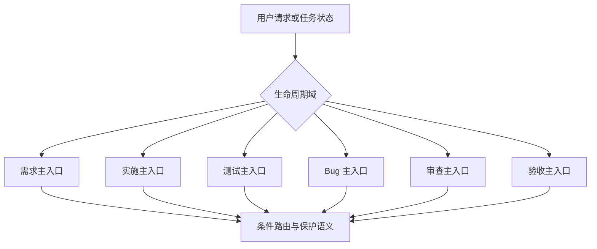
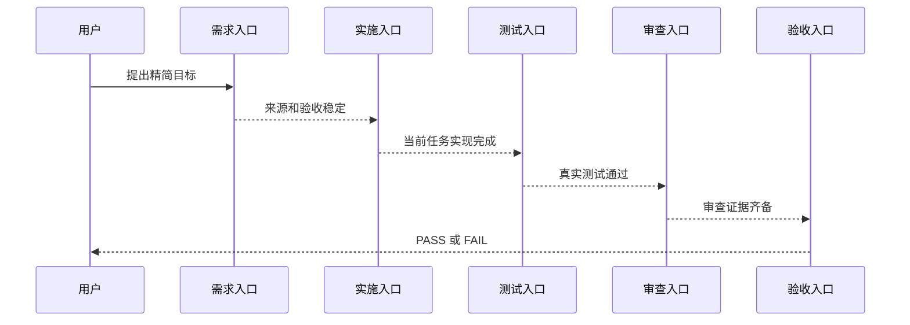

# 六域 Skill 结构精简与自动触发保持需求

结论：对需求、实施、测试、Bug、审查、验收六域实施结构精简，合并重叠入口、下沉重复正文，并在等价验证后删除旧目录；影响：六域自动路由、文档、测试资产和后续研发任务均会依赖本次结果；范围：36 个目标域 Skill、活跃引用、references、路由说明、验证资产、字典和项目记忆；非范围：不以模型能力删除规则，不改历史归档，不改 `.codex/config.toml`，不提交 Git；变化：同一生命周期只保留一个主入口，细则使用条件路由和共享契约承接；完成标准：旧触发等价、新入口唯一、保护语义可定位、活跃引用清零、删除后真实测试和文档门禁均通过；术语说明：单主入口是同一生命周期阶段唯一自动触发入口，条件路由是主入口按场景读取对应细则；验证状态：需求已冻结，实施已获用户授权并从周期 01 开始，Obsidian bridge 未注册导致知识库沉淀受阻。

## 文档信息

图片资产决策：N/A + 原因：本任务不涉及图片生成、编辑或引用；证据：本文文档信息、范围和执行附录均声明无图片资产。

| 字段 | 内容 |
| --- | --- |
| 来源对象 | `SRC-SKILL-STREAMLINE-20260721-001` |
| 复杂度 | L3 跨模块：六域、36 个 Skill、公共路由、测试资产与项目级模板引用。 |
| 基线提交 | `548fe02a42b6572b75330fc8b8827b62a4218b5f` |
| 当前状态 | planned；仅文档持久化，未修改 Skill 资产。 |
| 图片资产 | N/A + 原因：本任务仅涉及 Markdown、YAML、脚本和路由文字。 |

## 当前计划最终方案简要说明

采用“保留入口语义、下沉重复正文、删除等价旧目录”的方案。每个域保留生命周期主 Skill；仅因发现、缺口、诊断手段或测试资产布局而拆出的入口，迁入主入口的条件路由 references。任何旧目录都必须先完成 source-target 映射、触发回归、保护语义、活跃引用、物理资源与回滚验证。

## 决策冻结

| 决策 ID | 选定方案 | 排除方案 | 原因 | 回滚 |
| --- | --- | --- | --- | --- |
| `DEC-SS-001` | 六域一个来源对象，逐域闭环。 | 多域变更后统一验证。 | 每域可独立测试、审查、验收和回滚。 | 停止未进入周期。 |
| `DEC-SS-002` | 回归通过后真实删除旧 Skill。 | 保留长期兼容壳。 | 兼容壳持续制造触发和维护噪声。 | 恢复源目录和消费者引用。 |
| `DEC-SS-003` | 单主入口加条件路由。 | 多入口平行自动触发。 | 保留自动触发并避免重复命中。 | 候选标记 `hold`。 |
| `DEC-SS-004` | 大 Skill 拆 references，不拆竞争入口。 | 因体积大直接新建多个入口。 | 防止 Plan Mode、审查和验收链断裂。 | 恢复原细则。 |
| `DEC-SS-005` | 保护语义使用稳定 ID 和断言。 | 仅人工阅读。 | 用户习惯必须可审计、可回归。 | 恢复 canonical locator。 |

## 需求来源与证据台账

| 来源 ID | 事实与要求 | 证据 |
| --- | --- | --- |
| `SRC-SKILL-STREAMLINE-20260721-001` | 用户要求继续精简六域 Skill；用户习惯可移动但不可删除。 | 本轮用户消息。 |
| `SRC-SKILL-STREAMLINE-20260721-002` | 用户确认六域总方案分周期、验证后真实删除、单主入口加条件路由。 | 当前会话确认。 |
| `SRC-SKILL-STREAMLINE-20260721-003` | 目标域共 36 个 Skill，文本资产约 843,744B。 | 本轮仓库盘点。 |
| `SRC-SKILL-STREAMLINE-20260721-004` | `implementation-planning-rules` 已复评为 `no_split`。 | 既有实施周期 08 文档。 |
| `SRC-SKILL-STREAMLINE-20260721-005` | `.codex/config.toml` 存在无关未提交改动。 | 当前工作树。 |
| `SRC-SKILL-STREAMLINE-20260721-006` | Obsidian bridge 返回 `VAULT_NOT_REGISTERED`。 | 本轮 doctor 输出。 |

## 目标与非目标

| ID | 类型 | 内容 | 优先级 |
| --- | --- | --- | --- |
| `REQ-SS-001` | 目标 | 对六域全部 Skill 完成保留、合并、正文下沉或退役分类。 | P0 |
| `REQ-SS-002` | 目标 | 保留所有原始自动触发能力并确保同域主入口唯一。 | P0 |
| `REQ-SS-003` | 目标 | 将用户习惯、授权、安全、local、输出、暂停和停止作为保护语义迁移。 | P0 |
| `REQ-SS-004` | 目标 | 对 11 个明确冗余入口完成等价迁移与真实删除。 | P1 |
| `REQ-SS-005` | 目标 | 对大型 Skill 做 references 化去重，不拆竞争入口。 | P1 |
| `REQ-SS-006` | 目标 | 更新活跃引用、字典、模板和项目长期记忆。 | P1 |
| `BOUND-SS-001` | 非目标 | 不使用模型能力替代作为删除依据。 | P0 |
| `BOUND-SS-002` | 非目标 | 不回写历史归档文档中的旧名称。 | P0 |
| `BOUND-SS-003` | 非目标 | 不改 `.codex/config.toml` 或 Git 历史。 | P0 |

## 角色、权限与责任

| 角色 | 允许动作 | 禁止动作 | 责任 |
| --- | --- | --- | --- |
| 主 agent | 冻结映射、在 write_set 内迁移、运行 local 验证。 | 未通过测试删除旧目录；修改无关工作树。 | 最终裁决与收口。 |
| 执行 agent | 处理单候选和对应消费者。 | 自行扩大范围或改写历史归档。 | 实现和证据。 |
| 审查者 | 复核触发、语义、引用和资源归属。 | 用主观阅读替代测试。 | 通过、驳回或阻断。 |
| 用户 | 决定范围、退役策略和 Git 授权。 | N/A + 原因：用户不承担仓库验证。 | 产品意图。 |

## 功能需求与规则要求

| ID | 触发条件 | 处理规则 | 输出与副作用 | 异常与边界 | 验收 |
| --- | --- | --- | --- | --- | --- |
| `REQ-SS-007` | 开始候选迁移。 | 先登记 source、target、action、trigger、semantics、consumers、hash、rollback。 | 完整 manifest 条目。 | 字段缺失即 `hold`。 | `AC-SS-001` |
| `REQ-SS-008` | 合并旧入口。 | description 保留触发摘要；细则移入必读 reference。 | 新入口可解释旧触发。 | 不得只写“见旧 Skill”。 | `AC-SS-002` |
| `REQ-SS-009` | 遇到保护语义。 | 赋予 `RULE-SS-*` 与 canonical locator。 | 可自动断言清单。 | 只在待删目录即 FAIL。 | `AC-SS-003` |
| `REQ-SS-010` | 迁移消费者。 | 仅改活跃资产；历史归档 allowlist。 | 活跃引用全指向目标 owner。 | 非归档残留旧引用即 FAIL。 | `AC-SS-004` |
| `REQ-SS-011` | 删除旧目录。 | pre-delete 后删除，再 post-delete。 | retired 证据。 | 断链即回滚当前候选。 | `AC-SS-005` |
| `REQ-SS-012` | 需求域迁移。 | discovery/gap 迁入 intake；boundary/splitting/change 保留。 | 退役 2 个入口。 | 模糊需求不可直接实施。 | `AC-SS-006` |
| `REQ-SS-013` | 实施域迁移。 | planning 拆 references，保持唯一入口。 | 主入口减重。 | 出现多个 planning 入口即 FAIL。 | `AC-SS-007` |
| `REQ-SS-014` | 测试域迁移。 | 4 个测试资产入口迁入 test-strategy。 | 退役 4 个入口。 | 专项测试不可被吞并。 | `AC-SS-008` |
| `REQ-SS-015` | Bug 域迁移。 | 5 个 Bug 入口迁入 bug-intake routes。 | 退役 5 个入口。 | 静态证据充分时不强制 runtime。 | `AC-SS-009` |
| `REQ-SS-016` | 审查/验收去重。 | 不合并生命周期不同入口。 | 细则下沉 references。 | 不得互相替代。 | `AC-SS-010`,`AC-SS-011` |
| `REQ-SS-017` | description/H2 变化。 | 重跑字典生成。 | 生成资产一致。 | 禁止手改生成产物。 | `AC-SS-012` |

## 业务规则与优先级

1. `RULE-SS-001`：自动触发、用户习惯、安全、授权、local、协议和输出优先于体积缩减。
2. `RULE-SS-002`：同生命周期只有一个主入口；专项能力仅在前置状态明确时触发。
3. `RULE-SS-003`：references 只承载细则，不能成为唯一触发来源。
4. `RULE-SS-004`：测试、调试和验证只允许 local 配置归属。
5. `RULE-SS-005`：Git 历史写入只来自当前轮用户授权。
6. `RULE-SS-006`：每个最小任务先实现、真实测试、审查、验收，再推进。
7. `RULE-SS-007`：共享脚本、template、reference 必须有唯一物理 owner。
8. `RULE-SS-008`：无法证明等价承接时固定 `hold`。

## 数据与外部契约

本任务不新增数据库、HTTP API、外部服务或图片资产。新增内部契约 `domain-streamlining-manifest.yaml`。

| 字段 | 类型 | 必填 | 规则 |
| --- | --- | --- | --- |
| `candidate_id` | string | 是 | 全局唯一。 |
| `domain` | enum | 是 | requirement / implementation / test / bug / review / acceptance。 |
| `source_skill` | string | 是 | 源目录。 |
| `target_owner` | string | 是 | 目标主入口。 |
| `action` | enum | 是 | keep / deduplicate / merge_into_reference / retire。 |
| `trigger_contract` | object | 是 | 原信号、目标定位、正例、负例和唯一命中预期。 |
| `protected_semantics` | array | 是 | `RULE-SS-*`。 |
| `active_consumers` | array | 是 | 排除历史归档。 |
| `physical_assets` | array | 是 | SKILL、agents、references、scripts、templates。 |
| `baseline_hashes` | object | 是 | 删除前基线。 |
| `rollback_locator` | object | 是 | 恢复定位。 |

## 状态、流程与时序

图形目的：展示六域入口与条件路由；关联 `REQ-SS-002`、`RULE-SS-002`。

图形目的：用于说明本任务流程；关联 ID：REQ-SS-001。

图形目的：展示来源对象到最终验收的顺序；关联 `RULE-SS-006`。

图形目的：用于说明本任务流程；关联 ID：REQ-SS-001。

## 非功能要求、风险与阻断

| ID | 要求或风险 | 处理 |
| --- | --- | --- |
| `RISK-SS-001` | 旧触发不能被新入口覆盖。 | 正向 fixture 阻断删除。 |
| `RISK-SS-002` | 新主入口重新膨胀。 | 细则下沉 references。 |
| `RISK-SS-003` | 共享资源误删。 | owner、文件数、哈希和 post-delete 检查。 |
| `RISK-SS-004` | 活跃引用遗漏。 | `rg`、allowlist、字典和 fixture 共同校验。 |
| `BLK-SS-001` | Obsidian vault 未注册。 | 不使用文件系统 fallback。 |
| `BLK-SS-002` | P0/P1 无等价承接。 | 候选 `hold`。 |

## 普通模型零决策执行契约

- 只能按 manifest 中的 source、target、action、trigger_contract、protected_semantics、active_consumers、physical_assets 和 rollback_locator 执行。
- 未列入 manifest 的规则默认保护，不得自行删除。
- 未完成当前最小任务四项闭环不得进入下一任务。
- 发现 owner 不明、触发不唯一或共享资产不明时，必须写 `hold` 并停止。
- unresolved_decisions：无 P0/P1 未决；Obsidian 注册问题只阻断 vault 沉淀。

## 追踪矩阵

| 来源 | 决策 | 需求/规则 | 验收 | 周期 | 测试 |
| --- | --- | --- | --- | --- | --- |
| `SRC-SKILL-STREAMLINE-20260721-001` | `DEC-SS-001`~`005` | `REQ-SS-001`~`017`,`RULE-SS-001`~`008` | `AC-SS-001`~`012` | `CYCLE-SS-01`~`06` | `TEST-SS-001`~`012` |

## 追踪契约

- 每条 `REQ-SS-*` 至少关联一个 `AC-SS-*`、一个 `CYCLE-SS-*`、一个 `TASK-SS-*` 和一个 `TEST-SS-*`。
- 每个 `RULE-SS-*` 必须在 manifest 中有 canonical locator 和至少一个语义断言。
- source、target、consumer、physical asset、hash、rollback 与 trigger_contract 必须双向可追踪。

## 执行附录

- local 命令、fixture、哈希、扫描和字典日志均进入 `doc/5-tests/<timestamp>/six-domain-skill-streamlining/`。
- 图片资产：N/A + 原因：没有图片生成、编辑或引用。

## 追踪附录

- manifest 是候选 source、target、hash、consumer、trigger、保护语义和 rollback 的机器事实来源。
