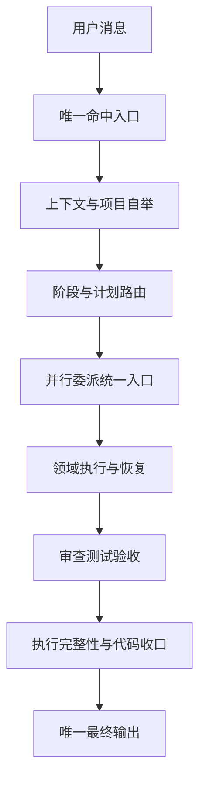
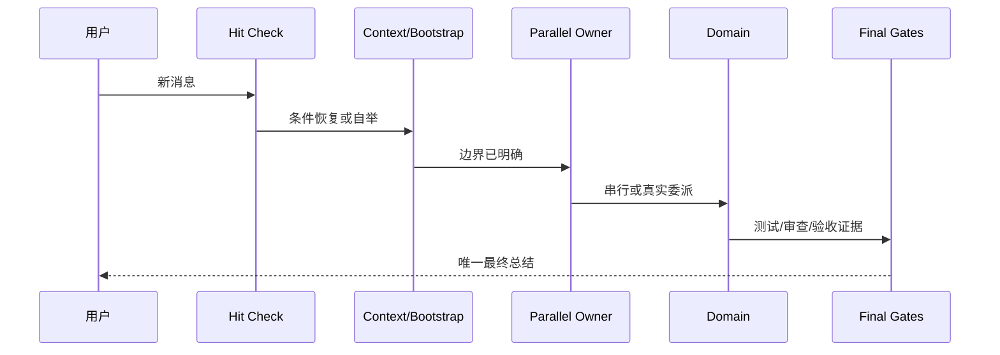

# 总控层 Skill 精简、合并与单向路由需求

结论：总控层需要继续精简，但只合并职责和生命周期高度重叠的入口；影响：每轮 Skill 命中、上下文恢复、项目自举、并行委派、执行恢复和最终收口都会依赖本次结果；范围：18 个总控候选、两个退役入口、活跃消费者、references、agents、scripts、字典和工程证据；非范围：不修改需求、Bug、测试等业务域专职规则，不以模型能力替代用户习惯，不执行 Git 提交；变化：形成唯一命中入口、条件上下文恢复、项目自举双路由、并行委派单状态机和唯一最终输出 Owner；完成标准：规则逐条可追踪、自动触发兼容、旧消费者清零、两个退役目录删除后 baseline/trigger/post-delete 均通过；术语说明：Owner 是规则唯一事实归属，条件路由是在同一 Skill 内按场景读取细则；验证状态：基线校验已经通过，后续触发与删除后校验将在对应实施阶段完成。

## 文档信息

图片资产决策：N/A + 原因：本任务只修改 Markdown、YAML、Python、Shell 与 Skill 元数据；证据：范围和非功能要求均无图片交付。

| 字段 | 内容 |
| --- | --- |
| 来源对象 | `SRC-CONTROL-PLANE-20260722-001` |
| 需求 ID | `REQ-TC-20260722` |
| 复杂度 | L3：跨入口、上下文、项目自举、并行生命周期与最终收口 |
| 基线提交 | `76ee419d59396d919fea04ed55ea373ddeb8cb26` |
| unresolved_decisions | `[]`，用户已确认完整计划并要求实施 |
| 图片资产 | N/A + 原因：无图片输入输出 |

## 当前计划最终方案简要说明

采用“两组合并、一个触发冲突修复、多组引用化、专职 Owner 保持独立”的方案。旧入口只有在保护语义、触发契约、消费者迁移、物理资产和回滚证据全部通过后才删除；任何失败候选独立保持 `HOLD`。

## 需求来源与证据台账

| SRC ID | 来源 | 冻结内容 | 证据 |
| --- | --- | --- | --- |
| `SRC-CONTROL-PLANE-20260722-001` | 用户确认的总控层实施计划 | 两组合并、单向路由、自动触发和用户习惯保护 | 当前用户消息 |
| `SRC-CONTROL-PLANE-20260722-002` | 当前仓库 Skill | 入口、触发、references 和资产事实 | `MANIFEST-TC-20260722` |
| `SRC-CONTROL-PLANE-20260722-003` | 项目长期规则 | 自动触发、Git 当前轮授权、UTF-8、local、停止边界 | `AGENTS.md`、`PROJECT_MEMORY.md` |

## 决策冻结

| DEC ID | 选定方案 | 排除方案 | 回滚 |
| --- | --- | --- | --- |
| `DEC-TC-001` | `skill-hit-check-rules` 保持每轮唯一入口 | 合入 team-development | 恢复基线树 |
| `DEC-TC-002` | `subagent-dispatch-rules` 合入 `parallel-task-dispatch-rules` | 两入口重复判定 | 恢复旧目录和消费者 |
| `DEC-TC-003` | 四件套自举合入 `project-rule-file-bootstrap-rules` | 继续两个入口执行同一脚本 | 恢复旧目录和引用 |
| `DEC-TC-004` | 压缩恢复条件调用 recent-context | 压缩后无条件执行新会话预热 | 恢复压缩 Skill 基线 |
| `DEC-TC-005` | 最终 Markdown 只由 reasoning summary 持有 | 每个闸门复制输出模板 | 恢复重复 reference |
| `DEC-TC-006` | 审查、验收、Git、恢复专职 Owner 不合并 | 全面合并总控 Skill | 候选保持 `HOLD` |

## 目标与非目标

| 类型 | ID | 内容 |
| --- | --- | --- |
| 目标 | `REQ-TC-001` | 合并并行判断与子代理生命周期，只执行一次状态机 |
| 目标 | `REQ-TC-002` | 合并规则文件和记忆文件自举，保留双条件路由 |
| 目标 | `REQ-TC-003` | 修复压缩恢复与新会话预热触发冲突 |
| 目标 | `REQ-TC-004` | 入口、自治、Git、实现审查和收口正文引用化 |
| 目标 | `REQ-TC-005` | 保持自动触发、授权、安全、停止、回滚和输出协议 |
| 非目标 | `BOUND-TC-001` | 不修改需求、Bug、测试等业务域专职规则 |
| 非目标 | `BOUND-TC-002` | 不改变 Git 当前轮授权，不自动提交 |
| 非目标 | `BOUND-TC-003` | 不改变 CodeGraph 自动准备行为，除非另有等价证据 |

## 功能需求与规则要求

| ID | 要求 | 优先级 | 失败处理 |
| --- | --- | ---: | --- |
| `RULE-TC-001` | 每轮首个总控入口保持 `skill-hit-check-rules` | P0 | 阻断 |
| `RULE-TC-002` | 退役 Skill 的 description 触发语义必须进入目标 Owner | P0 | `HOLD` |
| `RULE-TC-003` | 并行状态必须记录计划、启动、完成和关闭数量 | P0 | 阻断完成结论 |
| `RULE-TC-004` | 项目自举必须逐文件报告且保持幂等 | P0 | 回滚候选 |
| `RULE-TC-005` | 压缩恢复只有在缺近期事实时调用 recent-context | P0 | 恢复基线 |
| `RULE-TC-006` | 最终用户输出只有 reasoning summary 一个 Owner | P1 | 驳回收口 |
| `RULE-TC-007` | 注释详细字段只由 comment-completion 定义 | P1 | 引用化修正 |
| `RULE-TC-008` | 活跃消费者不得引用已删除入口 | P0 | 禁止删除 |

## 业务规则与优先级

图形目的：说明总控层从用户消息到最终总结的单向路由，以及各阶段只有一个主要职责入口。

关联 ID：`REQ-TC-001`、`REQ-TC-003`、`REQ-TC-004`、`RULE-TC-001`、`RULE-TC-005`、`RULE-TC-006`。

图形目的：说明一轮任务中命中检查、上下文恢复、并行决策、领域执行和最终收口之间的调用顺序。

关联 ID：`REQ-TC-001`、`REQ-TC-003`、`REQ-TC-005`、`RULE-TC-003`、`RULE-TC-006`。

## 数据与外部契约

| 契约 | 内容 |
| --- | --- |
| manifest | `MANIFEST-TC-20260722`，18 个候选、2 个退役入口 |
| 保护语义 | `PS-TC-001` 至 `PS-TC-018` |
| 触发样本 | `TR-TC-001` 至 `TR-TC-016` |
| 环境 | local 文件系统和本地 Python；外部服务不适用。原因：任务不调用数据库、缓存、消息队列、HTTP/RPC 或生产服务；证据：第三方验收闸门已标记为不适用。 |
| 编码 | UTF-8 |

## 非功能要求、风险与阻断

- 自动触发、当前轮授权、用户停止和输出格式属于保护语义，不得弱化。
- 任一 source-target 映射缺失、消费者未清零、资产无 Owner 或机器验证失败，候选保持 `HOLD`。
- 不允许为了达到 Skill 数量 73 强行删除失败候选。
- 工具失败必须改变诊断假设后再复验，不做无变化循环。

## 普通模型零决策执行契约

执行模型不得自行选择 Owner、触发 aliases、删除时机、消费者范围、回滚方式或验证断言。所有动作严格使用 manifest、周期文档和 validator；遇到未覆盖情况停止并创建阻断事实，不自行扩大范围。

## 主追踪矩阵

| SRC | DEC | REQ/RULE | AC | CYCLE | TEST | EVIDENCE |
| --- | --- | --- | --- | --- | --- | --- |
| `SRC-CONTROL-PLANE-20260722-001` | `DEC-TC-002` | `REQ-TC-001`,`RULE-TC-003` | `AC-TC-001` | `CYCLE-TC-04` | `TEST-TC-TRIGGER` | lifecycle evidence |
| `SRC-CONTROL-PLANE-20260722-001` | `DEC-TC-003` | `REQ-TC-002`,`RULE-TC-004` | `AC-TC-002` | `CYCLE-TC-03` | `TEST-TC-BOOTSTRAP` | idempotence evidence |
| `SRC-CONTROL-PLANE-20260722-001` | `DEC-TC-004` | `REQ-TC-003`,`RULE-TC-005` | `AC-TC-003` | `CYCLE-TC-03` | `TEST-TC-CONTEXT` | trigger evidence |
| `SRC-CONTROL-PLANE-20260722-001` | `DEC-TC-005` | `REQ-TC-004`,`RULE-TC-006` | `AC-TC-004` | `CYCLE-TC-06` | `TEST-TC-OUTPUT` | reference evidence |
| `SRC-CONTROL-PLANE-20260722-001` | `DEC-TC-001` | `REQ-TC-005`,`RULE-TC-001`,`RULE-TC-008` | `AC-TC-005` | `CYCLE-TC-07` | `TEST-TC-POSTDELETE` | final evidence |

## 垂直切片与追踪契约

每个候选按“基线映射 → 单一 Owner 实现 → 正负触发 → 消费者迁移 → 删除 → post-delete”形成独立垂直切片。任一切片失败只回滚该候选，不影响已通过切片。
