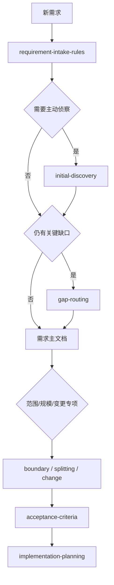
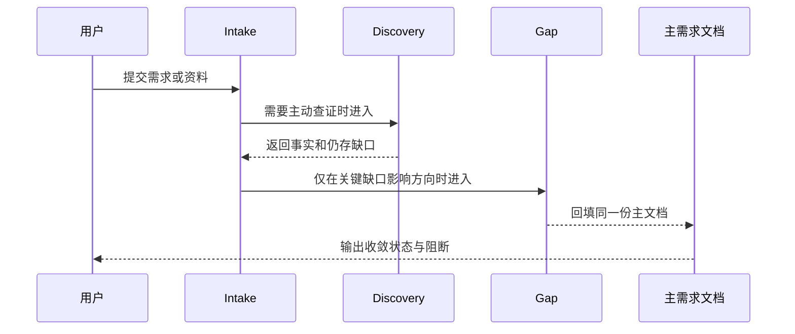

# 需求域 Skill 精简、旧路由收口与职责归位需求

结论：保留四个需求域 Owner，不再新增顶层合并；影响：降低重复正文、旧路由和竞争触发风险，同时保留自动触发与用户习惯；范围：四个需求 Skill、必要相邻消费者、测试资产、字典和工程文档；非范围：不恢复退役 Skill、不改 Bug/测试/审查/最终验收业务规则、不执行 Git 写历史；变化：将 discovery/gap 固定为 intake 内部条件路由并把公共契约引用化；完成标准：旧活跃消费者清零、五阶段验证全通过、Skill 总数 73、planned_missing=0 且无 P0/P1；术语说明：Owner 指规则唯一事实归属，条件路由指同一 Skill 内按场景进入的细则；验证状态：基线已冻结，核心资产实施完成，专项验证执行中。

## 文档信息

图片资产决策：N/A + 原因：本任务只修改 Skill、Markdown、YAML 和 Python 验证资产，无图片交付；证据：实施范围与测试命令均为文本和本地脚本。

| 字段 | 内容 |
| --- | --- |
| 来源对象 | `SRC-REQ-DOMAIN-20260722-001` |
| 需求 ID | `REQ-REQ-DOMAIN-20260722` |
| 基线提交 | `76ee419d59396d919fea04ed55ea373ddeb8cb26` |
| unresolved_decisions | `[]`；用户已确认按本计划实施 |

## 需求来源与证据台账

| SRC ID | 来源 | 冻结内容 | 证据 |
| --- | --- | --- | --- |
| `SRC-REQ-DOMAIN-20260722-001` | 用户实施计划 | 保留四 Owner、旧路由收口、共享契约和五阶段验证 | 当前用户消息 |
| `SRC-REQ-DOMAIN-20260722-002` | 当前仓库 | 触发描述、references、消费者和资产事实 | 当前磁盘扫描与 SHA-256 inventory |
| `SRC-REQ-DOMAIN-20260722-003` | 项目规则 | 自动触发、UTF-8、local、停止、Git 当前轮授权 | `AGENTS.md`、`PROJECT_MEMORY.md` |

## 决策冻结

| DEC ID | 决策 | 排除方案 | 回滚 |
| --- | --- | --- | --- |
| `DEC-REQ-001` | 四个需求 Owner 保持独立 | 物理合并为一个大 Skill | 恢复对应候选基线文件 |
| `DEC-REQ-002` | discovery/gap 作为 intake 内部路由 | 恢复旧顶层入口 | 恢复旧路由与消费者映射 |
| `DEC-REQ-003` | gap 运行正文只有 `gap-routing.md` | 保留迁移快照双正文 | 恢复基线快照 |
| `DEC-REQ-004` | 专项字段由 checklist/reference 唯一持有 | 在四个根 Skill 重复定义 | 恢复对应 reference |

## 目标与非目标

- 目标：降低重复触发判断、正文复制和旧路由误命中成本。
- 目标：保持自然语言自动触发、用户习惯、local 红线、授权、停止、回滚和输出语义。
- 非目标：不以行数减少替代规则保留，不改变业务需求内容。

## 功能需求与规则要求

| REQ ID | 要求 | 通过断言 |
| --- | --- | --- |
| `REQ-REQ-001` | 新需求只由 intake 作为接入入口 | description 包含唯一接入入口而非吞并专项 |
| `REQ-REQ-002` | discovery/gap aliases 映射到内部路由 | trigger fixtures 正向和负向通过 |
| `REQ-REQ-003` | boundary/splitting/change 保持独立自动触发 | 四个 description 与 agents 元数据均保留专项信号 |
| `REQ-REQ-004` | gap 运行资产唯一 | 迁移快照不存在且直接 references 全部存在 |
| `REQ-REQ-005` | 旧活跃消费者清零 | validator consumer 阶段通过 |

## 业务规则与优先级

1. 每轮先命中总控入口，再按需求信号进入唯一 Owner。
2. 未收敛的关键缺口不得进入验收标准、实施规划或编码。
3. 原实现不符合原需求进入 Bug 域，不误判为 requirement-change。
4. 用户明确停止时立即停止扩散，旧名称可在历史、manifest、hash 和回滚证据保留。

## 数据与外部契约

- Skill 公共接口是 frontmatter name/description、自然语言 aliases、reference 路径、条件 route 和验证状态。
- 所有新增/修改文件使用 UTF-8；不连接外部环境，local 仅指本地仓库和本地验证脚本。

## 风险、假设、依赖与阻断

- 假设：当前 HEAD 与冻结 SHA 可作为候选回滚定位。
- 依赖：`quick_validate.py`、`generate_dictionary.py`、工程文档 validator 和专项 validator。
- 阻断：自动触发、负向竞争、reference、consumer、字典或 P0/P1 失败时保持 `HOLD`。

## 追踪矩阵

| SRC | DEC | REQ/RULE | AC | CYCLE | TASK | TEST/EVIDENCE |
| --- | --- | --- | --- | --- | --- | --- |
| `SRC-REQ-DOMAIN-20260722-001` | `DEC-REQ-001` | `REQ-REQ-001` | `AC-REQ-001` | `CYCLE-REQ-03` | `TASK-REQ-03-01` | `TEST-REQ-TRIGGER-001` |
| `SRC-REQ-DOMAIN-20260722-002` | `DEC-REQ-002` | `REQ-REQ-002` | `AC-REQ-002` | `CYCLE-REQ-02` | `TASK-REQ-02-01` | `TEST-REQ-CONSUMER-001` |
| `SRC-REQ-DOMAIN-20260722-003` | `DEC-REQ-003` | `REQ-REQ-004` | `AC-REQ-003` | `CYCLE-REQ-02` | `TASK-REQ-02-02` | `TEST-REQ-REFERENCE-001` |
| `SRC-REQ-DOMAIN-20260722-001` | `DEC-REQ-004` | `REQ-REQ-003/005` | `AC-REQ-004/005` | `CYCLE-REQ-04/05` | `TASK-REQ-04-01/05-04` | `TEST-REQ-FIXTURE-001` |

## 垂直切片与追踪契约

每条来源必须沿 `SRC -> DEC -> REQ/RULE -> AC -> CYCLE -> TASK -> 文件/符号 -> TEST -> EVIDENCE` 双向追踪；孤立 ID、无目标 Owner 或失效链接均阻断。

## 普通模型零决策执行契约

执行模型必须按 manifest 既定 write set 修改文件，不得自行补充默认值、别名、路径、权限、异常、兼容、回滚或删除动作；发现缺口即标记 `HOLD` 并回交主 Agent。每个任务必须完成“实现 -> 真实测试 -> 当前任务审查 -> 当前任务验收”，不得先批量修改后统一验证。

## 需求流程图

图形目的：展示需求从接入到实施规划的单向路由。

关联 ID：`REQ-REQ-001`、`REQ-REQ-002`、`REQ-REQ-003`。

## 需求时序图

图形目的：展示一次需求澄清中主 Agent、条件路由与文档 Owner 的交互。

关联 ID：`REQ-REQ-002`、`REQ-REQ-004`、`AC-REQ-002`。

