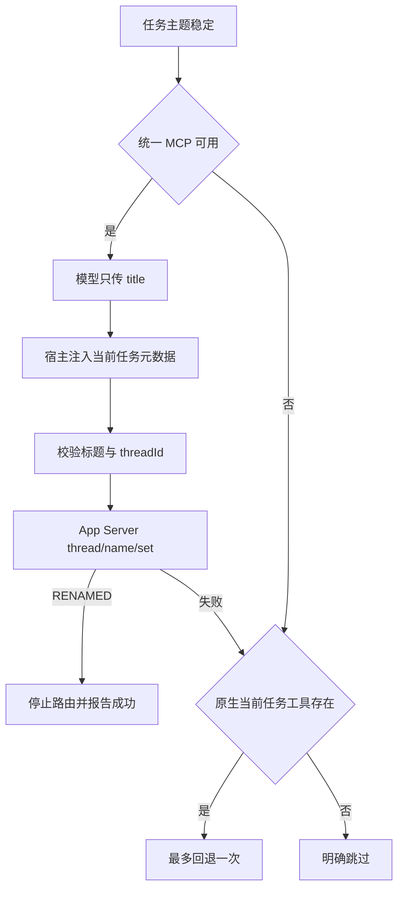
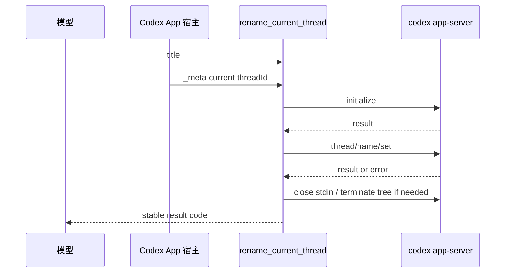

# 模型无关的会话重命名工具需求

结论：保留 `thread-title-rules` 为唯一规则 Owner，并在该 Skill 内提供本地 MCP 工具 `rename_current_thread`；影响：Codex App 中 GPT 或其他支持工具调用的模型都使用同一工具契约，不再直接依赖可能缺失的原生 `set_thread_title`；范围：当前任务身份识别、标题校验、App Server `thread/name/set`、MCP 注册、Skill 路由、全局注册和自动化测试；非范围：没有工具调用能力的模型、其他宿主未经验证的适配器、数据库直写和 UI 点击模拟；变化：模型只传 `title`，线程 ID 由宿主元数据提供；完成标准：新持久化任务能发现工具、调用返回 `RENAMED`、Codex App 立即回读新名称且再次打开仍保留；术语说明：MCP 是宿主向不同模型统一提供工具的协议；验证状态：正式注册、真实改名、即时回读和自动化测试均已通过，非 GPT 实机环境当前不具备。

## 文档信息

图片资产决策：N/A + 原因：本需求只涉及本地工具、Markdown/YAML/JavaScript 和配置注册；证据：全部交付物均为代码、规则、测试和文本证据。

| 字段 | 内容 |
| --- | --- |
| 来源对象 | `SRC-THREAD-RENAME-20260722-001` |
| 需求 ID | `REQ-TR-20260722` |
| 复杂度 | L2：单一 Skill 内新增本地 MCP 与宿主适配器 |
| unresolved_decisions | `[]`，用户已确认仅 Codex App 第一版 |
| local 环境 | `F:\luode-skills` 与 `C:\Users\luode\.codex` |

## 当前计划最终方案简要说明

采用“一个规则 Owner、一个统一 MCP 工具、一个 Codex App 适配器”的最小方案。`rename_current_thread` 成功后立即停止；只有工具未暴露或出现非标题校验类失败时，才允许真实存在的 `set_thread_title` 回退一次。

## 需求来源与证据台账

| SRC ID | 来源 | 冻结内容 | 证据 |
| --- | --- | --- | --- |
| `SRC-THREAD-RENAME-20260722-001` | 用户确认的实施计划 | MCP 优先、原生回退、禁止任意线程 ID、真实持久化验收 | 用户附件计划 |
| `SRC-THREAD-RENAME-20260722-002` | Codex App 本机能力 | MCP 请求含当前任务元数据，App Server 支持 `thread/name/set` | 真实 MCP 调用与 App 回读 |
| `SRC-THREAD-RENAME-20260722-003` | 现有 Skill 保护语义 | 自动触发、8-24 字、用户禁止与标题准确时跳过 | `thread-title-rules/SKILL.md` |

## 决策冻结

| DEC ID | 选定方案 | 排除方案 | 回滚 |
| --- | --- | --- | --- |
| `DEC-TR-001` | 保留 `thread-title-rules` 唯一自动触发入口 | 新增竞争 Skill | 移除 MCP 资源并恢复原 Skill 路由 |
| `DEC-TR-002` | 输入 schema 只含 `title` | 模型传入任意 `threadId` | 恢复严格 schema |
| `DEC-TR-003` | 通过 App Server `thread/name/set` | 直写 SQLite/rollout | 删除适配器并保留原生回退 |
| `DEC-TR-004` | Codex App 宿主元数据是第一版信任边界 | 把 MCP `_meta` 当作跨用户鉴权 | 停止外部暴露，仅保留本机宿主使用 |
| `DEC-TR-005` | Windows 用 `taskkill /t /f` 回收进程树 | 只杀包装进程 | 恢复前一稳定版本并阻断发布 |

## 目标与非目标

| 类型 | ID | 内容 |
| --- | --- | --- |
| 目标 | `REQ-TR-001` | 新任务可发现 `rename_current_thread`，schema 只包含 `title` |
| 目标 | `REQ-TR-002` | 当前任务 ID 仅来自宿主 `_meta.threadId` 或 turn metadata `thread_id` |
| 目标 | `REQ-TR-003` | 调用 App Server 正式方法并返回稳定错误码 |
| 目标 | `REQ-TR-004` | Skill 路由固定为 MCP 优先、原生最多回退一次、失败显式跳过 |
| 目标 | `REQ-TR-005` | 成功、拒绝、超时、异常退出和进程回收均可自动验证 |
| 非目标 | `BOUND-TR-001` | 不为完全无工具调用能力的模型伪造成功 |
| 非目标 | `BOUND-TR-002` | 不改名其他任务，不从任务列表、路径、时间或标题相似度猜测 |
| 非目标 | `BOUND-TR-003` | 不实现 Claude Desktop 等其他宿主的未经验证适配器 |
| 非目标 | `BOUND-TR-004` | 不执行 Git commit/push |

## 功能需求与规则要求

| ID | 要求 | 优先级 | 失败处理 |
| --- | --- | ---: | --- |
| `RULE-TR-001` | 标题 trim 后为 1-24 个 Unicode 字符 | P0 | 返回 `INVALID_TITLE` |
| `RULE-TR-002` | 元数据缺失、格式错误或冲突不得改名 | P0 | 返回 `THREAD_CONTEXT_MISSING` |
| `RULE-TR-003` | 成功必须收到对应 JSON-RPC 请求 ID 的结果 | P0 | 返回拒绝或不可用 |
| `RULE-TR-004` | 返回值不得泄露完整路径、认证信息或原始响应 | P0 | 审查阻断 |
| `RULE-TR-005` | Windows 超时/异常必须终止完整进程树并等待真实退出 | P0 | 测试失败阻断 |
| `RULE-TR-006` | MCP 成功后不得再次调用原生工具 | P0 | 路由回归失败 |
| `RULE-TR-007` | `INVALID_TITLE` 只允许修正后重试 MCP 一次 | P1 | 显式跳过 |
| `RULE-TR-008` | 用户禁止、标题已准确、主题不稳定或小步骤推进时跳过 | P0 | 保护语义回归失败 |

## 业务流程与时序

图形目的：说明模型只生成标题，宿主元数据和 App Server 适配由统一工具负责。

关联 ID：`REQ-TR-001` 至 `REQ-TR-004`、`RULE-TR-001` 至 `RULE-TR-006`。

图形目的：说明 MCP Server 与独立 App Server 进程之间的初始化、改名和清理顺序。

关联 ID：`REQ-TR-003`、`REQ-TR-005`、`RULE-TR-003`、`RULE-TR-005`。

## 数据、接口与安全契约

| 契约 | 内容 |
| --- | --- |
| 工具输入 | `{ title: string }`，禁止额外字段 |
| 工具输出 | `ok`、六种稳定 `code`、成功时可选 `title` |
| 任务身份 | Codex App 注入 `_meta.threadId` 或 `_meta["x-codex-turn-metadata"].thread_id` |
| 信任边界 | 任意本机外部 MCP 客户端可伪造 `_meta`，不属于本工具安全边界；本工具不作为网络或多用户鉴权组件 |
| 存储 | 只通过 App Server 正式接口，不直写内部文件或数据库 |
| 编码 | 所有资产 UTF-8 |

## 非功能要求、风险与阻断

- 启动、协议和清理总耗时由 `timeoutMs` 与 `cleanupGraceMs` 控制。
- 成功和失败均不得遗留 App Server 子进程；Windows 必须覆盖包装进程及其后代。
- MCP 配置仅追加 `thread_session`，不得覆盖已有 `node_repl`、模型供应商或其他用户配置。
- 当前模型选择器只提供 GPT 系列，非 GPT 实机验证记为环境不具备，不得宣称完整跨模型实机验收。
- 独立 App Server 无法通知当前 UI、宿主不注入元数据或正式方法不存在时停止，不退化为数据库直写或 UI 模拟。

## 普通模型零决策执行契约

执行模型不得选择其他任务 ID、修改错误码、改变回退次数、扩大宿主范围、推断工具存在、替换存储方式或跳过真实测试。遇到未知响应、元数据冲突、进程无法回收或 UI 不更新时，按停止条件报告，不自行设计替代方案。

## 主追踪矩阵

| SRC | DEC | REQ/RULE | AC | CYCLE | TASK | TEST | EVIDENCE |
| --- | --- | --- | --- | --- | --- | --- | --- |
| `SRC-THREAD-RENAME-20260722-001` | `DEC-TR-001` | `REQ-TR-004`,`RULE-TR-006`,`RULE-TR-008` | `AC-TR-007`,`AC-TR-009` | `CYCLE-TR-01` | `TASK-TR-03` | `TEST-TR-ROUTE` | Skill 与旧路由扫描 |
| `SRC-THREAD-RENAME-20260722-001` | `DEC-TR-002`,`DEC-TR-004` | `REQ-TR-001`,`REQ-TR-002`,`RULE-TR-002` | `AC-TR-001`,`AC-TR-003`,`AC-TR-004` | `CYCLE-TR-01` | `TASK-TR-02` | `TEST-TR-MCP` | schema 与元数据测试 |
| `SRC-THREAD-RENAME-20260722-002` | `DEC-TR-003`,`DEC-TR-005` | `REQ-TR-003`,`REQ-TR-005`,`RULE-TR-003`,`RULE-TR-005` | `AC-TR-002`,`AC-TR-006` | `CYCLE-TR-01` | `TASK-TR-01`,`TASK-TR-04` | `TEST-TR-APP`,`TEST-TR-REAL` | 15 项自动化与真实任务回读 |

## 垂直切片与追踪契约

本任务按“App Server 客户端与回收 → MCP schema 与元数据 → Skill 路由与兼容 → 全局注册与真实持久化任务 → 文档、审查和验收”形成一个端到端垂直切片。每一步都有独立失败码、测试和停止条件，前一步未通过不得宣称后续成功。
