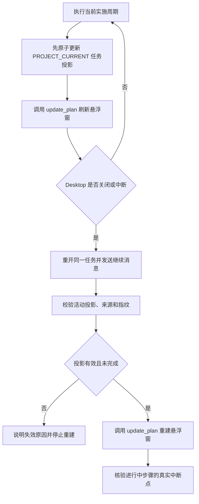
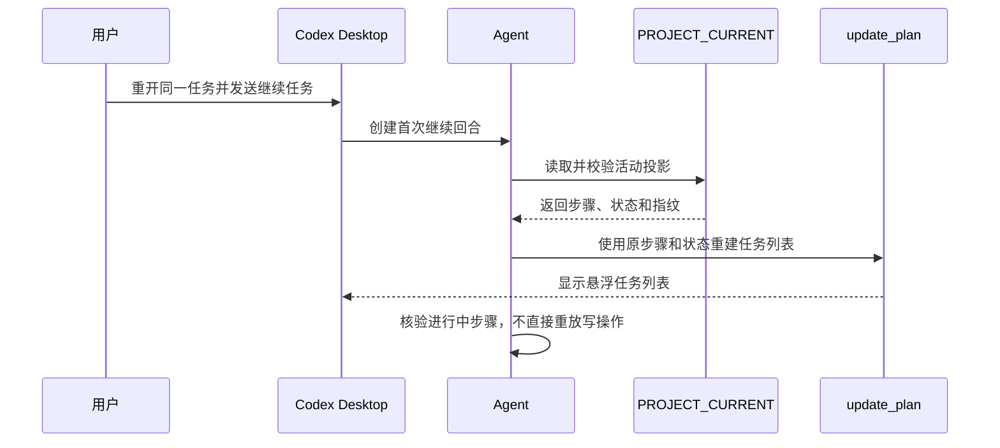

# Codex Desktop 任务悬浮窗断点恢复需求

结论：在 Skills 仓库新增任务投影保存与恢复能力；影响：使用计划模式执行多步骤任务的 Codex Desktop 用户；范围：任务投影、项目当前状态、恢复路由、测试和验收；非范围：修改 Codex Desktop 产品代码或在没有新回合时自动显示悬浮窗；变化：关闭应用后，首次发送继续消息即可重建关闭前的任务列表；完成标准：步骤顺序和状态一致，进行中写操作不会未经核验自动重放；术语说明：任务投影是正式实施计划在悬浮窗中的精简运行时副本；验证状态：需求和安全边界已冻结，真实关闭重开验收在实现完成后执行。

## 文档信息

| 项目 | 内容 |
|---|---|
| 来源 | `SRC-RTP-001` 用户确认的仅 Skills 实施计划 |
| 当前优先闭环 | `SLICE-RTP-001` 首次继续回合重建悬浮任务列表 |
| 图片资产决策 | N/A。原因：本需求只处理状态和工具调用规则；证据：流程与交互可由 Mermaid 完整表达。 |

图片资产决策：N/A。原因：本需求只处理状态和工具调用规则；证据：流程与交互可由 Mermaid 完整表达。

## 需求来源与证据台账

| 来源 ID | 来源事实 | 冻结结论 |
|---|---|---|
| `SRC-RTP-001` | Desktop 中断或关闭后，原任务悬浮窗不会自行恢复 | 使用 `PROJECT_CURRENT.md` 持久化单一活动投影 |
| `SRC-RTP-002` | `update_plan` 可在新回合中重建悬浮任务列表 | 首次继续回合在领域动作前调用该工具 |
| `SRC-RTP-003` | Skills 没有应用启动钩子 | 不承诺仅打开应用时自动恢复 |

## 目标与非目标

| 类型 | 内容 | 边界 ID |
|---|---|---|
| 目标 | 保存当前实施周期最多 20 个步骤及三态状态 | `BOUND-RTP-001` |
| 目标 | 校验投影来源、指纹、结构和大小后重建 UI | `BOUND-RTP-002` |
| 目标 | 对中断中的进行中步骤先核验磁盘和测试状态 | `BOUND-RTP-003` |
| 非目标 | 修改 Desktop 数据库、UI 或启动生命周期 | `BOUND-RTP-004` |
| 非目标 | 自动恢复未知幂等性的写操作 | `BOUND-RTP-005` |
| 非目标 | 一个项目同时恢复多个活动投影 | `BOUND-RTP-006` |

## 功能需求

| 需求 ID | 需求 | 优先级 | 验收入口 |
|---|---|---|---|
| `REQ-RTP-001` | 把当前周期任务投影写入 `PROJECT_CURRENT.md` 唯一托管区块 | P0 | `AC-RTP-001` |
| `REQ-RTP-002` | 重开同一任务后的首次继续回合调用 `update_plan` 重建 UI | P0 | `AC-RTP-002` |
| `REQ-RTP-003` | 进行中步骤恢复后先核验，不直接重放写操作 | P0 | `AC-RTP-003` |
| `REQ-RTP-004` | 全部完成后把投影设为 `inactive`，不再重放 | P0 | `AC-RTP-004` |
| `REQ-RTP-005` | 工具不可用、投影损坏或来源不匹配时保留磁盘状态并明确停止 | P1 | `AC-RTP-005` |

## 业务规则与优先级

- `RULE-RTP-001`：步骤状态只允许 `pending`、`in_progress`、`completed`，最多一个 `in_progress`。
- `RULE-RTP-002`：最多 20 个步骤，每条文案最多 256 个字符，最终文件不得超过 51,200 字节。
- `RULE-RTP-003`：指纹只使用有序任务 ID 和文案计算 SHA-256，进度变化不改变指纹。
- `RULE-RTP-004`：投影禁止保存 prompt、响应、凭据、线程 ID、业务数据和原始用户输入。
- `RULE-RTP-005`：状态迁移时先原子更新磁盘，再调用 `update_plan`；工具失败不得声称 UI 已刷新。
- `RULE-RTP-006`：UI 重建不恢复执行授权，也不等同于 L5 检查点续接。

## 非功能要求、风险与阻断

| 项目 | 约束 | 处理 |
|---|---|---|
| 用户内容保护 | 非托管正文必须逐字保留 | 使用唯一标题和 fenced JSON 区块窄范围替换 |
| 崩溃一致性 | 持久化后、工具调用前崩溃仍可恢复最新状态 | 临时文件写入、刷新并原子替换 |
| 安全 | 敏感字段和未知字段不得进入投影 | 白名单 schema 校验并拒绝写入 |
| 阻断 | 投影重复、损坏、过期或来源无法确认 | 不调用工具，不继续未知写操作 |

## 流程图

图形目的：说明保存、关闭和恢复路径；关联 ID：`REQ-RTP-001` 至 `REQ-RTP-005`。

## 时序图

图形目的：说明首次继续回合交互顺序；关联 ID：`REQ-RTP-002`、`REQ-RTP-003`。

## 追踪矩阵

| 来源 | 决策 | 需求 | 验收 | 实施承接 |
|---|---|---|---|---|
| `SRC-RTP-001` | `DEC-RTP-001` 单一投影 Owner | `REQ-RTP-001` | `AC-RTP-001` | `CYCLE-RTP-02`、`CYCLE-RTP-03` |
| `SRC-RTP-002` | `DEC-RTP-002` 首次继续回合重建 | `REQ-RTP-002` | `AC-RTP-002` | `CYCLE-RTP-03`、`CYCLE-RTP-04` |
| `SRC-RTP-003` | `DEC-RTP-003` 不承诺启动即恢复 | `REQ-RTP-003`、`REQ-RTP-005` | `AC-RTP-003`、`AC-RTP-005` | `CYCLE-RTP-03` |
| `SRC-RTP-001` | `DEC-RTP-004` 完成投影失活 | `REQ-RTP-004` | `AC-RTP-004` | `CYCLE-RTP-02`、`CYCLE-RTP-03` |

## 决策冻结

- `DEC-RTP-001`：新增 `task-plan-rehydration-rules`，投影 schema、指纹、原子写入和 payload 由它唯一负责。
- `DEC-RTP-002`：正式实施文档仍是真实计划源，`PROJECT_CURRENT.md` 只保存当前周期运行状态。
- `DEC-RTP-003`：恢复时机固定为用户第一次发送继续类消息后的新回合。
- `DEC-RTP-004`：活动投影只允许一个；完成后写为 `inactive`。
- `unresolved_decisions`：零个 P0/P1 未决项。

## 垂直切片与追踪契约

| 切片 | 输入 | 输出 | 完成标准 |
|---|---|---|---|
| `SLICE-RTP-001` | 有效活动投影和首次继续消息 | 悬浮任务列表重建 | 步骤、顺序、状态一致 |
| `SLICE-RTP-002` | 状态迁移 | 原子磁盘状态和工具 payload | 崩溃点恢复最新状态 |
| `SLICE-RTP-003` | 进行中步骤 | 中断点核验结论 | 未知写操作不重放 |

## 普通模型零决策执行契约

- 执行模型不得新增字段、放宽状态、步骤数量、文案长度或大小上限。
- 执行模型不得把 UI 重建描述为自动恢复执行授权或 L5 resume。
- 执行模型不得覆盖 `PROJECT_CURRENT.md` 非托管正文，也不得建立平行状态文件。
- 所有测试只使用当前 local 工作区和临时目录；N/A：原因是本需求不连接数据库、缓存、消息队列或外部业务服务；证据是全部测试入口均使用临时文件和本地 Codex Desktop。
