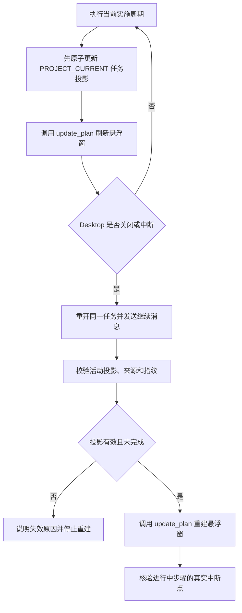
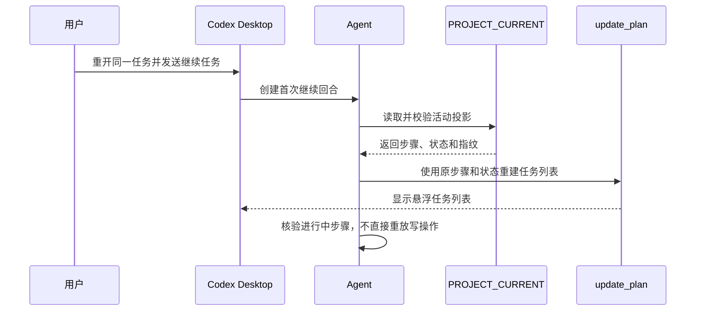
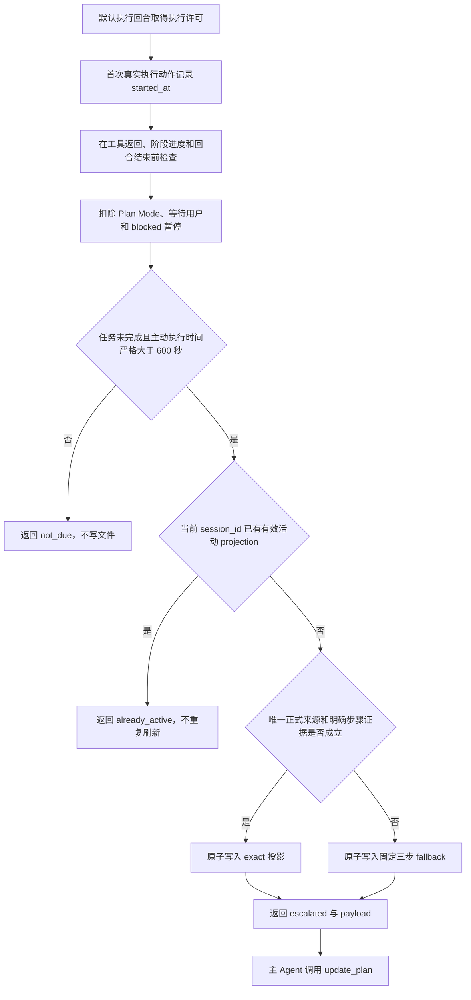
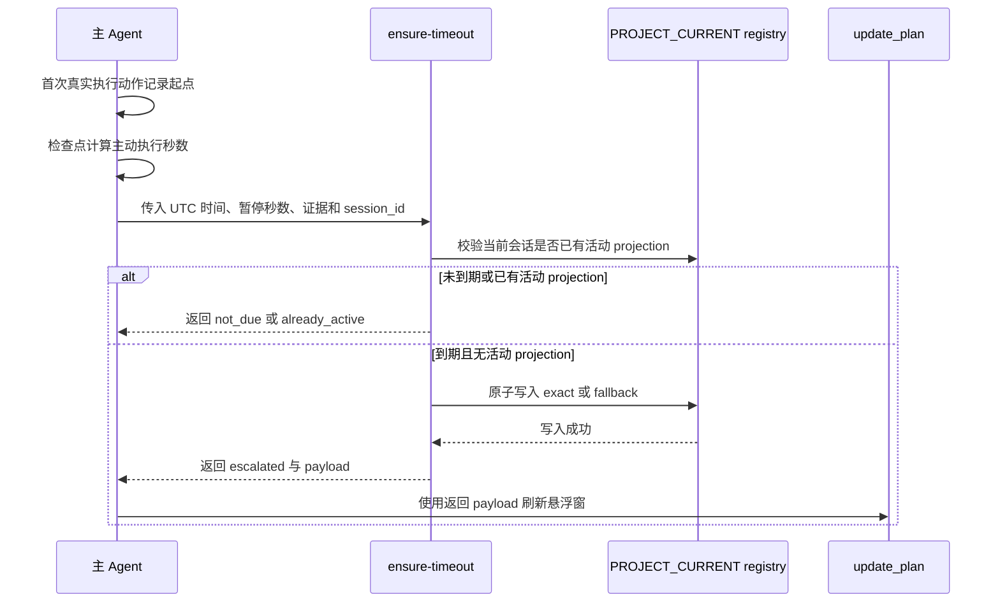
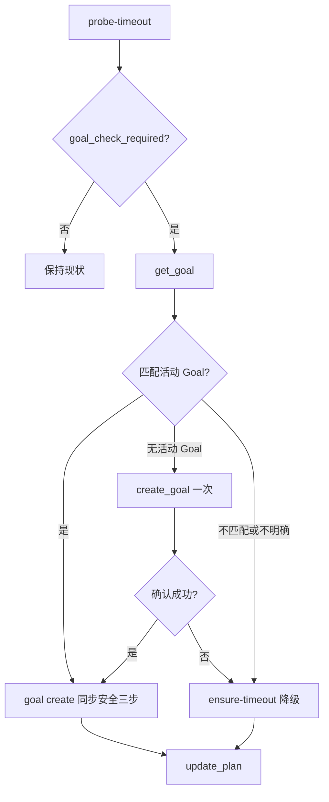
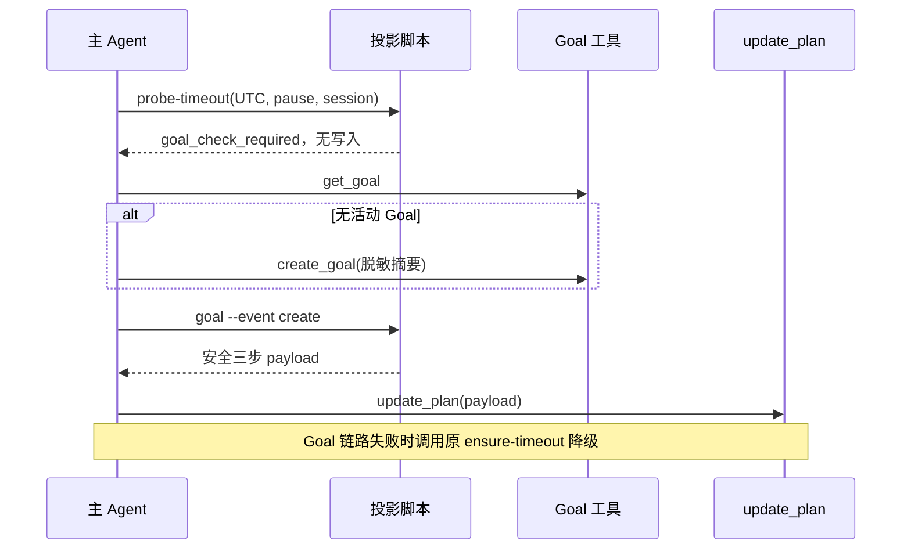
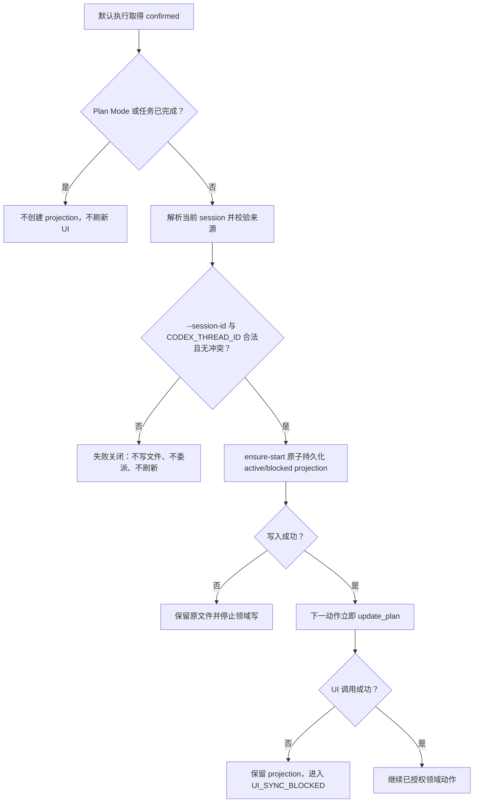
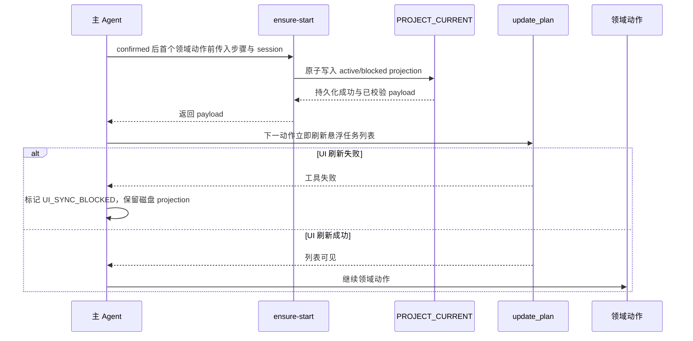

# Codex Desktop 任务悬浮窗断点恢复需求

结论：把“首次持久化即显示悬浮任务列表”设为默认执行模式的硬闸门，并保留十分钟入口作为异常修复闸门；影响：任何已确认、未完成的执行任务都会在第一个领域动作前留下当前会话投影并立即同步 UI，不再因任务被误判为简单而长时间无列表；范围：首次投影持久化与 `update_plan` 顺序、UI 同步失败状态、会话解析、Plan Mode 退出和十分钟异常修复；非范围：修改 Codex Desktop 产品代码、后台定时唤醒、增加 registry v4 字段或持久化计时事实；变化：默认首显从“等待超时补建”改为“持久化后立即刷新”，十分钟入口降为异常修复；完成标准：首次持久化、立即刷新、失败保护、会话冲突失败关闭和活动/阻断状态可见性均有本地行为与真实 Desktop 证据；术语说明：首次领域动作是取得执行许可后准备执行的第一个会改变项目、代码、文档、测试或外部运行时的动作；验证状态：本次需求变更已冻结，实施周期 07 负责规则接入和回归，真实 Desktop 可见性仍需单独放行。

## 文档信息

| 项目 | 内容 |
|---|---|
| 来源 | `SRC-RTP-001` 用户确认的仅 Skills 实施计划 |
| 当前优先闭环 | `SLICE-RTP-006` 首次持久化 projection 后立即刷新悬浮任务列表；十分钟仅作异常修复 |
| 完整性等级 | L2。原因：涉及 Agent、投影脚本和 Desktop 工具三方交互以及时间边界；证据：`REQ-RTP-006/007`、超时流程图与超时时序图。 |
| 图片资产决策 | N/A。原因：本需求只处理状态和工具调用规则；证据：流程与交互可由 Mermaid 完整表达。 |

图片资产决策：N/A。原因：本需求只处理状态和工具调用规则；证据：流程与交互可由 Mermaid 完整表达。

## 需求来源与证据台账

| 来源 ID | 来源事实 | 冻结结论 |
|---|---|---|
| `SRC-RTP-001` | Desktop 中断或关闭后，原任务悬浮窗不会自行恢复 | 使用 `PROJECT_CURRENT.md` 持久化单一活动投影 |
| `SRC-RTP-002` | `update_plan` 可在新回合中重建悬浮任务列表 | 首次继续回合在领域动作前调用该工具 |
| `SRC-RTP-003` | Skills 没有应用启动钩子 | 不承诺仅打开应用时自动恢复 |
| `SRC-RTP-004` | 既有超时入口曾被当作默认的首次悬浮窗保障 | 保留严格超过 600 秒的 `ensure-timeout`，但仅作为首次投影缺失的异常修复闸门 |
| `SRC-RTP-006` | 用户反馈会话执行约 29 分钟仍看不到任务悬浮窗，并明确要求“只要持久化到 `PROJECT_CURRENT.md` 就立即创建列表” | 默认执行取得 `confirmed` 后，第一个领域动作前先持久化当前 session projection；成功后下一动作必须立即 `update_plan`，中间禁止领域写或委派 |

## 目标与非目标

| 类型 | 内容 | 边界 ID |
|---|---|---|
| 目标 | 保存当前实施周期最多 20 个步骤及三态状态 | `BOUND-RTP-001` |
| 目标 | 校验投影来源、指纹、结构和大小后重建 UI | `BOUND-RTP-002` |
| 目标 | 对中断中的进行中步骤先核验磁盘和测试状态 | `BOUND-RTP-003` |
| 非目标 | 修改 Desktop 数据库、UI 或启动生命周期 | `BOUND-RTP-004` |
| 非目标 | 自动恢复未知幂等性的写操作 | `BOUND-RTP-005` |
| 非目标 | 一个项目同时恢复多个活动投影 | `BOUND-RTP-006` |
| 目标 | 默认执行首次领域动作前持久化当前 session projection，并在成功后立即同步 UI | `BOUND-RTP-007` |
| 目标 | 无活动投影的未完成任务在主动执行时间严格超过 600 秒后通过异常修复闸门补建 | `BOUND-RTP-008` |
| 非目标 | 新增后台计时器、在第 601 秒无回合唤醒 Agent，或把计时写入投影 schema | `BOUND-RTP-009` |
| 非目标 | Plan Mode 期间创建活动 projection 或调用主悬浮窗 `update_plan` | `BOUND-RTP-010` |
| 目标 | 解析当前 session 时显式 `--session-id` 优先于 `CODEX_THREAD_ID`，冲突或都缺失时失败关闭 | `BOUND-RTP-011` |

## 功能需求

| 需求 ID | 需求 | 优先级 | 验收入口 |
|---|---|---|---|
| `REQ-RTP-001` | 把当前周期任务投影写入 `PROJECT_CURRENT.md` 唯一托管区块 | P0 | `AC-RTP-001` |
| `REQ-RTP-002` | 重开同一任务后的首次继续回合调用 `update_plan` 重建 UI | P0 | `AC-RTP-002` |
| `REQ-RTP-003` | 进行中步骤恢复后先核验，不直接重放写操作 | P0 | `AC-RTP-003` |
| `REQ-RTP-004` | 全部完成后把投影设为 `inactive`，不再重放 | P0 | `AC-RTP-004` |
| `REQ-RTP-005` | 工具不可用、投影损坏或来源不匹配时保留磁盘状态并明确停止 | P1 | `AC-RTP-005` |
| `REQ-RTP-006` | 默认执行回合从首次真实执行动作开始累计主动执行时间；Plan Mode、等待用户以及 `blocked` 暂停不计入，只有严格大于 600 秒才到期 | P0 | `AC-RTP-006`、`AC-RTP-008` |
| `REQ-RTP-007` | 到期且当前会话没有有效活动 projection 时，必须优先按唯一正式来源创建 `exact`，无法唯一确认时创建固定三步 `fallback`；投影原子写入成功后才返回并使用 `update_plan` payload | P0 | `AC-RTP-007`、`AC-RTP-009` |
| `REQ-RTP-010` | 默认执行模式取得 `confirmed` 后，在第一个领域动作前必须为当前 session 持久化 `active` 或 `blocked` projection；Plan Mode、等待用户和未确认许可不得创建 | P0 | `AC-RTP-014` |
| `REQ-RTP-011` | 首次 projection 原子写入成功后，下一动作必须立即调用 `update_plan`；两者之间不得发生代码、文档、测试、委派或其它领域写操作；工具失败时保留投影并进入运行时 `UI_SYNC_BLOCKED` | P0 | `AC-RTP-015` |
| `REQ-RTP-012` | 活动和阻断 projection 必须有悬浮任务列表，`inactive` 不创建新列表；session 解析按显式 `--session-id`、`CODEX_THREAD_ID` 顺序，冲突或都缺失时失败关闭 | P0 | `AC-RTP-016` |
| `REQ-RTP-013` | `ensure-timeout` 仅作为首次列表缺失的异常修复闸门；默认首次显示不等待十分钟，仍只在主动执行严格大于 600 秒的可执行检查点尝试补建 | P1 | `AC-RTP-017` |

## 业务规则与优先级

- `RULE-RTP-001`：步骤状态只允许 `pending`、`in_progress`、`completed`，最多一个 `in_progress`。
- `RULE-RTP-002`：最多 20 个步骤，每条文案最多 256 个字符，最终文件不得超过 51,200 字节。
- `RULE-RTP-003`：指纹只使用有序任务 ID 和文案计算 SHA-256，进度变化不改变指纹。
- `RULE-RTP-004`：投影禁止保存 prompt、响应、凭据、线程 ID、业务数据和原始用户输入。
- `RULE-RTP-005`：状态迁移时先原子更新磁盘，再调用 `update_plan`；工具失败不得声称 UI 已刷新。
- `RULE-RTP-006`：UI 重建不恢复执行授权，也不等同于 L5 检查点续接。
- `RULE-RTP-007`：计时起点固定为取得执行许可后的首次真实执行动作；需求澄清、Plan Mode 和尚未取得执行许可的阶段不得提前计时。
- `RULE-RTP-008`：主动执行秒数固定为 `observed_at - started_at - paused_seconds`；等待用户、`blocked` 以及归属于等待用户的 `manual_handoff` 计入暂停，结果严格大于 600 才到期，恰好 600 秒不升级。
- `RULE-RTP-009`：每次工具返回、阶段进度更新和准备结束当前回合前检查一次；任务已完成、许可不是 `confirmed`、处于 Plan Mode 或当前 `session_id` 已有活动 projection 时不得创建重复投影。
- `RULE-RTP-010`：计时事实只保存在当前执行上下文，不新增 registry 或 projection 字段，不写入步骤文案和项目长期状态；跨回合丢失计时上下文时不得猜测补齐。
- `RULE-RTP-016`：默认执行取得 `confirmed` 后，首次领域动作前先调用 `ensure-start`（或等价唯一 Owner 入口）持久化当前 session 的 `active` 或 `blocked` projection；Plan Mode、等待用户、许可非 `confirmed` 和任务已完成不得进入该入口。
- `RULE-RTP-017`：`ensure-start` 持久化成功后，下一动作固定为使用已验证 payload 调用 `update_plan`；持久化与 UI 调用之间禁止代码、文档、测试、委派、服务启动及其它领域写操作。
- `RULE-RTP-018`：`update_plan` 失败时保留已持久化 projection，当前执行状态为 `UI_SYNC_BLOCKED`，不得声称悬浮窗已出现或继续执行下一领域写；该运行时状态不扩展 registry v4 schema。
- `RULE-RTP-019`：`active` 和 `blocked` projection 必须同步悬浮任务列表；`inactive` 只作为终态磁盘状态，不触发新列表；恢复活动/阻断 projection 时仍须重新调用 `update_plan`。
- `RULE-RTP-020`：session 解析严格按 `--session-id` 优先、`CODEX_THREAD_ID` 回退；显式值与环境值冲突、两者缺失或值非法时非零退出且不写文件、不调用 `update_plan`。
- `RULE-RTP-021`：十分钟 `ensure-timeout` 仅用于检测首次列表缺失的异常修复，不是默认首次显示路径；主动执行时间仍按既有 `>600` 秒、暂停扣除和可执行检查点规则计算。
- `RULE-RTP-022`：任何子 Agent 不得调用主悬浮窗 `update_plan` 或替换当前 session projection；主 Agent 对“持久化后立即刷新”顺序和 `UI_SYNC_BLOCKED` 负责。

## 非功能要求、风险与阻断

| 项目 | 约束 | 处理 |
|---|---|---|
| 用户内容保护 | 非托管正文必须逐字保留 | 使用唯一标题和 fenced JSON 区块窄范围替换 |
| 崩溃一致性 | 持久化后、工具调用前崩溃仍可恢复最新状态 | 临时文件写入、刷新并原子替换 |
| 安全 | 敏感字段和未知字段不得进入投影 | 白名单 schema 校验并拒绝写入 |
| 阻断 | 投影重复、损坏、过期或来源无法确认 | 不调用工具，不继续未知写操作 |
| 时间准确性 | 起始时间、观察时间或暂停秒数缺失、非 UTC、为负或互相矛盾 | 命令非零退出，原文件字节不变，不猜测墙钟时间 |
| 唤醒能力 | Skills 没有后台定时器，也不能在工具阻塞期间精确唤醒 | 仅在可执行检查点判断；不承诺第 601 秒即时出现悬浮窗 |
| 兼容性 | 现有 v4 registry 与 v1-v3 读取兼容不得被超时能力改变 | 复用 `synthesize`、原子写入和 payload，不修改 schema |

## 流程图

图形目的：说明保存、关闭和恢复路径；关联 ID：`REQ-RTP-001` 至 `REQ-RTP-005`。

```mermaid
flowchart TD
    A["执行当前实施周期"] --> B["先原子更新 PROJECT_CURRENT 任务投影"]
    B --> C["调用 update_plan 刷新悬浮窗"]
    C --> D{"Desktop 是否关闭或中断"}
    D -- "否" --> A
    D -- "是" --> E["重开同一任务并发送继续消息"]
    E --> F["校验活动投影、来源和指纹"]
    F --> G{"投影有效且未完成"}
    G -- "否" --> H["说明失效原因并停止重建"]
    G -- "是" --> I["调用 update_plan 重建悬浮窗"]
    I --> J["核验进行中步骤的真实中断点"]
```

## 时序图

图形目的：说明首次继续回合交互顺序；关联 ID：`REQ-RTP-002`、`REQ-RTP-003`。

```mermaid
sequenceDiagram
    participant U as 用户
    participant D as Codex Desktop
    participant A as Agent
    participant P as PROJECT_CURRENT
    participant T as update_plan
    U->>D: 重开同一任务并发送继续任务
    D->>A: 创建首次继续回合
    A->>P: 读取并校验活动投影
    P-->>A: 返回步骤、状态和指纹
    A->>T: 使用原步骤和状态重建任务列表
    T-->>D: 显示悬浮任务列表
    A->>A: 核验进行中步骤，不直接重放写操作
```

**超时升级流程图**

图形目的：说明无活动悬浮窗任务的严格阈值、排除条件和安全回退；关联 ID：`REQ-RTP-006`、`REQ-RTP-007`、`RULE-RTP-007` 至 `RULE-RTP-010`、`AC-RTP-006` 至 `AC-RTP-009`。

```mermaid
flowchart TD
    A["默认执行回合取得执行许可"] --> B["首次真实执行动作记录 started_at"]
    B --> C["在工具返回、阶段进度和回合结束前检查"]
    C --> D["扣除 Plan Mode、等待用户和 blocked 暂停"]
    D --> E{"任务未完成且主动执行时间严格大于 600 秒"}
    E -- "否" --> F["返回 not_due，不写文件"]
    E -- "是" --> G{"当前 session_id 已有有效活动 projection"}
    G -- "是" --> H["返回 already_active，不重复刷新"]
    G -- "否" --> I{"唯一正式来源和明确步骤证据是否成立"}
    I -- "是" --> J["原子写入 exact 投影"]
    I -- "否" --> K["原子写入固定三步 fallback"]
    J --> L["返回 escalated 与 payload"]
    K --> L
    L --> M["主 Agent 调用 update_plan"]
```

边界覆盖：恰好 600 秒、任务已完成、Plan Mode、许可非 `confirmed`、已有活动投影、非法时间和损坏 registry 都不会进入写入路径；没有后台唤醒能力时只在下一个可执行检查点判断。

**超时升级时序图**

图形目的：冻结计时检查、持久化和 UI 刷新的先后顺序；关联 ID：`REQ-RTP-007`、`AC-RTP-007`、`AC-RTP-009`、`CYCLE-RTP-05`。

```mermaid
sequenceDiagram
    participant A as 主 Agent
    participant S as ensure-timeout
    participant P as PROJECT_CURRENT registry
    participant U as update_plan
    A->>A: 首次真实执行动作记录起点
    A->>A: 检查点计算主动执行秒数
    A->>S: 传入 UTC 时间、暂停秒数、证据和 session_id
    S->>P: 校验当前会话是否已有活动 projection
    alt 未到期或已有活动 projection
        S-->>A: 返回 not_due 或 already_active
    else 到期且无活动 projection
        S->>P: 原子写入 exact 或 fallback
        P-->>S: 写入成功
        S-->>A: 返回 escalated 与 payload
        A->>U: 使用返回 payload 刷新悬浮窗
    end
```

异常覆盖：原子写入失败、时间非法或 registry 损坏时脚本非零退出且不返回可调用 payload；`update_plan` 失败时保留已写入投影，但不得声称悬浮窗已出现。

## 追踪矩阵

| 来源 | 决策 | 需求 | 验收 | 实施承接 |
|---|---|---|---|---|
| `SRC-RTP-001` | `DEC-RTP-001` 单一投影 Owner | `REQ-RTP-001` | `AC-RTP-001` | `CYCLE-RTP-02`、`CYCLE-RTP-03` |
| `SRC-RTP-002` | `DEC-RTP-002` 首次继续回合重建 | `REQ-RTP-002` | `AC-RTP-002` | `CYCLE-RTP-03`、`CYCLE-RTP-04` |
| `SRC-RTP-003` | `DEC-RTP-003` 不承诺启动即恢复 | `REQ-RTP-003`、`REQ-RTP-005` | `AC-RTP-003`、`AC-RTP-005` | `CYCLE-RTP-03` |
| `SRC-RTP-001` | `DEC-RTP-004` 完成投影失活 | `REQ-RTP-004` | `AC-RTP-004` | `CYCLE-RTP-02`、`CYCLE-RTP-03` |
| `SRC-RTP-004` | `DEC-RTP-005` 主动执行严格超时 | `REQ-RTP-006`、`RULE-RTP-007`、`RULE-RTP-008`、`RULE-RTP-009` | `AC-RTP-006`、`AC-RTP-008` | `CYCLE-RTP-05`、`TASK-RTP-10`、`TASK-RTP-11`、`TASK-RTP-12`、`TASK-RTP-13` |
| `SRC-RTP-004` | `DEC-RTP-006` 复用现有投影补建能力 | `REQ-RTP-007`、`RULE-RTP-010` | `AC-RTP-007`、`AC-RTP-009` | `CYCLE-RTP-05`、`TASK-RTP-11`、`TASK-RTP-12`、`TASK-RTP-13` |
| `SRC-RTP-006` | `DEC-RTP-010` 首次持久化即 UI 闸门 | `REQ-RTP-010`、`REQ-RTP-011`、`RULE-RTP-016..018` | `AC-RTP-014`、`AC-RTP-015` | `CYCLE-RTP-07`、`TASK-RTP-22..24` |
| `SRC-RTP-006` | `DEC-RTP-011` session 解析与异常修复边界 | `REQ-RTP-012`、`REQ-RTP-013`、`RULE-RTP-019..022` | `AC-RTP-016`、`AC-RTP-017` | `CYCLE-RTP-07`、`TASK-RTP-25..28` |

## 决策冻结

- `DEC-RTP-001`：新增 `task-plan-rehydration-rules`，投影 schema、指纹、原子写入和 payload 由它唯一负责。
- `DEC-RTP-002`：正式实施文档仍是真实计划源，`PROJECT_CURRENT.md` 只保存当前周期运行状态。
- `DEC-RTP-003`：恢复时机固定为用户第一次发送继续类消息后的新回合。
- `DEC-RTP-004`：活动投影只允许一个；完成后写为 `inactive`。
- `DEC-RTP-005`：十分钟不再承担默认首次显示职责；它只作为首次投影缺失的异常修复闸门，超时起点仍固定为首次真实执行动作，扣除 Plan Mode、等待用户和 `blocked` 暂停后，只有主动执行时间严格大于 600 秒才允许补建。
- `DEC-RTP-006`：超时升级复用现有 `synthesize` 的 `exact/fallback` 判定、v4 registry 原子写入和 payload 生成；不新增 schema 字段、计时持久化或后台监控。
- `DEC-RTP-010`：默认执行取得 `confirmed` 后，首次领域动作前必须先持久化当前 session 的活动 projection；持久化成功后的下一动作必须立即调用 `update_plan`，中间不允许任何领域写或委派。
- `DEC-RTP-011`：`update_plan` 失败保留 projection 并进入 `UI_SYNC_BLOCKED`；`active/blocked` 始终要求悬浮任务列表，`inactive` 不生成新列表；不扩展 v4 schema。
- `DEC-RTP-012`：session 解析显式 `--session-id` 优先于 `CODEX_THREAD_ID`；冲突、缺失或非法值失败关闭；Plan Mode 永不创建投影或刷新主悬浮窗。
- `unresolved_decisions`：零个 P0/P1 未决项。

**需求变更记录**

| 变更 ID | 来源与授权 | 原值 | 新值 | 影响与回开 | 清理、回滚与复核 |
|---|---|---|---|---|---|
| `CHG-RTP-001` | `SRC-RTP-004`；用户于 2026-07-25 明确要求并授权按计划实施 | 简单任务可以全程不创建任务悬浮窗 | 无活动 projection 的未完成任务，主动执行时间严格超过 600 秒后必须升级当前会话悬浮窗 | 新增 `REQ-RTP-006/007`、`RULE-RTP-007..010`、`AC-RTP-006..009`、`SLICE-RTP-004`、`CYCLE-RTP-05`、`TASK-RTP-10..13`、`TEST-RTP-009..012`；回开需求、验收、实施、测试和 Skill 合规审查 Owner；既有 `CYCLE-RTP-01..04` 不改写历史闭环内容 | 回滚仅移除超时入口及对应规则、测试和文档增量，不删除既有 projection；复核入口为四类文档 profile、超时 CLI 单元测试和全量回归 |
| `CHG-RTP-002` | `SRC-RTP-006`；用户于 2026-07-26 反馈会话执行约 29 分钟仍无悬浮窗，并明确要求按 `PROJECT_CURRENT.md` 持久化即显示 | 默认执行可先无悬浮窗，十分钟后再补建 | 默认执行首次领域动作前先持久化当前 session projection，持久化后下一动作立即 `update_plan`；失败进入 `UI_SYNC_BLOCKED`；十分钟仅异常修复 | 新增 `REQ-RTP-010..013`、`RULE-RTP-016..022`、`AC-RTP-014..017`、`SLICE-RTP-006`、`CYCLE-RTP-07`、`TASK-RTP-22..28`；回开默认执行、恢复、超时、Goal 和验收路由；历史 `CYCLE-RTP-01..06` 只保留已完成证据，不重写执行事实 | 回滚只撤销首次持久化闸门及对应路由和文档增量，保留 v4 schema；若 `update_plan` 不可用，保留投影并维持 `UI_SYNC_BLOCKED`，不得降级为无列表成功 |

## 垂直切片与追踪契约

| 切片 | 输入 | 输出 | 完成标准 |
|---|---|---|---|
| `SLICE-RTP-001` | 有效活动投影和首次继续消息 | 悬浮任务列表重建 | 步骤、顺序、状态一致 |
| `SLICE-RTP-002` | 状态迁移 | 原子磁盘状态和工具 payload | 崩溃点恢复最新状态 |
| `SLICE-RTP-003` | 进行中步骤 | 中断点核验结论 | 未知写操作不重放 |
| `SLICE-RTP-004` | 已确认执行许可、可靠 UTC 时间、暂停秒数、当前 `session_id` 和补建证据 | `not_due`、`already_active` 或持久化后的 `escalated + payload` | 599/600 秒不升级，601 秒升级；exact 优先、fallback 兜底；非法输入不改原文件 |
| `SLICE-RTP-006` | 默认执行 `confirmed`、首次领域动作、当前 `session_id` 和合法步骤证据 | 持久化后的活动/阻断 projection 与立即 `update_plan`；失败为 `UI_SYNC_BLOCKED` | 投影先写盘，下一动作唯一为 UI 刷新；中间无领域写/委派；active/blocked 可见，inactive 不新建；session 冲突/缺失失败关闭 |

## 普通模型零决策执行契约

- 执行模型不得新增字段、放宽状态、步骤数量、文案长度或大小上限。
- 执行模型不得把 UI 重建描述为自动恢复执行授权或 L5 resume。
- 执行模型不得覆盖 `PROJECT_CURRENT.md` 非托管正文，也不得建立平行状态文件。
- 执行模型不得把 600 秒解释为“到达即触发”，不得用总墙钟时间替代扣除暂停后的主动执行时间。
- 执行模型不得新增后台计时器、registry/projection 计时字段或跨回合猜测；`ensure-timeout` 只能在可执行检查点调用。
- 执行模型只有在 `action=escalated` 且投影已成功持久化后才能调用 `update_plan`；`not_due` 和 `already_active` 均不得重复刷新。
- 执行模型在默认执行首次领域动作前必须先调用唯一 `ensure-start` 投影入口；写盘成功后的下一动作必须立即 `update_plan`，两者之间不得执行领域写或委派。
- 执行模型不得把 `UI_SYNC_BLOCKED` 当作成功；工具失败时只能保留投影、报告阻断并停止下一领域写。
- 执行模型必须按 `--session-id` 优先、`CODEX_THREAD_ID` 回退解析会话；冲突、缺失或非法值不写盘、不刷新。
- 执行模型不得把十分钟入口当作默认首次显示路径；仅在发现首次投影缺失且主动执行严格大于 600 秒时走异常修复检查。
- 所有测试只使用当前 local 工作区和临时目录；N/A：原因是本需求不连接数据库、缓存、消息队列或外部业务服务；证据是全部测试入口均使用临时文件和本地 Codex Desktop。

**SLICE-RTP-005：超时自动升级 Goal**

结论：用户确认把十分钟普通悬浮窗升级扩展为“优先自动创建或复用 Goal，失败时保留普通悬浮窗”；影响：长任务在不扩大执行授权的前提下获得持续目标；范围：只读超时探测、宿主 Goal 编排、失败降级和终态；非范围：Desktop 产品代码和后台定时器；变化：`ensure-timeout` 从默认首选变为 Goal 失败时的兼容降级；完成标准：`AC-RTP-010..013` 通过；术语说明：任务摘要是只传给 Goal 工具的脱敏单行目标；验证状态：`CHG-RTP-001` 已确认，进入 `CYCLE-RTP-06`。

**来源、变更与决策**

| ID | 类型 | 冻结内容 |
|---|---|---|
| `SRC-RTP-005` | 用户来源 | 用户确认长任务超过十分钟时自动创建 Goal 的体验符合预期，并要求正式定义和实施。 |
| `CHG-RTP-001` | 需求变更 | 旧值为超时直接写 `exact/fallback`；新值为先无写入探测、再检查或创建 Goal，失败才调用原 `ensure-timeout`。 |
| `DEC-RTP-007` | 技术决策 | 新增 `probe-timeout`，不改变现有 `ensure-timeout`、Goal CLI 和 v4 schema。 |
| `DEC-RTP-008` | 体验决策 | Goal 使用最多 80 个字符的脱敏任务摘要；无法安全生成时使用固定兜底文案。 |
| `DEC-RTP-009` | 失败决策 | 活动 Goal 不匹配、工具不可用或结果不明确时不重复创建，降级普通悬浮窗。 |

**功能需求与规则要求**

| ID | 内容 | 优先级 | 验收 |
|---|---|---|---|
| `REQ-RTP-008` | 默认执行回合、许可为 `confirmed`、任务未完成且主动执行严格大于 600 秒时，`probe-timeout` 无写入返回 `goal_check_required`。 | P0 | `AC-RTP-010` |
| `REQ-RTP-009` | 主 Agent 按 `get_goal → create_goal/复用 → goal create → update_plan` 执行；失败时调用原 `ensure-timeout`。 | P0 | `AC-RTP-011..013` |
| `RULE-RTP-011` | 599/600 秒不触发，601 秒才触发；Plan Mode、等待、阻断和手工交接暂停不计时。 | P0 | `AC-RTP-010` |
| `RULE-RTP-012` | 当前会话已有 active/blocked projection 时不创建 Goal；其它会话投影不得参与判断。 | P0 | `AC-RTP-010/011` |
| `RULE-RTP-013` | 每次自动升级前先 `get_goal`；同一执行上下文最多一次 `create_goal` 尝试，结果不明确时最多再确认一次。 | P0 | `AC-RTP-011/012` |
| `RULE-RTP-014` | Goal 摘要单行、最多 80 字符，不得含凭据、完整路径、session ID、原始 prompt、日志或大段输入，且不得持久化。 | P0 | `AC-RTP-013` |
| `RULE-RTP-015` | Goal 创建或投影失败时调用原 `ensure-timeout`；`update_plan` 失败只保留磁盘投影，不虚报 UI。 | P0 | `AC-RTP-012` |

**边界与外部契约**

| 边界 ID | 内容 |
|---|---|
| `BOUND-RTP-009` | Python 只探测、校验和持久化，不直接调用宿主 `get_goal/create_goal/update_goal`。 |
| `BOUND-RTP-010` | 只有当前主会话主 Agent 调用 Goal 工具和主悬浮窗 `update_plan`。 |
| `BOUND-RTP-011` | 没有可执行检查点时不承诺第 601 秒精确唤醒；计时上下文丢失时重新计时。 |

**自动 Goal 流程图**

图形目的：冻结自动 Goal 与普通投影降级顺序；关联 ID：`REQ-RTP-008/009`、`RULE-RTP-011..015`。

```mermaid
flowchart TD
    A["probe-timeout"] --> B{"goal_check_required?"}
    B -- "否" --> C["保持现状"]
    B -- "是" --> D["get_goal"]
    D --> E{"匹配活动 Goal?"}
    E -- "是" --> F["goal create 同步安全三步"]
    E -- "无活动 Goal" --> G["create_goal 一次"]
    E -- "不匹配或不明确" --> H["ensure-timeout 降级"]
    G --> I{"确认成功?"}
    I -- "是" --> F
    I -- "否" --> H
    F --> J["update_plan"]
    H --> J
```

**自动 Goal 时序图**

图形目的：冻结宿主工具和投影 Owner 的职责；关联 ID：`REQ-RTP-009`、`AC-RTP-011/012`。

```mermaid
sequenceDiagram
    participant A as 主 Agent
    participant P as 投影脚本
    participant G as Goal 工具
    participant U as update_plan
    A->>P: probe-timeout(UTC, pause, session)
    P-->>A: goal_check_required，无写入
    A->>G: get_goal
    alt 无活动 Goal
        A->>G: create_goal(脱敏摘要)
    end
    A->>P: goal --event create
    P-->>A: 安全三步 payload
    A->>U: update_plan(payload)
    Note over A,U: Goal 链路失败时调用原 ensure-timeout 降级
```

**决策冻结**

`DEC-RTP-007..009` 均已确认，`unresolved_decisions: []`。不得把自动 Goal 解释为新的编码、写入或外部副作用授权。

**普通模型零决策执行契约**

1. 只有默认执行、`confirmed`、任务未完成且无当前会话活动投影时运行 `probe-timeout`。
2. `goal_check_required` 后先 `get_goal`；匹配则复用，无活动才尝试一次 `create_goal`。
3. 任务摘要来源依次为正式计划摘要、已确认用户目标、固定兜底；只传给 Goal 工具。
4. Goal 或投影任一失败时调用原 `ensure-timeout`；不得重复创建 Goal。
5. `update_plan` 失败只报告投影已保存；Goal complete/blocked 继续遵守既有运行时门槛。

**追踪矩阵**

| 来源/变更 | 决策 | 需求/规则 | 验收 | 周期/任务 | 测试 |
|---|---|---|---|---|---|
| `SRC-RTP-005/CHG-RTP-001` | `DEC-RTP-007` | `REQ-RTP-008`、`RULE-RTP-011/012` | `AC-RTP-010` | `CYCLE-RTP-06/TASK-RTP-16` | `TEST-RTP-013/014` |
| `SRC-RTP-005/CHG-RTP-001` | `DEC-RTP-008/009` | `REQ-RTP-009`、`RULE-RTP-013..015` | `AC-RTP-011..013` | `CYCLE-RTP-06/TASK-RTP-17..21` | `TEST-RTP-015..018` |

**SLICE-RTP-006：首次持久化即悬浮窗同步**

结论：默认执行不再等待十分钟才获得悬浮任务列表；影响：凡进入真实领域动作的已确认任务均可在首个动作前被观察和恢复；范围：`ensure-start`、`update_plan` 紧邻顺序、失败阻断、会话解析、Plan Mode 排除和十分钟异常修复；非范围：Desktop 产品代码、后台计时器、registry v4 字段和子 Agent UI 调用；变化：从“超时补建”改为“首次持久化必显示，超时只修复漏显示”；完成标准：`AC-RTP-014..017`、CYCLE-RTP-07 和真实 Desktop 证据闭环。

**新增功能需求与规则追踪**

| ID | 内容 | 优先级 | 验收 |
|---|---|---|---|
| `REQ-RTP-010` | 默认执行取得 `confirmed` 后，首次领域动作前为当前 session 持久化 `active` 或 `blocked` projection；Plan Mode 不创建 | P0 | `AC-RTP-014` |
| `REQ-RTP-011` | 持久化成功后下一动作立即 `update_plan`，中间禁止任何领域写/委派；失败保留投影并进入 `UI_SYNC_BLOCKED` | P0 | `AC-RTP-015` |
| `REQ-RTP-012` | active/blocked 必须有列表、inactive 不新建；session 解析显式参数优先，冲突/缺失失败关闭 | P0 | `AC-RTP-016` |
| `REQ-RTP-013` | 十分钟仅异常修复闸门，不承担默认首次显示 | P1 | `AC-RTP-017` |

**首次持久化与 UI 同步流程图**

图形目的：冻结默认执行首个领域动作前的写盘、刷新和失败阻断顺序；关联 ID：`REQ-RTP-010/011`、`RULE-RTP-016..018`、`AC-RTP-014/015`。

```mermaid
flowchart TD
    A["默认执行取得 confirmed"] --> B{"Plan Mode 或任务已完成？"}
    B -- "是" --> C["不创建 projection，不刷新 UI"]
    B -- "否" --> D["解析当前 session 并校验来源"]
    D --> E{"--session-id 与 CODEX_THREAD_ID 合法且无冲突？"}
    E -- "否" --> F["失败关闭：不写文件、不委派、不刷新"]
    E -- "是" --> G["ensure-start 原子持久化 active/blocked projection"]
    G --> H{"写入成功？"}
    H -- "否" --> I["保留原文件并停止领域写"]
    H -- "是" --> J["下一动作立即 update_plan"]
    J --> K{"UI 调用成功？"}
    K -- "否" --> L["保留 projection，进入 UI_SYNC_BLOCKED"]
    K -- "是" --> M["继续已授权领域动作"]
```

**首次持久化与 UI 同步时序图**

图形目的：证明 projection 持久化和 `update_plan` 之间没有其它领域动作；关联 ID：`REQ-RTP-011`、`RULE-RTP-017/018`、`AC-RTP-015`。

```mermaid
sequenceDiagram
    participant A as 主 Agent
    participant S as ensure-start
    participant P as PROJECT_CURRENT
    participant U as update_plan
    participant D as 领域动作
    A->>S: confirmed 后首个领域动作前传入步骤与 session
    S->>P: 原子写入 active/blocked projection
    P-->>S: 持久化成功与已校验 payload
    S-->>A: 返回 payload
    A->>U: 下一动作立即刷新悬浮任务列表
    alt UI 刷新失败
        U-->>A: 工具失败
        A->>A: 标记 UI_SYNC_BLOCKED，保留磁盘 projection
    else UI 刷新成功
        U-->>A: 列表可见
        A->>D: 继续领域动作
    end
```

**新增追踪矩阵**

| 来源 | 决策 | 需求/规则 | 验收 | 周期/任务 | 测试 |
|---|---|---|---|---|---|
| `SRC-RTP-006` | `DEC-RTP-010` | `REQ-RTP-010/011`、`RULE-RTP-016..018` | `AC-RTP-014/015` | `CYCLE-RTP-07/TASK-RTP-22..24` | `TEST-RTP-019..021` |
| `SRC-RTP-006` | `DEC-RTP-011/012` | `REQ-RTP-012/013`、`RULE-RTP-019..022` | `AC-RTP-016/017` | `CYCLE-RTP-07/TASK-RTP-25..28` | `TEST-RTP-022..025` |

**新增普通模型零决策执行契约**

1. 仅默认执行、许可为 `confirmed`、任务未完成且不处于 Plan Mode 时调用 `ensure-start`；首个领域动作前必须完成持久化。
2. 持久化成功后下一动作只能是 `update_plan`；任何领域写、委派或服务启动都必须等待 UI 结果。
3. `update_plan` 失败时保留投影并报告 `UI_SYNC_BLOCKED`，不声称悬浮窗可见，也不继续领域写。
4. session 解析使用显式 `--session-id` 优先、`CODEX_THREAD_ID` 回退；冲突/缺失/非法均失败关闭。
5. active/blocked 必须有悬浮列表，inactive 不生成新列表；十分钟入口只修复漏显示，不替代首次同步。
