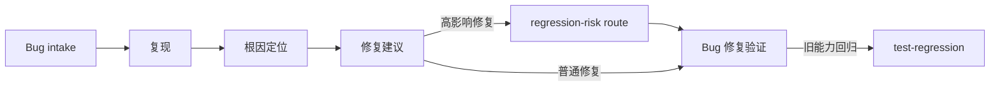
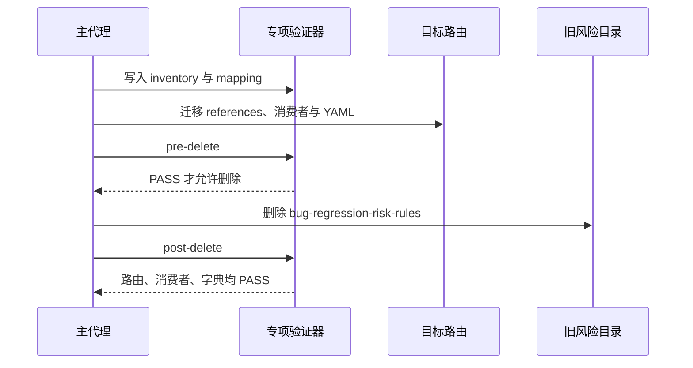

# Bug 域回归风险入口合并与生命周期精简需求

结论：删除独立回归风险入口并合并到修复建议路由。影响：高影响修复改为在同一入口完成风险评估。范围：Bug Skill、引用、消费者、字典和专项验证。非范围：复现、根因和关闭验证入口不合并。变化：新增 `regression-risk` 条件路由并删除旧目录。完成标准：新入口、消费者、字典和专项验证均通过。术语说明：条件路由是指在满足特定风险条件时进入的同一入口子流程。验证状态：已完成迁移，待最终文档和审查验收门禁复核。

## 文档信息

本文件冻结 `SRC-BUG-STREAMLINE-20260724-001` 的合并决策、范围、验收依据和证据入口；详细命令、资产清单和审查结论只在执行附录与追踪附录维护。

## 需求来源与证据台账

本次来源是用户确认的 Bug 域精简请求，证据基线为 inventory、触发夹具、专项验证器和保留入口 YAML；历史周期只读保留，不作为本轮通过依据。

## 目标与非目标

| 项目 | 冻结结论 |
| --- | --- |
| 来源 | `SRC-BUG-STREAMLINE-20260724-001`：用户确认“再合并风险入口”。 |
| 目标 | 用一个修复建议入口承接“怎样修”和“会影响什么”，删除重复风险入口。 |
| 本轮范围 | 六个 Bug Skill、其 references/agents、活跃消费者、字典、专项验证器、工程文档与项目记忆。 |
| 非范围 | 不合并 `bug-reproduction-rules`、`bug-root-cause-rules`、`bug-validation-rules`；不修改历史 `CYCLE-SS-04` 证据；不连接非 local 环境；不提交 Git。 |
| 图片资产 | N/A + 原因：只涉及文本路由、YAML、脚本与 Mermaid；证据：无视觉产物需求。 |

## 决策冻结

| DEC | 决定 | 原因 | 回滚定位器 |
| --- | --- | --- | --- |
| `DEC-BS-001` | 迁入 `bug-fix-proposal-rules#regression-risk`。 | 修复方案已负责影响范围、风险点、回归影响和验证方式。 | `doc/5-tests/2026-07-24_234623/bug-domain-streamlining/inventory.json` 的 SHA-256 与 source-target mapping。 |
| `DEC-BS-002` | 删除 `bug-regression-risk-rules/`，不保留兼容壳。 | 长期壳会继续制造双入口与错误选择。 | pre-delete inventory 和 rollback locator。 |
| `DEC-BS-003` | 复现、根因、验证仍为独立入口。 | 它们分别产出稳定复现、根因证据与关闭判断，和修复决策不重叠。 | 本轮不移动这些目录。 |
| `DEC-BS-004` | intake 的发现缺口与运行时诊断只做引用化整理。 | 保留一句话 Bug 与运行时观察的既有入口语义。 | 保留原 references 内容与映射。 |
| `DEC-BS-005` | 新建独立当前专项验证器。 | 历史 `CYCLE-SS-04` validator 受已删除旧消费者影响，不能作为本轮基线。 | 本轮 validator 只读取本轮 inventory。 |

## 功能需求与规则要求

| REQ/RULE | 必须满足 |
| --- | --- |
| `REQ-BS-001` | `bug-fix-proposal-rules` 在公共方法、共享模块、接口、数据库、缓存、兼容或异常语义变化时自动进入 `regression-risk`。 |
| `REQ-BS-002` | 新 route 必须迁移风险维度、分级范围和样例三类 reference，并把结论写回当前 Bug 根目录。 |
| `REQ-BS-003` | 删除前必须有资产 inventory、SHA-256、source-target mapping、消费者归零、pre-delete 证据和精确回滚定位器。 |
| `REQ-BS-004` | 删除后不存在活跃 `bug-regression-risk-rules` 选择器、目录、agent UI 或消费者引用。历史归档中的记录可保留并被 validator 排除。 |
| `REQ-BS-005` | 一句话 Bug/截图/信息缺口仍进入 intake `discovery-and-gap`；需要断言、临时日志、断点、调用栈或状态观察仍进入 `runtime-diagnostics`。 |
| `REQ-BS-006` | 修复后是否关闭仍由 `bug-validation-rules` 判断；普通旧能力回归仍由 `test-regression-rules` 判断。 |
| `RULE-BS-001` | 只使用 local 配置；侦察只读；临时诊断可清理；禁止把诊断遗留为业务逻辑。 |
| `RULE-BS-002` | 修复必须针对根因，禁止吞异常、表层特判或坏数据兜底式补丁。 |

## 用户可感知的变化

| 旧方式 | 新方式 | 保留语义 |
| --- | --- | --- |
| `$bug-regression-risk-rules` | `$bug-fix-proposal-rules`，在满足条件时进入 `#regression-risk` | 仍输出风险清单、等级与验证优先级。 |
| 高影响修复后另选风险入口 | 修复建议内自动评估风险 | 高影响路径不允许跳过风险识别。 |
| 普通修复验证 | `bug-validation-rules` | 不把风险识别误当成关闭验证。 |

图形目的：展示 Bug 生命周期和本轮唯一合并点；关联 ID：`REQ-BS-001`、`REQ-BS-005`、`REQ-BS-006`。

图形目的：说明删除门禁的时间顺序；关联 ID：`REQ-BS-003`、`REQ-BS-004`。

## 非功能要求、风险与阻断

- 任何 mapping、hash、消费者、pre-delete 或 post-delete 失败都停止删除并按 inventory 精确回滚。
- YAML 无法解析时，先修复目标和保留入口的接口文件，再继续迁移。
- 不以文档文字、人工阅读或旧 validator 成功代替本轮专项测试。

## 普通模型零决策执行契约

执行者只能按本文件冻结的入口、目录、消费者和验证器推进；任一映射、YAML、验证或删除门禁失败即停止，不得自行增加兼容壳、改写历史周期或连接非 local 环境。

## 执行附录

- 图片资产决策：N/A + 原因：本轮只有文本路由、YAML、脚本与 Mermaid；证据：没有用户提供或需要生成的视觉资产。
- unresolved_decisions：无；所有入口、删除和验证决策已由 `DEC-BS-001` 至 `DEC-BS-005` 冻结。
- `EVD-TASK-BS-01-01-IMPL`、`EVD-TASK-BS-01-01-TEST`、`EVD-TASK-BS-01-01-REVIEW`、`EVD-TASK-BS-01-01-ACCEPT`：inventory、夹具与 baseline 验证记录。
- `EVD-TASK-BS-02-01-IMPL`、`EVD-TASK-BS-02-01-TEST`、`EVD-TASK-BS-02-01-REVIEW`、`EVD-TASK-BS-02-01-ACCEPT`：保留入口 YAML 修复和解析记录。
- `EVD-TASK-BS-02-02-IMPL`、`EVD-TASK-BS-02-02-TEST`、`EVD-TASK-BS-02-02-REVIEW`、`EVD-TASK-BS-02-02-ACCEPT`：intake 路由收敛与 `intake-contract` 验证记录。
- `EVD-TASK-BS-03-01-IMPL`、`EVD-TASK-BS-03-01-TEST`、`EVD-TASK-BS-03-01-REVIEW`、`EVD-TASK-BS-03-01-ACCEPT`：风险 route、三份迁移 reference 与 `pre-delete` 验证记录。
- `EVD-TASK-BS-03-02-IMPL`、`EVD-TASK-BS-03-02-TEST`、`EVD-TASK-BS-03-02-REVIEW`、`EVD-TASK-BS-03-02-ACCEPT`：旧目录删除与 `post-delete` 验证记录。
- `EVD-TASK-BS-04-01-IMPL`、`EVD-TASK-BS-04-01-TEST`、`EVD-TASK-BS-04-01-REVIEW`、`EVD-TASK-BS-04-01-ACCEPT`：字典刷新、工程文档、实现审查、变更审查和最终验收记录。

## 追踪附录

### 追踪矩阵

| REQ/RULE | AC | CYCLE | TASK | TEST/EVIDENCE |
| --- | --- | --- | --- | --- |
| `REQ-BS-001`,`REQ-BS-002` | `AC-BS-001`,`AC-BS-002` | `CYCLE-BS-03` | `TASK-BS-03-01` | `TEST-BS-03-ROUTE` |
| `REQ-BS-003`,`REQ-BS-004` | `AC-BS-003`,`AC-BS-004` | `CYCLE-BS-01`,`CYCLE-BS-03` | `TASK-BS-01-01`,`TASK-BS-03-02` | `TEST-BS-PRE`,`TEST-BS-POST` |
| `REQ-BS-005`,`REQ-BS-006` | `AC-BS-005` | `CYCLE-BS-02`,`CYCLE-BS-04` | `TASK-BS-02-02`,`TASK-BS-04-01` | `TEST-BS-TRIGGER` |
| `RULE-BS-001`,`RULE-BS-002` | `AC-BS-006` | 全部 | 全部 | review/acceptance evidence |

### 垂直切片与追踪契约

每个 `TASK-BS-*` 必须同时具备 `IMPL`、`TEST`、`REVIEW`、`ACCEPT` 四类 `EVD-*` 证据；证据 ID、专项验证器和验收标准之间的关系以本附录和 `doc/7-验收/` 文档为准。
