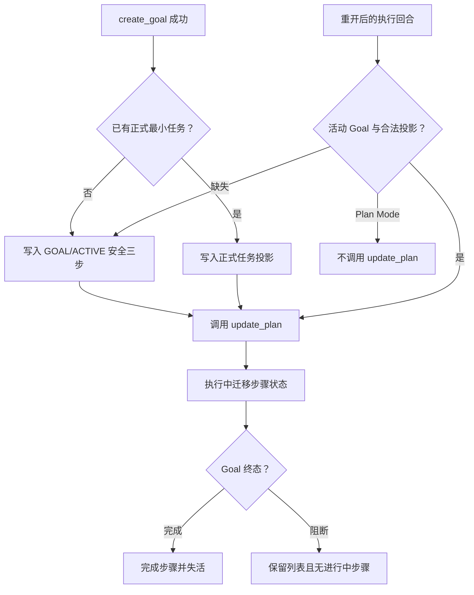
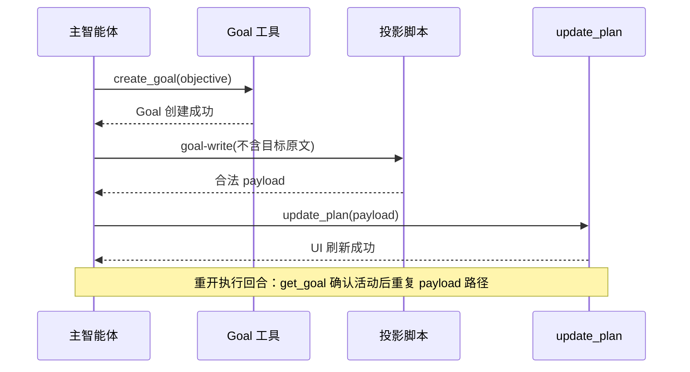

# Goal 模式任务悬浮窗进度可视化需求

结论：Goal 创建后可见任务悬浮窗；影响：用户可观察当前、上一步和下一步；范围：投影、规则、测试和验收；非范围：产品 UI；变化：默认三步可被正式任务替换；完成标准：创建、恢复与终态均可验证；术语说明：安全三步是固定的无原文列表；验证状态：需求已冻结，待实施验证。

## 文档信息

| 项目 | 内容 |
|---|---|
| 来源 | `SRC-GTP-001` 用户确认：Goal 模式也必须可观察进度、位置、上一步和下一步 |
| 当前优先闭环 | `SLICE-GTP-001` 成功创建活动 Goal 后出现安全三步悬浮窗 |
| 图片资产决策 | N/A。原因：能力由已有 Desktop 悬浮窗承载；证据：用户截图和 Mermaid 流程足以定义交互。 |

图片资产决策：N/A。原因：不新增视觉资源或产品 UI；证据：只调用已有 `update_plan` 工具。

## 来源与边界

| 来源 ID | 来源事实 | 冻结决策 |
|---|---|---|
| `SRC-GTP-001` | 用户在 Goal 模式难以判断进度、上一步和下一步 | 每个活动 Goal 必须拥有一份当前主会话的悬浮任务列表 |
| `SRC-GTP-002` | `create_goal` 同时只能存在一个未完成 Goal | 当前主会话只维护一个活动 Goal 投影，新 Goal 替换旧活动投影 |
| `SRC-GTP-003` | 无正式实施计划的 Goal 仍需立即可见 | 使用固定三步安全列表，后续由正式最小任务替换 |
| `SRC-GTP-004` | 现有投影不得保存 prompt、响应或原始用户输入 | Goal 投影不保存目标原文、线程 ID 或凭据 |

## 目标、非目标与功能需求

| 类型 | 内容 | 边界 ID |
|---|---|---|
| 目标 | Goal 创建成功后持久化并显示三步安全悬浮窗 | `BOUND-GTP-001` |
| 目标 | 正式实施计划可替换安全三步并持续迁移三态步骤 | `BOUND-GTP-002` |
| 目标 | Desktop 或宿主重开后的执行回合可检测活动 Goal 并重建 UI | `BOUND-GTP-003` |
| 目标 | Goal 完成失活投影；Goal 阻断保留无进行中步骤供用户观察 | `BOUND-GTP-004` |
| 非目标 | 修改 Desktop 产品代码、数据库或启动钩子 | `BOUND-GTP-005` |
| 非目标 | 在 Plan Mode 中调用 `update_plan`，或自动重放任何写操作 | `BOUND-GTP-006` |
| 非目标 | 同时保存或展示多个活动 Goal 的悬浮窗 | `BOUND-GTP-007` |

| 需求 ID | 需求 | 优先级 | 验收入口 |
|---|---|---|---|
| `REQ-GTP-001` | `create_goal` 成功后，主智能体生成并原子写入 `GOAL/ACTIVE` 三步投影，再真实调用 `update_plan` | P0 | `AC-GTP-001` |
| `REQ-GTP-002` | 安全三步固定为“确认当前闭环、执行并更新进度、验证并完成 Goal”，仅第一步为 `in_progress` | P0 | `AC-GTP-001` |
| `REQ-GTP-003` | 正式实施周期可按既有写入流程替换安全三步；状态始终先持久化、后刷新 UI | P0 | `AC-GTP-002` |
| `REQ-GTP-004` | 活动 Goal 的执行回合可恢复合法 Goal 投影；缺失时只生成安全三步；Plan Mode 明确退出 | P0 | `AC-GTP-003` |
| `REQ-GTP-005` | Goal 完成后投影失活；Goal 阻断后保留活动列表但无 `in_progress`；不得保存目标原文 | P1 | `AC-GTP-004`、`AC-GTP-005` |

## 端到端流程

图形目的：说明创建、替换、恢复和终态的唯一顺序；关联 ID：`REQ-GTP-001` 至 `REQ-GTP-005`。

图形目的：说明主会话的调用时序；关联 ID：`REQ-GTP-001`、`REQ-GTP-004`。

## 数据、安全、异常与追踪

- Goal 投影扩展为可识别 `projection_origin=goal` 与 `synthesis_mode=goal_default` 的版本化 schema；既有 `version: 2` persisted/synthesized 投影必须可读取并升级，不能被误判为 Goal。
- `goal` CLI 输入只接受活动状态与可选正式任务；拒绝目标文本、线程 ID、凭据、未知字段、超过 20 步和任何敏感字段；默认文案是固定常量。
- Goal 不活动、投影损坏、来源不一致或 `update_plan` 不可用时，保留原文件并停止 UI 成功宣称。阻断状态不自动恢复执行权。
- `create_goal` 失败时不写投影；`update_goal(complete)` 成功后再失活；`update_goal(blocked)` 成功后写入无进行中状态。

| 来源 | 决策 | 需求 | 验收 | 周期 | 任务 | 测试 |
|---|---|---|---|---|---|---|
| `SRC-GTP-001` | 安全三步即时可见 | `REQ-GTP-001/002` | `AC-GTP-001` | `CYCLE-GTP-01` | `TASK-GTP-01/02` | `TEST-GTP-001/002` |
| `SRC-GTP-002` | 正式任务替换默认任务 | `REQ-GTP-003` | `AC-GTP-002` | `CYCLE-GTP-02` | `TASK-GTP-03` | `TEST-GTP-003` |
| `SRC-GTP-003` | 重开后执行回合恢复 | `REQ-GTP-004` | `AC-GTP-003` | `CYCLE-GTP-02` | `TASK-GTP-04` | `TEST-GTP-004` |
| `SRC-GTP-004` | 终态与隐私保护 | `REQ-GTP-005` | `AC-GTP-004/005` | `CYCLE-GTP-03` | `TASK-GTP-05` | `TEST-GTP-005/006` |

## 完成、停止与最大推进边界

- 完成条件：需求、验收、实施文档 profile 通过；脚本及路由回归通过；Skill 合规和字典刷新通过；本机 Desktop 创建与重开验收通过。
- 停止条件：Goal 工具无法确认成功或活动状态、投影可能保存原始目标、普通投影被错误覆盖、Plan Mode 触发 UI，或任何测试破坏原有投影兼容性。
- 最大推进边界：仅修改 Skills 仓库的规则、投影脚本、测试、字典和项目记忆；不修改 Codex Desktop 产品代码。

## 决策冻结

| 决策 ID | 决策 | 依据 | 不允许的替代行为 |
|---|---|---|---|
| `DEC-GTP-001` | 默认使用固定三步，且不写入 Goal 原文 | `SRC-GTP-001/004` | 用用户目标文本充当悬浮窗文案 |
| `DEC-GTP-002` | 成功创建或确认恢复后，必须先落盘再调用 UI | `REQ-GTP-001/004` | 先调用 `update_plan` 后补写文件 |
| `DEC-GTP-003` | Plan Mode 只形成计划，不刷新任务悬浮窗 | `BOUND-GTP-006` | 把计划卡片当作 UI 投影 |

## 普通模型零决策执行契约

1. 收到 `create_goal` 成功结果后，仅向 `goal` 投影入口传入活动状态和可选正式任务，不传入目标原文。
2. 没有正式任务时，脚本只能生成三个固定步骤；存在正式任务时按既有 `write` 契约替换默认步骤。
3. 只有投影写入和 payload 均成功后才能调用 `update_plan`；工具失败时仅报告磁盘状态。
4. `update_goal(complete)` 成功后失活；`update_goal(blocked)` 成功后移除进行中状态；任何未知写操作均不重放。

## 业务规则与优先级

| 规则 ID | 规则 | 优先级 |
|---|---|---|
| `RULE-GTP-001` | 主会话每次最多一个活动 Goal 投影 | P0 |
| `RULE-GTP-002` | 默认三步的状态为 completed/pending/in_progress 三态，且至多一个进行中 | P0 |
| `RULE-GTP-003` | 正式实施任务优先于安全三步 | P0 |
| `RULE-GTP-004` | 无活动 Goal、Plan Mode、来源不一致和工具失败都不得声称 UI 已刷新 | P0 |

## 数据与外部契约

| 接口 | 输入 | 输出 | 拒绝条件 |
|---|---|---|---|
| `goal` 投影 CLI | 活动状态、可选合法任务 | v3 投影和 payload | 目标原文、未知字段、敏感字段 |
| `get_goal` | 无 | 活动/终态事实 | 不可确认时不恢复 |
| `update_plan` | 已验证 payload | Desktop 悬浮窗 | 工具失败时不报成功 |

## 风险、假设、依赖与阻断

| 风险 ID | 风险 | 处理 | 停止边界 |
|---|---|---|---|
| `RISK-GTP-001` | Goal 工具缺少活动状态 | 只保留现有文件，不刷新 UI | 不伪造恢复 |
| `RISK-GTP-002` | v2 投影兼容回归 | 迁移和读取回归覆盖 | 旧投影读写失败即停止 |
| `RISK-GTP-003` | Desktop 人工验收不可取得 | 输出受限结论 | 不宣称正式 UI 通过 |

## 追踪矩阵

结论：Goal 创建后可见任务悬浮窗；影响：用户可观察当前、上一步和下一步；范围：投影、规则、测试和验收；非范围：产品 UI；变化：默认三步可被正式任务替换；完成标准：创建、恢复与终态均可验证；术语说明：安全三步是固定的无原文列表；验证状态：需求已冻结，待实施验证。

术语说明：安全三步是未形成正式实施任务时的固定、无业务原文任务列表。验证状态：文档门禁修复后才进入代码实施。

## 决策冻结
| 决策 ID | 决策 | 依据 | 不允许的替代行为 |
|---|---|---|---|
| `DEC-GTP-001` | 默认三步不保存 Goal 原文 | `SRC-GTP-001/004` | 用用户目标文本作为文案 |
| `DEC-GTP-002` | 先落盘再调用 UI | `REQ-GTP-001/004` | 先 UI 后文件 |
| `DEC-GTP-003` | Plan Mode 不刷新 UI | `BOUND-GTP-006` | 把计划卡片当投影 |

## 普通模型零决策执行契约
1. `create_goal` 成功后仅传活动状态和可选正式任务，禁止传目标原文。
2. 无正式任务时只能生成三个固定步骤；有正式任务时按既有写入契约替换。
3. 写入和 payload 成功后才调用 `update_plan`；工具失败时仅报告磁盘状态。
4. `complete` 成功后失活；`blocked` 成功后移除进行中状态；未知写操作不重放。

## 业务规则与优先级
| 规则 ID | 规则 | 优先级 |
|---|---|---|
| `RULE-GTP-001` | 主会话最多一个活动 Goal 投影 | P0 |
| `RULE-GTP-002` | 至多一个进行中步骤 | P0 |
| `RULE-GTP-003` | 正式任务优先默认三步 | P0 |
| `RULE-GTP-004` | Plan Mode 和失败路径不得报 UI 成功 | P0 |

## 数据与外部契约
| 接口 | 输入 | 输出 | 拒绝条件 |
|---|---|---|---|
| goal 投影 CLI | 活动状态和可选任务 | v3 投影及 payload | 原文、未知或敏感字段 |
| get_goal | 无 | 活动/终态事实 | 不可确认不恢复 |
| update_plan | 已验证 payload | 悬浮窗 | 失败不报成功 |

## 风险、假设、依赖与阻断
| 风险 ID | 风险 | 处理 | 停止边界 |
|---|---|---|---|
| `RISK-GTP-001` | 工具缺少活动状态 | 保留文件 | 不刷新 UI |
| `RISK-GTP-002` | v2 兼容回归 | 回归测试 | 读取失败即停止 |
| `RISK-GTP-003` | 无 Desktop 人工证据 | 受限结论 | 不报正式通过 |

## 追踪契约
每一个 `TASK-GTP-*` 必须关联实现、测试、审查和验收四类 `EVD-*` 证据，缺少任一类即停止推进。

## 追踪矩阵
| 任务 | 实现证据 | 测试证据 | 审查证据 | 验收证据 |
|---|---|---|---|---|
| `TASK-GTP-01` | `EVD-TASK-GTP-01-IMPL` | `EVD-TASK-GTP-01-TEST` | `EVD-TASK-GTP-01-REVIEW` | `EVD-TASK-GTP-01-ACCEPT` |
| `TASK-GTP-02` | `EVD-TASK-GTP-02-IMPL` | `EVD-TASK-GTP-02-TEST` | `EVD-TASK-GTP-02-REVIEW` | `EVD-TASK-GTP-02-ACCEPT` |
| `TASK-GTP-03` | `EVD-TASK-GTP-03-IMPL` | `EVD-TASK-GTP-03-TEST` | `EVD-TASK-GTP-03-REVIEW` | `EVD-TASK-GTP-03-ACCEPT` |
| `TASK-GTP-04` | `EVD-TASK-GTP-04-IMPL` | `EVD-TASK-GTP-04-TEST` | `EVD-TASK-GTP-04-REVIEW` | `EVD-TASK-GTP-04-ACCEPT` |
| `TASK-GTP-05` | `EVD-TASK-GTP-05-IMPL` | `EVD-TASK-GTP-05-TEST` | `EVD-TASK-GTP-05-REVIEW` | `EVD-TASK-GTP-05-ACCEPT` |

## 需求来源与证据台账
见前述来源表。

## 目标与非目标
见前述边界表。

## 功能需求
见前述需求表。

## 决策冻结
`DEC-GTP-001`：默认三步不保存原文；`DEC-GTP-002`：先落盘后 UI；`DEC-GTP-003`：Plan Mode 不刷新。

## 普通模型零决策执行契约
创建成功后只传活动状态；无正式任务时只能生成固定三步；写入成功后才调用 UI；终态变化不重放写操作。

## 追踪契约
每个 `TASK-GTP-*` 必须有 `IMPL`、`TEST`、`REVIEW`、`ACCEPT` 证据。
