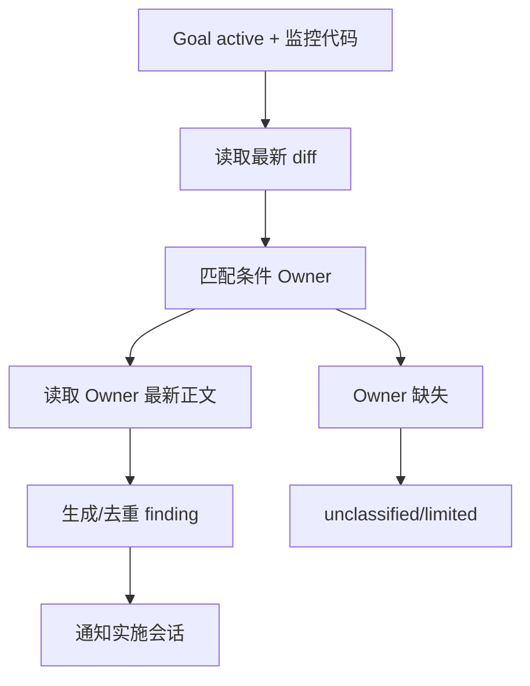
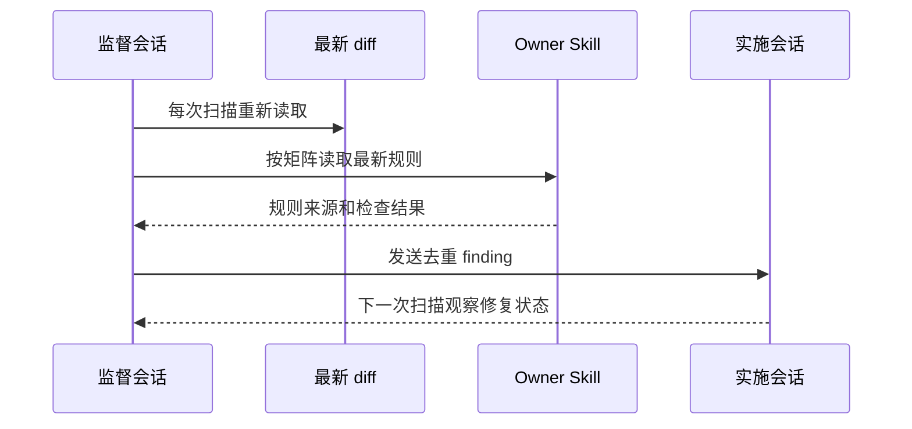

# 持续代码质量监督 Skill 需求

结论：新增一个只在 Goal active 且用户明确表达“监控代码”时进入的监督 Skill；影响：独立 Goal 会话可以周期性读取最新 diff、调用既有代码规则并通知实施会话；范围：触发、路由、状态、finding 和测试；非范围：自动改码、测试执行、阶段审查、提交和交付；变化：新增一个规则编排层；完成标准：矩阵和脚本回归通过；术语说明：Owner 是实际规则 Skill，finding 是可去重的质量问题记录；验证状态：需求已冻结。

## 文档信息

| 项目 | 内容 |
|---|---|
| 来源 | `SRC-CCQS-001`：用户要求复核持续代码质量监督 Skill 的引用矩阵 |
| 当前优先闭环 | `SLICE-CCQS-001`：允许/排除列表、状态脚本、Owner 路由和 finding 契约 |
| 数据边界 | 不保存代码正文、Goal 原文、提示词、响应、凭据或完整用户输入 |
| 图片资产 | N/A。原因：本需求是规则和脚本资产；证据：状态与路由契约即可验证。 |

## 需求来源与证据台账

| 来源 ID | 来源事实 | 冻结决策 |
|---|---|---|
| `SRC-CCQS-001` | 需要在 Goal 会话中持续观察代码质量 | 仅 Goal active 且消息含“监控代码”意图时触发 |
| `SRC-CCQS-002` | 既有代码规则已经分散在多个 Skill | 监督 Skill 只保存链接、条件和顺序，不复制正文 |
| `SRC-CCQS-003` | 阶段审查和测试执行有独立职责 | 监督 Skill 必须完整排除这些 Owner |
| `SRC-CCQS-004` | Owner 文件可能缺失或改名 | 生成 `unclassified/limited` finding，不猜测规则 |

## 目标与非目标

| 类型 | 内容 | 边界 ID |
|---|---|---|
| 目标 | 周期性基于最新 diff 选择适用 Owner | `BOUND-CCQS-001` |
| 目标 | 记录带 Owner、证据、位置、级别和指纹的 finding | `BOUND-CCQS-002` |
| 目标 | 向实际实施任务发送结构化通知 | `BOUND-CCQS-003` |
| 非目标 | 自动修改、格式化、测试或提交代码 | `BOUND-CCQS-004` |
| 非目标 | 调用阶段审查、最终验收、Git 和元流程 Skill | `BOUND-CCQS-005` |

## 功能需求

| 需求 ID | 需求 | 优先级 | 验收 |
|---|---|---|---|
| `REQ-CCQS-001` | 仅当 Goal active 且当前消息有“监控代码”意图时激活 | P0 | `AC-CCQS-001` |
| `REQ-CCQS-002` | 每次扫描重新读取最新 diff，并按条件路由 Owner | P0 | `AC-CCQS-002` |
| `REQ-CCQS-003` | API 改动同时命中 endpoint/request/response/swagger，未命中不误触发 | P0 | `AC-CCQS-003` |
| `REQ-CCQS-004` | Schema 路由先于 Query；测试程序只做静态检查 | P1 | `AC-CCQS-004` |
| `REQ-CCQS-005` | 缺失 Owner 生成 limited finding，禁止继续猜测 | P0 | `AC-CCQS-005` |

## 数据与外部契约

| 契约 | 输入 | 输出 | 拒绝条件 |
|---|---|---|---|
| 监督触发 | Goal active、当前消息意图 | active 或退出 | 单条件、Plan Mode、Goal inactive |
| Owner 路由 | 最新 diff、Owner 名称 | 有序 Owner 列表 | 名称不一致或来源不可读 |
| finding 通知 | finding 元数据 | 实施会话通知 | 敏感原文、凭据或无法验证的通知 |

## 风险、假设、依赖与阻断

Goal 状态依赖宿主事实，无法确认时阻断启动；Owner 文件依赖当前工作树，缺失时 limited；通知依赖实施会话可达，无法确认时保留待通知状态；状态文件依赖本地可写目录，失败时保持原文件。

## 端到端流程

图形目的：说明 Goal 触发、增量扫描、Owner 路由和通知边界；关联 ID：`REQ-CCQS-001` 至 `REQ-CCQS-005`。

图形目的：说明监督会话与实施会话的通知时序；关联 ID：`REQ-CCQS-002`、`REQ-CCQS-005`。

## 数据与安全要求

- 状态文件只保存 checkout 摘要、Goal 活跃标记、监督状态、Owner 注册、扫描摘要和去重 finding 元数据。
- finding 必须包含 `owner_skill`、规则来源、文件位置、证据、严重级别、状态和去重指纹。
- 通知只发送结构化 finding 和修复位置，不发送提示词、响应、凭据或不必要的代码正文。
- 监督任务不执行测试命令；它只把测试程序结构问题路由到 `test-program-rules`。

## 追踪矩阵

| 来源 | 需求 | 规则 | 验收 | 周期 | 任务 | 测试 |
|---|---|---|---|---|---|---|
| `SRC-CCQS-001` | `REQ-CCQS-001` | `RULE-CCQS-001` | `AC-CCQS-001` | `CYCLE-CCQS-01` | `TASK-CCQS-01` | `TEST-CCQS-001` |
| `SRC-CCQS-002` | `REQ-CCQS-002/003` | `RULE-CCQS-002` | `AC-CCQS-002/003` | `CYCLE-CCQS-02` | `TASK-CCQS-02/03` | `TEST-CCQS-002/003` |
| `SRC-CCQS-003` | `REQ-CCQS-004` | `RULE-CCQS-003` | `AC-CCQS-004` | `CYCLE-CCQS-02` | `TASK-CCQS-03` | `TEST-CCQS-004` |
| `SRC-CCQS-004` | `REQ-CCQS-005` | `RULE-CCQS-004` | `AC-CCQS-005` | `CYCLE-CCQS-03` | `TASK-CCQS-04` | `TEST-CCQS-005` |

## 决策冻结

| 决策 ID | 决策 | 依据 | 不允许的替代行为 |
|---|---|---|---|
| `DEC-CCQS-001` | 触发条件是 Goal active 与“监控代码”双条件 | `SRC-CCQS-001` | 普通代码改动自动启动监督 Goal |
| `DEC-CCQS-002` | Owner 正文由现有 Skill 提供 | `SRC-CCQS-002` | 在监督 Skill 复制规则正文 |
| `DEC-CCQS-003` | 缺失 Owner 只产生 limited finding | `SRC-CCQS-004` | 自行创造新规范或假装规则已读取 |

## 普通模型零决策执行契约

1. 先确认 Goal active 和当前用户消息的“监控代码”意图，任一不满足即退出。
2. 每次扫描重新读取最新 diff 和 Owner 文件；不使用监督 Skill 中的规则副本。
3. 只记录结构化 finding 并通知实施会话，不执行改码、测试和提交。
4. 缺少 Owner 或来源不可读时写 `unclassified/limited` 并停止该 Owner 路由。

## 追踪契约

每个 `REQ-CCQS-*` 必须关联规则、验收、周期、任务和测试 ID；缺少任一映射时不得进入实现收口。

## 风险、假设与阻断

| 风险 | 处理 | 停止条件 |
|---|---|---|
| Owner 文件被删除或重命名 | 输出 limited finding | 不继续推断规则 |
| 扫描间隔重复产生同一问题 | 使用去重指纹 | 状态损坏时停止写入 |
| Goal 状态无法确认 | 不激活监督 | 不伪造 Goal active |
| 通知目标不可达 | 保留待通知状态 | 不宣称已通知 |

## 完成、停止与最大推进边界

- 完成标准：允许/排除矩阵完整，状态脚本和单元测试通过，Skill quick validate 通过，字典已刷新，工程文档校验通过。
- 停止条件：Goal 状态不明、Owner 不能读取、状态文件敏感字段校验失败、通知不可验证或任一排除项被调用。
- 最大推进边界：只修改本 Skill、其文档、测试和字典生成结果；不修改业务代码、不提交 Git。

图片资产决策：N/A。原因：不新增视觉资源；证据：流程图和契约表足以定义本需求。
