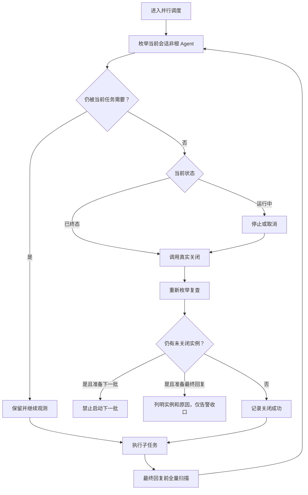
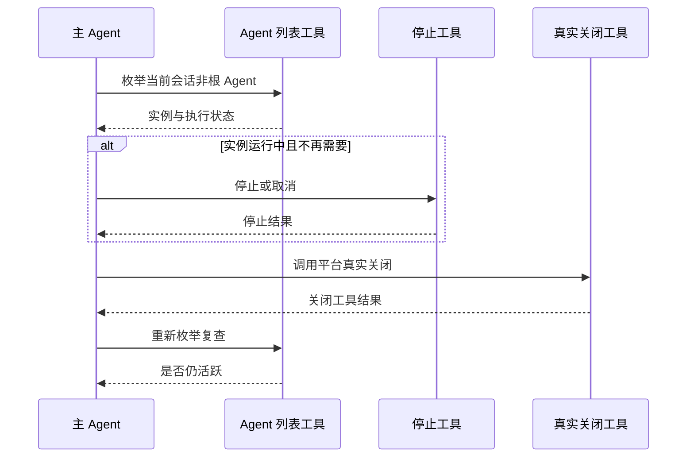

# 子 Agent 遗留实例终局清理需求

结论：进入并行调度前和最终回复前都必须检查当前会话的非根 Agent；影响：已完成、失败、取消或被遗忘的实例不再被误报为已关闭；范围：生命周期规则、提示词、契约测试、字典和项目记忆；非范围：Codex Desktop 产品代码、其他会话、根 Agent 和固定超时；变化：增加进入前预检、批次回收和终局扫描；完成标准：关闭成功必须有真实工具结果且复查不再活跃，无关闭能力时必须准确告警；术语说明：终局扫描是最终回复前对当前会话非根 Agent 的全量复查；验证状态：需求已冻结，待按实施周期执行。

## 文档信息

| 项目 | 内容 |
| --- | --- |
| 来源对象 | REQ-SUBAGENT-CLEANUP-20260725-001 |
| 来源证据 | SRC-SAC-001：用户确认的实施计划与当前会话遗留实例 |
| 当前优先闭环 | SLICE-SAC-001：双扫描、真实关闭复查与数量对账 |
| 验收标准 | [子 Agent 遗留实例终局清理验收标准](../7-验收/2026-07-25_142508_子Agent遗留实例终局清理_验收标准.md) |
| 图片资产决策 | N/A。原因：本需求是运行规则与状态契约；证据：Mermaid 可完整表达生命周期。 |

图片资产决策：N/A。原因：不新增 UI 或视觉资源；证据：当前问题只需要平台 Agent 状态和工具结果。

## 需求来源与证据台账

| 来源 ID | 已确认事实 | 冻结结论 |
| --- | --- | --- |
| SRC-SAC-001 | 用户要求实施已确认的终局清理计划 | 继续由 parallel-task-dispatch-rules 唯一负责 |
| SRC-SAC-002 | 当前平台可枚举和中断 Agent，未暴露真实关闭工具 | interrupt_agent 不计作关闭 |
| SRC-SAC-003 | 已完成的审计子 Agent 仍在当前会话列表可见 | 无关闭能力时只告警，不伪报成功 |

## 目标与非目标

| 类型 | 内容 | 边界 ID |
| --- | --- | --- |
| 目标 | 调度前枚举当前会话全部非根 Agent | BOUND-SAC-001 |
| 目标 | 每批结束后回收并复查，未释放时禁止下一批 | BOUND-SAC-002 |
| 目标 | 最终回复前全量扫描并列出未关闭原因 | BOUND-SAC-003 |
| 非目标 | 修改 Desktop 产品代码或自行创造关闭工具 | BOUND-SAC-004 |
| 非目标 | 扫描其他会话、全局任务或根 Agent | BOUND-SAC-005 |
| 非目标 | 以固定分钟数作为唯一回收判定 | BOUND-SAC-006 |

## 功能需求

| 需求 ID | 需求 | 优先级 | 验收入口 |
| --- | --- | --- | --- |
| REQ-SAC-001 | 进入并行调度前真实枚举当前会话非根 Agent | P0 | AC-SAC-001 |
| REQ-SAC-002 | 保留仍被当前任务需要的 Agent，回收不再需要的实例 | P0 | AC-SAC-001/002 |
| REQ-SAC-003 | 运行实例先停止或取消再真实关闭，终态实例直接真实关闭 | P0 | AC-SAC-002/003 |
| REQ-SAC-004 | 只有关闭工具成功且复查不再活跃才增加关闭数 | P0 | AC-SAC-003/004 |
| REQ-SAC-005 | 任一未回收实例禁止启动下一批 | P0 | AC-SAC-005 |
| REQ-SAC-006 | 最终回复前全量扫描；无法关闭时仅告警收口 | P0 | AC-SAC-005/006 |
| REQ-SAC-007 | 保留旧数量字段，新增终态、扫描、活跃、未关闭和告警字段 | P1 | AC-SAC-004/006 |

## 端到端流程

图形目的：冻结进入、执行、回收和终局清扫的完整分支；关联 ID：RULE-SAC-001、AC-SAC-001..006。

图形目的：说明列表、停止、关闭和复查的调用顺序；关联 ID：REQ-SAC-001..006。

## 业务规则与优先级

| 规则 ID | 规则 | 优先级 |
| --- | --- | --- |
| RULE-SAC-001 | 进入前预检、批次回收、终局扫描共用同一生命周期台账 | P0 |
| RULE-SAC-002 | interrupt_agent、停止采样和完成通知都不等于关闭 | P0 |
| RULE-SAC-003 | 关闭数只计真实关闭且复查不再活跃的实例 | P0 |
| RULE-SAC-004 | 未关闭实例阻止下一批，最终收口只产生准确告警 | P0 |
| RULE-SAC-005 | 清理范围仅为当前会话非根 Agent | P0 |

## 数据与外部契约

| 类型 | 必填字段 | 成功判定 |
| --- | --- | --- |
| 数量汇总 | 计划线程数、实际启动数、完成数、终态数、关闭数、终局扫描数、仍活跃数、未关闭数 | 所有数量都能由实例台账重算 |
| 实例记录 | agent_id、逻辑名、平台昵称、扫描阶段、执行终态、关闭动作、关闭工具结果、复查结果 | 记录不依赖推测或口头结论 |
| 告警 | 回退原因、告警原因、未关闭实例 | 无关闭工具或复查仍活跃时必须非空 |

## 风险、假设、依赖与阻断

| 风险 ID | 风险 | 处理 | 停止边界 |
| --- | --- | --- | --- |
| RISK-SAC-001 | 平台只有中断而无真实关闭 | 关闭数为 0，记录未关闭实例和告警 | 不得宣称全部已关闭 |
| RISK-SAC-002 | 平台列表无法限定当前会话 | 停止清理并记录环境阻断 | 不扩大到其他会话 |
| RISK-SAC-003 | 工作树存在用户改动 | 只修改冻结目标文件 | 冲突无法安全合并时停止 |

## 决策冻结

| 决策 ID | 决策 | 依据 | 禁止的替代行为 |
| --- | --- | --- | --- |
| DEC-SAC-001 | 不新增竞争 Skill | SRC-SAC-001 | 建立第二个子 Agent 生命周期 Owner |
| DEC-SAC-002 | 清理当前会话全部非根 Agent | BOUND-SAC-001/005 | 扫描其他会话或关闭根 Agent |
| DEC-SAC-003 | 未关闭时最终仅告警 | RULE-SAC-004 | 伪报关闭成功或阻塞已完成主体任务 |

## 普通模型零决策执行契约

1. 调用平台列表工具，保留根 Agent 和仍被当前任务需要的实例。
2. 不再需要的运行实例先停止或取消；所有不再需要的实例只调用平台真实关闭能力。
3. 关闭后再次枚举；只有关闭结果成功且复查不再活跃才计入关闭数。
4. 未关闭数大于零时不启动下一批；最终回复前重复扫描，仍无法关闭时输出实例级告警。
5. 平台没有真实关闭工具时，不调用 interrupt_agent 冒充关闭，也不增加关闭数。

## 追踪矩阵

| 来源 | 决策 | 需求/规则 | 验收 | 周期 | 任务 | 测试 | 证据 |
| --- | --- | --- | --- | --- | --- | --- | --- |
| SRC-SAC-001 | DEC-SAC-001/002 | REQ-SAC-001/002、RULE-SAC-001/005 | AC-SAC-001/002 | CYCLE-SAC-01 | TASK-SAC-01/02 | TEST-SAC-001/002 | EVD-SAC-001 |
| SRC-SAC-002 | DEC-SAC-003 | REQ-SAC-003/004、RULE-SAC-002/003 | AC-SAC-003/004 | CYCLE-SAC-01 | TASK-SAC-02/03 | TEST-SAC-003/004 | EVD-SAC-002 |
| SRC-SAC-003 | DEC-SAC-003 | REQ-SAC-005/006/007、RULE-SAC-004 | AC-SAC-005/006 | CYCLE-SAC-01 | TASK-SAC-03/04 | TEST-SAC-005..008 | EVD-SAC-003 |

## 追踪契约

- 每个 SRC 必须至少连接一个 DEC、REQ 或 RULE；每个 REQ/RULE 必须连接一个 AC。
- 每个 AC 必须连接 CYCLE、TASK、文件/符号、TEST 和 EVD；任何孤立 ID 都阻断交付。
- 实施结果改变来源、决策、范围、关闭判定或告警策略时，必须先回开本需求与验收标准，再更新实施文档。
