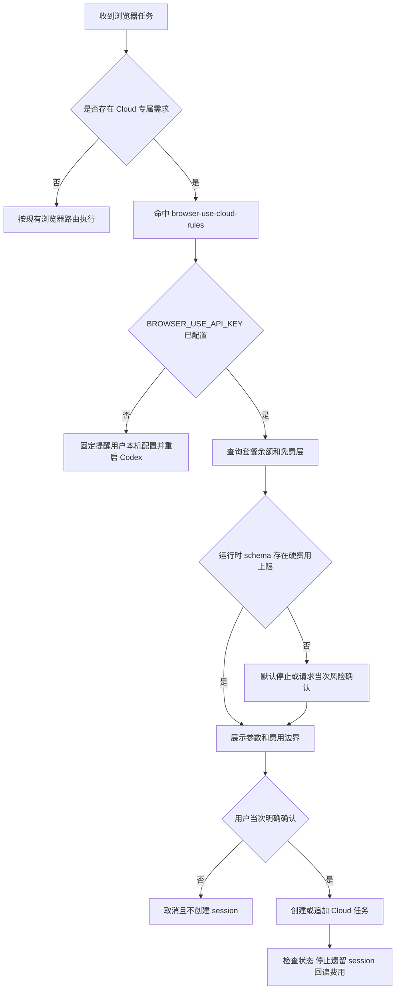
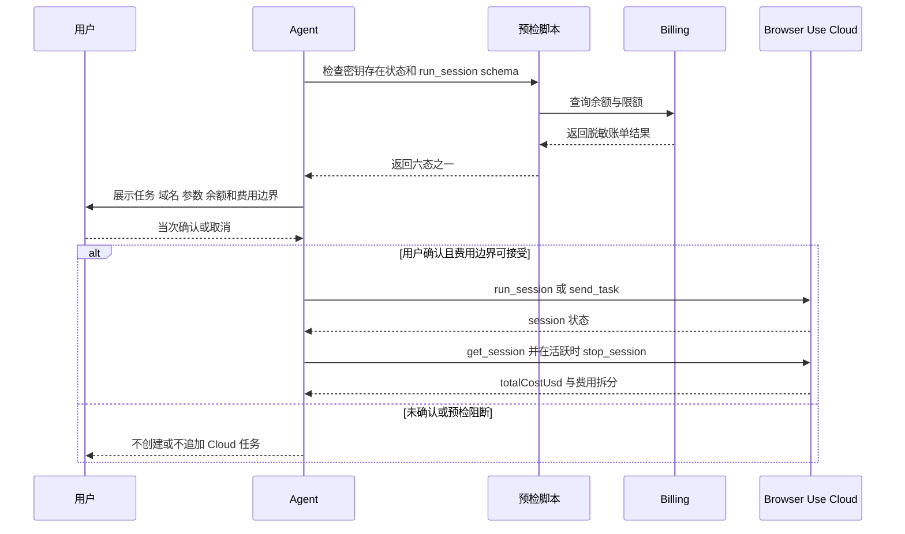

# Browser Use Cloud 浏览器 Skill 升级需求

结论：新增独立的 `browser-use-cloud-rules`，只接入 Browser Use Cloud；影响：以后只有云端自主长链、托管并发、地域代理、隐身或合规验证码等 Cloud 专属场景才使用它；范围：Cloud Skill、预检脚本、统一路由、逐次费用确认、session 收口和回归证据；非范围：本地开源 Browser Use、替换现有浏览器工具、真实收费测试、真实凭据配置和 Git 历史写入；变化：每次 `run_session`、`send_task` 前均检查密钥、账单和硬费用上限，并取得用户当次明确确认；完成标准：密钥、账单、费用上限、路由、session 清理及无泄密回归全部通过；术语说明：硬费用上限是单次 Cloud 任务允许消费的最大美元金额；验证状态：用户已确认 `1A/2A` 并授权实施，当前需求决策已冻结。

## 文档信息

| 项目 | 内容 |
|---|---|
| 来源对象 | `REQ-BU-20260726-001` |
| 当前优先闭环 | `SLICE-BU-001`：先建立安全 Cloud 路由，再开放执行能力 |
| 完整性等级 | L3。原因：涉及 Cloud 计费、密钥、MCP schema、用户确认和 session 生命周期；证据：`REQ-BU-001..012` |
| 图片资产决策 | N/A。原因：没有 UI 或视觉产物；证据：流程、时序和状态均由 Mermaid 表达 |

图片资产决策：N/A + 原因：本需求不交付位图 + 证据：所有关系可由 Mermaid 和表格完整表达。

## 需求来源与证据台账

| 来源 ID | 来源事实 | 冻结结论 |
|---|---|---|
| `SRC-BU-001` | 用户选择 `1A` | 仅接入 Browser Use Cloud，不接本地开源版本 |
| `SRC-BU-002` | 用户选择 `2A` | 每次 `run_session`、`send_task` 前均取得当次明确确认 |
| `SRC-BU-003` | Browser Use Cloud 与 REST Session API 的能力边界不同 | 运行前检查真实 MCP schema；没有硬上限时默认停止 |

## 目标与非目标

| 类型 | 内容 | 边界 ID |
|---|---|---|
| 目标 | 新增 Cloud 专用 Skill、预检脚本和 local mock 测试 | `BOUND-BU-001` |
| 目标 | 统一路由并保护真实 Chrome、DevTools 和本地 agent-browser | `BOUND-BU-002` |
| 目标 | 固化密钥、账单、费用、profile、录制、保活和 session 收口 | `BOUND-BU-003` |
| 非目标 | 安装或接入本地 Browser Use | `BOUND-BU-004` |
| 非目标 | 配置、保存、输出或提交真实 API key | `BOUND-BU-005` |
| 非目标 | 创建真实 Cloud session、消费额度或连接非 local 测试目标 | `BOUND-BU-006` |
| 非目标 | 上传 Cookie、本地 Chrome profile、密码或登录状态 | `BOUND-BU-007` |

## 功能需求

| 需求 ID | 需求 | 优先级 | 验收入口 |
|---|---|---:|---|
| `REQ-BU-001` | 新增 `browser-use-cloud-rules` 作为 Cloud 执行、安全、费用和生命周期唯一 Owner | P0 | `AC-BU-001` |
| `REQ-BU-002` | Cloud 只命中云端自主长链、托管并发、地域代理、隐身或合规验证码等专属场景 | P0 | `AC-BU-002` |
| `REQ-BU-003` | 密钥只从 `BROWSER_USE_API_KEY` 读取，缺失时输出固定提醒且不回显原值 | P0 | `AC-BU-003` |
| `REQ-BU-004` | 查询 Billing API；认证、账户、余额、响应或超时不明确时失败关闭 | P0 | `AC-BU-004` |
| `REQ-BU-005` | 检查真实 `run_session` schema 是否支持 `maxCostUsd` 或等价硬上限 | P0 | `AC-BU-005` |
| `REQ-BU-006` | 没有硬上限时默认停止；仅用户当次明确接受风险后允许继续 | P0 | `AC-BU-006` |
| `REQ-BU-007` | 每次 `run_session`、`send_task` 均单独展示参数与费用边界并确认 | P0 | `AC-BU-007` |
| `REQ-BU-008` | 默认 `keep_alive=false`，不使用 Cloud profile，不上传 Cookie | P0 | `AC-BU-008` |
| `REQ-BU-009` | 成功、失败或取消后检查 session，仍活跃则停止并读取实际费用 | P0 | `AC-BU-009` |
| `REQ-BU-010` | 费用确认只授权 Cloud 消费，不授权提交、购买、发布或发消息 | P0 | `AC-BU-010` |
| `REQ-BU-011` | 提供只含环境变量引用和逐工具 prompt 审批的 MCP 配置模板 | P1 | `AC-BU-011` |
| `REQ-BU-012` | 测试只使用 local mock，不调用真实 Cloud、不消费额度 | P0 | `AC-BU-012` |

## 业务规则与优先级

- `RULE-BU-ROUTE-001`：`mcp-installation-rules/references/tool-priority.md` 是唯一浏览器路由矩阵；新 Skill 不复制竞争矩阵。
- `RULE-BU-COST-001`：任何可能计费的 `run_session`、`send_task` 都需要用户当次明确确认，免费层也不例外。
- `RULE-BU-SECRET-001`：只报告密钥存在或缺失；stdout、stderr、异常、fixture、仓库和项目记忆不得出现原值。
- `RULE-BU-BILLING-001`：401、403、账户不存在、余额不明、响应损坏和超时全部失败关闭。
- `RULE-BU-CAP-001`：发现等价硬上限时必须设置；没有硬上限则状态为 `blocked_hard_cap_unavailable`。
- `RULE-BU-SESSION-001`：默认 `keep_alive=false`；结束时检查并停止遗留 session，再读取 `totalCostUsd` 和可用费用拆分。
- `RULE-BU-PROFILE-001`：默认不用 Cloud profile，不上传 Cookie、localStorage、密码或本地 Chrome 登录状态。
- `RULE-BU-SAFETY-001`：Cloud 不得用于绕过权限、安全策略、真实 Chrome 连接失败或目标站点限制。

## 数据与外部契约

| 契约 | 固定值 | 失败处理 |
|---|---|---|
| MCP URL | `https://api.browser-use.com/v3/mcp` | 配置说明只引用，不在测试中连接 |
| 鉴权环境变量 | `BROWSER_USE_API_KEY` | 缺失为 `blocked_key_missing` |
| Billing | 官方账户 billing endpoint；测试允许 local mock URL | 非成功、超时或响应损坏为 `blocked_auth`/`blocked_billing` |
| 硬上限字段 | `maxCostUsd` 或运行时 schema 明确的等价字段 | 不存在为 `blocked_hard_cap_unavailable` |
| 允许状态 | `ready_for_confirmation`、`blocked_key_missing`、`blocked_auth`、`blocked_billing`、`blocked_no_credit`、`blocked_hard_cap_unavailable` | 其它状态为实现错误 |

## 风险、假设、依赖与阻断

| 项目 | 结论 | 处理 |
|---|---|---|
| Cloud 定价变化 | 免费层和余额可能变化 | 每次运行前查询，不宣传永久免费 |
| MCP schema 差异 | Cloud MCP 可能没有 REST 的硬上限字段 | 运行时检查，缺失默认停止 |
| 数据隐私 | Cloud profile 和模型输入输出不是天然零留存 | 默认无 profile、无 Cookie，并明确参数 |
| 真实收费 | 本轮禁止任何真实 Cloud 调用 | 测试使用 local mock |
| 工作树脏改动 | 存在其它任务未提交改动 | 只做窄范围增量，不重置、不覆盖、不提交 |

## 流程图

图形目的：展示 Cloud 路由、预检和费用确认主链路；关联 ID：`RULE-BU-ROUTE-001`、`RULE-BU-COST-001`。

## 时序图

图形目的：冻结每次收费动作前后的交互顺序；关联 ID：`REQ-BU-003..010`。

## 追踪矩阵

| 来源 | 决策 | 需求/规则 | 验收 | 实施承接 |
|---|---|---|---|---|
| `SRC-BU-001` | `DEC-BU-001` 只接 Cloud | `REQ-BU-001/002`、`RULE-BU-ROUTE-001` | `AC-BU-001/002` | `CYCLE-BU-02/03` |
| `SRC-BU-002` | `DEC-BU-002` 逐次确认 | `REQ-BU-007/010`、`RULE-BU-COST-001` | `AC-BU-007/010` | `CYCLE-BU-02` |
| `SRC-BU-003` | `DEC-BU-003` schema 运行时检查 | `REQ-BU-004..006`、`RULE-BU-CAP-001` | `AC-BU-004..006` | `CYCLE-BU-02` |
| `SRC-BU-003` | `DEC-BU-004` 默认无 profile 且 session 必须收口 | `REQ-BU-008/009` | `AC-BU-008/009` | `CYCLE-BU-02/03` |

## 决策冻结

- `DEC-BU-001`：只接 Browser Use Cloud，不接本地开源 Browser Use。
- `DEC-BU-002`：每次 `run_session` 和 `send_task` 都需要新的当次明确确认，不能复用上次授权。
- `DEC-BU-003`：真实使用前检查 MCP schema；没有硬费用上限时默认停止。
- `DEC-BU-004`：Cloud 只作为专属后端，不替换 Chrome Plugin、应用内 Browser、Chrome DevTools MCP 或两个 agent-browser Skill。
- `DEC-BU-005`：不宣传配置 key 后永久免费；免费层与余额以当次 Billing 结果为准。
- `unresolved_decisions`：零个 P0/P1 未决项。

## 垂直切片与追踪契约

| 切片 | 输入 | 输出 | 完成标准 |
|---|---|---|---|
| `SLICE-BU-001` | 已冻结路由与收费策略 | Cloud Owner、预检、测试和路由增量 | 全部 `AC-BU-*` 有 `TASK/TEST/EVIDENCE` 承接 |

### 最小任务承接

| 任务 ID | 承接需求 / 规则 | 主要产出 |
|---|---|---|
| `TASK-BU-01` | `REQ-BU-001..012`、全部冻结决策 | 需求、验收标准、实施总览和全量顺序方案 |
| `TASK-BU-02` | `RULE-BU-ROUTE-001`、`RULE-BU-COST-001` | `CYCLE-BU-01..04` 四份实施周期文档 |
| `TASK-BU-03` | `REQ-BU-001/003..011` | Cloud Owner Skill、预检脚本和安全参考 |
| `TASK-BU-04` | `REQ-BU-003..009/012` | local mock 单元测试、Skill 校验和无泄密扫描 |
| `TASK-BU-05` | `REQ-BU-002/010/011` | MCP 安装域、唯一工具矩阵和 URL 路由接入 |
| `TASK-BU-06` | `REQ-BU-002/008..010` | 两个浏览器 Skill、团队路由和失败分类边界更新 |
| `TASK-BU-07` | `RULE-BU-ROUTE-001` | Skill 字典生成产物刷新 |
| `TASK-BU-08` | `REQ-BU-001..012` | 项目说明、设计文档和项目记忆三文件更新 |
| `TASK-BU-09` | `AC-BU-001..012` | 测试、实现审查、当前改动总审查和最终验收文档 |

### 测试与证据承接

| 测试 ID | 覆盖范围 | 通过证据 |
|---|---|---|
| `TEST-BU-001` | key 缺失、401/403、账单异常、余额不足和响应损坏 | `EVIDENCE-BU-TEST-001` |
| `TEST-BU-002` | 硬费用上限 schema、六态输出和脱敏 | `EVIDENCE-BU-TEST-001` |
| `TEST-BU-003` | Cloud 正负触发、既有浏览器路由不回归 | `EVIDENCE-BU-TEST-001` |
| `TEST-BU-004` | 文档 strict、Skill quick validate、字典一致性 | `EVIDENCE-BU-ACCEPT-001` |

| 证据 ID | 证据类别 | 预定落点 |
|---|---|---|
| `EVIDENCE-BU-IMPL-001` | 实现证据 | Skill、脚本、参考和路由 diff |
| `EVIDENCE-BU-TEST-001` | 测试证据 | `doc/5-tests/` 同一测试任务根目录 |
| `EVIDENCE-BU-REVIEW-001` | 审查证据 | `doc/6-审查/` 实现审查与当前改动总审查 |
| `EVIDENCE-BU-ACCEPT-001` | 验收证据 | `doc/7-验收/` 最终验收文档 |

## 普通模型零决策执行契约

- 执行模型不得接入本地 Browser Use、配置真实 key、调用真实 Cloud 或消费额度。
- 执行模型不得把免费层描述为永久免费，不得在没有当次确认时调用 `run_session` 或 `send_task`。
- 执行模型不得在无硬上限、账单不明或认证失败时自动继续。
- 执行模型不得上传 Cookie、密码、本地 profile 或登录状态，也不得用 Cloud 绕过权限和安全策略。
- 执行模型必须按周期和最小任务逐个完成实现、真实测试或合规免测、审查、验收。
