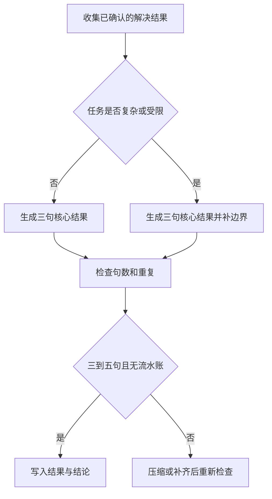
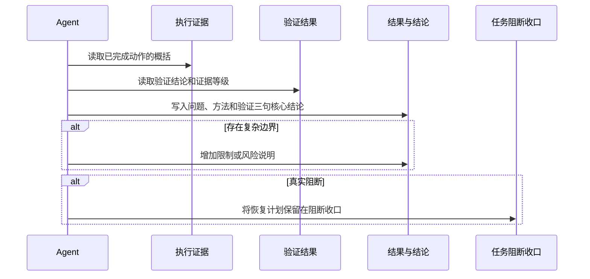

# reasoning-summary-structure-rules「结果与结论」适中详细度调整需求

结论：把最终总结中的“结果与结论”固定为自适应 3–5 句的适中详细表达；影响：读者能同时看到解决事项、采用方法和验证状态，不再只看到“已完成”或一整段执行流水；范围：结果区的句数、信息覆盖、复杂任务边界说明、正反例和回归判定；非范围：不改变总结章节顺序、图形化总览、阻断收口、Obsidian 规则或其他 Skill；变化：简单任务默认 3 句，复杂或受限任务按需要扩展到 4–5 句；完成标准：过短、适中、冗长和重复四类样例均有确定判定，且与现有总结结构兼容；术语说明：结果区是最终总结中集中说明本轮解决什么、怎样解决以及验证到什么程度的部分；验证状态：需求口径已冻结，后续规则实现、专项回归和最终验收均已按本需求执行。

## 文档信息

| 项目 | 内容 |
|---|---|
| 来源对象 | `SRC-SUMMARY-DETAIL-001` 用户对“结果与结论”详细度的调整请求 |
| 基线来源 | `SRC-SUMMARY-VISUAL-20260722-001` 图形化优先升级的既有结构与保护语义 |
| 当前优先闭环 | `SLICE-SUMMARY-DETAIL-001` 冻结结果区 3–5 句自适应契约 |
| 复杂度 | L2；原因：只调整总结表达规则，但同时影响模板、示例、测试和最终输出门禁；证据：本需求的范围矩阵与两类任务样例。 |
| 责任边界 | `reasoning-summary-structure-rules` 是结果区规则唯一 Owner，相邻 Skill 只提供执行事实。 |
| 图片资产决策 | N/A + 原因：本轮没有 UI、截图或视觉产物，规则关系可由 Mermaid 和表格完整表达；证据：流程图、时序图和样例验收。 |

图片资产决策：N/A + 原因：需求只涉及 Markdown 规则、模板和文本断言，不产生位图文件；证据：本文件没有图片引用，流程与交互使用 Mermaid 表达。

## 需求来源与证据台账

| 来源 ID | 来源事实 | 证据 | 冻结结论 |
|---|---|---|---|
| `SRC-SUMMARY-DETAIL-001` | 用户认为当前“结果与结论”过于简单，要求稍微详细但不能过多。 | 当前会话用户消息。 | 建立适中详细度契约，不用单句确认替代结果说明。 |
| `SRC-SUMMARY-VISUAL-20260722-001` | 既有升级已经固定总结容器、章节顺序和图形/阻断保护。 | `doc/7-验收/2026-07-22_001100_reasoning-summary-structure-rules_图形化优先升级最终验收.md`。 | 本需求只补结果区内容颗粒度，不重排或删除既有结构。 |
| `SRC-SUMMARY-EXAMPLE-001` | 现有正例已经采用“问题、方法、结果确认”三句表达。 | `reasoning-summary-structure-rules/references/output-examples.md`。 | 将三句骨架升级为可测试的句数和信息覆盖规则。 |

## 目标与非目标

| 类型 | 内容 | 边界 ID |
|---|---|---|
| 目标 | 结果区必须具体说明本轮解决的问题及最终状态。 | `BOUND-SUMMARY-DETAIL-001` |
| 目标 | 结果区必须说明采用的方法或主要落点，不能只写“按要求处理”。 | `BOUND-SUMMARY-DETAIL-002` |
| 目标 | 结果区必须说明验证状态、证据等级或当前能确认到的范围。 | `BOUND-SUMMARY-DETAIL-003` |
| 目标 | 复杂、受限或存在关键安全边界时，补充一句范围、限制或残留风险。 | `BOUND-SUMMARY-DETAIL-004` |
| 非目标 | 修改总结章节顺序、图形化总览触发条件或阻断 Owner。 | `BOUND-SUMMARY-DETAIL-005` |
| 非目标 | 修改 `reasoning-summary-structure-rules` 的触发描述、二级标题或字典生成结果。 | `BOUND-SUMMARY-DETAIL-006` |
| 非目标 | 把执行命令、完整测试清单、逐文件改动或流水账复制到结果区。 | `BOUND-SUMMARY-DETAIL-007` |

## 功能需求与规则要求

| 需求 ID | 需求陈述 | 优先级 | 验收入口 |
|---|---|---:|---|
| `REQ-SUMMARY-DETAIL-001` | 结果区第一句说明本轮解决的问题及最终达到的状态。 | P0 | `AC-SUMMARY-DETAIL-001` |
| `REQ-SUMMARY-DETAIL-002` | 结果区第二句说明采用的方法、主要落点或关键处理方式。 | P0 | `AC-SUMMARY-DETAIL-002` |
| `REQ-SUMMARY-DETAIL-003` | 结果区第三句说明验证状态、证据等级或当前确认边界。 | P0 | `AC-SUMMARY-DETAIL-003` |
| `REQ-SUMMARY-DETAIL-004` | 复杂、受限或存在关键边界时，最多增加两句必要的限制或风险说明。 | P1 | `AC-SUMMARY-DETAIL-004` |
| `REQ-SUMMARY-DETAIL-005` | 简单任务默认 3 句，复杂或受限任务使用 4–5 句，不得少于 3 句或超过 5 句。 | P0 | `AC-SUMMARY-DETAIL-005` |
| `REQ-SUMMARY-DETAIL-006` | 结果区不得重复执行证据、验证清单、逐文件改动或执行流水。 | P1 | `AC-SUMMARY-DETAIL-006` |
| `REQ-SUMMARY-DETAIL-007` | 既有“结果与结论”标题、引用块容器、阻断收口和 Obsidian 条件语义保持不变。 | P0 | `AC-SUMMARY-DETAIL-007` |

| 规则 ID | 规则 | 冲突处理 |
|---|---|---|
| `RULE-SUMMARY-DETAIL-001` | 结果区使用单个引用块承载 3–5 个简短句子。 | 句数与内容覆盖冲突时先满足 3 句核心覆盖，再压缩措辞。 |
| `RULE-SUMMARY-DETAIL-002` | 核心三句依次回答“解决了什么、采用了什么方法、验证到什么程度”。 | 不得用同义重复句填充句数。 |
| `RULE-SUMMARY-DETAIL-003` | 第四句只在复杂、受限或存在关键边界时出现，第五句只用于额外关键限制。 | 没有边界事实时保持 3 句，不为凑数增加句子。 |
| `RULE-SUMMARY-DETAIL-004` | Obsidian 沉淀行计入 5 句上限，且只能在真实 CLI 沉淀后出现。 | 只有轻量判断或阻断时不输出沉淀成功句。 |
| `RULE-SUMMARY-DETAIL-005` | 执行证据、验证小节和改动点保留原职责，结果区只作一次概括。 | 需要精确命令或文件时回指对应小节，不复制正文。 |
| `RULE-SUMMARY-DETAIL-006` | 真实 `blocked/manual_handoff` 的恢复计划只放在任务阻断收口。 | 结果区只说明已阻断事实和影响，不重复恢复字段。 |

## 输出详细度契约

| 任务类型 | 句数 | 必须覆盖 | 允许补充 |
|---|---:|---|---|
| 简单单点任务 | 3 | 问题、方法、验证/完成状态 | 无；除非存在明确限制 |
| 普通多步骤任务 | 3–4 | 问题、方法、验证状态 | 主要落点或兼容影响 |
| 复杂、受限或跨边界任务 | 4–5 | 问题、方法、验证状态、确认边界 | 一句关键风险或残留卡点 |
| 真实阻断任务 | 3–5 | 已解决部分、已尝试方向、阻断事实 | 影响概括；恢复计划只在阻断收口 |

## 数据与外部契约

| 对象 | 类型/来源 | 本轮处理 | 错误与兼容边界 |
|---|---|---|---|
| 结果区文本 | Markdown 引用块 | 只承载 3–5 句业务可读结论，不保存命令、凭据或完整日志。 | 句数或信息覆盖不满足契约时判定失败，不自动放宽上限。 |
| 执行证据与验证结果 | 本轮本地工具输出 | 作为结果区的事实来源，结果区只作一次概括。 | 只有静态检查时标明证据等级，不能宣称运行成功。 |
| Obsidian 状态 | 本地 CLI 条件事实 | N/A + 原因：本任务只冻结规则，不执行 Obsidian 检索或沉淀；证据：本轮轻量判断为不适用。 | 没有真实 CLI 证据时不得输出沉淀成功句。 |
| 数据库、外部接口、浏览器和 Cloud | N/A + 原因：本轮不改变运行时行为，也不需要外部数据；证据：非目标边界。 | 不连接、不写入、不作为验收证据。 | 发现外部调用需求时停止并回到范围裁决。 |

## 流程与时序

图形目的：说明任务复杂度如何决定结果区句数，并在输出前经过去重和边界检查；关联 ID：`REQ-SUMMARY-DETAIL-001` 至 `REQ-SUMMARY-DETAIL-006`、`RULE-SUMMARY-DETAIL-001` 至 `RULE-SUMMARY-DETAIL-006`。

图形目的：冻结结果区与执行证据、验证和阻断收口之间的职责边界；关联 ID：`REQ-SUMMARY-DETAIL-003`、`REQ-SUMMARY-DETAIL-006`、`REQ-SUMMARY-DETAIL-007`。

## 决策冻结

| 决策 ID | 选定方案 | 排除方案与原因 | 回滚 |
|---|---|---|---|
| `DEC-SUMMARY-DETAIL-001` | 自适应 3–5 句，按任务复杂度决定是否补边界。 | 固定长段落会让简单任务冗长，固定三句又无法说明复杂边界。 | 删除新增句数和边界规则，恢复现有三句正例口径。 |
| `DEC-SUMMARY-DETAIL-002` | 核心顺序固定为问题、方法、验证状态。 | 只写结果会缺少可复核路径，只写方法会缺少完成判断。 | 恢复原结果区内容，不改变其它小节。 |
| `DEC-SUMMARY-DETAIL-003` | 结果区不复制执行证据、测试清单和逐文件改动。 | 复制会形成流水账并超过适中详细度。 | 将精确细节留在既有小节。 |
| `DEC-SUMMARY-DETAIL-004` | 不修改 description、触发条件或 `##` 标题。 | 改标题会触发字典刷新并扩大职责变更。 | 仅回滚正文和样例，不触碰字典。 |

## 普通模型零决策执行契约

1. 先读取本需求、验收标准、实施总览和当前周期文档，确认 `unresolved_decisions` 为零；任何 P0/P1 未决都停止进入 Skill 修改。
2. 生成结果区时先写三句核心内容，分别回答问题、方法和验证状态，再依据任务事实决定是否增加第四或第五句。
3. 简单任务不得少于三句；复杂或受限任务只能补充必要边界，不得复制命令、测试清单、逐文件改动或流水账。
4. 真实阻断时只在结果区概括阻断影响，恢复 owner、前置条件、完成判据和验证入口必须留在“任务阻断收口”。
5. 实施完成后必须运行专项正负回归、Skill 校验和目标文件 `git diff --check`；未通过不得宣称规则升级完成。

## 风险、假设、依赖与阻断

| 风险/依赖 | 处理 | 停止与回滚 |
|---|---|---|
| 句数限制与信息完整性冲突 | 先保留三句核心信息，再压缩重复措辞；复杂边界最多补两句。 | 无法同时满足时停止并回到需求裁决，不自行放宽上限。 |
| 结果区重复执行证据 | 以执行证据、验证和改动点为唯一精确事实 Owner，结果区只概括。 | 发现重复样例立即标记 FAIL，保留其它小节不变。 |
| 既有阻断或 Obsidian 语义漂移 | 只修改结果区正文和对应模板样例，保留条件字段规则。 | 触发语义变化时停止并回滚本需求写集。 |
| 字典联动风险 | 不修改 description 或 `##` 标题，字典刷新属于 N/A + 原因：本需求不触发字典输入变化；证据：文件落点仅为正文和样例。 | 若实现必须改标题，暂停实施并重新评估范围。 |

## 追踪矩阵

| 来源 | 决策 | 需求/规则 | 验收 | 实施周期 | 任务 | 测试/证据 |
|---|---|---|---|---|---|---|
| `SRC-SUMMARY-DETAIL-001` | `DEC-SUMMARY-DETAIL-001`、`DEC-SUMMARY-DETAIL-002` | `REQ-SUMMARY-DETAIL-001` 至 `REQ-SUMMARY-DETAIL-005`、`RULE-SUMMARY-DETAIL-001` 至 `RULE-SUMMARY-DETAIL-004` | `AC-SUMMARY-DETAIL-001` 至 `AC-SUMMARY-DETAIL-005` | `CYCLE-SUMMARY-DETAIL-01`、`CYCLE-SUMMARY-DETAIL-02` | `TASK-SUMMARY-DETAIL-01`、`TASK-SUMMARY-DETAIL-02` | `TEST-SUMMARY-DETAIL-001` 至 `TEST-SUMMARY-DETAIL-005` |
| `SRC-SUMMARY-VISUAL-20260722-001` | `DEC-SUMMARY-DETAIL-003`、`DEC-SUMMARY-DETAIL-004` | `REQ-SUMMARY-DETAIL-006`、`REQ-SUMMARY-DETAIL-007`、`RULE-SUMMARY-DETAIL-005`、`RULE-SUMMARY-DETAIL-006` | `AC-SUMMARY-DETAIL-006`、`AC-SUMMARY-DETAIL-007` | `CYCLE-SUMMARY-DETAIL-02`、`CYCLE-SUMMARY-DETAIL-03` | `TASK-SUMMARY-DETAIL-02`、`TASK-SUMMARY-DETAIL-03` | `TEST-SUMMARY-DETAIL-006` 至 `TEST-SUMMARY-DETAIL-009` |

## 追踪契约

1. 每条 `REQ` 必须至少回指一个 `AC`，每个 `AC` 必须回指一个 `CYCLE` 和 `TASK`。
2. 每个 `TASK` 必须在唯一周期中拥有实现、真实测试、审查和验收四类 `EVD-*` 证据。
3. 结果区规则事实以本需求和目标 Skill 为 Owner，验收文档只引用，不复制规则正文。

## 文档链与回指

- 验收标准：[结果与结论详细度验收标准](../7-验收/2026-07-26_073000_reasoning-summary-structure-rules_结果与结论详细度验收标准.md)。
- 实施总览：[结果与结论详细度实施总览](../3-实施/2026-07-26_073000_reasoning-summary-structure-rules_结果与结论详细度_实施总览.md)。
- 实施周期：[`CYCLE-SUMMARY-DETAIL-01`](../3-实施/2026-07-26_073000_reasoning-summary-structure-rules_结果与结论详细度_实施周期01_需求与验收冻结.md)、[`CYCLE-SUMMARY-DETAIL-02`](../3-实施/2026-07-26_073000_reasoning-summary-structure-rules_结果与结论详细度_实施周期02_规则模板与回归.md)、[`CYCLE-SUMMARY-DETAIL-03`](../3-实施/2026-07-26_073000_reasoning-summary-structure-rules_结果与结论详细度_实施周期03_审查验收与收口.md)。

## 完成、停止与最大推进边界

- 完成条件：需求、验收标准、实施总览和三个实施周期文档真实落盘；每个 `REQ` 都能回指 `AC`、`CYCLE`、`TASK`、`TEST` 和 `EVIDENCE`；`unresolved_decisions` 为零；对应 profile 严格校验通过。
- 停止条件：发现现有标题或触发语义必须改变、出现未决 P0/P1、结果区无法形成确定的正负断言、内部链接失效、或工作树已有改动可能被覆盖。
- 最大推进边界：本需求只冻结“结果与结论”内容契约及其验证范围；不修改 Skill、测试、README、项目记忆、字典或 Git 历史。

## 执行附录

- 本需求阶段只执行文档读取、文档落盘和对应 profile 严格校验；不运行外部服务、不调用浏览器、不连接数据库。原因：本轮只冻结规则契约；证据：`BOUND-SUMMARY-DETAIL-005` 至 `BOUND-SUMMARY-DETAIL-007`。
- 规则修改阶段的真实测试入口由 `CYCLE-SUMMARY-DETAIL-02` 冻结，包含简单、复杂、过短、超长和重复样例；本文件不提前宣称测试通过。

## 追踪附录

| 稳定链路 | 当前落点 |
|---|---|
| `SRC-SUMMARY-DETAIL-001` -> `DEC-SUMMARY-DETAIL-001` | 用户要求与适中句数决策 |
| `DEC-SUMMARY-DETAIL-001` -> `REQ-SUMMARY-DETAIL-001..005` | 三句核心与 3–5 句上限 |
| `REQ-SUMMARY-DETAIL-001..007` -> `AC-SUMMARY-DETAIL-001..007` | 验收标准与失败判定 |
| `AC-SUMMARY-DETAIL-001..007` -> `CYCLE-SUMMARY-DETAIL-01..03` | 周期承接与任务闭环 |
| `TASK-SUMMARY-DETAIL-01..03` -> `TEST-SUMMARY-DETAIL-001..009` | 本地测试、门禁和证据 |
