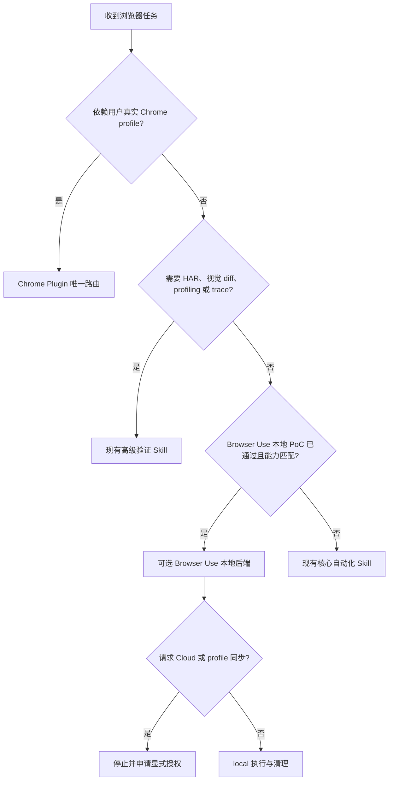
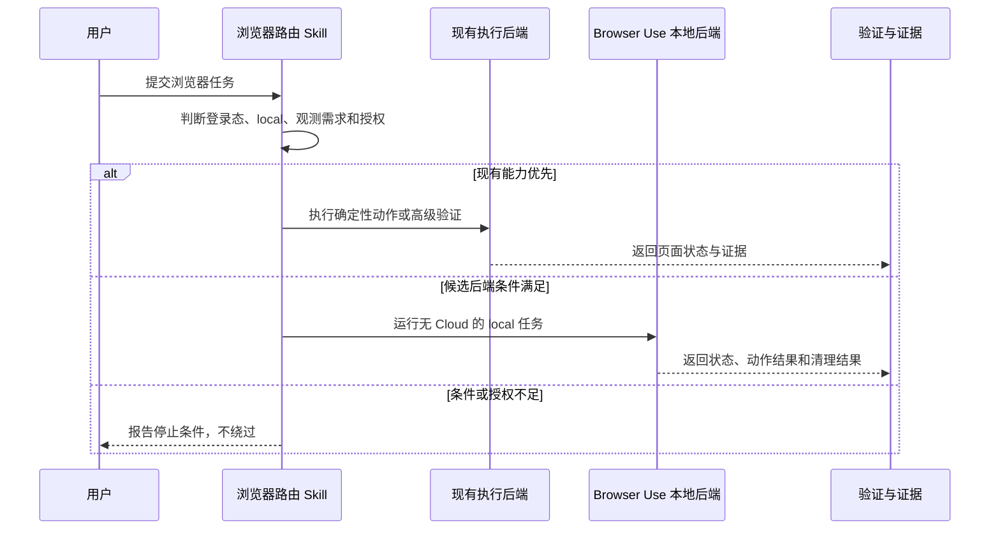

# Browser Use 浏览器自动化能力评估与可选接入需求

结论：保留现有浏览器 Skill 作为唯一策略与安全入口，把 Browser Use 作为公开或 local 页面场景的候选执行后端；影响：后续可增加自然语言自主操作和托管浏览器选项，但不会降低真实 Chrome 登录态与高级验证的现有保护；范围：官方事实基线、能力分工、本地优先 PoC、条件接入和 Cloud 决策闸门；非范围：本轮安装软件、配置密钥、同步 cookie、运行 Cloud、修改 Skill 或提交 Git；变化：从“是否更好”的口头判断转成可验证的分层选型；完成标准：需求、验收、实施总览和全量顺序方案落盘并通过严格门禁；术语说明：PoC 是用于证明方案可行的最小试验，执行后端是实际完成浏览器动作的工具；验证状态：官方一手资料与当前仓库能力已完成只读核对，真实浏览器能力留待后续独立周期验证。

## 文档信息

| 项目 | 内容 |
| --- | --- |
| 来源对象 | `REQ-BU-20260726-001` |
| 当前优先闭环 | `SLICE-BU-001`：冻结“现有入口不替换、本地 PoC 先行、Cloud 显式授权”的选型契约 |
| 复杂度 | L3；原因：跨现有路由、核心自动化、高级验证、第三方模型与云数据边界 |
| 责任人 | 主 Agent 负责决策与收口；实施 Agent 只按冻结任务执行 |
| 输入 | 用户链接、Browser Use 官方资料、仓库现有三个浏览器 Skill |
| 输出 | 唯一选型口径、验收标准、实施顺序与停止边界 |
| 图片资产决策 | N/A + 原因：没有 UI、原型或视觉基线交付；证据：流程、时序和能力矩阵已能完整表达关系 |

## 需求来源与证据台账

| 来源 ID | 来源事实 | 证据 | 决策状态 |
| --- | --- | --- | --- |
| `SRC-BU-001` | Browser Use 提供开源 Python 库、CLI、本地 MCP 和 Cloud | [官方仓库](https://github.com/browser-use/browser-use)、[CLI](https://docs.browser-use.com/open-source/browser-use-cli) | 已核实 |
| `SRC-BU-002` | 开源部分 MIT；本地 Agent 仍需模型 key 或本地模型 | [MIT](https://github.com/browser-use/browser-use/blob/main/LICENSE)、[本地 MCP](https://docs.browser-use.com/open-source/customize/integrations/mcp-server) | 已核实 |
| `SRC-BU-003` | Cloud 的零月费不等于零使用费，通用价格按浏览器、代理、模型等收费 | [官方定价](https://browser-use.com/pricing) | 已核实 |
| `SRC-BU-004` | 用户希望判断 Browser Use 是否比现有 Skill 更好 | 当前会话用户请求 | 已确认 |
| `SRC-BU-005` | 当前仓库已有认证 URL 路由、核心自动化和高级验证三层能力 | `authenticated-url-routing-rules/SKILL.md`、`browser-session-automation-rules/SKILL.md`、`browser-advanced-testing-rules/SKILL.md` | 已核实 |

## 目标与非目标

| 类型 | 内容 | 边界 ID |
| --- | --- | --- |
| 目标 | 保持真实 Chrome profile、公开/local、隔离 session 和高级验证的既有路由优先级 | `BOUND-BU-001` |
| 目标 | 用 local、无 Cloud、无敏感账号的 PoC 判断 Browser Use 是否有可复用增益 | `BOUND-BU-002` |
| 目标 | 通过条件路由接入，而不是复制或替换现有 Skill | `BOUND-BU-003` |
| 非目标 | 本轮安装、联网运行、配置 API key、修改任何 Skill | `BOUND-BU-004` |
| 非目标 | 自动上传 cookie、localStorage、saved password、截图或业务数据到 Cloud | `BOUND-BU-005` |
| 非目标 | 把“5 个免费任务”或专项免费层解释成永久全功能免费 | `BOUND-BU-006` |

## 功能需求与规则要求

| ID | 需求陈述 | 触发与输入 | 输出、异常与权限 | 验收 |
| --- | --- | --- | --- | --- |
| `REQ-BU-001` | 所有 URL 任务仍先由认证 URL 路由判断真实 Chrome、公开页面或 local 页面 | 用户提供 URL | 输出唯一通道；登录态页面不得因 Browser Use 可用而绕过 Chrome Plugin | `AC-BU-001` |
| `REQ-BU-002` | Browser Use 只作为公开/local、非真实 profile 强依赖场景的候选后端 | 既有通道能力不足且 PoC 已通过 | 输出条件路由；证据不足则保持现状 | `AC-BU-002` |
| `REQ-BU-003` | PoC 必须覆盖导航、状态读取、点击、输入、标签/session、截图、错误和清理 | local fixture 与公开只读页 | 每项产生二值结果；失败停止接入 | `AC-BU-003` |
| `REQ-BU-004` | 安全配置必须关闭匿名遥测、限制域名、敏感页关闭视觉，并仅连接可信 MCP 客户端 | PoC 或后续接入 | 拒绝越域、敏感截图和明文凭据 | `AC-BU-004` |
| `REQ-BU-005` | Cloud、API key、付费、代理、验证码与 profile 同步必须经过独立授权 | 明确出现 Cloud 需求 | 未获当轮显式授权只输出评估，不执行 | `AC-BU-005` |
| `REQ-BU-006` | 接入不能削弱现有 HAR、diff、profiling、trace、代理和 dashboard 能力 | 候选后端与现有能力比较 | 不支持项继续路由现有高级 Skill | `AC-BU-006` |

| 规则 ID | 优先级 | 冻结规则 | 冲突处理 |
| --- | ---: | --- | --- |
| `RULE-BU-001` | P0 | 真实用户 Chrome profile 仍优先 `chrome:control-chrome` | Browser Use 不得作为绕过通道 |
| `RULE-BU-002` | P0 | 当前与 PoC 只使用 local 配置 | 缺 local 条件即停止，不回退 Cloud |
| `RULE-BU-003` | P0 | key、cookie、profile、storage state 不写仓库与文档 | 发现原值立即停止并清理 |
| `RULE-BU-004` | P1 | Browser Use 增益仅限自治 Agent、Python 编排或托管基础设施 | 确定性动作与高级观测继续使用现有通道 |
| `RULE-BU-005` | P1 | 价格和免费额度按采用当日官方 dashboard 复核 | 文档口径冲突时不得承诺免费 |

## 数据与外部契约

| 对象 | 类型/来源 | 保留与脱敏 | 兼容与错误 |
| --- | --- | --- | --- |
| API key | secret / 用户环境变量 | 不落盘、不回显、不进入证据 | 缺失时 Cloud 分支停止；本地分支不得要求该 key |
| 浏览器状态 | cookie/localStorage/profile | PoC 使用无账号隔离 profile，任务后删除 | 不导入真实 profile；清理失败则 FAIL |
| 页面内容与截图 | local fixture 或公开只读页 | 只保留最小脱敏断言 | 视觉输入关闭时以 DOM/state 断言替代 |
| Cloud 输入输出 | 第三方服务数据 | 当前 N/A + 原因：禁止调用；证据：`DEC-BU-003` | 未来需单独数据处理与留存评审 |
| 数据库/接口/schema | N/A + 原因：本需求不新增业务接口或数据表；证据：范围仅为 Skill 选型 | N/A + 原因同前；证据：`BOUND-BU-004` | 不产生 SQL 或迁移 |

## 流程与时序

图形目的：冻结浏览器通道选择与停止边界；关联 ID：`REQ-BU-001` 至 `REQ-BU-006`、`RULE-BU-001`。

图形目的：说明用户、策略入口、候选后端和验证证据之间的调用顺序；关联 ID：`AC-BU-001` 至 `AC-BU-006`。

## 决策冻结

| 决策 ID | 选定方案 | 排除方案与原因 | 回滚 | 证据 |
| --- | --- | --- | --- | --- |
| `DEC-BU-001` | 现有 Skill 继续作唯一策略层 | 直接替换会丢失真实 Chrome 与高级验证边界 | 删除候选路由即可恢复原行为 | `SRC-BU-005` |
| `DEC-BU-002` | 本地隔离 PoC 后再接入 | 先安装再决定会污染环境并扩大范围 | 删除隔离环境和 PoC 资产 | `SRC-BU-002` |
| `DEC-BU-003` | Cloud 独立授权、独立预算与数据评审 | 免费口径不一致，且 profile/输入可能进入第三方 | 不创建 key、不上传 profile | `SRC-BU-003` |
| `DEC-BU-004` | Browser Use 只补自治与托管能力 | 现有确定性/观测能力已有稳定 Owner | 路由回到现有 Owner | `SRC-BU-001`、`SRC-BU-005` |

## 普通模型零决策执行契约

1. 先执行 `CYCLE-BU-01` 文档冻结，未通过严格门禁不得安装或改 Skill。
2. 进入 `CYCLE-BU-02` 时只用 local fixture 和公开只读页，不使用真实账号、Cloud、API key 或 profile 同步。
3. 每个 PoC 场景必须输出 PASS/FAIL、命令、断言、失败预期和清理结果；任何 P0 失败停止。
4. 只有全部适用 `AC-BU-*` 通过，才可按 `CYCLE-BU-03` 的精确文件表修改条件路由。
5. `CYCLE-BU-04` 只有用户在当轮明确授权 Cloud、费用和数据范围后才可进入。

## 风险、假设、依赖与阻断

| 风险/依赖 | 处理 | 停止与回滚 |
| --- | --- | --- |
| 官方免费口径变化或相互冲突 | 采用当日 pricing 与 billing 实值 | 不承诺永久免费；删除费用假设 |
| 本地 MCP 拥有浏览器和文件系统能力 | 仅可信客户端、域名白名单、隔离目录 | 越域或访问范围外文件立即停止 |
| 页面内容进入 LLM 或遥测 | 关闭匿名遥测，敏感页关闭视觉，PoC 无敏感数据 | 发现外传证据立即删除隔离环境并 FAIL |
| Browser Use 与现有 daemon/profile 冲突 | 独立 session、独立 profile、串行启动 | 关闭候选 session，不终止用户真实 Chrome |

## 追踪矩阵

| 来源 | 决策 | 需求/规则 | 验收 | 周期 | 任务 | 测试 | 证据 |
| --- | --- | --- | --- | --- | --- | --- | --- |
| `SRC-BU-004/005` | `DEC-BU-001` | `REQ-BU-001/002`、`RULE-BU-001` | `AC-BU-001/002` | `CYCLE-BU-01/03` | `TASK-BU-01/04` | `TEST-BU-001/006` | `EVIDENCE-BU-DOC-001` |
| `SRC-BU-001/002` | `DEC-BU-002/004` | `REQ-BU-003/004/006`、`RULE-BU-002/004` | `AC-BU-003/004/006` | `CYCLE-BU-02` | `TASK-BU-02/03` | `TEST-BU-002..005` | `EVIDENCE-BU-POC-001` |
| `SRC-BU-003` | `DEC-BU-003` | `REQ-BU-005`、`RULE-BU-003/005` | `AC-BU-005/007` | `CYCLE-BU-04` | `TASK-BU-05` | `TEST-BU-007` | `EVIDENCE-BU-CLOUD-GATE-001` |

## 完成、停止与最大推进边界

- 完成条件：四份文档通过对应 `--strict` profile，内部链接有效，Mermaid 可解析，`unresolved_decisions` 为零。
- 停止条件：同来源文档冲突、既有文件被覆盖、任何严格门禁失败、范围扩大到安装/密钥/Cloud/Skill 修改。
- 最大推进边界：本轮只新增四份 Markdown，不更新根文档、项目记忆、Skill、字典或 Git 历史。

## 执行附录

- 当前任务只执行文档 validator、Mermaid 解析、UTF-8 回读和 `git diff --check`；无需真实浏览器测试。原因：纯文档冻结不改变运行行为；证据：`BOUND-BU-004`。
- 后续 local PoC 命令必须在 `CYCLE-BU-02` 实施周期文档中冻结后执行，本需求不提前给安装授权。

## 追踪附录

- 文档链：[验收标准](../7-验收/2026-07-26_132244_REQ-BU-20260726-001_验收标准.md) -> [实施总览](../3-实施/2026-07-26_132244_REQ-BU-20260726-001_实施总览.md) -> [全量顺序方案](../3-实施/2026-07-26_132244_BrowserUse浏览器能力选型_需求与实施计划全量顺序实施方案.md)。
- `SRC-BU-* -> DEC-BU-* -> REQ-BU-*/RULE-BU-* -> AC-BU-* -> CYCLE-BU-* -> TASK-BU-* -> TEST-BU-* -> EVIDENCE-BU-*`。

