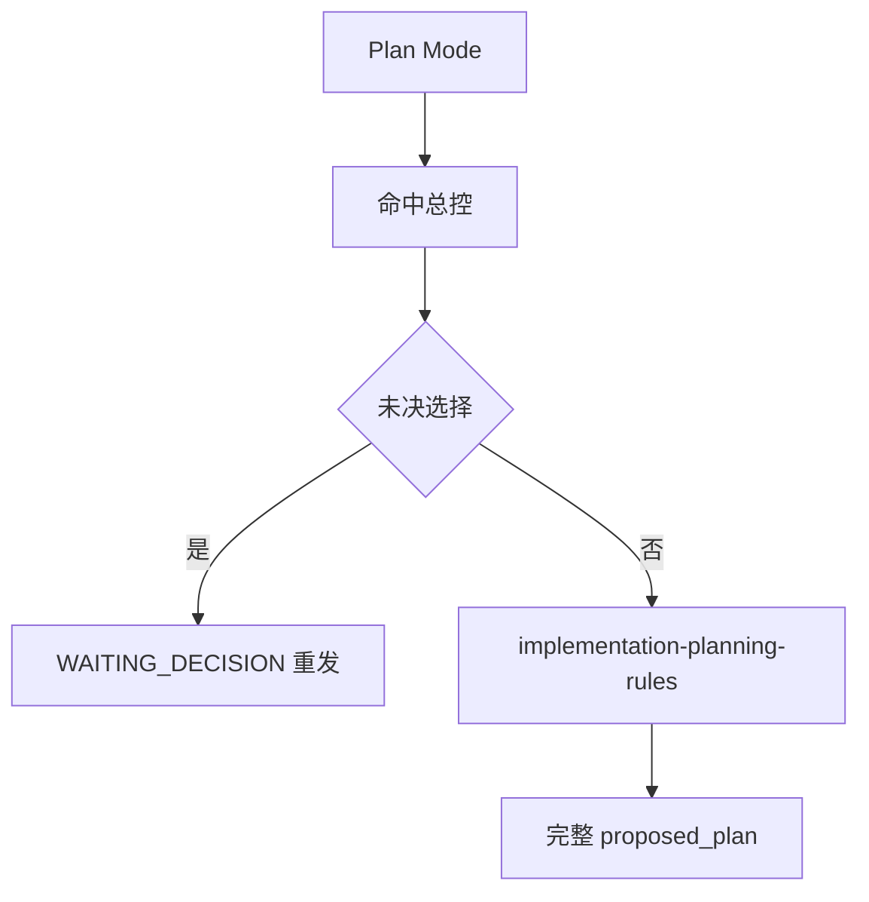
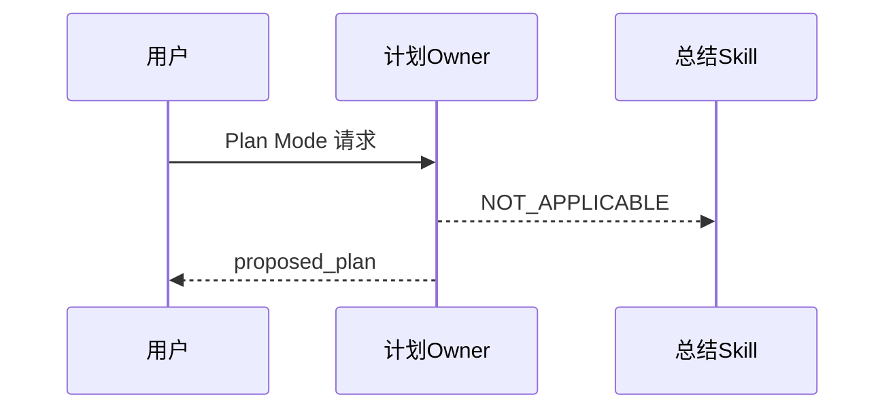

# Plan Mode 计划出口修复需求

结论：Plan Mode 当前会被总结 Skill 抢占计划出口；影响：用户看不到合法计划；范围：规则、路由和回归；非范围：产品源码与外部服务；变化：计划 Owner 互斥；完成标准：自动回归和文档链通过；术语说明：`NOT_APPLICABLE` 表示 Plan Mode 排除；验证状态：实施中；图片资产决策：`N/A + 原因 + 证据`，本需求只涉及文本规则、消息 fixture 和流程图，不需要位图。

## 文档信息

| 项目 | 内容 |
|---|---|
| 来源对象 | `BUG-PLAN-OUTPUT-20260726-001` |
| 问题会话 | `019f992e-ea18-7f30-bf23-37c7b87398b9` |
| 当前状态 | 已确认，实施中 |
| 图片资产 | `N/A`：规则和文本契约无需位图，Mermaid 足够表达流程 |

## 需求来源与证据台账

| ID | 证据 | 结论 |
|---|---|---|
| `SRC-PLAN-001` | 原始会话出现总结型 `final_answer` | Plan Mode 计划出口被抢占 |
| `SRC-PLAN-002` | 真实 `<proposed_plan>` 输出次数为 0 | 计划未按协议生成 |
| `SRC-PLAN-003` | 两个 Skill 同时命中 | 缺少 Owner 互斥和负向路由 |

## 目标与非目标

目标：Plan Mode 完全排除 `reasoning-summary-structure-rules`，由 `implementation-planning-rules` 独占正式、受限和阻断计划出口；无未决项时只允许输出完整 `<proposed_plan>`。

非目标：不修改 Codex Desktop 产品源码、工具 schema、非 local 服务和 Git 历史；普通 Default Mode 总结行为保持不变。

## 决策冻结

| ID | 决策 |
|---|---|
| `DEC-PLAN-001` | Plan Mode 下总结 Skill 为 `NOT_APPLICABLE` |
| `DEC-PLAN-002` | `implementation-planning-rules` 是唯一计划 Owner |
| `DEC-PLAN-003` | `WAITING_DECISION` 期间禁止所有总结/计划/完成信号 |
| `DEC-PLAN-004` | 压缩恢复不得生成总结型 `final_answer` |

## 功能需求与规则要求

| ID | 要求 | 验收 |
|---|---|---|
| `REQ-PLAN-001` | Plan Mode 命中列表不得包含总结 Skill | `AC-PLAN-001` |
| `REQ-PLAN-002` | 无未决项只输出一对完整 `<proposed_plan>` | `AC-PLAN-002` |
| `REQ-PLAN-003` | 空答案/部分答案保持 `WAITING_DECISION` 并重发 | `AC-PLAN-003` |
| `REQ-PLAN-004` | Default Mode 仍允许普通总结 | `AC-PLAN-004` |
| `REQ-PLAN-005` | 压缩恢复只恢复计划状态 | `AC-PLAN-005` |

## 普通模型零决策执行契约

执行模型不得自行决定 Owner、输出协议、等待超时、默认选项或宿主验证替代方案；每个任务必须按实施总览的“实现 -> 真实测试 -> 审查 -> 验收”顺序闭环。未决 `WAITING_DECISION`、宿主不可验证或规则 profile 失败时停止，不得宣称完成。`N/A` 只用于明确无图片、无数据库和无外部服务场景，并写出原因与证据。

## 数据与外部契约

本 Bug 不新增数据库表、字段、HTTP/RPC 接口或外部服务调用；输入是脱敏消息 fixture，输出是计划/总结路由判定。数据库与外部服务：`N/A + 原因 + 证据`，本地规则测试无需连接运行时依赖。

## 风险、假设、依赖与阻断

假设：真实宿主仍可能不可操作。依赖：Python 3、Skill 校验器和字典生成器。阻断：宿主证据缺失、文档 profile 失败、发现敏感信息或工作树冲突；阻断时保持 `LIMITED/HOST_BLOCKED`。

## 垂直切片与追踪契约

`SRC-PLAN-001..003 -> DEC-PLAN-001..004 -> REQ/RULE -> AC-PLAN-001..005 -> CYCLE-PLAN-01..05 -> TASK-PLAN-01..11 -> TEST-PLAN-001..006 -> EVIDENCE-PLAN-001..006`。

## 主追踪矩阵

| 来源 | 决策 | 需求/规则 | 验收 | 实施任务 |
|---|---|---|---|---|
| `SRC-PLAN-001..003` | `DEC-PLAN-001..004` | `REQ-PLAN-001..005` | `AC-PLAN-001..005` | `TASK-PLAN-01..11` |

## 流程图

图形目的：说明 Plan Mode 的唯一出口；关联 ID：`REQ-PLAN-001..005`。

## 时序图

图形目的：说明压缩恢复与总结 Skill 的互斥；关联 ID：`DEC-PLAN-001..004`。

