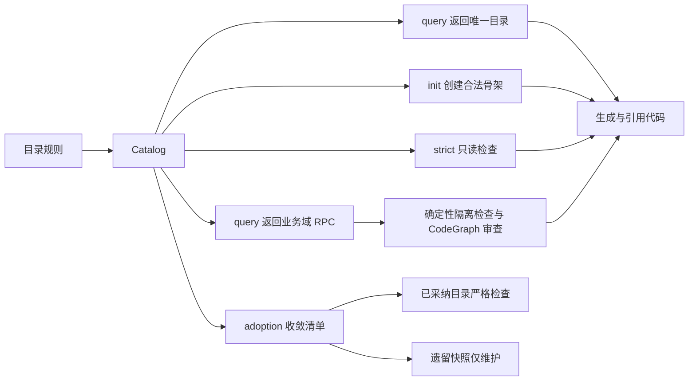
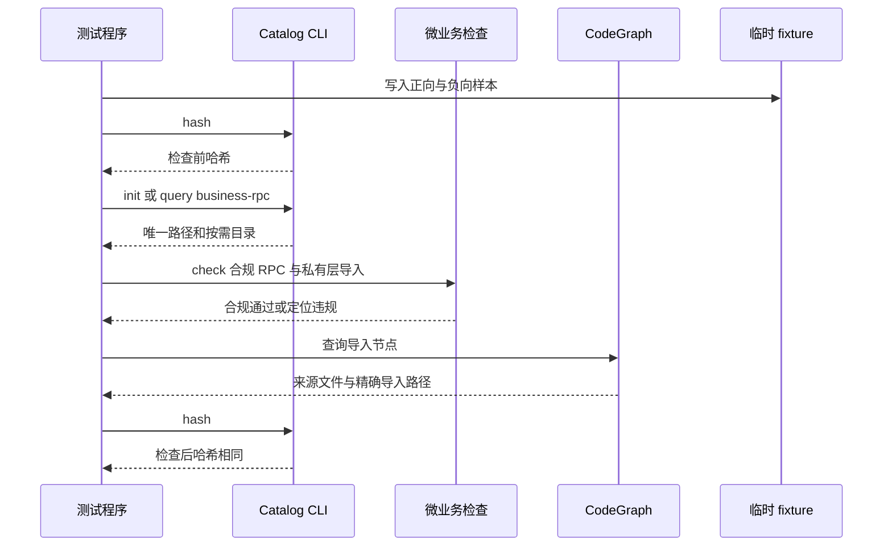
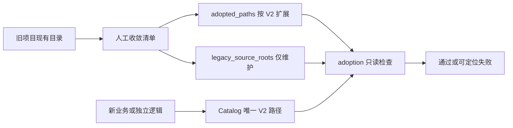
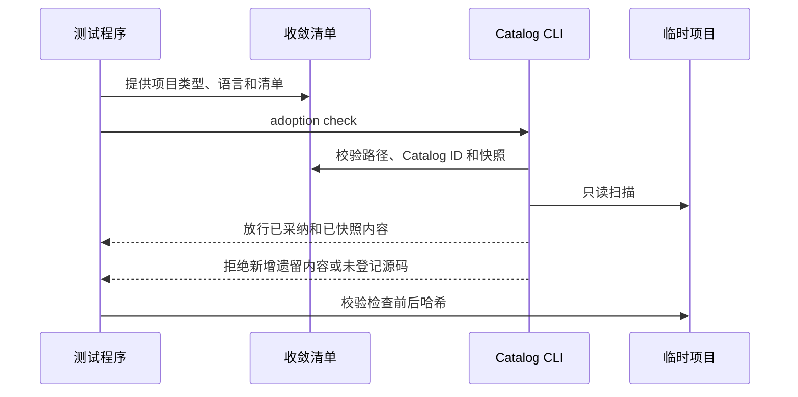

# 代码位置目录规则 V2

结论：三类项目的根目录都必须同时保存 `AGENTS.md` 与 `CLAUDE.md`，两份文件的正文保持完全一致，分别作为 Codex 与 Claude Code 的同一套协作规则入口。影响：新项目初始化、目录查询、完整树渲染与严格检查可一致识别双平台规则文件，避免两种 Agent 使用互相冲突的项目规则。范围：本轮更新目录规则、Catalog、CLI、自举脚本、测试和研发文档。非范围：不迁移业务仓库、不修改业务逻辑、不连接外部服务。变化：补齐三类项目的 `project-governance` 文件节点，并在两个规则文件同时存在时严格校验内容一致。完成标准：三类项目的 query、render、init 与 strict 检查都对相同规则给出一致结果。术语说明：Catalog 是记录目录规则的机器可读清单；strict 是只读且拒绝违规位置的检查策略。验证状态：本地 Python 行为测试覆盖本轮规则，浏览器和第三方验证不适用。图片资产决策：N/A。原因：本需求只定义文本目录规则和命令行行为。证据：冻结范围不包含界面、截图或视觉验收。

## 文档信息

| 项目 | 内容 |
|---|---|
| 文档 ID | `REQ-PSR-V2-001` |
| 来源对象 | 用户冻结的“后端 `utils/` 与源码根 `util/` 目录规则调整计划”“微业务跨域 RPC 通信目录规则升级计划”、`utils/ip/` 工具包补充及三类项目根 `CLAUDE.md` 同步规则。 |
| 当前状态 | `CYCLE-12` 已完成实现与本地行为验证，正在执行审查、验收与文档门禁收口。 |
| 图片资产决策 | N/A；原因：本需求只定义文本目录规则与 CLI 行为；证据：目录关系已由 Mermaid 图示准确表达。 |
| unresolved_decisions | `[]`；P0/P1 未决决策为零。 |

## 决策冻结

| 决策 ID | 冻结结论 | 不允许的替代方案 |
|---|---|---|
| `DEC-PSR-UTILS-001` | 后端项目根技术工具目录固定为 `utils/`。 | 根 `util/` 继续作为技术工具或 SDK 根。 |
| `DEC-PSR-SOURCE-UTIL-002` | 四语言源码根新增扁平 `util/`，文件直接落盘。 | 在源码根 `util/` 再创建能力子目录。 |
| `DEC-PSR-CLI-003` | 查询 artifact 固定为 `utils` 与 `source-util`，不保留旧 `util` 查询。 | 为旧根 `util` 提供兼容查询或自动迁移。 |
| `DEC-PSR-STRICT-004` | 后端 strict 必须传项目类型和语言。 | 猜测源码根语言或静默降级 strict。 |
| `DEC-PSR-RPC-003` | 微业务跨域调用唯一经目标域 `business/<domain>/rpc` 公开函数，输入和输出均为 JSON 字符串。 | 导入目标域 `service/`、`entity/`、`util/` 或直接传递实体。 |
| `DEC-PSR-RPC-004` | 成功、JSON 解析、校验和业务失败均返回 `Response{code,status,message,data}` JSON；CodeGraph 导入节点作为审查证据。 | 跨域抛出语言异常、暴露内部实体或以网络 RPC 替代进程内边界。 |
| `DEC-PSR-IP-001` | 请求 IP 获取、规范化、公私网判断和国家/地区归属查询只进入根 `utils/ip/`。 | 将代理信任、风控、业务黑白名单或业务地域策略放入 `utils/ip/`。 |
| `DEC-PSR-GOVERNANCE-001` | 后端根直接保存四个必需治理 Markdown 文件；`PROJECT_STYLE.md` 仅在存在长期风格时按需创建。 | 将治理文件放入源码根、业务域或 `doc/`，或由目录初始化覆盖文件正文。 |
| `DEC-PSR-CLAUDE-006` | 前后端同仓、独立后端、独立前端的项目根都必须同时保存 `AGENTS.md` 与 `CLAUDE.md`，二者正文完全一致。 | 只为其中一种 Agent 保留规则文件，或允许两份规则文本独立漂移。 |

## 普通模型零决策执行契约

- 执行模型必须先查询 Catalog，再创建、引用或检查目录；同一输入只能取得一个路径。
- 执行模型不得创建根 `utils/` 直接文件，不得将项目依赖导入根 `utils/` 的工具包。
- 执行模型必须把通用 IP 处理与地址归属查询实现放入 `utils/ip/`；代理信任和业务策略仍由调用层或业务域拥有。
- 执行模型必须把可依赖项目包的非业务流程工具函数直接放进当前语言源码根 `util/`；业务域私有辅助仍放 `business/<domain>/util/`。
- 执行模型跨业务调用时只能导入目标域 `rpc/`；请求与返回值必须为 JSON 字符串，目标域在本域内解析并返回统一响应 JSON。
- 执行模型必须在每种项目根创建同内容的 `AGENTS.md` 与 `CLAUDE.md`；`CLAUDE.md` 不得成为独立规则来源。
- strict 只能读取并报告；legacy 只能告警，不得移动、删除、重命名或改写用户文件。

## 需求来源与证据台账

| 来源 ID | 已确认事实 | 落点 | 证据 |
|---|---|---|---|
| `SRC-PSR-001` | 根工具目录改名为 `utils/`，且只允许子工具包。 | `project-layout-v2.md`、Catalog、CLI。 | 用户已冻结计划。 |
| `SRC-PSR-002` | 源码根 `util/` 可依赖项目包，代码直接落盘且禁止子目录。 | 四语言 reference、Catalog、strict。 | 用户已冻结计划。 |
| `SRC-PSR-003` | 前端 `src/util/` 与业务域私有 `util/` 保持不变。 | 后端规则边界、测试范围。 | 用户已冻结计划。 |
| `SRC-PSR-RPC-003` | 微业务不直接访问不同业务包数据，跨域通信模拟接口调用且固定 JSON 字符串边界。 | `business/<domain>/rpc`、Catalog、隔离检查、CodeGraph fixture。 | 用户已冻结计划。 |
| `SRC-PSR-IP-001` | IP 地址获取和国家/地区归属属于可独立复制的技术能力。 | `utils/ip/`、Catalog、query、init、render 与 strict fixture。 | 用户已冻结目录优化指令。 |
| `SRC-PSR-CLAUDE-001` | Codex 与 Claude Code 都需要项目根规则文件，且规则内容必须相同。 | 三类目录树、Catalog、CLI strict 与自举脚本。 | 用户明确要求。 |

## 目标与非目标

| 分类 | 内容 |
|---|---|
| 目标 | 让人工目录树、Catalog、CLI、测试和相邻规则对根 `utils/` 与源码根 `util/` 给出相同结论。 |
| 目标 | 为 Go、Java、Node.js、Python 返回唯一的源码根工具函数目录。 |
| 目标 | 让微业务跨域调用只有目标域 `rpc/` 一个公开入口，并能由确定性检查与 CodeGraph 共同审查。 |
| 目标 | 让 IP 处理能力只由 `utils/ip/` 唯一承载，并保持根 `utils/` 无直接文件的边界。 |
| 目标 | 让三类项目根的 `AGENTS.md` 与 `CLAUDE.md` 都可唯一查询、初始化、渲染并校验一致。 |
| 非目标 | 不迁移任何业务仓库或用户文件。 |
| 非目标 | 不实现 ORM 自动迁移，不连接数据库、缓存、消息队列或第三方 API。 |

## 功能需求与规则要求

| 需求 ID | 要求 | 通过标准 |
|---|---|---|
| `REQ-PSR-UTILS-001` | 根 `utils/` 只允许工具包子目录，代码文件只能在子目录或更深真实技术目录。 | strict 拒绝 `utils/<file>.<ext>`。 |
| `REQ-PSR-SOURCE-UTIL-002` | 源码根 `util/` 直接存放当前语言工具函数，禁止子目录。 | 四语言正向 fixture 通过，子目录 fixture 失败。 |
| `REQ-PSR-CLI-003` | `utils` 与 `source-util --language` 返回唯一位置；旧 `util` 查询失败。 | query 测试取得确定退出码和路径。 |
| `RULE-PSR-STRICT-004` | 后端 strict 必须显式传 `--project-kind backend --language`。 | 缺少语言时退出码为 2。 |
| `RULE-PSR-LEGACY-005` | legacy 只输出 warnings，不写 fixture。 | 检查前后哈希一致且 errors 为空。 |
| `REQ-PSR-BUSINESS-RPC-004` | 每个业务域按需在 `<source-root>/business/<domain>/rpc/` 直接存放对其他微业务公开的函数。 | `query --artifact business-rpc` 唯一返回，显式 init 才创建目标域目录。 |
| `RULE-PSR-RPC-005` | 跨域只允许精确导入目标域 `rpc/`；目标域其他层均为私有。 | `micro_business.py check` 放行 `users/rpc`，拒绝 `users/service`、`users/entity`、`users/util`。 |
| `RULE-PSR-RPC-006` | RPC 入参、返回值均为 JSON 字符串，任何结果都符合 `Response{code,status,message,data}` 语义。 | 成功、非法 JSON、校验失败和业务失败都可解析为统一字段集合。 |
| `REQ-PSR-IP-001` | 请求 IP 提取、规范化、公私网判断和国家/地区归属查询固定进入 `utils/ip/`，可封装离线库或第三方 GeoIP 适配。 | `query --artifact utils --category ip` 唯一返回 `utils/ip`，显式 init 才创建目录。 |
| `RULE-PSR-IP-002` | `utils/ip/` 不承载代理信任、风控、业务黑白名单或业务地域策略。 | strict 仍拒绝 `utils/` 根直接源码文件，`utils/ip/<file>.<ext>` 通过。 |
| `REQ-PSR-GOVERNANCE-001` | 后端项目根必须直接保存 `AGENTS.md`、`PROJECT_CURRENT.md`、`PROJECT_MEMORY.md`、`PROJECT_HISTORY.md`；`PROJECT_STYLE.md` 仅在真实存在长期风格时创建。 | Catalog 对五个文件均给出唯一位置、创建策略和正文 Owner；render 列出完整用途。 |
| `RULE-PSR-GOVERNANCE-002` | `init` 创建四个必需根文件，只在显式启用 `backend.root.project-style` 时创建条件风格文件；目录规则不得覆盖对应 Owner 的正文。 | 临时项目包含四个普通文件、不含未启用的风格文件；显式启用仅新增 `PROJECT_STYLE.md`，不创建无关 `utils/`。 |
| `REQ-PSR-CLAUDE-001` | 前后端同仓、独立后端、独立前端的项目根必须保存必需的 `CLAUDE.md`；它与同根 `AGENTS.md` 使用相同正文。 | 三个项目类型对 `project-governance --category claude` 都唯一返回 `CLAUDE.md`，render 列出用途。 |
| `RULE-PSR-CLAUDE-002` | `init` 创建同根 `AGENTS.md` 和 `CLAUDE.md`；strict 在二者均存在时拒绝内容不一致，但不改写文件，也不把旧项目缺失文件当作迁移行为。 | 三种 init 样本都创建两个空文件；相同正文通过，差异正文返回稳定错误且检查前后哈希一致。 |

## 业务规则与优先级

1. 三类项目根的 `AGENTS.md`、`CLAUDE.md`、`PROJECT_CURRENT.md`、`PROJECT_MEMORY.md`、`PROJECT_HISTORY.md` 是必需治理文件，`PROJECT_STYLE.md` 是条件治理文件；它们不属于源码根、业务域或 `doc/`。
2. `utils/<package>/` 优先承载项目无关、可独立复制的工具包与 SDK。
3. `utils/ip/` 只承载通用 IP 技术处理和归属查询适配；代理及业务策略由项目其他边界负责。
4. 当前语言源码根 `util/<function>.<ext>` 承载可引用项目包但不编排业务流程的工具函数。
5. `business/<domain>/util/` 只承载业务域私有辅助能力，不能替代上述两类位置。
6. 前端 `src/util/` 与 `src/common/util/` 不在本次变更范围内。
7. 调用方业务域仅导入目标域 `rpc/`；`rpc/` 内部可调用本域私有层，但不泄漏实体、仓储模型或语言异常。

## 数据与外部契约

- Catalog 使用 JSON 兼容 YAML，新增 `backend.utils.*` 和四个 `backend.source-util.<language>` 条目。
- IP 工具包条目固定为 `backend.utils.ip`，允许 `.go`、`.java`、`.ts`、`.js`、`.py`；不新增网络服务或真实 GeoIP 数据源。
- 根治理文件固定为 `project-governance` artifact、`node_kind: file` 和 `.md` 扩展名；`AGENTS.md` 与 `CLAUDE.md` 共同由项目规则 Owner 维护且正文一致，目录规则仅创建文件位置。
- CLI 公开命令保持 `init/query/render/check`；本轮新增 `query --language` 与 strict 的 `--project-kind`、`--language` 上下文。
- `query --artifact business-rpc` 返回唯一规范路径；`init --enable backend.business-rpc --domain <domain> --language <language>` 才创建对应业务域公开入口，Java 另需基础包。
- JSON 响应固定包含 `code`、`status`、`message`、`data`；根 `common/` 五类目录与只含非业务运行引用的 `global/` 是唯一跨域公共例外。
- 旧项目采用固定收敛清单 `doc/1-架构/3-目录规则收敛清单.yaml`：`adopted_paths` 原地沿用已符合 V2 的目录，`legacy_source_roots` 仅保存可维护的历史源码快照，多个遗留根不得重复、嵌套或重叠。
- `check --policy adoption` 必须同时传入项目类型、后端语言和收敛清单；清单、实际项目文件和检查结果均保持只读。
- 外部数据库、网络、账户、秘密、图像资产均为 N/A；原因：测试只运行本地 Python 和临时目录；证据：TEST-PSR-UTILS-001。

## 风险、假设、依赖与阻断

| 类别 | 内容 | 处理方式 |
|---|---|---|
| 风险 | Catalog、渲染树和 CLI 路径不一致会让生成代码落错位置。 | 同一轮测试同时断言 query、render、init 和 check。 |
| 风险 | strict 误写 fixture 会破坏用户文件。 | 每次 strict 前后计算目录哈希。 |
| 风险 | 业务域直接导入私有层会绕开 JSON 边界并重新耦合业务。 | 确定性 `micro_business.py check` 与 CodeGraph 导入节点共同拦截。 |
| 风险 | 旧项目把新源码继续放入历史目录会让遗留结构扩张。 | 清单只承认已快照目录和源码文件；`adoption` 对新增文件、目录和未登记根失败。 |
| 风险 | 两份 Agent 规则文件内容漂移会让不同 AI 采用冲突项目规则。 | strict 在同根双文件存在时按字节比较；自举脚本在 `--target both` 时以 `AGENTS.md` 覆盖同步 `CLAUDE.md`。 |
| 假设 | 四语言的源码根路径按冻结映射存在。 | Catalog 直接返回占位基础包或 package 路径。 |
| 依赖 | Python 标准库可执行 CLI 与 unittest。 | 不安装运行依赖、不联网。 |
| 阻断 | 无真实阻断；原因：本地行为测试已覆盖冻结规则；证据：`TEST-PSR-UTILS-001`。 | 不适用；原因：当前不存在阻断恢复动作；证据：本轮没有 `BLK-*` 记录。 |

## 需求流程图

图形目的：说明从目录规则到查询、初始化和只读检查的一致性链路。
关联 ID：`REQ-PSR-UTILS-001`、`REQ-PSR-SOURCE-UTIL-002`、`REQ-PSR-CLI-003`、`REQ-PSR-BUSINESS-RPC-004`。

## 验证时序图

图形目的：说明跨业务 JSON RPC 由确定性检查和 CodeGraph 导入节点共同验证，且不修改 fixture。
关联 ID：`RULE-PSR-RPC-005`、`RULE-PSR-RPC-006`。

## 旧项目渐进采用流程

图形目的：说明旧项目只承认人工登记的相符目录和历史快照，新业务不会继续进入遗留结构。
关联 ID：`REQ-PSR-ADOPT-001`、`RULE-PSR-ADOPT-001`。

图形目的：说明 `adoption` 先验证清单，再只读比对目录快照的顺序。
关联 ID：`AC-PSR-ADOPT-002`、`AC-PSR-ADOPT-003`。

## 追踪矩阵

| SRC/DEC | REQ/RULE | AC | 实施任务 | 文件/符号 | 测试 | 证据 |
|---|---|---|---|---|---|---|
| `SRC-PSR-001`、`DEC-PSR-UTILS-001` | `REQ-PSR-UTILS-001` | `AC-PSR-UTILS-001` | `TASK-05-01`、`TASK-06-01` | `project-layout-v2.md`、`placement_catalog.py:check_path` | `test_init_check.py` | `TEST-PSR-UTILS-001` |
| `SRC-PSR-002`、`DEC-PSR-SOURCE-UTIL-002` | `REQ-PSR-SOURCE-UTIL-002` | `AC-PSR-UTILS-002` | `TASK-05-02`、`TASK-06-01` | 四语言 layout、`source_util_root` | `test_query_render.py`、`test_init_check.py` | `TEST-PSR-UTILS-001` |
| `SRC-PSR-003`、`DEC-PSR-CLI-003` | `REQ-PSR-CLI-003`、`RULE-PSR-STRICT-004` | `AC-PSR-UTILS-003` | `TASK-06-01`、`TASK-06-02` | Catalog、CLI parser | 三份 V2 测试 | `TEST-PSR-UTILS-001` |
| `SRC-PSR-RPC-003`、`DEC-PSR-RPC-003` | `REQ-PSR-BUSINESS-RPC-004`、`RULE-PSR-RPC-005` | `AC-PSR-RPC-001`、`AC-PSR-RPC-002` | `TASK-07-01`、`TASK-07-02` | Catalog、`micro_business.py:check_isolation` | `test_business_rpc.py`、Go fixture | `TEST-PSR-RPC-001`、`TEST-PSR-RPC-002` |
| `DEC-PSR-RPC-004` | `RULE-PSR-RPC-006` | `AC-PSR-RPC-003` | `TASK-08-01`、`TASK-08-02` | `get_profile_rpc`、审查与验收文档 | `test_business_rpc.py` | `TEST-PSR-RPC-003` |
| `SRC-PSR-ADOPT-001`、`DEC-PSR-ADOPT-001` | `REQ-PSR-ADOPT-001`、`RULE-PSR-ADOPT-001` | `AC-PSR-ADOPT-001` 至 `AC-PSR-ADOPT-003` | `TASK-09-01` 至 `TASK-09-03` | 清单 Schema、`placement_catalog.py:load_adoption_manifest` | `test_adoption_check.py` | `TEST-PSR-ADOPT-001` |
| `SRC-PSR-IP-001`、`DEC-PSR-IP-001` | `REQ-PSR-IP-001`、`RULE-PSR-IP-002` | `AC-PSR-IP-001`、`AC-PSR-IP-002` | `TASK-10-01`、`TASK-10-02` | `backend-util-layout.md`、`placement-catalog.yaml` | `test_catalog_schema.py`、`test_query_render.py`、`test_init_check.py` | `TEST-PSR-IP-001` |
| `SRC-PSR-GOVERNANCE-001`、`DEC-PSR-GOVERNANCE-001` | `REQ-PSR-GOVERNANCE-001`、`RULE-PSR-GOVERNANCE-002` | `AC-PSR-GOVERNANCE-001`、`AC-PSR-GOVERNANCE-002` | `TASK-11-01`、`TASK-11-02` | `project-layout-v2.md`、`placement-catalog.yaml`、`placement_catalog.py:command_init` | `test_catalog_schema.py`、`test_query_render.py`、`test_init_check.py` | `TEST-PSR-GOVERNANCE-001` |
| `SRC-PSR-CLAUDE-001`、`DEC-PSR-CLAUDE-006` | `REQ-PSR-CLAUDE-001`、`RULE-PSR-CLAUDE-002` | `AC-PSR-CLAUDE-001`、`AC-PSR-CLAUDE-002` | `TASK-12-01` 至 `TASK-12-03` | 三类 `*.root.claude`、`command_init`、`check_path`、`bootstrap_agents.sh` | `test_catalog_schema.py`、`test_query_render.py`、`test_init_check.py` | `TEST-PSR-CLAUDE-001` |

## 证据索引

| 证据 ID | 任务 | 证据 |
|---|---|---|
| `EVD-TASK-09-03-IMPL` | `TASK-09-03` | 收敛清单 Schema、`placement_catalog.py` 的 adoption 解析与只读检查实现。 |
| `EVD-TASK-09-03-TEST` | `TASK-09-03` | 30 项本地 `unittest`、普通 YAML 清单、正反向 fixture 和无写入哈希。 |
| `EVD-TASK-09-03-REVIEW` | `TASK-09-03` | 实现审查与当前改动审查均未发现 P0/P1。 |
| `EVD-TASK-09-03-ACCEPT` | `TASK-09-03` | 最终验收、五个文档 profile 与目标 Skill 快速校验通过。 |
| `EVD-TASK-10-01-IMPL` | `TASK-10-01` | `utils/ip/` 规则、Catalog 唯一条目和 CLI 通用条目解析。 |
| `EVD-TASK-10-02-TEST` | `TASK-10-02` | 34 项本地 `unittest`、IP query、render、显式 init 与 strict 无写入断言。 |
| `EVD-TASK-11-01-IMPL` | `TASK-11-01` | 五个根治理文件的 Catalog 文件节点、目录树、正文 Owner 与 `command_init` 文件初始化。 |
| `EVD-TASK-11-02-TEST` | `TASK-11-02` | 37 项本地 `unittest`、根文件 query/render、必需与条件 init 断言、Python 编译和无写入检查。 |
| `EVD-TASK-11-02-REVIEW` | `TASK-11-02` | 实现审查与当前改动审查未发现 P0/P1，文件节点、初始化和测试追踪一致。 |
| `EVD-TASK-11-02-ACCEPT` | `TASK-11-02` | 五类文档 profile、Skill 快速校验与最终验收均为通过。 |
| `EVD-TASK-12-01-PLAN` | `TASK-12-01` | `SRC/DEC/REQ/RULE/AC/CHG-PSR-CLAUDE-006`、三类项目范围和本周期任务已冻结。 |
| `EVD-TASK-12-02-IMPL` | `TASK-12-02` | 三类 `*.root.claude` 文件节点、`content_must_match`、`command_init` 的空文件初始化和 strict 只读一致性检查。 |
| `EVD-TASK-12-02-TEST` | `TASK-12-02` | 41 项本地 `unittest`、三类 Claude query/render/init、双文件漂移哈希与 `bootstrap_agents.sh --target both` 幂等断言。 |

## 追踪契约

- `AC-PSR-UTILS-001`：根 `utils/` 的直接文件在 strict 必须失败。
- `AC-PSR-UTILS-002`：四语言源码根 `util/` 直接代码文件必须通过，子目录必须失败。
- `AC-PSR-UTILS-003`：`utils`、`source-util` 与旧 `util` 查询给出冻结结果。
- `AC-PSR-UTILS-004`：strict 在后端缺少语言上下文时必须失败。
- `AC-PSR-UTILS-005`：legacy 和 strict 都不得改写 fixture。
- `AC-PSR-RPC-001`：Catalog 查询和渲染唯一展示业务域 `rpc/`，init 只在显式启用且具备域与语言上下文时创建。
- `AC-PSR-RPC-002`：跨业务精确导入 `rpc/` 通过；`service/`、`entity/`、`util/` 等私有层导入在确定性检查和 CodeGraph 审查中失败。
- `AC-PSR-RPC-003`：成功、非法 JSON、校验失败和业务失败的跨域响应均可解析为 `code`、`status`、`message`、`data`。
- `AC-PSR-ADOPT-001`：可唯一匹配 Catalog 的已采纳目录无需物理迁移即可通过并继续按 V2 检查。
- `AC-PSR-ADOPT-002`：遗留快照仅允许登记时已有的目录和源码文件；新增文件、目录和未登记源码必须失败。
- `AC-PSR-ADOPT-003`：缺少、越界、重复、禁止路径或项目上下文不匹配的清单必须失败，且 `check` 前后哈希相同。
- `AC-PSR-IP-001`：`query --artifact utils --category ip` 必须唯一返回 `utils/ip`，并在完整渲染树中出现用途说明。
- `AC-PSR-IP-002`：显式启用才创建 `utils/ip/`，其中语言源码文件可通过 strict；`utils/` 根直接文件仍必须失败且检查不写入样本。
- `AC-PSR-GOVERNANCE-001`：`query --artifact project-governance --category agents` 唯一返回 `AGENTS.md`，`render --project-kind backend` 显示五个根治理文件及用途。
- `AC-PSR-GOVERNANCE-002`：后端 `init` 创建四个必需 Markdown 文件；`PROJECT_STYLE.md` 仅在 `--enable backend.root.project-style` 时创建，且不连带创建 `utils/`。
- `AC-PSR-CLAUDE-001`：fullstack、backend、frontend 分别查询 `project-governance --category claude` 时，唯一返回根 `CLAUDE.md`；三棵完整渲染树均展示该必需文件及用途。
- `AC-PSR-CLAUDE-002`：三种 `init` 都创建 `AGENTS.md` 和 `CLAUDE.md`；strict 对相同正文通过、对不一致正文返回稳定错误且检查前后哈希一致。

## 需求变更记录

| 变更 ID | 旧值 | 新值 | 失效传播与重验 |
|---|---|---|---|
| `CHG-PSR-RPC-003` | 目录规则只定义业务域私有层，跨域隔离没有目录、CLI 与审查闭环。 | 业务域新增条件 `rpc/` 公开入口；跨域固定 JSON 字符串，确定性检查与 CodeGraph 共同审查。 | 回开目录树、Catalog、CLI、微业务隔离规则、测试、审查与最终验收；既有 `utils` 验证保留有效。 |
| `CHG-PSR-ADOPT-001` | 旧项目只能采用全量 strict 或宽松 legacy，无法区分已采纳目录、历史存量与新增路径。 | 固定收敛清单与 `adoption` 策略：相符目录可原地沿用，遗留根只允许维护快照，新逻辑必须进入 V2。 | 回开 Catalog Schema、CLI、测试、审查和验收；不迁移、不删除或重命名任何业务项目文件。 |
| `CHG-PSR-IP-004` | 根 `utils/` 没有 IP 地址处理和国家/地区归属能力的唯一分类。 | 新增 `utils/ip/`，只承载 IP 提取、规范化、公私网判断和归属查询适配。 | 回开目录树、Catalog、query/render/init/strict 测试、研发文档、审查与验收；不新增网络调用、业务策略或项目迁移。 |
| `CHG-PSR-GOVERNANCE-005` | 后端完整树、Catalog 与 `init` 未定义项目根治理文件，无法按新项目骨架统一创建。 | 根固定 `AGENTS.md`、`PROJECT_CURRENT.md`、`PROJECT_MEMORY.md`、`PROJECT_HISTORY.md`，条件 `PROJECT_STYLE.md`；Catalog 明确文件节点和正文 Owner，`init` 只创建位置。 | 回开后端目录树、Catalog Schema、query/render/init 测试、研发文档、审查与最终验收；不改写文件正文、不迁移业务项目。 |
| `CHG-PSR-CLAUDE-006` | 三类完整目录树只列出 `AGENTS.md`，Catalog 仅覆盖后端五个治理文件，无法保证 Claude Code 与 Codex 使用同一规则正文。 | 三类项目根都增加必需 `CLAUDE.md`；同根双文件正文完全一致，Catalog、init、render、strict 与 `--target both` 自举共同验证。 | 回开三类目录树、Catalog、CLI、项目规则自举、query/render/init/check 测试、审查与最终验收；旧项目不自动补齐或迁移文件。 |
