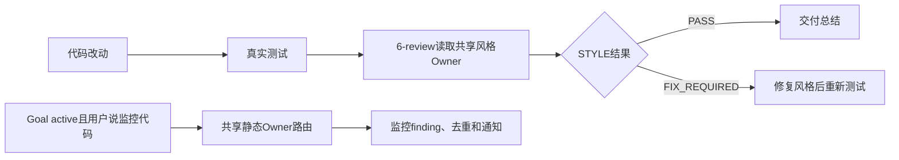
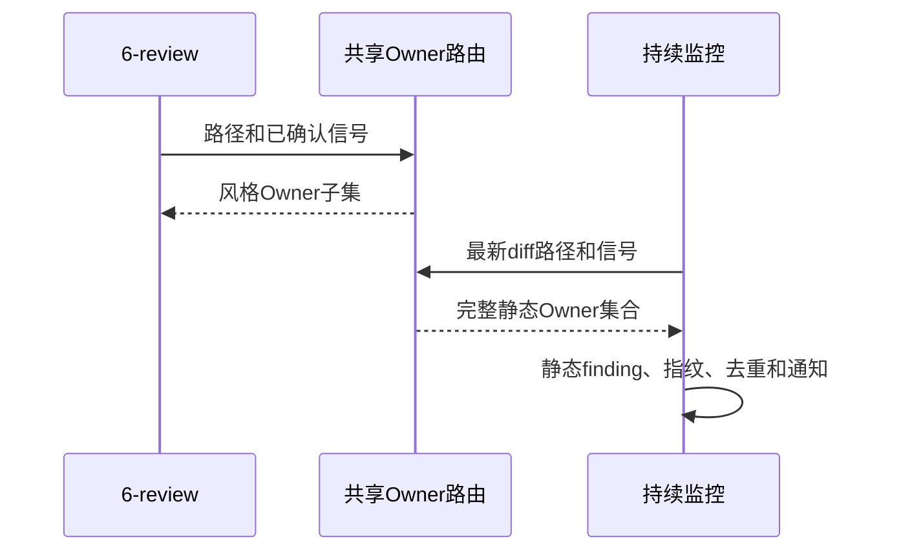

# 6-review 共享静态 Owner 路由需求

结论：把“监控代码” Skill 的静态 Owner 路由抽成 `code-style-consistency-rules` 的共享契约，供 `6-review` 和持续监控共同读取；影响：两条质量链路的规则来源一致；范围：路由、来源映射、监控消费边界和回归证据；非范围：业务逻辑、功能测试、发布放行和历史审查/验收正文；变化：监控不再复制 Owner 路由；完成标准：共享路由、监控兼容、活动文档和本地回归全部通过；术语说明：Owner 指负责某类代码质量规则的 Skill；验证状态：实现后执行本地 Python 测试和测试后的 `6-review`。

## 文档信息

| 字段 | 内容 |
| --- | --- |
| 来源 | `SRC-6ROUTE-20260801`：用户确认按计划执行并整合监控代码 Skill 的引用方式 |
| 当前问题 | 监控 Skill 内有独立 Owner 常量、路由算法和来源映射，可能与 `6-review` 分叉 |
| 目标 | 建立一个共享静态路由源，保持监控生命周期能力不变 |
| 优先闭环 | 共享路由 -> 监控消费 -> 真实测试 -> `6-review` |
| 决策状态 | `unresolved_decisions`：无 |

## 需求来源与证据台账

| 来源 ID | 内容 | 可信边界 |
| --- | --- | --- |
| `SRC-6ROUTE-20260801` | 用户确认按既定流程实施，并要求将监控代码 Skill 的优质引用方式合并到 `6-review` | 只授权本仓库规则、活动文档与本地测试，不授权业务项目、外部服务或 Git 历史写入 |
| `DEC-6ROUTE-01` | 共享 Owner 路由由 `code-style-consistency-rules` 持有 | 监控只能消费，不得重新定义路由或来源映射 |

## 功能需求与规则要求

| ID | 要求 | 优先级 |
| --- | --- | --- |
| `REQ-6ROUTE-01` | `code-style-consistency-rules` 导出完整 Owner 集合、基础 Owner 顺序、条件路由和共享来源路径 | P0 |
| `REQ-6ROUTE-02` | 持续监控导入共享路由并保持 `supervisor_state.py` 的公开导入兼容 | P0 |
| `REQ-6ROUTE-03` | 监控目录不得保留重复 Owner 路由算法或旧 source map | P0 |
| `REQ-6ROUTE-04` | `6-review` 只消费风格、位置、格式和可读性相关规则，不判断业务正确性 | P0 |
| `REQ-6ROUTE-05` | 共享路由必须有正例、负例、来源完整性和文档回归证据 | P1 |

## 决策冻结

| ID | 决策 | 证据 |
| --- | --- | --- |
| `DEC-6ROUTE-01` | 共享 Owner 路由唯一落点为 `code-style-consistency-rules/scripts/static_owner_router.py` | 既有 `6-review` Owner 与本轮执行计划 |
| `DEC-6ROUTE-02` | 监控保留 Goal 双条件、扫描、脱敏、finding 指纹、去重和通知 | `continuous-code-quality-supervisor-rules/SKILL.md` |
| `DEC-6ROUTE-03` | 历史 `doc/6-审查/`、`doc/7-验收/` 原文只读保留 | `artifact-storage-rules` 活动目录契约 |

## 范围与边界

- 活动质量链路：实施计划含 `AC` -> 实现 -> 真实测试 -> 一次 `6-review` -> 交付总结。
- `6-review` 只输出 `STYLE: PASS` 或 `STYLE: FIX_REQUIRED`。
- 真实测试负责行为正确性、需求完成条件和回归断言；监控 Skill 只做静态质量编排。
- N/A + 原因 + 证据：本需求不涉及数据库、外部服务、业务项目、图片资产或 Git 历史。

图片资产决策：N/A + 原因：本需求只定义规则、代码和文档路由，流程与时序由 Mermaid 足够表达 + 证据：下方 `REQ-6ROUTE-01..05` 流程图和时序图。

## 数据与外部契约

N/A + 原因：共享路由只读取本地受版本控制的路径和 JSON 来源映射，不定义接口、数据库、缓存或外部服务契约 + 证据：`static_owner_router.py` 使用 Python 标准库，专项测试只读取工作树。

## 风险、假设、依赖与阻断

| ID | 风险或依赖 | 防护与停止边界 |
| --- | --- | --- |
| `GAP-6ROUTE-01` | 共享来源映射缺失、越界或 Owner 顺序漂移 | 来源路径和共享路由单测失败即停止，不猜测替代来源 |
| `GAP-6ROUTE-02` | 监控迁移改变公开导入、状态 schema 或脱敏行为 | 监控兼容测试失败即停止，恢复消费者导入而不改状态契约 |
| `GAP-6ROUTE-03` | 历史审查/验收资料被写入 | 历史目录出现正文 diff 即停止；只读保留，不纳入活动流程 |

## 追踪契约

每个 `REQ` 必须连到实施计划中的 `AC`、唯一周期任务、真实测试和测试后 `STYLE` 证据。历史 `REVIEW`、`ACCEPT` 与 `FINAL_ACCEPTANCE` 不进入活动链。

## 追踪矩阵

| 来源/规则 | 需求 | 完成条件 | 周期 | 任务 | 测试 |
| --- | --- | --- | --- | --- | --- |
| `SRC-6ROUTE-20260801` / `DEC-6ROUTE-01` | `REQ-6ROUTE-01` | `AC-6ROUTE-01` | `CYCLE-6ROUTE-01` | `TASK-6ROUTE-01` | `TEST-6ROUTE-01` |
| `DEC-6ROUTE-02` | `REQ-6ROUTE-02`、`REQ-6ROUTE-03` | `AC-6ROUTE-02`、`AC-6ROUTE-03` | `CYCLE-6ROUTE-02` | `TASK-6ROUTE-02` | `TEST-6ROUTE-02` |
| `DEC-6ROUTE-03` | `REQ-6ROUTE-04`、`REQ-6ROUTE-05` | `AC-6ROUTE-04`、`AC-6ROUTE-05` | `CYCLE-6ROUTE-03` | `TASK-6ROUTE-03` | `TEST-6ROUTE-03` |

| 计划证据 | 说明 |
| --- | --- |
| `EVIDENCE-6ROUTE-PLAN-01` | 本需求中的共享路由、监控消费边界和历史归档只读规则已冻结；后续实现、测试与风格证据由同来源活动文档承接 |

## 流程图

图形目的：说明共享路由的两个消费者和职责边界。关联 ID：`REQ-6ROUTE-01..05`。

## 时序图

图形目的：说明共享模块只提供路由，监控不复制规则内容。关联 ID：`DEC-6ROUTE-01`、`DEC-6ROUTE-02`。

## 普通模型零决策执行契约

- 不得在监控目录重新定义 `OWNER_NAMES`、`BASE_OWNER_NAMES`、条件路由或 source map。
- 不得让 `6-review` 替代真实测试，也不得把业务逻辑错误判为风格失败。
- 发现共享来源缺失、名称不一致或路径越界时只能产生 `unclassified/limited`，停止猜测。
- N/A + 原因 + 证据：不改历史归档、不连接外部环境、不执行 Git 历史写入。

## 验收与停止条件

- `AC-6ROUTE-01..05`：共享接口、监控迁移、重复实现删除、边界文档和正负回归均有 `TEST` 与 `STYLE` 证据。
- 任一真实测试、文档 profile 或 `6-review` 失败，立即停止并回到对应任务；不得给完成结论。
- 历史资料发生正文变更时立即停止并保留阻断证据。
