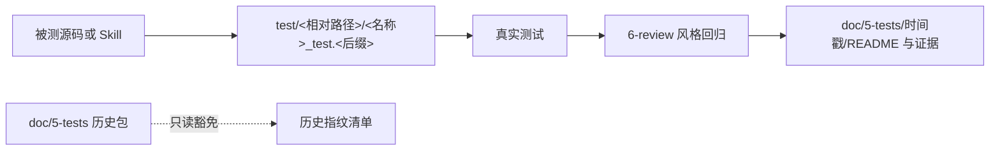
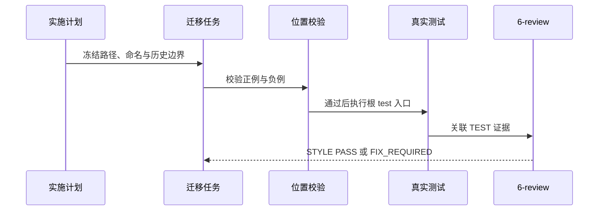

# 根 test 目录统一需求

结论：活动测试代码统一迁至仓库根 `test/`，并镜像被测源码或 Skill 路径；影响：测试代码与测试证据不再混放，后续人员可在固定位置定位和运行测试；范围：活动测试、规则、目录树、入口和索引；非范围：历史测试包正文和业务项目；变化：`doc/5-tests/` 只保留中文说明、日志、报告和非可执行证据；完成标准：七组活动测试迁移完成、位置回归和真实测试通过；术语说明：路径镜像是指测试目录保留被测目录的相对层级；验证状态：实施已获授权，尚未开始迁移。

## 文档信息

| 字段 | 内容 |
| --- | --- |
| 来源 | `SRC-TEST-LAYOUT-20260801`：用户确认的根 `test/` 目录统一方案 |
| 目标 | 将新增和活动测试代码收敛为唯一根目录 |
| 优先闭环 | 先冻结位置契约和历史豁免，再迁移活动测试 |
| 相关实施 | `IMP-TEST-LAYOUT-20260801`、`CYCLE-TEST-LAYOUT-01..03` |

## 需求来源与证据台账

| SRC | 来源内容 | 已冻结决策 | 证据 |
| --- | --- | --- | --- |
| `SRC-TEST-LAYOUT-20260801` | 用户确认的实施计划 | 测试代码根与证据根分离 | 当前会话计划 |
| `SRC-TEST-LAYOUT-LEGACY-01` | 历史测试包现状 | 不批量迁移 `doc/5-tests/` 可执行资产 | 工作树目录盘点 |
| `SRC-TEST-LAYOUT-ACTIVE-01` | 七组 `*/tests/` | 本轮必须迁移至根 `test/` | 当前活动测试清单 |

## 目标与非目标

| 分类 | 内容 |
| --- | --- |
| 目标 | 新测试代码只能进入 `test/<被测相对路径>/<名称>_test.<后缀>`。 |
| 目标 | 活动 Python 测试改为 `*_test.py`，统一由根测试入口发现。 |
| 目标 | Go 测试保持根 `test/` 下外部黑盒包，源码目录不出现 `*_test.go`。 |
| 非目标 | 不批量搬迁、改写或格式化 `doc/5-tests/**` 历史文件。 |
| 非目标 | 不改业务项目代码、不连接外部服务、不写 Git 历史。 |

## 功能需求与规则要求

| REQ | 规则 | 完成条件 |
| --- | --- | --- |
| `REQ-TEST-LAYOUT-01` | 根 `test/` 是唯一活动测试代码根，按被测路径镜像。 | `AC-TEST-LAYOUT-001` |
| `REQ-TEST-LAYOUT-02` | `doc/5-tests/` 只存 README、日志、报告、截图和非可执行产物。 | `AC-TEST-LAYOUT-002` |
| `REQ-TEST-LAYOUT-03` | 历史可执行资产由指纹清单只读豁免；首次修改才迁至 `test/`。 | `AC-TEST-LAYOUT-003` |
| `REQ-TEST-LAYOUT-04` | Python 统一 `*_test.py`；Go 只允许根 `test/` 外部黑盒测试。 | `AC-TEST-LAYOUT-004` |
| `REQ-TEST-LAYOUT-05` | 七组活动 `*/tests/` 迁移后由根入口真实执行。 | `AC-TEST-LAYOUT-005` |

## 决策冻结

| DEC | 决策 | 异常与边界 |
| --- | --- | --- |
| `DEC-TEST-LAYOUT-01` | 使用双根分工：`test/` 放代码，`doc/5-tests/` 放证据。 | 历史目录不是活动代码根。 |
| `DEC-TEST-LAYOUT-02` | Python 使用 `<名称>_test.py`。 | `test_*.py` 作为负例失败。 |
| `DEC-TEST-LAYOUT-03` | Go 使用根 `test/` 外部包。 | 源码目录 Go `*_test.go` 必须失败。 |
| `DEC-TEST-LAYOUT-04` | 历史可执行文件以清单指纹豁免。 | 改动、重命名或新增历史可执行文件必须失败。 |

图形目的：说明测试代码、真实测试、风格回归和证据的单向职责。关联 ID：`REQ-TEST-LAYOUT-01..05`。

图形目的：说明开发人员执行一次迁移任务时的状态和失败停止点。关联 ID：`AC-TEST-LAYOUT-001..005`。

## 范围与边界

- `BOUND-TEST-LAYOUT-01`：仅迁移七组活动 `*/tests/`；历史 `doc/5-tests/**` 原文保持不变。
- `BOUND-TEST-LAYOUT-02`：不创建 `tests/`、`testing/` 或源码目录内的平行测试根。
- `BOUND-TEST-LAYOUT-03`：不以构建、lint、静态扫描或人工阅读代替真实测试。
- `BOUND-TEST-LAYOUT-04`：`6-review` 只检查目录归位、命名、编码、格式、注释和可读性，不判断行为正确性。

## 数据与外部契约

| 对象 | 输入 | 输出 | 边界 |
| --- | --- | --- | --- |
| 路径校验器 | 本地仓库路径、历史清单 | 通过或失败的本地断言 | 不读取网络、不连接服务 |
| 历史指纹清单 | `doc/5-tests/**` 的可执行资产元数据 | 只读豁免结果 | 未登记的新增、改动、重命名均失败 |
| 根测试发现器 | 根 `test/` 的 `*_test.py` | 测试结果与退出码 | 不递归扫描 `doc/5-tests/` |

## 风险、假设、依赖与阻断

| 项目 | 内容 | 应对 |
| --- | --- | --- |
| `RULE-TEST-LAYOUT-01` | 旧规则仍指向 `doc/5-tests/`。 | 先更新规则，再迁移测试。 |
| `RULE-TEST-LAYOUT-02` | 历史目录含可执行资产。 | 用指纹清单冻结，不批量搬迁。 |
| `RULE-TEST-LAYOUT-03` | 根测试发现器可能遗漏目录。 | 添加发现、镜像和 Go 黑盒正负例。 |
| `ROLLBACK-TEST-LAYOUT-01` | 单组迁移失败。 | 恢复该组原路径与规则口径，停止后续迁移。 |

## 普通模型零决策执行契约

- 只能新增 `test/` 镜像内的测试代码；不能将新可执行文件写回 `doc/5-tests/`。
- 每个最小任务必须依次完成实现、真实测试和 `STYLE` 记录；其中任一失败即停止。
- 历史资产只有在首次需要修改时，才迁移对应代码和必要辅助资产，并更新历史指纹清单。
- unresolved_decisions：无。位置、命名、Go 边界、历史兼容和停止条件均已冻结。

## 垂直切片与追踪契约

- `SLICE-TEST-LAYOUT-01`：先落盘四份活动文档并执行严格 profile，产出 `EVD-TEST-LAYOUT-01-IMPL-01`、`EVD-TEST-LAYOUT-01-TEST-01` 和 `EVD-TEST-LAYOUT-01-STYLE-01`。
- `SLICE-TEST-LAYOUT-02`：规则、清单与布局校验同一任务闭环，产出 `EVD-TEST-LAYOUT-02-IMPL-01`、`EVD-TEST-LAYOUT-02-TEST-01` 和 `EVD-TEST-LAYOUT-02-STYLE-01`。
- `SLICE-TEST-LAYOUT-03`：七组活动测试迁移后逐组真实运行，产出 `EVD-TEST-LAYOUT-03-IMPL-01`、`EVD-TEST-LAYOUT-03-TEST-01` 和 `EVD-TEST-LAYOUT-03-STYLE-01`。

## 主追踪矩阵

| SRC | DEC | REQ | AC | CYCLE | TASK | TEST | EVIDENCE |
| --- | --- | --- | --- | --- | --- | --- |
| `SRC-TEST-LAYOUT-20260801` | `DEC-TEST-LAYOUT-01` | `REQ-TEST-LAYOUT-01` | `AC-TEST-LAYOUT-001` | `CYCLE-TEST-LAYOUT-01` | `TASK-TEST-LAYOUT-02` | `TEST-TEST-LAYOUT-01` | `EVD-TEST-LAYOUT-01` |
| `SRC-TEST-LAYOUT-LEGACY-01` | `DEC-TEST-LAYOUT-04` | `REQ-TEST-LAYOUT-03` | `AC-TEST-LAYOUT-003` | `CYCLE-TEST-LAYOUT-01` | `TASK-TEST-LAYOUT-02` | `TEST-TEST-LAYOUT-02` | `EVD-TEST-LAYOUT-02` |
| `SRC-TEST-LAYOUT-ACTIVE-01` | `DEC-TEST-LAYOUT-02..03` | `REQ-TEST-LAYOUT-04..05` | `AC-TEST-LAYOUT-004..005` | `CYCLE-TEST-LAYOUT-02` | `TASK-TEST-LAYOUT-03` | `TEST-TEST-LAYOUT-03` | `EVD-TEST-LAYOUT-03` |

## 执行附录

实施入口、样本、失败预期、清理与回滚命令统一写入 `doc/5-tests/2026-08-01_191658_根test目录统一/README.md`。图片资产决策：N/A + 原因：目录与流程关系已由 Mermaid 表达，不需要位图 + 证据：本文件两张图。

## 追踪附录

`SRC-TEST-LAYOUT-20260801` -> `DEC-TEST-LAYOUT-01..04` -> `REQ-TEST-LAYOUT-01..05` -> `AC-TEST-LAYOUT-001..005` -> `CYCLE-TEST-LAYOUT-01..03` -> `TASK-TEST-LAYOUT-01..05` -> `TEST-TEST-LAYOUT-01..05` -> `EVD-TEST-LAYOUT-*`。
