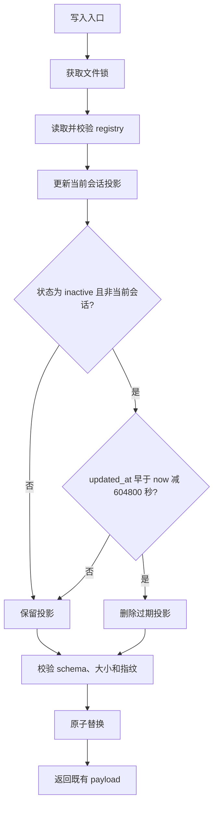
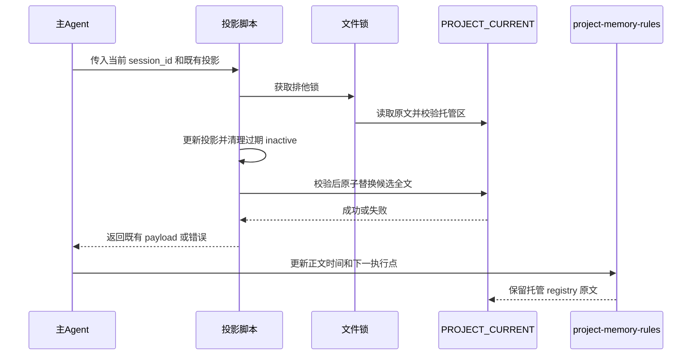

# PROJECT_CURRENT 任务记录七天保留与过期清理需求

结论：`PROJECT_CURRENT.md` 的当前状态只保留最近七天的完成记录，机器任务 registry 在每次写入时自动清理已完成且超过七天的非当前会话投影；影响：当前状态文档不会长期累积已经结束的任务和旧会话记录；范围：两个 Owner Skill、投影脚本、契约、模板、自举规则、测试、项目记忆和字典同步；非范围：不删除活动投影或阻断投影，不查询宿主归档状态，不连接数据库或外部服务，不写 Git 历史；变化：将完成态的更新时间明确定义为完成时间，并以严格七天窗口清理；完成标准：清理边界、当前会话保护、旧版本兼容、原子写入和真实测试全部通过；术语说明：完成态表示任务已经结束并退出悬浮任务恢复链路；验证状态：需求边界和实施口径已冻结，本轮开始进入实现。

## 文档信息

| 字段 | 内容 |
| --- | --- |
| 来源对象 | `SRC-CUR-20260802-001`：用户要求压缩 `PROJECT_CURRENT.md` 的近期状态和会话记录 |
| 需求主文档 | `REQ-CUR-20260802-001` |
| 实施承接 | `IMP-CUR-20260802-001`、`CYCLE-CUR-01` |
| 当前优先闭环 | 机器 registry 自动清理、正文保留规则、四件套与模板同步 |
| 变更类型 | 新增独立保留策略，复用现有 v4 registry 字段 |

## 需求来源与证据台账

| SRC | 来源内容 | 冻结结论 | 证据 |
| --- | --- | --- | --- |
| `SRC-CUR-20260802-001` | 用户要求已完成任务超过七天后清除 | 保留最近 `7×24` 小时，过期记录不再长期累积 | 当前会话用户消息 |
| `SRC-CUR-20260802-001` | 用户要求当前会话保留，旧归档会话不再记录 | 当前 session 永不因时间清理；不猜测宿主归档状态 | 当前会话用户消息、现有 v4 session 隔离契约 |
| `SRC-CUR-20260802-001` | 用户要求记录完成时间便于清除 | 复用 `inactive.updated_at` 作为完成时间 | 现有 `task_plan_projection.py` v4 字段 |

## 目标与非目标

| 分类 | 内容 |
| --- | --- |
| 目标 | registry 每次成功写入时清理超过严格七天的非当前 `inactive` 投影。 |
| 目标 | `active`、`blocked`、当前会话和七天内 `inactive` 投影始终保留。 |
| 目标 | 普通 Markdown 的已完成记录带 UTC 完成时间；下一执行点只记录当前会话和明确未完成事项。 |
| 目标 | 保持 v4 字段、CLI JSON 结构、v1-v3 读取兼容、锁和原子写入语义。 |
| 非目标 | 不删除 `active` 或 `blocked`，不因“看起来已归档”而删除任何会话。 |
| 非目标 | 不新增数据库、外部接口、独立清理命令、自由文本日期解析器或新的 registry 字段。 |
| 非目标 | 不修改 Codex Desktop 产品源码，不提交、推送或改写 Git 历史。 |

## 功能需求与规则要求

| ID | 规则 | 完成条件 |
| --- | --- | --- |
| `REQ-CUR-001` | 每次 registry 写入前，在同一文件锁内按 UTC 当前时间清理 `inactive` 投影。 | `AC-CUR-001`、`AC-CUR-002` |
| `REQ-CUR-002` | 清理条件为 `updated_at < now - 604800 秒`；恰好到边界时保留。 | `AC-CUR-003` |
| `REQ-CUR-003` | 当前会话、`active`、`blocked` 和近期完成投影不受清理影响。 | `AC-CUR-004`、`AC-CUR-005` |
| `REQ-CUR-004` | 写入失败、非法 registry、超限或编码错误时原文件字节不变。 | `AC-CUR-006` |
| `REQ-CUR-005` | 普通 Markdown 只按明确时间字段和覆盖维护保留近期状态，不由脚本解析自由文本。 | `AC-CUR-007` |

## 决策冻结

| DEC | 决策 | 异常与边界 |
| --- | --- | --- |
| `DEC-CUR-001` | 保留窗口严格为 `7×24` 小时，即 `604800` 秒。 | `updated_at` 恰好等于截止时刻时保留；未来时间也保留。 |
| `DEC-CUR-002` | 清理发生在所有 registry 写入入口的锁内写入路径。 | 清理或校验失败不得替换原文件。 |
| `DEC-CUR-003` | 只清理非当前会话的 `inactive` 投影。 | 当前会话、`active`、`blocked` 永远跳过。 |
| `DEC-CUR-004` | 复用已有 `inactive.updated_at`，不升 v4 schema。 | 不新增完成时间字段，不改变 CLI payload 字段。 |
| `DEC-CUR-005` | 不查询或猜测宿主会话是否归档。 | 删除判断只依赖 registry 状态、session_id 和 UTC 时间。 |
| `DEC-CUR-006` | 普通正文通过记录 UTC 时间和覆盖维护保持近期，不引入自由文本删除器。 | 缺少可解析时间的旧正文不自动猜测或批量删除。 |

## 验收条件

| AC | 可测试条件 | 对应需求 |
| --- | --- | --- |
| `AC-CUR-001` | `write`、`ensure-start`、`deactivate`、Goal 和 timeout 写入口均经过同一清理路径。 | `REQ-CUR-001` |
| `AC-CUR-002` | 清理后重新执行 v4 schema、大小校验和原子替换。 | `REQ-CUR-001`、`REQ-CUR-004` |
| `AC-CUR-003` | 旧于七天的非当前 `inactive` 删除，七天边界、近期记录和未来时间保留。 | `REQ-CUR-002` |
| `AC-CUR-004` | 旧 `active`、旧 `blocked` 和当前会话旧 `inactive` 均保留。 | `REQ-CUR-003` |
| `AC-CUR-005` | 不同会话交错写入只清理符合条件的投影，不覆盖其它会话。 | `REQ-CUR-003` |
| `AC-CUR-006` | 损坏 registry、UTF-8 错误、超限和原子写失败时，原文件字节哈希不变。 | `REQ-CUR-004` |
| `AC-CUR-007` | Owner Skill、模板和生成规则明确已完成记录带 UTC 时间、下一执行点保留当前会话和未完成事项。 | `REQ-CUR-005` |

## 数据与外部契约

| 对象 | 输入 | 输出/行为 | 兼容边界 |
| --- | --- | --- | --- |
| v4 registry | 现有投影、当前 session_id、UTC now | 删除符合条件的 `inactive` 后输出既有 registry | 顶层和投影字段不变 |
| `updated_at` | UTC ISO-8601 时间 | 作为 `inactive` 完成时间比较 | v1-v3 读取兼容继续有效 |
| CLI | 现有 JSON 输入和参数 | 既有 JSON 结构与 payload 字段不变 | 不新增子命令或输出字段 |
| 普通 Markdown | 人工状态文本和明确 UTC 时间 | 由 `project-memory-rules` 覆盖维护 | 不运行自由文本解析删除 |

## 图形化流程

图形目的：说明 registry 写入、七天判断、保护状态和原子替换的顺序。关联 ID：`REQ-CUR-001..004`、`AC-CUR-001..006`。

图形目的：说明清理失败时保护原文件，以及普通正文和机器 registry 的职责分离。关联 ID：`DEC-CUR-002`、`DEC-CUR-006`、`AC-CUR-006..007`。

## 风险、假设、依赖与阻断

| ID | 风险/假设 | 应对与停止边界 |
| --- | --- | --- |
| `BOUND-CUR-001` | `session_id` 缺失、冲突或非法会导致误删其它会话。 | 拒绝写入并保持原文件不变。 |
| `BOUND-CUR-002` | registry 损坏、未知字段、非 UTF-8 或超出 51,200 字节。 | 停止清理，原文件保持字节不变。 |
| `BOUND-CUR-003` | `updated_at` 无法解析。 | 不猜测时间，不删除该投影，按契约失败关闭。 |
| `BOUND-CUR-004` | 宿主归档状态不可验证。 | 不调用 Desktop 归档查询，不以归档猜测替代 registry 状态。 |
| `BOUND-CUR-005` | 普通正文是自由文本。 | 只同步规则，不新增文本删除器；旧缺时记录由后续覆盖维护补齐。 |

## 普通模型零决策执行契约

- 只能使用 `updated_at` 作为 `inactive` 完成时间，不能新增字段、改变 schema 或猜测会话归档状态。
- 只能在 `_upsert_projection_while_locked` 的共享写入路径中清理，不能新增旁路清理命令或跨锁读写。
- 清理必须严格使用 `updated_at < now - 604800`；边界相等、未来时间、`active`、`blocked` 和当前会话全部保留。
- 任何错误都必须在原子替换前失败关闭，并证明原文件字节未变化。
- 普通 Markdown 只保留近期且有 UTC 时间的完成记录、当前会话和明确未完成执行点；旧历史转入 `PROJECT_HISTORY.md`。
- `unresolved_decisions`：无。窗口、状态、会话保护、数据模型、Owner、测试和停止条件均已冻结。

## 垂直切片与追踪契约

- `SLICE-CUR-01`：文档、契约、脚本和行为测试形成 registry 自动清理闭环。
- `SLICE-CUR-02`：两个 Owner Skill、模板和 bootstrap 形成正文规则同步闭环。
- `SLICE-CUR-03`：项目四件套、字典、根测试和 `6-review` 形成交付收口闭环。

## 主追踪矩阵

| SRC | DEC | REQ/RULE | AC | CYCLE | TASK | TEST | EVIDENCE |
| --- | --- | --- | --- | --- | --- | --- | --- |
| `SRC-CUR-20260802-001` | `DEC-CUR-001..003` | `REQ-CUR-001..003`、`RULE-CUR-001..003` | `AC-CUR-001..005` | `CYCLE-CUR-01` | `TASK-CUR-02` | `TEST-CUR-001..005` | `EVIDENCE-CUR-001..005` |
| `SRC-CUR-20260802-001` | `DEC-CUR-004..005` | `REQ-CUR-004`、`RULE-CUR-004` | `AC-CUR-006` | `CYCLE-CUR-01` | `TASK-CUR-02` | `TEST-CUR-006` | `EVIDENCE-CUR-006` |
| `SRC-CUR-20260802-001` | `DEC-CUR-006` | `REQ-CUR-005`、`RULE-CUR-005` | `AC-CUR-007` | `CYCLE-CUR-01` | `TASK-CUR-03..05` | `TEST-CUR-007..008` | `EVIDENCE-CUR-007..008` |

## 执行附录

- 图片资产决策：`N/A + 原因 + 证据`。本需求没有 UI、截图或位图产物，流程和职责关系由正文两张 Mermaid 图表达。
- 测试环境：Windows 本地 Python、临时目录和 local fixture；不连接数据库、缓存、消息队列、HTTP/RPC 上游或外部服务。
- 失败处理：所有临时 fixture 使用 `TemporaryDirectory`；清理候选在原子替换前校验，失败时保留原文件字节哈希。
- 回滚：按 `ROLLBACK-CUR-001` 撤销本轮规则、脚本、测试和文档，不使用 `reset`、`checkout`、`rebase` 或覆盖其它会话投影。

## 追踪附录

`SRC-CUR-20260802-001` -> `DEC-CUR-001..006` -> `REQ-CUR-001..005` / `RULE-CUR-001..005` -> `AC-CUR-001..007` -> `CYCLE-CUR-01` -> `TASK-CUR-01..06` -> `TEST-CUR-001..008` -> `EVIDENCE-CUR-001..008`。

规则锚点：

- `RULE-CUR-001`：写入路径统一执行自动清理。
- `RULE-CUR-002`：仅删除非当前、超过七天的 `inactive`。
- `RULE-CUR-003`：active、blocked、当前会话和边界记录保留。
- `RULE-CUR-004`：清理与现有 v4 schema、原子写入、失败不变契约合并。
- `RULE-CUR-005`：普通正文使用 UTC 时间和覆盖维护，不解析自由文本删除。
