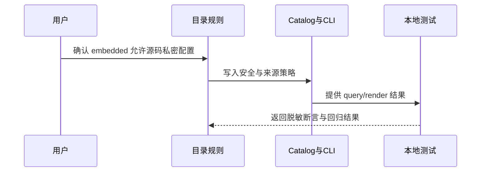

# 代码位置目录规则 V2：embedded 私密配置边界变更

结论：独立后端和同仓后端的 embedded 目录是源码内配置入口。影响：用户选择该目录即接受 API key、密钥、密码等私密值直接写入源码并随项目编译。范围：目录规则、机器 Catalog、Schema、测试和研发文档；非范围：具体后端加载器、真实项目迁移和真实密钥。变化：源码配置默认作为主来源且不要求环境变量，外部 YAML 仍禁止秘密原值。完成标准：规则、测试、文档门禁和风格回归全部通过。术语说明：embedded 是源码内 YAML 字符串配置。验证状态：需求、实施、测试、文档门禁和风格回归均已通过。

## 文档信息

| 字段 | 内容 |
|---|---|
| 文档 ID | `REQ-PSR-CONFIG-SECRET-001` |
| 来源 | 用户本轮确认的 embedded 配置安全边界 |
| 当前周期 | `CYCLE-PSR-19-001` |
| 直接落点 | 配置 Reference、Catalog/Schema、根专项测试 |
| 图片资产 | N/A；原因：无视觉验收；证据：本文 Mermaid 流程和时序图覆盖关系 |

## 普通模型零决策执行契约

- 两类后端的 embedded 源码允许直接包含私密配置；YAML 仍禁止秘密原值。
- embedded 的源码值为默认主来源，不自动要求读取或覆盖环境变量。
- 所有 Agent 输出、日志、README、错误、测试报告和知识库必须脱敏。
- 不修改具体业务项目加载器，不读取真实密钥，不连接外部服务。

## 变更范围

| 分类 | 内容 |
|---|---|
| 变更目标 | 放开两类后端 embedded 源码中的私密配置边界，并记录源码优先契约。 |
| 适用语言 | Catalog 当前支持的 Go、Java、Node.js、Python embedded 源码。 |
| 保持不变 | `config/yaml/` 与 `backend/config/yaml/` 继续禁止秘密原值；目录和文件名契约不变。 |
| 非范围 | 不修改真实后端配置加载器，不接入外部服务，不读取真实密钥，不迁移业务项目，不提交 Git。 |

## 需求来源与证据台账

| 来源 ID | 已确认事实 | 规则落点 | 证据 |
|---|---|---|---|
| `SRC-PSR-CONFIG-SECRET-001` | 用户接受 embedded 源码直接保存 API key、密钥和密码。 | Reference、Catalog、Schema | 当前用户消息 |
| `REQ-PSR-CONFIG-ENV-001` | 既有目录和 `config_<env>` 命名契约继续有效。 | CYCLE-17 规则与测试 | 既有需求与周期证据 |

## 目标与非目标

| 分类 | 内容 |
|---|---|
| 目标 | 统一 backend/fullstack embedded 的秘密策略和来源策略。 |
| 目标 | 保留 YAML 禁止秘密及所有外部输出脱敏边界。 |
| 非目标 | 不实现通用运行时配置加载器。 |
| 非目标 | 不迁移真实后端项目或读取真实秘密。 |

## 决策冻结

| 决策 ID | 结论 |
|---|---|
| `DEC-PSR-CONFIG-SECRET-001` | 独立后端和同仓后端 embedded 均允许源码内私密配置。 |
| `DEC-PSR-CONFIG-SECRET-002` | 规则覆盖所有当前支持的 embedded 语言；Go 仍遵守 `config_<env>.go` 命名。 |
| `DEC-PSR-CONFIG-SECRET-003` | embedded 源码配置是默认主来源，不要求自动读取或覆盖为环境变量。 |
| `DEC-PSR-CONFIG-SECRET-004` | 允许源码内秘密不等于允许外泄；任何 Agent/日志/文档/测试证据必须脱敏。 |

## 规则与验收

| ID | 要求 | 验收 |
|---|---|---|
| `RULE-PSR-CONFIG-SECRET-001` | backend/fullstack embedded Catalog 条目标记为允许源码内秘密。 | 两类 embedded query 返回一致策略。 |
| `RULE-PSR-CONFIG-SECRET-002` | embedded 声明源码优先、默认不依赖环境变量。 | Catalog、reference 和测试断言一致。 |
| `RULE-PSR-CONFIG-SECRET-003` | YAML 秘密禁止策略保持不变。 | YAML 正向元数据仍为禁止秘密。 |
| `RULE-PSR-CONFIG-SECRET-004` | 外部输出不得出现秘密原值。 | 文档/测试扫描和脱敏 fixture 通过。 |

- `AC-PSR-CONFIG-SECRET-001`：backend/fullstack embedded query 唯一返回允许源码秘密策略。
- `AC-PSR-CONFIG-SECRET-002`：所有支持语言的 embedded 规则保持扩展名兼容。
- `AC-PSR-CONFIG-SECRET-003`：embedded 的源码优先、默认不依赖环境变量契约可被 query/render 读取。
- `AC-PSR-CONFIG-SECRET-004`：两类 YAML query 仍返回禁止秘密策略。
- `AC-PSR-CONFIG-SECRET-005`：测试、文档、日志和 Agent 输出不包含真实秘密原值。
- `AC-PSR-CONFIG-SECRET-006`：专项测试、根测试、文档 profile、Skill 合规和 6-review 全部通过。

## 功能需求

本需求只改变配置目录的治理语义：embedded 是用户主动选择的源码配置入口，可以承载私密值；YAML 仍是外部配置入口，不能承载秘密原值；治理工具和证据输出不得回显秘密。

## 数据与外部契约

- Catalog 继续使用 JSON 兼容 YAML，新增 `secret_policy`、`source_policy` 和 `environment_variable_policy` 元数据。
- CLI 继续使用既有 `query`、`render`、`check` 和 `init` 命令，不新增参数。
- 测试只使用本地 Python、脱敏占位符和临时目录，不连接数据库、缓存、HTTP/RPC 上游。

## 风险、假设、依赖与阻断

| 类型 | 内容 | 处理 |
|---|---|---|
| 风险 | “允许源码秘密”被误解为允许日志或文档泄露。 | Reference、测试和 6-review 固化外泄禁止边界。 |
| 风险 | embedded 与 YAML 策略字段漂移。 | 四类 query、Schema 和专项断言同时校验。 |
| 假设 | 本仓库只维护目录治理，不拥有具体后端加载器。 | 将运行时实现列为非范围。 |
| 阻断 | 需要真实密钥或外部服务才能验证。 | 立即停止，改用脱敏 local fixture。 |

## 垂直切片与追踪契约

需求冻结 -> Reference/Catalog/Schema -> query/render -> 本地脱敏测试 -> 文档 profile/6-review -> 项目记忆。每个 CYCLE-19 任务均登记 IMPL、TEST、STYLE 三类证据。

## 主追踪矩阵

| 上游 | 规则 | AC | 周期/任务 | 文件/符号 | 测试/证据 |
|---|---|---|---|---|---|
| `SRC-PSR-CONFIG-SECRET-001` | `RULE-PSR-CONFIG-SECRET-001..004` | `AC-PSR-CONFIG-SECRET-001..006` | `CYCLE-19/TASK-19-01..04` | Reference、Catalog、Schema、专项测试 | `TEST-PSR-CONFIG-SECRET-001..004` |

## 流程图

图形目的：表达需求到规则和测试的闭环。关联 ID：`REQ-PSR-CONFIG-SECRET-001`、`RULE-PSR-CONFIG-SECRET-001..004`。

## 时序图

图形目的：表达用户规则、目录 Owner、CLI 和测试之间的责任顺序。关联 ID：`CYCLE-PSR-19-001`、`TEST-PSR-CONFIG-SECRET-001..004`。

## unresolved_decisions

`[]`；两类后端、语言范围、源码优先、YAML 边界和外泄禁止边界均已确认。

## 图片资产决策

图片资产决策：N/A + 原因：本需求无 UI、截图或视觉验收对象；证据：流程和时序由本文 Mermaid 图表达。

## 追踪矩阵

`SRC-PSR-CONFIG-SECRET-001 -> DEC-PSR-CONFIG-SECRET-001..004 -> RULE-PSR-CONFIG-SECRET-001..004 -> AC-PSR-CONFIG-SECRET-001..006 -> CYCLE-PSR-19-001 -> TASK-19-01..04 -> TEST-PSR-CONFIG-SECRET-001..004 -> EVD-TASK-19-*`。

## 依赖与停止条件

- 依赖：现有 CYCLE-17 配置目录命名契约、Catalog CLI 和根 `test/package-structure-rules/`。
- 停止：需要修改具体后端加载器、需要真实密钥、规则与 Catalog 漂移、任何门禁失败或发现秘密原值进入输出。
- 回滚：仅撤销本变更写集，保留 CYCLE-17 及其他会话已有未提交改动。

## 图片资产决策

N/A + 原因：本变更只涉及文本规则、Catalog 元数据和本地测试；流程关系由实施文档 Mermaid 图表达。

## 追踪入口

`SRC-PSR-CONFIG-SECRET-001` -> `DEC-PSR-CONFIG-SECRET-001..004` -> `RULE-PSR-CONFIG-SECRET-001..004` -> `AC-PSR-CONFIG-SECRET-001..006` -> `CYCLE-PSR-19-001`。
