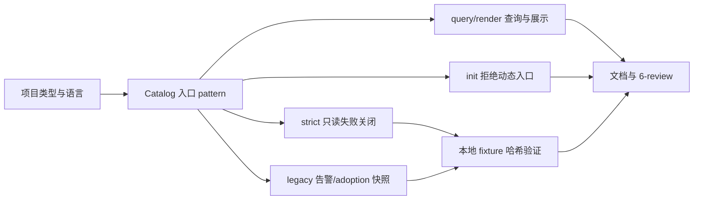
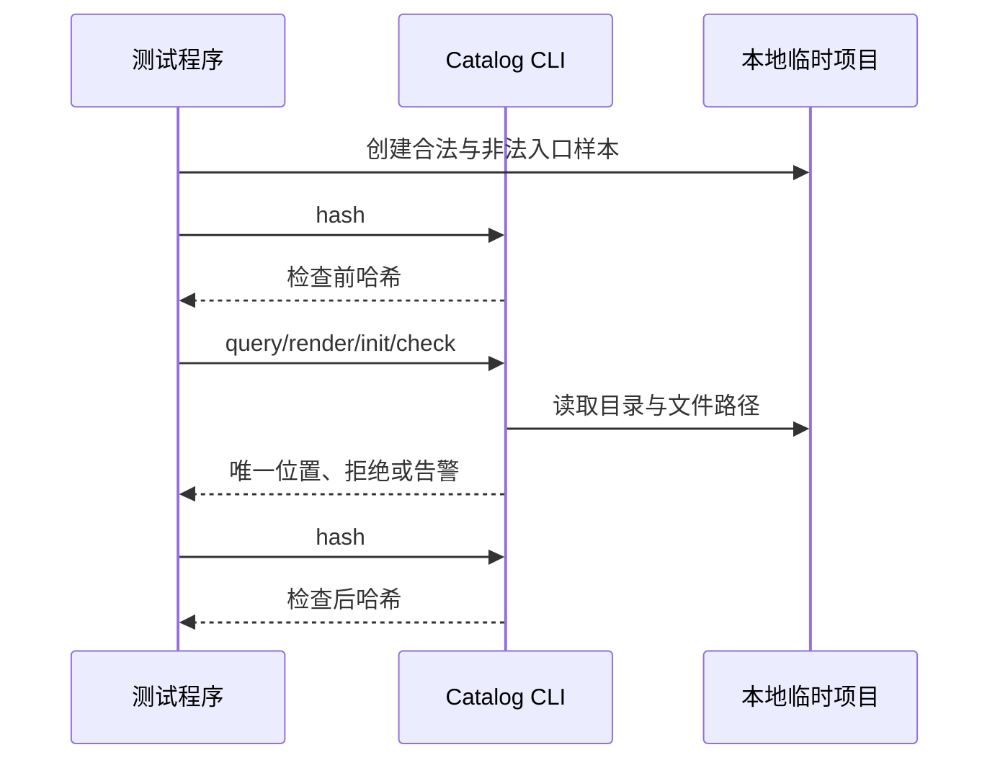

# 代码位置目录规则 V2：二进制入口与 cmd 收敛

结论：后端项目默认入口回到项目根，`cmd/` 只承载额外二进制；前后端同仓的后端入口统一以 `backend/` 为前缀。影响：目录查询、渲染、初始化和检查对入口位置给出唯一结论；范围：`package-structure-rules` 的目录树、Catalog、CLI、测试与研发文档；非范围：业务项目迁移、入口源码生成、构建发布和 Git 历史；变化：新增二进制入口 pattern 与只读检查边界；完成标准：五项 AC 均有本地测试证据；术语说明：`primary` 是默认启动入口，`additional` 是额外二进制入口；验证状态：专项入口测试 `5/5`、目录契约测试 `2/2`、文档 profile 与 `6-review` 均已通过。

## 文档信息

| 字段 | 内容 |
| --- | --- |
| 需求 ID | `REQ-PSR-BINARY-ENTRY-001` |
| 当前优先闭环 | `CYCLE-15` 的入口 pattern、策略检查和动态 init 边界。 |
| unresolved_decisions | `[]`；用户已确认入口目录与 init 边界。 |

## 需求来源与证据台账

| 来源 ID | 已冻结事实 | 证据 |
| --- | --- | --- |
| `SRC-PSR-BINARY-ENTRY-001` | 独立后端主入口应在根目录，`cmd/` 只承载其他 binary。 | 当前轮用户明确说明。 |
| `DEC-PSR-BINARY-ENTRY-001` | 同仓后端统一以 `backend/` 为入口前缀，动态入口不由 init 创建。 | 当前轮用户确认。 |

## 目标与非目标

| 类型 | 内容 |
| --- | --- |
| 目标 | 唯一查询、目录展示、只读检查和动态 init 对入口位置一致。 |
| 非目标 | N/A + 原因：不迁移真实项目，也不生成入口源码；证据：本周期只修改规则仓库和本地 fixture。 |

## 功能需求与规则要求

- `RULE-PSR-BINARY-ENTRY-001`：独立后端只允许根 `main.<ext>` 与 `cmd/<binary>/main.<ext>`。
- `RULE-PSR-BINARY-ENTRY-002`：同仓后端只允许 `backend/main.<ext>` 与 `backend/cmd/<binary>/main.<ext>`。
- `RULE-PSR-BINARY-ENTRY-003`：二进制入口为动态 pattern；`init` 显式启用必须返回 `2` 且不写占位路径。

## 决策冻结

- `primary` 是默认启动入口，不由 `init` 自动生成。
- `additional` 必须包含非空 `<binary>` 目录；`cmd/main.<ext>` 没有合法 binary 层级。
- `strict` 失败关闭，`legacy` 仅告警，`adoption` 只维持已登记历史快照，三者都只读。

## 数据与外部契约

N/A + 原因：本需求不读写数据库、HTTP/RPC 或其他外部服务；证据：所有验证使用 Python 临时目录和本地 CLI。

## 风险、假设、依赖与阻断

| 类型 | 内容 | 处理 |
| --- | --- | --- |
| 风险 | fullstack 根 `main.<ext>` 被误当后端入口。 | 以根路径负向样本和 `backend/` 正向样本验证。 |
| 风险 | `init` 创建 `<binary>`、`<ext>` 占位路径。 | pattern 启用在写入前失败，测试断言路径不存在。 |
| 阻断 | N/A + 原因：当前无外部阻断；证据：规则、CLI 和本地测试均可执行。 | 不适用。 |

## 普通模型零决策执行契约

执行模型不得自行选择入口位置、兼容路径、语言扩展或 init 行为。它只能按本需求的四条合法路径、三项策略语义、失败退出码、临时 fixture 和停止条件执行；任一不匹配立即停止并回到 Catalog 事实源。

## 当前计划最终方案的简要说明

新增二进制入口 pattern Catalog 条目，并由 CLI 统一识别合法路径。独立后端使用根 `main.<ext>` 与 `cmd/<binary>/main.<ext>`，同仓后端使用 `backend/main.<ext>` 与 `backend/cmd/<binary>/main.<ext>`；动态入口不由 `init` 创建。

## agent 对问题与目标的理解

| 项目 | 结论 |
| --- | --- |
| 用户原始诉求 | 独立后端主要入口放根目录，只有其他入口才进入 `cmd/<binary>/`；前后端同仓后端入口放 `backend/`。 |
| 本需求目标 | 让人工目录树、Catalog、`query`、`render`、`init`、`strict`、`legacy` 和 `adoption` 对上述位置保持一致。 |
| 本轮范围 | 后端独立项目、前后端同仓项目的入口规则；本地 Python CLI、根 `test/` 测试、需求/实施/审查文档。 |
| 非范围 | 前端入口、业务项目迁移、入口文件正文、构建系统、真实服务、数据库和 Git 历史。 |
| 当前优先闭环 | 先冻结路径 pattern，再完成 CLI 失败关闭与无写入行为，最后完成文档和风格回归。 |
| 关键假设 | `main.<ext>` 的扩展名沿用 CLI 支持的 Go、Java、Node.js、Python 源码扩展；后端 strict 必须显式传 `--language`。 |
| 未决项 | `[]`；用户已确认主入口和额外入口的目录边界。 |

## 冻结规则

| 项目类型 | 主入口 | 额外入口 | 禁止示例 |
| --- | --- | --- | --- |
| 独立后端 | `main.<ext>` | `cmd/<binary>/main.<ext>` | `cmd/main.go`、其他位置的 `main.<ext>` |
| 前后端同仓 | `backend/main.<ext>` | `backend/cmd/<binary>/main.<ext>` | 根 `main.go`、根 `cmd/...`、`backend/cmd/main.go` |

`<binary>` 必须是单个非空目录名，禁止把 `cmd/main.<ext>` 当作额外入口。`init` 不创建主入口或额外入口，也不创建 `<binary>`、`<ext>` 等占位路径；显式启用动态入口返回退出码 `2` 且保持目标目录未写入。

## 验收条件

- `AC-PSR-BINARY-001`：backend/fullstack 的 `query` 对 `binary-entrypoint` 的 `primary`、`additional` 各返回唯一 pattern；`render` 展示根入口和 `cmd/<binary>` 入口的职责。
- `AC-PSR-BINARY-002`：合法的四种项目入口路径可通过 strict；`cmd/main.go`、fullstack 根 `main.go`、fullstack 根 `cmd/...`、`backend/cmd/main.go` 和其他非法 `main.<ext>` 必须返回退出码 `2`。
- `AC-PSR-BINARY-003`：`init` 显式启用二进制入口返回 `2`，不得创建占位文件或占位目录；普通静态骨架行为保持不变。
- `AC-PSR-BINARY-004`：`legacy` 对相同非法入口只产生 warning 并返回 `0`；`adoption` 保留已登记历史快照边界，不自动迁移或扩张遗留路径。
- `AC-PSR-BINARY-005`：strict/legacy/adoption 检查前后 fixture 哈希相同，CLI、Catalog、目录树和引用契约术语一致。

## 需求流程图

图形目的：表达项目类型、入口 pattern 和策略检查的统一路径。
关联 ID：`REQ-PSR-BINARY-ENTRY-001`、`AC-PSR-BINARY-001` 至 `AC-PSR-BINARY-005`。

## 需求时序图

图形目的：表达检查入口如何在不改写项目文件的前提下判定合法与非法路径。
关联 ID：`RULE-PSR-BINARY-ENTRY-001`、`AC-PSR-BINARY-002`、`AC-PSR-BINARY-005`。

## 追踪矩阵

| SRC/DEC | REQ/RULE | AC | CYCLE/TASK | 文件/符号 | TEST | EVIDENCE |
| --- | --- | --- | --- | --- | --- | --- |
| `SRC-PSR-BINARY-ENTRY-001`、`DEC-PSR-BINARY-ENTRY-001` | `REQ-PSR-BINARY-ENTRY-001`、`RULE-PSR-BINARY-ENTRY-001` | `AC-PSR-BINARY-001` | `CYCLE-15/TASK-15-01` | Catalog、目录树、`query_entries`、`command_render` | `entrypoint_layout_test.py` | `EVD-TASK-15-01-*` |
| `SRC-PSR-BINARY-ENTRY-001`、`DEC-PSR-BINARY-ENTRY-001` | `RULE-PSR-BINARY-ENTRY-002` | `AC-PSR-BINARY-002`、`AC-PSR-BINARY-004` | `CYCLE-15/TASK-15-02` | `check_binary_entrypoint_path`、`command_check` | `entrypoint_layout_test.py` | `EVD-TASK-15-02-*` |
| `DEC-PSR-BINARY-ENTRY-001` | `RULE-PSR-BINARY-ENTRY-003` | `AC-PSR-BINARY-003`、`AC-PSR-BINARY-005` | `CYCLE-15/TASK-15-03` | `command_init`、Schema、引用契约 | `entrypoint_layout_test.py` | `EVD-TASK-15-03-*` |

## 风险与停止条件

- 风险：把 fullstack 根入口误判为后端入口。防护：fullstack 只接受 `backend/` 前缀正向样本，并以根 `main.<ext>`、根 `cmd/` 负向样本回归。
- 风险：`init` 创建 `<binary>` 或 `<ext>` 占位路径。防护：动态 pattern 显式失败，失败前不创建目录；测试前后哈希和目标路径断言共同证明。
- 风险：strict 为修复非法路径而改写用户文件。防护：所有策略均使用只读扫描和哈希对比。
- 停止条件：任一合法路径被拒绝、非法路径被放行、策略写入 fixture、Catalog 与渲染树不一致，立即停止收口。

## 交付边界

不连接数据库、缓存、消息队列、HTTP/RPC 上游或非 local 环境；不访问真实业务项目；不迁移、删除或重命名用户入口文件；不执行 Git commit、push 或其它历史写入。

## 追踪契约

每个 `SRC/DEC` 均映射到 `REQ/RULE`，每个 `RULE` 均映射到 AC、`CYCLE-15`、`TASK-15-*`、文件/符号和 `TEST-PSR-BINARY-*`。测试通过后以 `EVD-TASK-15-01-*` 至 `EVD-TASK-15-03-*` 记录实现、测试和风格证据；不存在孤立 ID。

## 图片资产决策

图片资产决策：N/A + 原因：入口位置、策略分流和任务依赖可由 Mermaid 与文本精确表达，不需要位图；证据：本需求没有 UI、截图或视觉产物验收条件。
