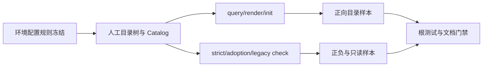
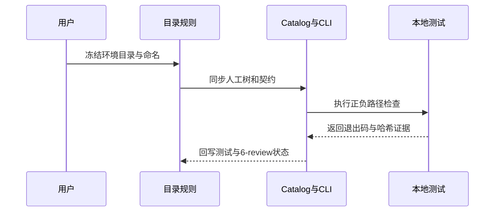

# 代码位置目录规则 V2：环境配置文件命名收敛

结论：后端配置按环境拆分为 `config_<env>` 文件，独立后端使用 `config/`，同仓后端使用 `backend/config/`；YAML 规则通用，Go embedded 规则采用 `.go` 文件名契约。影响：配置目录从“只规定扩展名”升级为可查询、可检查的环境文件规则。范围：目录说明、Catalog、Schema、CLI、测试和研发文档。非范围：真实业务项目迁移、配置加载逻辑、秘密原值和其他语言 embedded 命名。变化：新增标准环境示例、可扩展环境名和策略文件命名检查。完成标准：验收条件均有本地行为证据，策略检查与初始化语义保持一致。术语说明：环境文件是按部署环境拆分的配置文件，embedded 是源码内 YAML 字符串配置。验证状态：需求文档已冻结，行为实现和测试按当前实施周期执行。

## 文档信息

| 字段 | 内容 |
|---|---|
| 文档 ID | `REQ-PSR-CONFIG-ENV-001` |
| 来源 | 用户确认的后端配置目录与环境文件命名要求 |
| 当前状态 | `accepted`；实现承接 CYCLE-17 |
| 直接落点 | 配置 reference、Catalog/Schema、`placement_catalog.py`、根配置行为测试 |
| 图片资产 | N/A；原因：无 UI 或视觉验收；证据：本文 Mermaid 流程和时序图覆盖关系 |

## 目标与非目标

| 分类 | 内容 |
|---|---|
| 目标 | 让独立后端和同仓 backend 的 YAML/Go embedded 环境文件有唯一目录和命名契约。 |
| 目标 | 让人工目录树、Catalog、query、render、init 和 check 结论一致。 |
| 非目标 | 不迁移真实项目，不创建配置文件，不修改配置加载逻辑。 |
| 非目标 | 不强制 `local/test/prod` 三份齐全，不强制 YAML 与 embedded 配对。 |

## 普通模型零决策执行契约

- 先查询 Catalog，再创建或引用 `config/yaml`、`config/embedded` 或其 `backend/` 前缀路径。
- YAML 只能直接放置 `config_<env>.yaml` 或 `config_<env>.yml`。
- Go embedded 只能直接放置 `config_<env>.go`；不得继续使用 `config_test_yaml.go`。
- 不得新增 `config/examples`、`config/schema`、`config/loader` 或 `config/defaults`。
- strict/adoption 只读检查；legacy 只告警；init 不生成动态环境文件。

## 需求来源与证据台账

| 来源 ID | 已确认事实 | 规则落点 | 证据 |
|---|---|---|---|
| `SRC-PSR-CONFIG-ENV-001` | 配置按环境拆分，Go 示例使用 `config_prod.go`、`config_test.go`、`config_local.go`。 | `configuration-layout.md`、Catalog、CLI | 用户当前确认 |
| `SRC-PSR-CONFIG-ENV-001` | 同仓后端配置位于 `backend/config/`，继承独立后端规则。 | `project-layout-v2.md`、fullstack Catalog | 用户前序确认 |

## 功能需求

本需求要求独立后端和同仓后端按环境拆分配置文件，并为 YAML 与源码内 YAML 字符串配置提供唯一目录、文件名和检查契约。

## 功能需求与规则要求

## 决策冻结

| 决策 ID | 结论 |
|---|---|
| `DEC-PSR-CONFIG-ENV-001` | `local`、`test`、`prod` 是标准环境，但只校验已有文件，不要求三份齐全。 |
| `DEC-PSR-CONFIG-ENV-002` | 环境名使用小写标识符 `[a-z][a-z0-9_]*`，允许增加 `dev`、`staging`、`pre_prod` 等环境。 |
| `DEC-PSR-CONFIG-ENV-003` | YAML 使用 `config_<env>.yaml` 或兼容的 `config_<env>.yml`；Go embedded 使用 `config_<env>.go`。 |
| `DEC-PSR-CONFIG-ENV-004` | YAML 与 embedded 不要求环境配对；embedded 本次只强制 Go，其他语言维持扩展名兼容。 |
| `DEC-PSR-CONFIG-ENV-005` | fullstack 的 `backend/config/` 继承独立后端同一规则。 |

| ID | 要求 | 验收 |
|---|---|---|
| `REQ-PSR-CONFIG-ENV-001` | 人工目录树说明 `yaml/` 与 `embedded/` 的环境文件示例、职责和安全边界。 | `project-layout-v2.md` 与 `configuration-layout.md` 术语一致。 |
| `RULE-PSR-CONFIG-ENV-001` | YAML 文件名必须是 `config_<env>.yaml|yml`，环境名符合小写标识符。 | 合法标准/扩展环境通过，非法名称失败。 |
| `RULE-PSR-CONFIG-ENV-002` | Go embedded 文件名必须是 `config_<env>.go`，且直接位于 embedded 根。 | `config_local.go` 通过，`config_test_yaml.go` 或嵌套路径失败。 |
| `RULE-PSR-CONFIG-ENV-003` | 独立后端和 fullstack backend 前缀均可查询和检查。 | 四个 config query 唯一返回。 |
| `RULE-PSR-CONFIG-ENV-004` | strict/adoption 失败关闭，legacy 仅告警，check 不写入。 | 三种策略和前后哈希测试通过。 |
| `RULE-PSR-CONFIG-ENV-005` | init 只创建目录，不生成未知环境文件。 | 临时项目无动态配置文件。 |

## 验收标准

- `AC-PSR-CONFIG-001`：两类项目的目录树都展示标准环境示例。
- `AC-PSR-CONFIG-002`：backend/fullstack 的 yaml/embedded query 各返回唯一条目和契约元数据。
- `AC-PSR-CONFIG-003`：标准环境、扩展环境、单文件和 `.yml` 兼容通过。
- `AC-PSR-CONFIG-004`：非法文件名、扩展名、嵌套目录和错误位置失败。
- `AC-PSR-CONFIG-005`：缺少标准环境或跨目录配对不失败。
- `AC-PSR-CONFIG-006`：init 不生成 `config_<env>` 动态文件。
- `AC-PSR-CONFIG-007`：strict/adoption/legacy 和只读哈希语义保持。
- `AC-PSR-CONFIG-008`：秘密策略与非 Go embedded 扩展名兼容不回归。

## 数据与外部契约

- Catalog 继续使用 JSON 兼容 YAML；新增环境文件契约字段，不新增外部服务依赖。
- CLI 继续使用 `query`、`render`、`init`、`check`；不新增命令行参数。
- YAML 接受 `.yaml/.yml`；Go embedded 只新增 `.go` 文件名规则；其他语言扩展名保持现有兼容。
- 所有测试样本由本地 Python 临时目录生成；不读取 test/prod 连接配置。

## 风险、假设、依赖与阻断

本需求依赖现有 JSON 兼容 YAML Catalog、Python 标准库、CYCLE-15/CYCLE-16 基线和根 `test/`。不连接数据库、缓存、HTTP 上游或非 local 环境。不迁移真实项目，不删除旧项目文件。主要风险是目录树、Catalog 与 CLI 命名漂移，使用 query/render/strict/legacy/adoption/init 同轮测试拦截。

| 类型 | 内容 | 处理 |
|---|---|---|
| 风险 | Catalog 和人工树新增 fullstack backend 前缀时可能漂移。 | query/render 和正向 fixture 同时断言。 |
| 风险 | strict 检查误写用户文件。 | 临时 fixture 前后哈希断言，check 不提供写操作。 |
| 假设 | `.yml` 是现有兼容扩展，继续保留。 | 文档首选 `.yaml`，测试保留 `.yml` 正例。 |
| 阻断 | Obsidian 固定 vault 当前未注册。 | 不用文件系统替代；仅阻断知识沉淀，不阻断本地规则实现。 |

## 主追踪矩阵

| 上游 | 需求/规则 | AC | 周期/任务 | 文件/符号 | 测试 |
|---|---|---|---|---|---|
| `SRC/DEC-PSR-CONFIG-ENV-001` | `REQ/RULE-PSR-CONFIG-ENV-001..005` | `AC-PSR-CONFIG-001..008` | `CYCLE-17/TASK-17-01..05` | configuration reference、Catalog/Schema、CLI、根测试 | `TEST-PSR-CONFIG-001..006` |

## 垂直切片与追踪契约

规则定义 -> 人工目录树/Catalog -> query/render/init/check -> 临时正负 fixture -> 文档 profile/6-review。每个 CYCLE-17 任务必须同时登记 `IMPL`、`TEST`、`STYLE` 三类证据；未完成当前任务三类证据前不得推进下一任务。

## 流程图

图形目的：表达环境文件从规则定义到检查和证据收口的端到端流程。关联 ID：`REQ-PSR-CONFIG-ENV-001`、`RULE-PSR-CONFIG-ENV-001` 至 `005`、`AC-PSR-CONFIG-001` 至 `008`。

## 追踪入口

`SRC-PSR-CONFIG-ENV-001` -> `DEC-PSR-CONFIG-ENV-001..005` -> `REQ/RULE-PSR-CONFIG-ENV-001..005` -> `AC-PSR-CONFIG-001..008` -> `CYCLE-17` -> `TASK-17-01..05` -> `TEST-PSR-CONFIG-001..006` -> `EVD-TASK-17-*`。

## 时序图

图形目的：表达用户冻结规则、Catalog/CLI 实现和测试收口的参与顺序。关联 ID：`REQ-PSR-CONFIG-ENV-001`、`CYCLE-17`、`TEST-PSR-CONFIG-001..006`。

## 图片资产决策

图片资产决策：N/A + 原因：本需求只调整文本目录和 CLI 契约，不涉及 UI 或视觉验收；证据：本文 Mermaid 流程图和时序图已表达执行关系。

## unresolved_decisions

`[]`；用户已确认环境集合、完整性、Go 语言范围、同仓继承和强制检查力度，无未决 P0/P1。
