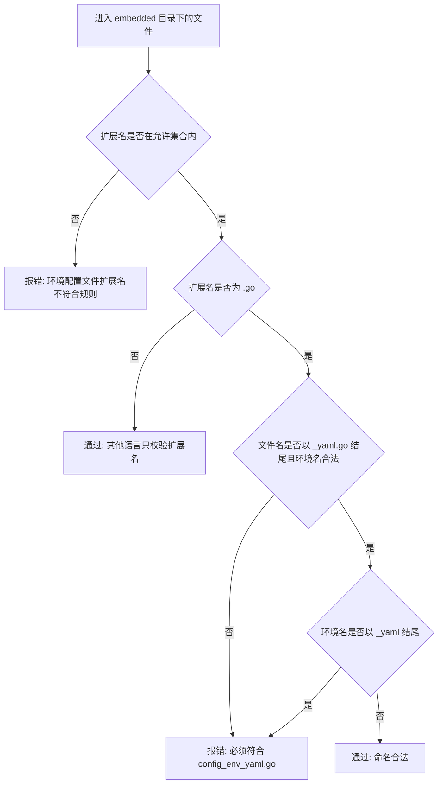
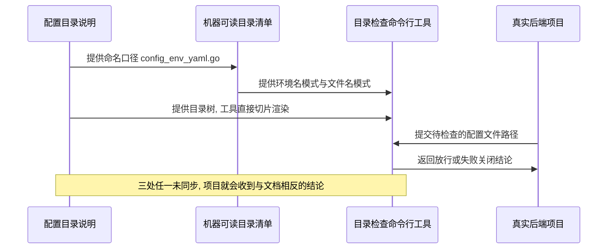

# 代码位置目录规则 V2：embedded 配置文件名格式后置

结论：源码内嵌配置文件名从 `config_<env>.go` 改成 `config_<env>_yaml.go`，把格式名 `yaml` 放到环境名后面。影响：所有按本规则组织后端配置的 Go 项目，以及负责检查目录规则的自动化入口。范围：`package-structure-rules` 的配置目录说明、机器可读目录清单、目录检查命令行工具、根 `test/` 回归用例和项目长期记忆。非范围：外部 YAML 文件命名、配置目录位置、秘密原值边界、二进制入口规则、其他语言的内嵌配置文件名强制校验，以及任何真实业务仓库的文件改名。变化：`config_test.go` 由合法变为非法，`config_test_yaml.go` 由非法变为合法，检查工具的判定方向整体反转。完成标准：新命名在严格检查下放行、旧命名与重复格式名两类写法失败关闭、目录检查全程只读，且跨周期回归用例不受影响。术语说明：`embedded` 指把 YAML 配置内容直接写在源码文件里的做法，用于让配置随程序编译进二进制、不依赖外部文件；`环境名` 指 `local`、`test`、`prod` 这类区分部署环境的短名；`格式后置` 指把 `yaml` 这个格式标记放在环境名之后而不是之前。验证状态：需求已冻结，实现、真实测试与风格回归均已在本次实施周期内完成。

## 文档信息

| 项目 | 内容 |
|---|---|
| 文档编号 | `REQ-PSR-CONFIG-ENV-002` |
| 修订对象 | `REQ-PSR-CONFIG-ENV-001`（CYCLE-17 冻结的配置文件命名口径） |
| 归属实施总览 | `IMP-PSR-V2-001` |
| 当前切片 | `CYCLE-20 embedded 配置文件名格式后置` |
| 状态 | accepted |
| unresolved_decisions | 无。两处关键取舍已由用户在本轮直接选定，见「决策冻结」。 |

## 需求来源与证据台账

| 来源 ID | 来源 | 事实 | 证据 |
|---|---|---|---|
| `SRC-PSR-CONFIG-ENV-002` | 用户本轮反馈 | 现有 `config_<env>` 顺序会踩到语言限制，Go 不允许 `config_test.go` 作为普通源码文件；要求统一改成 `config_<env>_yaml` | 用户消息原文 |
| `SRC-PSR-CONFIG-ENV-002` | Go 工具链约定 | 以 `_test.go` 结尾的文件被视为测试文件：`go build` 将其排除，`go test` 将其编译进测试包，因此内嵌配置无法进入生产构建产物 | Go 官方构建约定 |
| `SRC-PSR-CONFIG-ENV-002` | 仓库内既有不一致 | `test-strategy-rules/SKILL.md` 举的真实项目示例本来就是 `go-admin/config/config_local_yaml.go`，与 CYCLE-17 冻结的口径相反 | `test-strategy-rules/SKILL.md:134` |
| `SRC-PSR-CONFIG-ENV-002` | 现行实现 | 目录检查工具当时**主动拒绝** `_yaml.go` 结尾的文件名，正是本次要反转的判断 | `package-structure-rules/scripts/placement_catalog.py` 的 `check_environment_config_path` |

问题的实质是：CYCLE-17 在冻结命名时只考虑了"配置文件按环境拆分"这一条业务需要，没有考虑文件名会落进编程语言的保留命名空间。`test` 既是标准环境名，也是 Go 的测试文件后缀，两者相撞，规则写出来的文件在真实项目里编译不进去。

## 目标与非目标

| 类别 | 内容 |
|---|---|
| 目标 | 让规则产出的内嵌配置文件名在任何语言里都不会被当作特殊文件 |
| 目标 | 让规则与仓库内已有的真实项目示例一致，消除自相矛盾 |
| 目标 | 让检查工具能明确指出旧命名的问题，而不是放行 |
| 非目标 | 不改外部 YAML 文件命名，它不参与编译，不存在冲突 |
| 非目标 | 不改配置目录位置、秘密原值边界和二进制入口规则 |
| 非目标 | 不为 Java、Node.js、Python 的内嵌配置新增文件名强制校验 |
| 非目标 | 不迁移任何真实业务仓库的现有文件 |

## 决策冻结

以下两项由用户在本轮直接选定，属于冻结决策，执行时不得再自行取舍：

| 决策 ID | 决策点 | 冻结结论 | 理由 |
|---|---|---|---|
| `DEC-PSR-CONFIG-ENV-002-A` | `_yaml` 后缀加在哪些文件上 | 只加在内嵌源码文件上。外部 YAML 保持 `config_<env>.yaml`、`config_<env>.yml` 不变 | 语言冲突只发生在会被编译的源码文件上。外部 YAML 加后缀会变成 `config_test_yaml.yaml`，格式名重复且没有解决任何问题 |
| `DEC-PSR-CONFIG-ENV-002-B` | 旧命名是否继续兼容 | 硬切换。严格检查下只认新命名，`config_<env>.go` 变为非法 | 双轨会让规则失去唯一口径，自动生成新文件时仍可能踩坑。老项目已有 `legacy` 与 `adoption` 两档过渡策略，不需要在规则层再留后门 |

## 功能需求与规则要求

| 规则 ID | 规则 | 判定方 |
|---|---|---|
| `RULE-PSR-CONFIG-ENV-006` | Go 内嵌配置文件名必须是 `config_<env>_yaml.go`，格式名后置 | 目录检查工具的严格策略 |
| `RULE-PSR-CONFIG-ENV-007` | 环境名不得以 `_yaml` 结尾，避免 `config_test_yaml_yaml.go` 这类环境名与格式名无法唯一切分的文件名 | 目录检查工具的严格策略 |
| `RULE-PSR-CONFIG-ENV-008` | 外部 YAML 文件名不加 `_yaml` 后缀，继续沿用 `config_<env>.yaml` 或 `config_<env>.yml` | 目录检查工具的严格策略 |
| `RULE-PSR-CONFIG-ENV-009` | 文件名契约只对 `.go` 强制。Java、Node.js、Python 等内嵌配置仍只校验源码扩展名，沿用 CYCLE-17 的口径 | 目录检查工具的严格策略 |
| `RULE-PSR-CONFIG-ENV-010` | 配置目录说明、机器可读目录清单和目录树渲染必须表达同一命名口径，不得互相漂移 | 根 `test/` 回归用例 |

目标形态如下：

```text
config/
├── yaml/
│   ├── config_prod.yaml
│   ├── config_test.yaml
│   └── config_local.yaml
└── embedded/
    ├── config_prod_yaml.go
    ├── config_test_yaml.go
    └── config_local_yaml.go
```

## 范围与边界

| 边界 ID | 边界 |
|---|---|
| `BOUND-PSR-CONFIG-ENV-002` | 只改规则资产与其回归用例，不连接任何数据库、缓存或外部服务，不启动业务程序 |
| `BOUND-PSR-CONFIG-ENV-002` | 不改动 `AGENTS.md`、`CLAUDE.md`、`test-strategy-rules`：它们用 `config_local*`、`config_test*` 通配匹配，新文件名照样命中 |
| `BOUND-PSR-CONFIG-ENV-002` | 不改 `package-structure-rules/SKILL.md`，因此不触发技能字典重新生成 |
| `BOUND-PSR-CONFIG-ENV-002` | CYCLE-17 及更早的历史文档只读，不回溯改写 |

### 判定流程

图形目的：说明检查工具对一个内嵌配置文件名的判定顺序，避免执行时把语言分流和命名校验的先后搞反。关联 ID：`RULE-PSR-CONFIG-ENV-006`、`RULE-PSR-CONFIG-ENV-007`、`RULE-PSR-CONFIG-ENV-009`。



### 规则、工具与项目的协作顺序

图形目的：说明规则文档、机器可读清单、检查工具和真实项目之间的信息传递顺序，说明为什么三处口径必须同时改。关联 ID：`RULE-PSR-CONFIG-ENV-010`、`AC-PSR-CONFIG-010`。



## 非功能要求、风险与阻断

| 项目 | 内容 |
|---|---|
| 只读要求 | 目录检查必须全程只读，检查前后目标目录摘要必须一致 |
| 策略语义 | `strict`、`legacy`、`adoption` 三档的成功与失败语义不得因本次改动漂移 |
| 编码要求 | 所有改动文件保持 UTF-8 与原有换行风格，不得批量转换换行 |
| 风险 | 环境名允许下划线，正则贪婪匹配会把 `config_test_yaml_yaml.go` 的环境名解析成 `test_yaml` 而误放行。缓解：`RULE-PSR-CONFIG-ENV-007` 显式排除以 `_yaml` 结尾的环境名 |
| 风险 | 反转判定方向时可能顺手改动无关的外部 YAML 分支。缓解：回归用例同时锚定 YAML 命名模式未变 |
| 阻断项 | 无。本需求不依赖外部环境、网络或第三方服务 |
| 假设 | 假设仓库现有 `legacy` 与 `adoption` 策略足以承载老项目过渡，本轮不新增迁移工具。该假设已由 `DEC-PSR-CONFIG-ENV-002-B` 冻结 |

## 完成条件

| 条件 ID | 完成条件 | 判定方式 |
|---|---|---|
| `AC-PSR-CONFIG-009` | 两类后端项目的内嵌配置查询都返回 `config_<env>_yaml.go` 作为 Go 文件名模式 | 目录检查工具的查询命令 |
| `AC-PSR-CONFIG-010` | 目录树渲染同时含新的内嵌命名占位与未改动的外部 YAML 占位 | 目录检查工具的渲染命令 |
| `AC-PSR-CONFIG-011` | `config_local_yaml.go`、`config_dev_yaml.go` 在严格检查下放行 | 根 `test/` 正向用例 |
| `AC-PSR-CONFIG-012` | `config_test.go` 与 `config_test_yaml_yaml.go` 在严格检查下失败关闭，且目录摘要不变 | 根 `test/` 反向用例 |
| `AC-PSR-CONFIG-013` | `config_local.java` 继续放行，证明文件名契约只对 Go 强制 | 根 `test/` 正向用例 |
| `AC-PSR-CONFIG-014` | 外部 YAML 文件名模式与秘密边界策略保持 CYCLE-17 结论不变 | 根 `test/` 既有用例 |
| `AC-PSR-CONFIG-015` | 项目长期记忆中被本次推翻的稳定决策已改写，不再与新口径矛盾 | `PROJECT_MEMORY.md` 复核 |

## 普通模型零决策执行契约

执行模型不需要再做任何业务或技术取舍，以下内容已全部冻结：

| 项目 | 冻结内容 |
|---|---|
| 后缀范围 | 只有内嵌源码文件加 `_yaml`；外部 YAML 不加。见 `DEC-PSR-CONFIG-ENV-002-A` |
| 兼容策略 | 硬切换，旧命名变非法。见 `DEC-PSR-CONFIG-ENV-002-B` |
| 语言范围 | 只对 `.go` 强制文件名，其他语言不新增校验。见 `RULE-PSR-CONFIG-ENV-009` |
| 环境名约束 | 沿用 `[a-z][a-z0-9_]*`，额外排除以 `_yaml` 结尾。见 `RULE-PSR-CONFIG-ENV-007` |
| 错误文案 | 保留 `Go embedded` 开头，因为回归用例用它做子串断言 |
| 免测边界 | N/A + 原因：本需求改动检查工具的可执行判定行为，不属于纯文档或纯排版场景 + 证据：`AC-PSR-CONFIG-011` 与 `AC-PSR-CONFIG-012` 均由根 `test/` 用例判定，不允许以静态检查或人工阅读替代 |
| 提交边界 | 本需求不授权任何写入 Git 历史的动作 |

## 图片资产决策

图片资产决策：N/A + 原因：本需求不涉及界面、截图或视觉验收对象 + 证据：判定顺序与协作顺序已由本文两张 Mermaid 图表达，无需位图资产。

## 追踪矩阵

| SRC | DEC | RULE | AC | CYCLE/TASK | 文件/符号 | TEST | EVIDENCE |
|---|---|---|---|---|---|---|---|
| `SRC-PSR-CONFIG-ENV-002` | `DEC-PSR-CONFIG-ENV-002-A` | `RULE-PSR-CONFIG-ENV-006`、`008` | `AC-PSR-CONFIG-009`、`010`、`014` | `CYCLE-20/T20-01` | `configuration-layout.md`、`project-layout-v2.md`、`placement-catalog.yaml` | `TEST-PSR-CONFIG-002-A` | `EVD-T20-01-IMPL`、`EVD-T20-01-TEST`、`EVD-T20-01-STYLE` |
| `SRC-PSR-CONFIG-ENV-002` | `DEC-PSR-CONFIG-ENV-002-B` | `RULE-PSR-CONFIG-ENV-006`、`007`、`009` | `AC-PSR-CONFIG-011`、`012`、`013` | `CYCLE-20/T20-02` | `placement_catalog.py` 的 `check_environment_config_path`、`configuration_layout_test.py` | `TEST-PSR-CONFIG-002-B` | `EVD-T20-02-IMPL`、`EVD-T20-02-TEST`、`EVD-T20-02-STYLE` |
| `SRC-PSR-CONFIG-ENV-002` | `DEC-PSR-CONFIG-ENV-002-A` | `RULE-PSR-CONFIG-ENV-010` | `AC-PSR-CONFIG-015` | `CYCLE-20/T20-02` | `PROJECT_MEMORY.md` 配置稳定决策条目 | `TEST-PSR-CONFIG-002-B` | `EVD-T20-02-IMPL` |

## 追踪契约

| 契约项 | 约定 |
|---|---|
| 链路形态 | `SRC -> DEC -> RULE -> AC -> CYCLE/TASK -> 文件/符号 -> TEST -> EVIDENCE`，本需求的三条链路在上表中均已闭合 |
| 证据类别 | 每个最小任务必须同时产出实现、真实测试和风格回归三类证据，缺任一类视为该任务未闭环 |
| 证据落点 | 实现证据落在实施周期文档的文件与符号契约，真实测试证据落在 `doc/5-tests/` 任务目录，风格回归证据落在 `doc/6-review/` |
| 孤立 ID | 本需求不允许出现未被上表引用的 `RULE` 或 `AC`；新增规则必须同步补链 |
| 历史关系 | 本需求修订 `REQ-PSR-CONFIG-ENV-001` 的命名结论，其余结论继续有效，历史文档只读不回改 |
