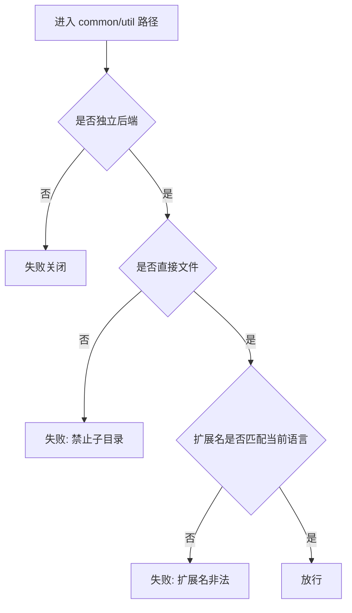
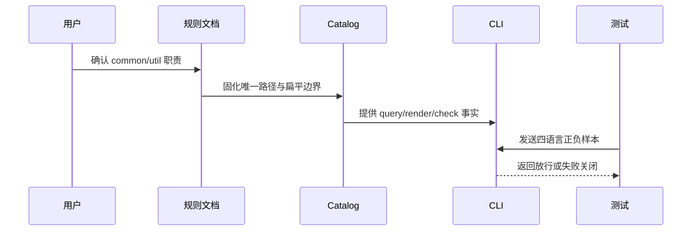

# 代码位置目录规则 V2：独立后端 common/util 落点变更

结论：独立后端中需要引用项目配置、公共结构或其他项目包、但不承载业务流程的工具函数统一放入 `common/util/`；根 `utils/<package>/` 继续只承载项目无关、可独立复制的工具包或 SDK。影响：规则查询、初始化、strict 检查和相邻公共工具说明的落点统一变化。范围：规则文档、目录树、Catalog、Schema、CLI、相邻 `common-util-rules`、活动测试和项目四件套。非范围：真实业务项目迁移、根 `utils` 职责、前端工具目录和 Git 历史写入。变化：源码根 `util/` 从新代码规范位置改为废弃位置，`common/util/` 成为独立后端唯一项目关联工具落点。完成标准：四种语言正向检查通过，错误扩展、子目录、旧位置和非 backend 根 `common/util` 失败关闭，目录检查保持只读。术语说明：`common/util/` 是独立后端公共层下直接存放项目关联工具函数的扁平目录；根 `utils/<package>/` 是不依赖项目其他包、可独立复制的技术工具包目录。验证状态：实现与专项测试已完成；文档 profile、风格回归与 Skill 合规门禁均通过。根测试中与本轮无关的历史 fixture 失败作为基线限制保留。

## 文档信息

| 项目 | 内容 |
|---|---|
| 文档编号 | `REQ-PSR-COMMON-UTIL-001` |
| 归属实施周期 | `CYCLE-PSR-22-001` |
| 状态 | accepted |
| unresolved_decisions | 无；三项目录职责与迁移决策已冻结 |

## 需求来源与证据台账

| 来源 ID | 来源 | 事实 | 证据 |
|---|---|---|---|
| `SRC-PSR-COMMON-UTIL-001` | 用户本轮确认 | 独立后端 `common/` 下新增与根 `utils/` 不同职责的 `util/` 目录 | 用户消息 |
| `SRC-PSR-COMMON-UTIL-001` | 当前 Catalog | 原源码根 util 存在四语言分支，需收敛为一个稳定查询落点 | `placement-catalog.yaml` |

## 目标与非目标

| 类别 | 内容 |
|---|---|
| 目标 | 独立后端项目关联工具唯一落在 `common/util/`，根 `utils/<package>/` 职责保持不变 |
| 非目标 | 不自动迁移真实项目，不改变前端工具目录，不写入 Git 历史 |

## 决策冻结

| ID | 决策 | 结论 |
|---|---|---|
| `DEC-PSR-COMMON-UTIL-001-A` | `common/util` 与源码根 `util` 是否共存 | 不共存；新规范唯一落点为独立后端 `common/util/` |
| `DEC-PSR-COMMON-UTIL-001-B` | 目录内容边界 | 只直接存放当前语言源码文件，禁止子目录和业务流程 |
| `DEC-PSR-COMMON-UTIL-001-C` | 旧项目处理 | 不自动搬移；旧源码根由 adoption legacy 快照渐进迁移 |

## 功能需求与规则要求

| 规则 ID | 规则 | 验证 |
|---|---|---|
| `RULE-PSR-COMMON-UTIL-001` | Catalog 只存在一个 `backend.common.util` 条目，规范路径为 `common/util`，并声明扁平文件 | Catalog 测试 |
| `RULE-PSR-COMMON-UTIL-002` | `common/util` 只允许 Go、Java、Node.js、Python 当前语言扩展名直接文件 | strict 行为测试 |
| `RULE-PSR-COMMON-UTIL-003` | 子目录、错误扩展名和根 `utils` 直接文件失败关闭 | strict 反向测试 |
| `RULE-PSR-COMMON-UTIL-004` | 新项目源码根 `util` 失败关闭；adoption 快照仍可维护既有内容 | strict/adoption 回归 |
| `RULE-PSR-COMMON-UTIL-005` | 非独立后端根级 `common/util` 失败关闭 | frontend/fullstack 负向测试 |
| `RULE-PSR-COMMON-UTIL-006` | `source-util` 仅作为兼容查询别名，返回 `common/util` | CLI 查询测试 |

## 非功能要求、风险与阻断

- 目录检查只读；所有行为测试使用本地 Python 和临时目录。
- 风险：移除旧 Catalog 条目可能影响旧查询脚本；缓解：保留 `source-util` 兼容查询别名。
- 阻断：无新增外部依赖；根测试已有历史 fixture 路径漂移失败，不改变本轮范围。

## 完成条件

| AC | 完成条件 | 证据 |
|---|---|---|
| `AC-PSR-COMMON-UTIL-001` | query、render、init 与 Catalog 统一表达 `common/util` | `backend_common_util_layout_test.py` |
| `AC-PSR-COMMON-UTIL-002` | 四种语言直接文件放行，错误扩展和子目录拒绝 | `backend_common_util_layout_test.py` |
| `AC-PSR-COMMON-UTIL-003` | 根 `utils` 直接文件、源码根旧 `util`、非 backend `common/util` 拒绝 | `backend_common_util_layout_test.py` |
| `AC-PSR-COMMON-UTIL-004` | 目录检查只读，现有测试与文档门禁不回归 | 根测试、文档 profile、diff/编码检查 |

## 追踪矩阵

| SRC | DEC | RULE | AC | CYCLE/TASK | 文件/符号 | TEST | EVIDENCE |
|---|---|---|---|---|---|---|---|
| `SRC-PSR-COMMON-UTIL-001` | `DEC-PSR-COMMON-UTIL-001-A/B` | `RULE-PSR-COMMON-UTIL-001/002/006` | `AC-PSR-COMMON-UTIL-001` | `CYCLE-PSR-22/T22-01` | Catalog、Schema、目录树、CLI | `TEST-PSR-COMMON-UTIL-001` | `EVD-T22-01-TEST` |
| `SRC-PSR-COMMON-UTIL-001` | `DEC-PSR-COMMON-UTIL-001-B/C` | `RULE-PSR-COMMON-UTIL-003/004/005` | `AC-PSR-COMMON-UTIL-002/003` | `CYCLE-PSR-22/T22-02` | `check_common_util_path`、旧路径检查 | `TEST-PSR-COMMON-UTIL-001` | `EVD-T22-02-TEST` |
| `SRC-PSR-COMMON-UTIL-001` | `DEC-PSR-COMMON-UTIL-001-A/B/C` | `RULE-PSR-COMMON-UTIL-001..006` | `AC-PSR-COMMON-UTIL-004` | `CYCLE-PSR-22/T22-03` | 四件套与文档 | 文档 profile、6-review | `EVD-T22-03-DOC` |

## 判定流程

图形目的：说明 `common/util` 的文件边界判定顺序。关联 ID：`RULE-PSR-COMMON-UTIL-002`、`RULE-PSR-COMMON-UTIL-003`。

## 规则与验证顺序

图形目的：说明规则文档、Catalog、CLI 与测试之间的端到端关系。关联 ID：`AC-PSR-COMMON-UTIL-001`、`AC-PSR-COMMON-UTIL-004`。

## 普通模型零决策执行契约

| 项目 | 冻结内容 |
|---|---|
| 新代码落点 | 独立后端 `common/util/<function>.<ext>` |
| 项目无关工具 | 根 `utils/<package>/` |
| 旧位置 | 源码根 `util/` 只可由 adoption legacy 快照维护 |
| 免测 | N/A + 原因：CLI 判定行为必须真实运行测试 + 证据：`TEST-PSR-COMMON-UTIL-001` |

## 追踪契约

- 链路必须保持 `SRC -> DEC -> RULE -> AC -> CYCLE/TASK -> 文件/符号 -> TEST -> EVIDENCE`。
- 每个 AC 必须有正向或反向真实测试，不得以静态阅读替代行为证据。
- 本需求无图片资产：N/A + 原因：不涉及界面或截图 + 证据：两张 Mermaid 流程图表达全部判定关系。

## 图片资产决策

图片资产决策：N/A + 原因：本需求不涉及界面、截图或视觉验收对象 + 证据：判定流程和端到端顺序已由两张 Mermaid 图表达。

## 约束

- 真实测试只使用本地 Python 与临时目录，不连接数据库、缓存、消息队列或外部服务。
- 免测：N/A + 原因：本次修改 CLI 可执行判定，必须运行行为测试；静态阅读不能替代真实测试。
- 提交边界：本需求不授权 commit、push、rebase、merge 或其它 Git 历史写入。
