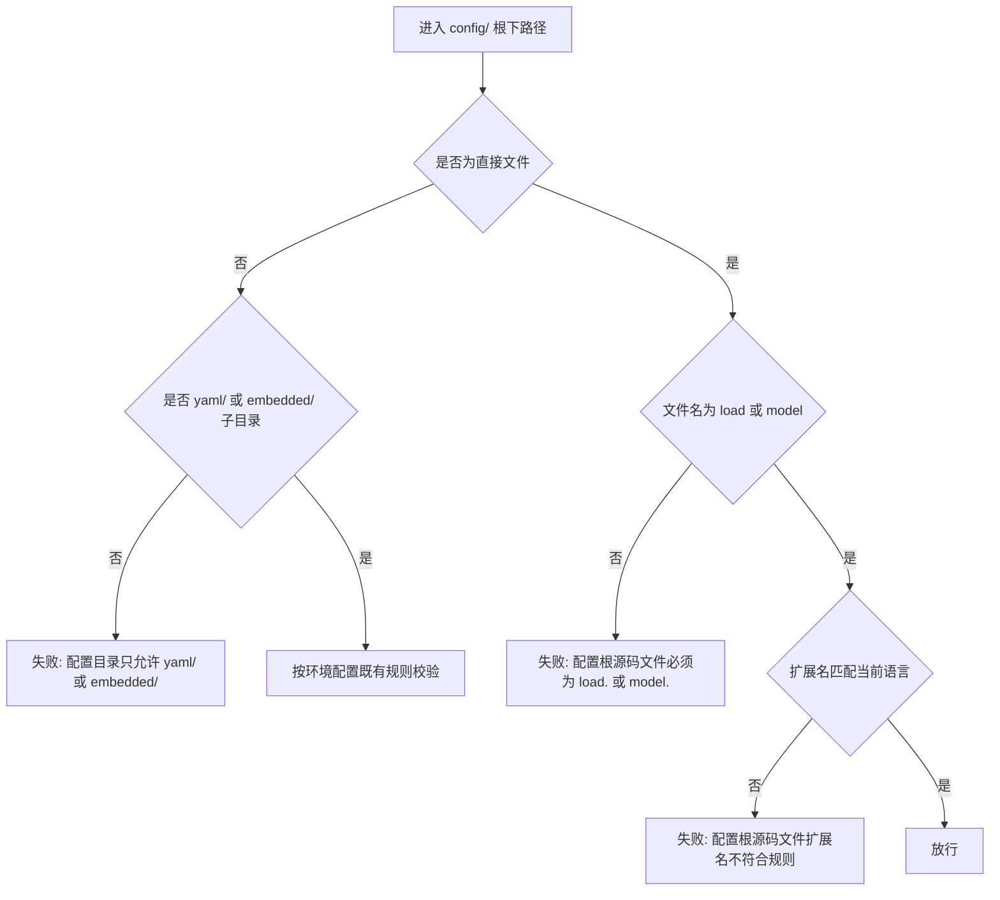
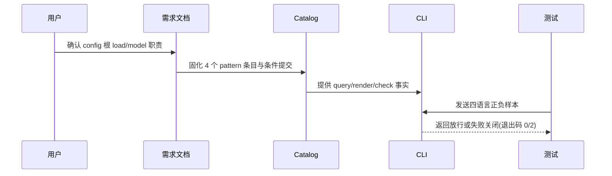

# 代码位置目录规则 V2：config 根加载与结构文件

结论：独立后端 `config/` 根新增 `load.<ext>`（配置加载与解析）与 `model.<ext>`（配置结构定义）两个条件提交源码文件，同仓后端同步到 `backend/config/` 根；影响：规则查询、目录树、Catalog、Schema、CLI strict 检查、配置 reference 和相邻测试的落点契约统一变化；范围：独立后端 `config/` 与同仓后端 `backend/config/` 两处规则资产、活动测试与文档；非范围：`common/util/` 既有规则、前端 `config/`、真实业务项目迁移与 Git 历史写入；变化：config/ 根直接源码文件从“一律拒绝”变为“仅放行 load/model 两个命名”，其余根文件与子目录继续失败关闭；完成标准：query/render/check 对 `config/load.<ext>`、`config/model.<ext>` 唯一一致表达，四语言正反向行为测试与文档门禁全部通过；术语说明：`load.<ext>` 指读取 yaml/embedded 配置并解析的源码文件，`model.<ext>` 指声明配置结构的类型/结构文件；验证状态：计划已收敛，开始实施。

## 文档信息

| 项目 | 内容 |
|---|---|
| 文档编号 | `REQ-PSR-CONFIG-SOURCE-001` |
| 归属实施周期 | `CYCLE-PSR-23` |
| 状态 | accepted |
| unresolved_decisions | 无；命名 load/model、条件提交、后端两类三个决策已由用户选定 |

## 需求来源与证据台账

| 来源 ID | 来源 | 事实 | 证据 |
|---|---|---|---|
| `SRC-PSR-CONFIG-SOURCE-001` | 用户本轮确认 | 后端 `config/` 下新增 2 个文件：一个加载配置、一个定义配置结构；`config/yaml/` 与 `config/embedded/` 只存放配置数据 | 用户消息 |
| `SRC-PSR-CONFIG-SOURCE-001` | 当前 Catalog | config/ 根直接源码文件目前被 strict 拒绝，仅 yaml/embedded 两个子目录合法 | `placement-catalog.yaml`、`check_environment_config_path` |

## 目标与非目标

| 类别 | 内容 |
|---|---|
| 目标 | `config/load.<ext>` 与 `config/model.<ext>` 成为独立后端和同仓后端的唯一配置加载/结构落点，并被 Catalog、CLI、测试一致表达 |
| 非目标 | 不迁移真实业务项目、不改变前端 `config/`、不改 `common/util/` 既有规则、不写入 Git 历史 |

## 决策冻结

| ID | 决策 | 结论 |
|---|---|---|
| `DEC-PSR-CONFIG-SOURCE-001-A` | 两个文件的统一命名 | 统一 `load.<ext>` + `model.<ext>`，跨语言一致 |
| `DEC-PSR-CONFIG-SOURCE-001-B` | 提交与初始化策略 | 条件提交；存在即校验，`init` 不创建（`init_policy: forbidden`） |
| `DEC-PSR-CONFIG-SOURCE-001-C` | 适用项目类型 | 独立后端 `config/` 与同仓后端 `backend/config/` 两处同步增加 |

## 功能需求与规则要求

| 规则 ID | 规则 | 验证 |
|---|---|---|
| `RULE-PSR-CONFIG-SOURCE-001` | config/ 根直接源码文件仅允许 `load.<ext>` 与 `model.<ext>` 两个命名；`config/yaml/` 与 `config/embedded/` 只存放配置数据 | 契约测试、strict 行为测试 |
| `RULE-PSR-CONFIG-SOURCE-002` | Catalog 提供 backend/fullstack × loader/model 共 4 个 pattern 条目，条件提交且 `init_policy: forbidden` | Catalog/Schema 测试 |
| `RULE-PSR-CONFIG-SOURCE-003` | 四语言（go/java/node/python）`load.<ext>`/`model.<ext>` 正向 strict 放行 | strict 正向测试 |
| `RULE-PSR-CONFIG-SOURCE-004` | 非 load/model 根文件、错误扩展名、子目录与禁止路径失败关闭并保持只读 | strict 反向测试 |
| `RULE-PSR-CONFIG-SOURCE-005` | `init` 不创建 load/model 占位文件；query/render 唯一一致表达 | init/query/render 测试 |
| `RULE-PSR-CONFIG-SOURCE-006` | 文档与项目四件套同步，文档 profile、全量回归、diff/编码与 Skill 合规门禁全部通过 | 门禁清单 |

## 非功能要求、风险与阻断

- 目录检查只读；所有行为测试使用本地 Python 与临时目录，不连接外部服务。
- 风险 1：既有 `config_entries == 4` 计数断言会随 4 个新条目失效；缓解：改为按 category 过滤断言，环境配置仍各 4 类唯一。
- 风险 2：pattern 条目误配 `init_policy` 会让 init 创建空源码文件；缓解：固定 `init_policy: forbidden` 并断言。
- 阻断：无已知阻断；根测试既有历史 fixture 基线限制只记录，不扩大本轮范围。

## 完成条件

| AC | 完成条件 | 证据 |
|---|---|---|
| `AC-PSR-CONFIG-SOURCE-001` | query 对 `--artifact config --category loader\|model` 唯一命中 4 个新条目；render 两棵树含 `load.<ext>`/`model.<ext>`；Schema 守卫就位；环境配置计数按 category 过滤仍唯一 | `configuration_layout_test.py` 契约用例 |
| `AC-PSR-CONFIG-SOURCE-002` | 四语言 `load.<ext>`/`model.<ext>` strict 正向退出码 0 | `configuration_layout_test.py` 行为用例 |
| `AC-PSR-CONFIG-SOURCE-003` | 非 load/model、错误扩展名、子目录、禁止路径均退出码 2 + 稳定文案，且 `directory_hash` 前后一致 | `configuration_layout_test.py` 行为用例 |
| `AC-PSR-CONFIG-SOURCE-004` | init 不创建 load/model 文件；既有 yaml/embedded、common/util、entrypoint、project-layout 回归全绿；需求/实施/测试/6-review 文档 profile、`git diff --check`、UTF-8 与 Skill 合规门禁 PASS；工作树保持已改动未提交 | 文档 profile、全量回归、门禁清单 |

## 追踪矩阵

| SRC | DEC | RULE | AC | CYCLE/TASK | 文件/符号 | TEST | EVIDENCE |
|---|---|---|---|---|---|---|---|
| `SRC-PSR-CONFIG-SOURCE-001` | `DEC-PSR-CONFIG-SOURCE-001-A/B/C` | `RULE-PSR-CONFIG-SOURCE-001/002` | `AC-PSR-CONFIG-SOURCE-001` | `CYCLE-PSR-23/T23-01` | 需求文档、目录树、Catalog、Schema | `TEST-PSR-CONFIG-SOURCE-001` | `EVD-T23-01-TEST` |
| `SRC-PSR-CONFIG-SOURCE-001` | `DEC-PSR-CONFIG-SOURCE-001-B/C` | `RULE-PSR-CONFIG-SOURCE-003/004/005` | `AC-PSR-CONFIG-SOURCE-002/003` | `CYCLE-PSR-23/T23-02` | `check_environment_config_path`、configuration-layout.md、SKILL.md | `TEST-PSR-CONFIG-SOURCE-001` | `EVD-T23-02-TEST` |
| `SRC-PSR-CONFIG-SOURCE-001` | `DEC-PSR-CONFIG-SOURCE-001-A/B/C` | `RULE-PSR-CONFIG-SOURCE-001..005` | `AC-PSR-CONFIG-SOURCE-004` | `CYCLE-PSR-23/T23-03` | 实施周期文档、测试 README、6-review | 文档 profile | `EVD-T23-03-DOC` |
| `SRC-PSR-CONFIG-SOURCE-001` | `DEC-PSR-CONFIG-SOURCE-001-A/B/C` | `RULE-PSR-CONFIG-SOURCE-006` | `AC-PSR-CONFIG-SOURCE-004` | `CYCLE-PSR-23/T23-04` | 项目四件套、门禁 | 全量回归与门禁清单 | `EVD-T23-04-GATE` |

## 判定流程

图形目的：说明 config/ 根直接文件的判定顺序。关联 ID：`RULE-PSR-CONFIG-SOURCE-001`、`RULE-PSR-CONFIG-SOURCE-003`。

## 规则与验证顺序

图形目的：说明规则文档、Catalog、CLI 与测试之间的端到端关系。关联 ID：`AC-PSR-CONFIG-SOURCE-001`、`AC-PSR-CONFIG-SOURCE-004`。

## 普通模型零决策执行契约

| 项目 | 冻结内容 |
|---|---|
| 新代码落点 | 独立后端 `config/load.<ext>`、`config/model.<ext>`；同仓后端 `backend/config/load.<ext>`、`backend/config/model.<ext>` |
| 职责 | `load.<ext>` 读取 yaml/embedded 配置并解析；`model.<ext>` 声明配置结构 |
| 数据边界 | `config/yaml/` 与 `config/embedded/` 只存放配置数据，加载与结构定义由 config 根 2 个源码文件承担 |
| 初始化 | 条件提交，`init` 不创建（`init_policy: forbidden`） |
| 免测 | N/A + 原因：CLI 判定行为必须真实运行测试 + 证据：`TEST-PSR-CONFIG-SOURCE-001` |

## 追踪契约

- 链路必须保持 `SRC -> DEC -> RULE -> AC -> CYCLE/TASK -> 文件/符号 -> TEST -> EVIDENCE`。
- 每个 AC 必须有正向或反向真实测试，不得以静态阅读替代行为证据。
- 本需求无图片资产：N/A + 原因：不涉及界面或截图 + 证据：两张 Mermaid 图表达全部判定关系。

## 图片资产决策

图片资产决策：N/A + 原因：本需求不涉及界面、截图或视觉验收对象 + 证据：判定流程与端到端顺序已由两张 Mermaid 图表达。

## 约束

- 真实测试只使用本地 Python 与临时目录，不连接数据库、缓存、消息队列或外部服务。
- 免测：N/A + 原因：本次修改 CLI 可执行判定，必须运行行为测试；静态阅读不能替代真实测试。
- 提交边界：本需求不授权 commit、push、rebase、merge 或其它 Git 历史写入。
