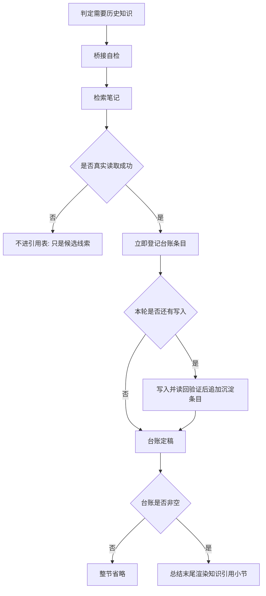
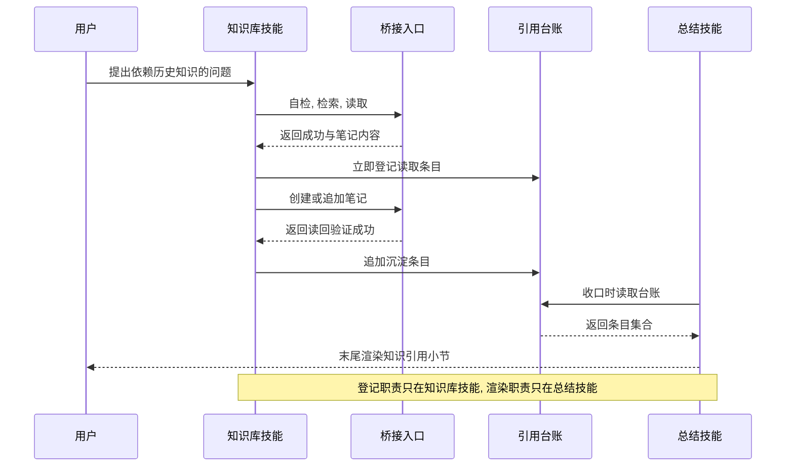

# 总结知识引用清单：让最终回复说清引用了知识库里的哪些知识

结论：最终总结新增一个固定小节「知识引用」，放在总结末尾，逐条列出本轮从 Obsidian 知识库读过哪些笔记、各自支撑了什么结论，以及本轮往知识库写入或更新了哪些笔记。影响：所有真实检索或沉淀过知识库的回答，其最终总结的结构和末尾顺序都会变化。范围：负责总结结构的技能及其三份说明文件与一份代理配置、负责知识库读写的技能及其一份说明文件、一个新增的规则契约测试，以及技能字典的两个生成物。非范围：知识库命令行桥接脚本、知识库目录结构与笔记字段定义、首条命中检查的四态判断口径、计划模式的输出出口，以及命令行回显中文乱码问题本身。变化：原先只允许在「方案与根因」和「结果与结论」各写一行摘要，现在改为独立小节的两张表；原先「本次改动点」必须是总结最后一节，现在改为存在引用小节时由引用小节收尾。完成标准：真实读过或写过笔记时该小节必须出现且每一行都能回指一次成功的知识库调用，没读没写时该小节完全不出现，且这两种行为都由可执行测试判定。术语说明：`vault` 指本地 Obsidian 知识库的根目录；`bridge` 指本仓库唯一允许的知识库命令行桥接入口；`readback` 指写入笔记后再读回一次以证明确实写进去了；`引用台账` 指本轮会话内部记录"读过哪篇、写过哪篇"的临时清单，不落盘、不写入知识库。验证状态：需求已冻结，五项决策已由用户在本轮直接选定。

## 文档信息

| 项目 | 内容 |
|---|---|
| 文档编号 | `REQ-RSR-OBS-CITATION-001` |
| 归属实施周期 | `CYCLE-RSR-21-001` |
| 当前切片 | `CYCLE-21 总结知识引用清单` |
| 状态 | accepted |
| unresolved_decisions | 无。五项关键取舍已由用户在本轮通过选择框直接选定，见「决策冻结」。 |

## 需求来源与证据台账

| 来源 ID | 来源 | 事实 | 证据 |
|---|---|---|---|
| `SRC-RSR-OBS-CITATION-001` | 用户本轮反馈 | 用户已经能在中间进度看到 `Obsidian:检索` 状态字，但看不到究竟引用了知识库里的哪些知识；要求最终输出像论文一样列出引用 | 用户消息原文与随附截图 |
| `SRC-RSR-OBS-CITATION-001` | 现行规则 | 总结技能明确禁止为知识库单独开小节，只允许写一行摘要 | `reasoning-summary-structure-rules/SKILL.md:148`、`references/summary-structure-template.md:198` |
| `SRC-RSR-OBS-CITATION-001` | 现行规则 | 条件字段规则把知识库状态限定成「方案与根因」一行检索摘要加「结果与结论」一行沉淀摘要 | `references/conditional-sections-rules.md:36-43` |
| `SRC-RSR-OBS-CITATION-001` | 本轮实测 | 知识库当前可用：桥接自检返回成功，根目录锁定 `D:\obsidian_data`，且成功读取 `知识库/INDEX.md`，其笔记头部含标题与状态字段 | 本轮 `doctor` 与 `read` 的真实返回 |
| `SRC-RSR-OBS-CITATION-001` | 本轮实测 | 检索命令只返回文件名，不返回笔记状态；笔记状态必须靠读取笔记头部才能拿到 | 本轮 `search` 的真实返回 |
| `SRC-RSR-OBS-CITATION-001` | 本轮实测 | 命令行回显中文会乱码，读取中文标题时返回的是不可用字符 | 本轮 `read 知识库/INDEX.md` 返回的标题字段 |

问题的实质是：知识库的使用过程目前只有一个状态字对外可见，用户无法核对结论到底建立在哪些既有知识上。而现行规则为了防止总结变长，把可见度压到了一行摘要，压得过狠——一行摘要既列不全多篇笔记，也说不清每篇支撑了什么，用户等于只知道"查过"，不知道"查了什么"。

## 目标与非目标

| 类别 | 内容 |
|---|---|
| 目标 | 让用户在最终回复末尾一眼看清本轮引用了知识库的哪些笔记，以及每篇支撑了什么结论 |
| 目标 | 让本轮往知识库写入或更新的笔记和引用一起可见，知识的进与出在同一处看全 |
| 目标 | 让每一条引用都能回指一次真实成功的知识库调用，杜绝凭记忆编造引用 |
| 目标 | 让"没读没写时不出现该小节"同样成为硬约束，避免出现空表或占位行 |
| 非目标 | 不改知识库命令行桥接脚本、不改允许的命令清单、不新增命令行能力 |
| 非目标 | 不改知识库目录结构、笔记字段定义和执行案例笔记契约 |
| 非目标 | 不改首条命中检查的 `Obsidian:<检索/沉淀/不适用/阻断>` 四态判断口径 |
| 非目标 | 不改计划模式的输出出口；计划模式本来就不输出总结容器，新小节同样不进计划模式 |
| 非目标 | 不修命令行回显中文乱码问题，只在规则层面规避 |

## 决策冻结

以下五项由用户在本轮通过选择框直接选定，属于冻结决策，执行时不得再自行取舍：

| 决策 ID | 决策点 | 冻结结论 | 理由 |
|---|---|---|---|
| `DEC-RSR-CIT-A` | 引用清单放在总结的哪个位置 | 独立小节 `## 📚 知识引用`，位于「本次改动点」之后、「任务阻断收口」之前 | 与论文把参考文献放在正文末尾的阅读习惯一致，用户看完结论和改动后自然读到依据 |
| `DEC-RSR-CIT-B` | 每条引用记录到什么粒度 | 三列：序号、笔记、本轮用途 | 用户明确不需要更多列；三列在窄终端里不折行，且已足够回答"引用了什么、用来干什么" |
| `DEC-RSR-CIT-C` | 不单列知识库路径时如何保住可核验性 | 笔记列填可定位的笔记文件名，仅在重名时括注所在目录；笔记状态为过期、废弃、退役或冲突时在用途列末尾标注警示符号 | 文件名在本知识库内已足够定位，长路径会挤占用途列；状态标注让"引用了过期知识"这类风险暴露在表面 |
| `DEC-RSR-CIT-D` | 写入类动作是否并入同一小节 | 并入同一小节，分「本轮引用」与「本轮沉淀」两张表；同时删除「结果与结论」里原有的沉淀摘要行 | 知识的进与出在一处看全；不删旧摘要行会出现同一事实两处重复 |
| `DEC-RSR-CIT-E` | 是否同时给知识库技能加约束 | 加。要求每次成功的读取或写入后立即登记引用台账 | 若只改总结技能，清单只能在收口时靠回忆拼出，与仓库「严禁脑补工具结果」的硬规则冲突 |

## 功能需求与规则要求

| 规则 ID | 规则 | 判定方 |
|---|---|---|
| `RULE-RSR-CITATION-001` | 引用台账非空时，最终总结必须输出 `## 📚 知识引用` 小节；台账为空时该小节必须整节省略，不得输出空表或占位行 | 总结技能的发送前自检 |
| `RULE-RSR-CITATION-002` | 无真实阻断时，存在引用小节则由它收尾、「本次改动点」紧邻其前；不存在引用小节时仍由「本次改动点」收尾；有真实阻断时「任务阻断收口」始终最后 | 总结技能的固定顺序与驳回标准 |
| `RULE-RSR-CITATION-003` | 「本轮引用」表固定三列（序号、笔记、本轮用途），「本轮沉淀」表固定四列（序号、笔记、操作、readback）；两张表都只列台账条目，不得输出笔记正文 | 规则契约测试 |
| `RULE-RSR-CITATION-004` | 引用小节的每一行都必须能回指本轮一次返回成功的知识库调用；无法回指即判定不通过 | 总结技能的发送前自检 |
| `RULE-RSR-CITATION-005` | 原先分散在「方案与根因」的检索摘要行与「结果与结论」的沉淀摘要行一并取消，改由引用小节统一承载；沉淀行不再占用结果区的句数上限 | 规则契约测试 |
| `RULE-OBS-LEDGER-001` | 每次读取、创建或追加笔记返回成功后必须立即登记台账条目，不得延后到收口阶段再回忆补记 | 规则契约测试 |
| `RULE-OBS-LEDGER-002` | 只有真实读取成功的笔记可进「本轮引用」表；检索命中但未读取的笔记一律不得入表 | 规则契约测试 |
| `RULE-OBS-LEDGER-003` | 笔记名取自本地发起调用时使用的路径字符串，不得使用命令行回显文本；笔记状态取自笔记头部字段 | 规则契约测试 |

台账条目的字段形态如下：

```text
笔记名      发起调用时所用路径的文件名部分，本地字符串，不受回显编码影响
所在目录    仅在同名笔记存在时填写，用于消歧
本轮用途    这篇笔记支撑了本轮哪个结论或判断
status      取自笔记头部字段，用于决定是否标注警示符号
操作        read / create / append
readback    写入类动作必须为成功，读取类留空
```

小节的目标形态如下：

```text
## 📦 改动点

| 文件 | 改动 |
|---|---|
| ... | ... |

## 📚 知识引用

**本轮引用**

| # | 笔记 | 本轮用途 |
|---|---|---|
| [1] | `INDEX.md` | 定位知识库导航入口 |

**本轮沉淀**

| # | 笔记 | 操作 | readback |
|---|---|---|---|
| [1] | `总结知识引用清单.md` | create | verified |
```

## 范围与边界

| 边界 ID | 边界 |
|---|---|
| `BOUND-RSR-CIT-001` | 只改规则文本、一份代理配置、一个新增契约测试和两个字典生成物；不连接数据库、缓存或外部服务，不启动业务程序 |
| `BOUND-RSR-CIT-002` | 不改知识库桥接脚本、允许命令清单、笔记字段定义和执行案例笔记契约 |
| `BOUND-RSR-CIT-003` | 不改总结技能的计划模式排除条款，也不改其等待用户决策相关的任何条文 |
| `BOUND-RSR-CIT-004` | 不改首条命中检查技能对四态判断的定义 |
| `BOUND-RSR-CIT-005` | 不执行任何写入版本历史的动作；本需求不构成提交授权 |

### 引用条目的产生与渲染流程

图形目的：说明一条引用从真实知识库调用到最终渲染要经过哪些环节，解释为什么清单不可能来自回忆。关联 ID：`RULE-OBS-LEDGER-001`、`RULE-OBS-LEDGER-002`、`RULE-RSR-CITATION-004`。



### 两个技能的责任边界

图形目的：说明知识库技能与总结技能各自负责什么，避免执行时把登记职责写进总结技能或把渲染职责写进知识库技能。关联 ID：`DEC-RSR-CIT-E`、`RULE-OBS-LEDGER-001`、`RULE-RSR-CITATION-001`。



## 非功能要求、风险与阻断

| 项目 | 内容 |
|---|---|
| 编码要求 | 所有改动文件保持 UTF-8 与原有换行风格，不得批量转换换行 |
| 保护要求 | 总结技能的计划模式排除条款与等待用户决策条文必须逐字不变 |
| 简洁要求 | 引用小节只列台账条目，不得输出笔记正文，避免总结体量失控 |
| 风险 | 放宽「禁止单开知识库小节」可能与其它收口闸门技能引用的旧顺序冲突。缓解：改后用全仓检索复核，冲突即停止裁决 |
| 风险 | 命令行回显中文乱码，若用回显填笔记名会写出乱码引用。缓解：`RULE-OBS-LEDGER-003` 硬性规定笔记名取自本地路径字符串 |
| 风险 | 简单任务如果真实检索过也会出现引用小节，可能被误判为"简单任务被强制加节"。缓解：条件字段规则显式写明该小节只看台账是否非空，不受简单任务豁免影响 |
| 风险 | 总结技能说明变更后忘记刷新技能字典，导致字典与实际不一致。缓解：字典刷新列为放行硬条件 |
| 阻断项 | 无。本需求不依赖网络、数据库或第三方服务；知识库实机验证在本轮已实测可用 |
| 假设 | 假设知识库保持可用；若实机验证时不可达，则实机验证降级为受限项并显式标注，不得伪报为已验证 |

## 完成条件

| 条件 ID | 完成条件 | 判定方式 |
|---|---|---|
| `AC-RSR-CIT-001` | 总结技能的固定顺序中「知识引用」位于「本次改动点」之后、「任务阻断收口」之前，且末尾顺序按台账是否非空分流 | 规则契约测试 |
| `AC-RSR-CIT-002` | 全仓已不存在「不得新增独立 Obsidian 小节」这类禁令表述，且三份总结说明文件中原有的两处单行摘要口径均已移除 | 规则契约测试 |
| `AC-RSR-CIT-003` | 总结模板含两张表的固定表头，条件字段规则写明台账为空时整节省略、未读取不得入表、不得输出笔记正文 | 规则契约测试 |
| `AC-RSR-CIT-004` | 知识库技能与其说明文件含台账六字段、立即登记、未读取不得入表、不使用回显文本四项硬约束 | 规则契约测试 |
| `AC-RSR-CIT-005` | 技能字典两个生成物已按新的技能说明刷新，且未新增缺项 | 字典生成脚本 |

## 普通模型零决策执行契约

执行模型不需要再做任何业务或技术取舍，以下内容已全部冻结：

| 项目 | 冻结内容 |
|---|---|
| 小节位置 | 「本次改动点」之后、「任务阻断收口」之前。见 `DEC-RSR-CIT-A` |
| 表格列数 | 引用表三列，沉淀表四列，表头逐字固定。见 `DEC-RSR-CIT-B`、`RULE-RSR-CITATION-003` |
| 笔记列内容 | 笔记文件名，重名才括注目录；状态异常在用途列末尾标警示符号。见 `DEC-RSR-CIT-C` |
| 旧摘要行 | 「方案与根因」检索行与「结果与结论」沉淀行一并删除，不保留双轨。见 `DEC-RSR-CIT-D` |
| 改动范围 | 同时改知识库技能，新增台账契约。见 `DEC-RSR-CIT-E` |
| 台账落点 | 台账是本轮会话内部事实，不写入知识库、不落盘到项目文件 |
| 免测边界 | N/A + 原因：本需求改变总结的输出结构契约与台账登记时机，会被规则契约测试与字典脚本真实判定 + 证据：`AC-RSR-CIT-001` 至 `AC-RSR-CIT-005` 均由可执行入口判定，不允许以静态阅读替代 |
| 提交边界 | 本需求不授权任何写入版本历史的动作 |

## 图片资产决策

图片资产决策：N/A + 原因：本需求不涉及界面、截图或视觉验收对象 + 证据：条目产生流程与两个技能的责任边界已由本文两张 Mermaid 图表达，无需位图资产。

## 追踪矩阵

| SRC | DEC | RULE | AC | CYCLE/TASK | 文件/符号 | TEST | EVIDENCE |
|---|---|---|---|---|---|---|---|
| `SRC-RSR-OBS-CITATION-001` | `DEC-RSR-CIT-E` | `RULE-OBS-LEDGER-001`、`002`、`003` | `AC-RSR-CIT-004` | `CYCLE-21/T21-02` | `obsidian-knowledge-flow/SKILL.md`、`references/capture-retrieve-distill.md` | `TEST-RSR-CIT-001` | `EVD-T21-02-IMPL`、`EVD-T21-02-TEST`、`EVD-T21-02-STYLE` |
| `SRC-RSR-OBS-CITATION-001` | `DEC-RSR-CIT-A`、`DEC-RSR-CIT-D` | `RULE-RSR-CITATION-001`、`002`、`004` | `AC-RSR-CIT-001`、`AC-RSR-CIT-002` | `CYCLE-21/T21-03` | `reasoning-summary-structure-rules/SKILL.md`、`agents/openai.yaml` | `TEST-RSR-CIT-001` | `EVD-T21-03-IMPL`、`EVD-T21-03-TEST`、`EVD-T21-03-STYLE` |
| `SRC-RSR-OBS-CITATION-001` | `DEC-RSR-CIT-B`、`DEC-RSR-CIT-C` | `RULE-RSR-CITATION-003`、`005` | `AC-RSR-CIT-002`、`AC-RSR-CIT-003` | `CYCLE-21/T21-04` | `references/summary-structure-template.md`、`references/conditional-sections-rules.md`、`references/output-examples.md` | `TEST-RSR-CIT-001` | `EVD-T21-04-IMPL`、`EVD-T21-04-TEST`、`EVD-T21-04-STYLE` |
| `SRC-RSR-OBS-CITATION-001` | `DEC-RSR-CIT-A` | `RULE-RSR-CITATION-001`、`003` | `AC-RSR-CIT-005` | `CYCLE-21/T21-05` | `test/reasoning-summary-structure-rules/obsidian_citation_contract_test.py`、`skill-dictionary/data.js`、`字典.md` | `TEST-RSR-CIT-002`、`TEST-RSR-CIT-003` | `EVD-T21-05-IMPL`、`EVD-T21-05-TEST`、`EVD-T21-05-STYLE` |
| `SRC-RSR-OBS-CITATION-001` | `DEC-RSR-CIT-A` 至 `DEC-RSR-CIT-E` | `RULE-RSR-CITATION-001` 至 `005`、`RULE-OBS-LEDGER-001` 至 `003` | `AC-RSR-CIT-001` 至 `AC-RSR-CIT-005` | `CYCLE-21/T21-01` | `doc/2-需求/2026-08-04_总结知识引用清单_Obsidian引用可视化.md`、`doc/3-实施/2026-08-04_总结知识引用清单_实施周期21_Obsidian引用可视化.md` | `TEST-RSR-CIT-DOC` | `EVD-T21-01-IMPL`、`EVD-T21-01-TEST` |

## 追踪契约

| 契约项 | 约定 |
|---|---|
| 链路形态 | `SRC -> DEC -> RULE -> AC -> CYCLE/TASK -> 文件/符号 -> TEST -> EVIDENCE`，本需求的五条链路在上表中均已闭合 |
| 证据类别 | 除文档落盘任务外，每个最小任务必须同时产出实现、真实测试和风格回归三类证据，缺任一类视为该任务未闭环 |
| 证据落点 | 实现证据落在实施周期文档的文件与符号契约，真实测试证据落在 `doc/5-tests/` 任务目录，风格回归证据落在 `doc/6-review/` |
| 孤立 ID | 本需求不允许出现未被上表引用的规则或完成条件；新增规则必须同步补链 |
| 历史关系 | 本需求不修订任何既有需求，只在总结结构上新增条件小节并放宽两条旧禁令 |
