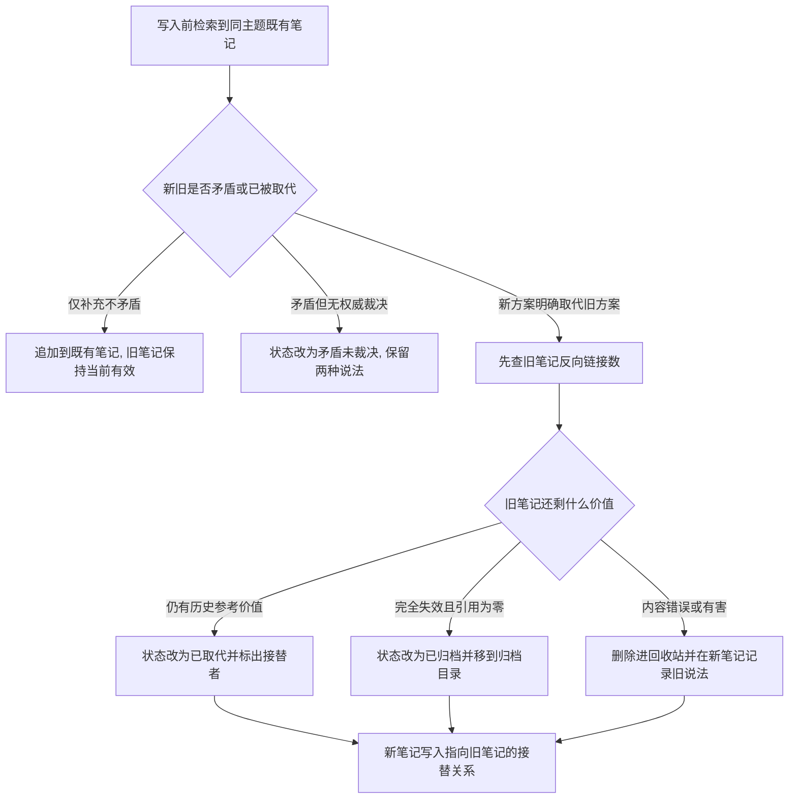
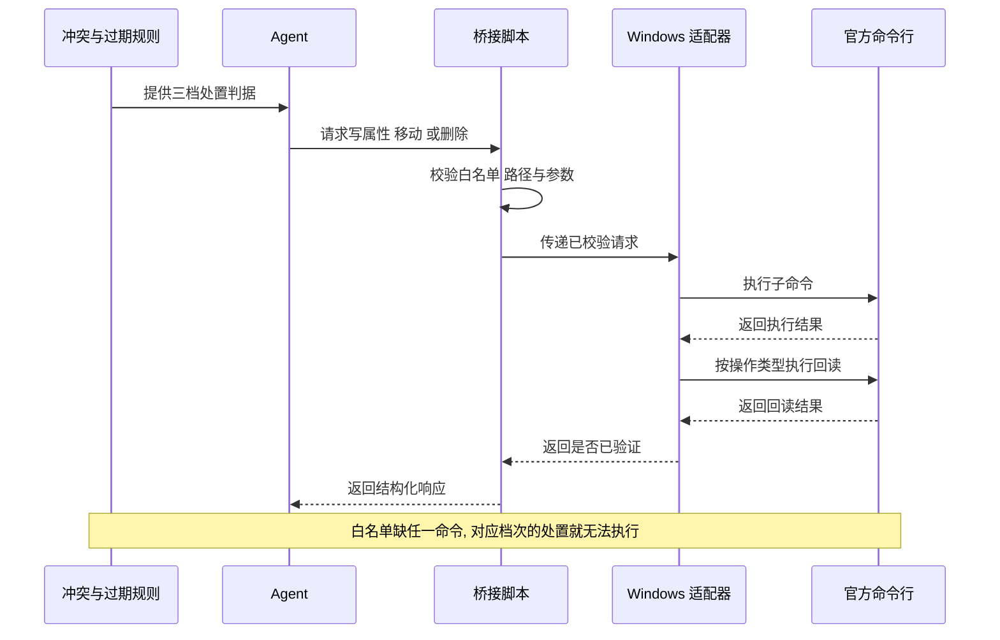

# 知识库可迭代更新：冲突、取代与废弃治理

结论：知识库从"只能增量补充"改成"可迭代更新"。发现旧笔记已被新方案取代时，按三档处置——仍有历史参考价值的改成已取代状态并标出接替者，完全失效且无人引用的移到归档目录，内容错误或有害的删除进回收站。影响：所有向知识库写入的动作都会多一道冲突判定，检索时只有当前有效的知识会被当作事实。范围：知识库命令行桥接的命令白名单、桥接脚本与 Windows 适配器、冲突与过期规则、捕获与沉淀流程、笔记字段定义、命令模板、验证清单、技能主入口，以及一个新增的只读巡检脚本。非范围：知识库目录结构、执行失败案例笔记的追加式契约、本轮范围外的其他命令行子命令、永久删除、现存积压笔记的批量清理。变化：原先明确写着"不要删除"的规则被改写为三档处置；桥接新增八个命令；沉淀前新增强制冲突判定。完成标准：八个命令实机可用且每次写入都有回读验证，三档处置规则有可执行断言锁定，巡检脚本能对真实知识库出报告且零写入。术语说明：`桥接` 指本仓库唯一允许操作知识库的公开入口脚本；`回读验证` 指写入后再读一次以证明确实写成功；`取代` 指同一件事换了新实现方案后旧记录不再是当前口径；`孤儿笔记` 指没有任何其他笔记链接到它的笔记。验证状态：需求已冻结，五项决策已由用户在本轮直接选定，八个命令的参数形态已实机实测。

## 文档信息

| 项目 | 内容 |
|---|---|
| 文档编号 | `REQ-OBS-ITERATIVE-KB-001` |
| 归属实施总览 | `IMP-OBS-KB-001` |
| 关联实施周期 | `CYCLE-OBS-22-001`、`CYCLE-OBS-23-001` |
| 当前切片 | `CYCLE-22 bridge 能力扩展` |
| 状态 | accepted |
| unresolved_decisions | 无。五项关键取舍已由用户在本轮通过选择框直接选定，见「决策冻结」。 |

## 需求来源与证据台账

| 来源 ID | 来源 | 事实 | 证据 |
|---|---|---|---|
| `SRC-OBS-ITERATIVE-KB-001` | 用户本轮反馈 | 知识库现在是增量补充，会出现冲突；之前的知识后面已经变化，一些逻辑换成另一种方案实现了；应遵循最新方案，旧记录废弃或删除，避免记忆混乱 | 用户消息原文 |
| `SRC-OBS-ITERATIVE-KB-001` | 现行规则缺口 | 冲突流程第 5 步明确写「标记为 `deprecated` 或 `retired`，不要删除」，与用户诉求直接冲突 | `obsidian-knowledge-flow/references/conflict-staleness.md:35` |
| `SRC-OBS-ITERATIVE-KB-001` | 现行能力缺口 | 桥接命令白名单只有 `doctor`、`search`、`search-context`、`read`、`create`、`append`、`open`、`project-context`，没有任何修改元数据、移动或删除能力；`append` 只能追加到文件末尾，改不了笔记头部的状态字段，因此连"标记"这个动作实际上也做不到 | `obsidian-knowledge-flow/scripts/obsidian_cli_bridge.py:23` |
| `SRC-OBS-ITERATIVE-KB-001` | 积压现状 | 知识库共 65 篇笔记，其中 41 篇没有任何笔记链接过去，占比 63% | 本轮实测 `files total`、`orphans total` |
| `SRC-OBS-ITERATIVE-KB-001` | 官方能力 | 官方命令行本就支持删除、移动、读写笔记头部属性、查反向链接、枚举文件与孤儿笔记，只是没有接进桥接白名单 | 本轮 `Obsidian.com --help` 输出 |
| `SRC-OBS-ITERATIVE-KB-001` | 既有踩坑记录 | 当前命令行版本的 `read`、`open` 只接受 `file=`，传 `path=` 会返回退出码为零的错误载荷 | `obsidian_cli_windows.ps1:494` 既有注释 |

问题的实质是：规则层想做治理，能力层却只能追加。旧笔记换了实现方案后仍以"当前有效"的状态躺在知识目录里，检索时和新笔记一起返回，agent 无法判断哪个才是现在的口径。而修正它所需的全部命令行能力其实早就存在，只是没有接入。

## 目标与非目标

| 类别 | 内容 |
|---|---|
| 目标 | 让桥接具备修改笔记头部属性、移动、删除和枚举四类能力，并且每次写入都有可验证的回读 |
| 目标 | 把"旧记录怎么处理"从一句"不要删除"改成有判据、可执行的三档处置 |
| 目标 | 把冲突判定前移到每次写入之前，让增量治理随时发生，不积压 |
| 目标 | 提供一个只读巡检入口，把已经积压的冲突、过期和孤儿笔记捞成可执行的清理清单 |
| 目标 | 让检索时能顺着接替关系找到当前有效笔记，已取代和已归档的笔记不再被当作事实 |
| 非目标 | 不改知识库目录结构 |
| 非目标 | 不改执行失败案例笔记的追加式契约；三档处置对这类笔记标记为 N/A + 原因：该类笔记以追加式状态事件表达取代关系，覆盖或删除会破坏历史证据链 + 证据：`execution-case-notes.md:86` 规定追加是唯一更新方式 |
| 非目标 | 不新增本轮八个命令之外的其他命令行子命令 |
| 非目标 | 不使用永久删除，一律进回收站保留可恢复性 |
| 非目标 | 不批量清理现存 41 篇孤儿笔记，本轮只交付巡检报告能力 |

## 决策冻结

以下五项由用户在本轮通过选择框直接选定，属于冻结决策，执行时不得再自行取舍：

| 决策 ID | 决策点 | 冻结结论 | 理由 |
|---|---|---|---|
| `DEC-OBS-KB-A` | 旧笔记被取代后怎么处置 | 分级三档：仍有历史参考价值改为已取代状态并标出接替者；完全失效且无人引用移到归档目录；内容错误或有害删除进回收站。三档都必须先查反向链接 | 一刀切保留会让废弃笔记持续堆积，一刀切删除会丢掉仍可检索的历史上下文；按剩余价值分档兼顾两者 |
| `DEC-OBS-KB-B` | 这些写操作是否需要用户确认 | 全部自动执行，只在最终总结里报告做了什么 | 删除默认进回收站可恢复，且三档都有反向链接前置检查；每次都打断用户会让治理无法随沉淀发生 |
| `DEC-OBS-KB-C` | 什么时候做冲突检测 | 沉淀前强制检测，同时提供独立巡检入口 | 沉淀前检测负责不再新增积压，巡检入口负责清理已有积压，两者缺一不可 |
| `DEC-OBS-KB-D` | 桥接白名单新增哪些命令 | 八个：读属性、读整篇属性、写属性、移动、删除、反向链接、枚举文件、枚举孤儿 | 分级处置需要写属性、移动、删除和反向链接；巡检需要枚举文件与孤儿；少任何一个对应能力就落不了地 |
| `DEC-OBS-KB-E` | 巡检入口做成什么形式 | 只读脚本输出候选报告，脚本内不做任何写入；哪篇真该废弃的语义裁决仍由 agent 判断并走桥接执行 | 机械枚举需要可重复，语义裁决不能写死在脚本里；只读边界让巡检本身零风险 |

## 功能需求与规则要求

| 规则 ID | 规则 | 判定方 |
|---|---|---|
| `RULE-OBS-CAP-001` | 桥接白名单新增八个命令，全部使用 `path=` 传参；`move` 额外需要 `to=`，写属性额外需要 `name=`、`value=` 与可选的 `type=` | 桥接参数校验单元测试 |
| `RULE-OBS-CAP-002` | 三类写操作各有回读判据：写属性后回读该属性值必须相等；移动后新路径必须可读且旧路径必须不可读；删除后原路径必须不可读。任一不符返回回读不匹配错误 | 实机链路测试 |
| `RULE-OBS-CAP-003` | 删除一律进回收站，不接受也不透传永久删除参数 | 桥接参数校验单元测试 |
| `RULE-OBS-CAP-004` | 移动的目标目录必须已存在；目标目录不存在时命令行返回退出码为零的错误载荷，原文件保持无损 | 实机链路测试 |
| `RULE-OBS-CAP-005` | 执行失败案例目录下的笔记禁止移动与删除，桥接层直接拒绝 | 桥接参数校验单元测试 |
| `RULE-OBS-SUPERSEDE-001` | 被取代且仍有历史参考价值的笔记：状态改为已取代，并写入指向接替者的接替关系字段 | 规则契约测试 |
| `RULE-OBS-SUPERSEDE-002` | 完全失效且反向链接为零的笔记：状态改为已归档，并移动到归档目录 | 规则契约测试 |
| `RULE-OBS-SUPERSEDE-003` | 内容错误或有害的笔记：删除进回收站，并在新笔记中记录被删除的旧说法 | 规则契约测试 |
| `RULE-OBS-SUPERSEDE-004` | 三档处置前必须先查反向链接；引用数不为零时不得移动或删除，只能降级为已取代 | 规则契约测试 |
| `RULE-OBS-SUPERSEDE-005` | 接替关系必须双向写入：新笔记指向被它取代的旧笔记，旧笔记指向接替它的新笔记 | 规则契约测试 |
| `RULE-OBS-SUPERSEDE-006` | 三档处置不适用于执行失败案例笔记：N/A + 原因：该类笔记用追加式状态事件表达取代 + 证据：`execution-case-notes.md:86` 的追加唯一更新契约 | 规则契约测试 |
| `RULE-OBS-DETECT-001` | 每次写入知识库前必须先检索同主题既有笔记，并显式判定为"补充"、"矛盾未裁决"或"取代"之一；判为取代必须在同一轮内完成三档处置 | 规则契约测试 |
| `RULE-OBS-DETECT-002` | 已取代与已归档状态的笔记不得作为当前事实引用，只能作为历史上下文；命中这类笔记时应顺着接替关系找到当前有效笔记 | 规则契约测试 |
| `RULE-OBS-AUDIT-001` | 巡检脚本只允许调用桥接的只读命令，源码内不得出现任何写操作命令；输出结构化候选报告，语义裁决交回 agent | 巡检脚本源码扫描测试 |

### 八个命令的实机实测结论

以下参数形态已在本轮用一次性测试笔记逐个实测，执行时直接采用，不需要再试：

| 命令 | 参数形态 | 成功输出 | 备注 |
|---|---|---|---|
| 读单个属性 | `path=` + `name=` | 属性值 | 实测返回 `active`、`superseded` 与中文双链值，均与写入值逐字一致 |
| 读整篇属性 | `path=` + `format=json` | 完整头部 JSON | 中文标题零乱码，比读全文更可靠 |
| 查反向链接 | `path=` + `total` | 引用计数 | |
| 枚举文件 | `folder=` | 路径列表 | 实测返回的 `知识库/90-Archive/...` 中文路径可直接回传给其他命令并成功命中 |
| 枚举孤儿 | `total` | 孤儿计数 | 不接受路径参数 |
| 写属性 | `path=` + `name=` + `value=` + `type=` | `Set <名>: <值>` | 其余头部属性、顺序与中文全部保留；支持列表类型写双链 |
| 移动 | `path=` + `to=` | `Moved: <旧> -> <新>` | `to=` 可给完整路径或仅给目录；目标目录不存在则失败但原文件无损 |
| 删除 | `path=` | `Moved to trash: <路径>` | 已确认进 Windows 回收站，实测可在回收站中找到 |

## 范围与边界

| 边界 ID | 边界 |
|---|---|
| `BOUND-OBS-KB-001` | 只改桥接脚本、Windows 适配器、六份规则参考文件、技能主入口与代理配置，新增一个只读巡检脚本和两个测试文件 |
| `BOUND-OBS-KB-002` | 不连接数据库、缓存或外部服务；知识库写操作只允许落一次性系统测试目录，并以删除收尾自清理 |
| `BOUND-OBS-KB-003` | 不改知识库目录布局，不改执行失败案例笔记契约，不改上一周期新增的总结知识引用小节口径 |
| `BOUND-OBS-KB-004` | 不新增本轮八个命令之外的命令行子命令，不透传永久删除参数，不清空回收站 |
| `BOUND-OBS-KB-005` | 不执行任何写入版本历史的动作；本需求不构成提交授权 |

### 分级处置判定流程

图形目的：说明发现取代关系后如何在三档处置之间分流，作为规则文本与测试断言的共同依据。关联 ID：`RULE-OBS-SUPERSEDE-001` 至 `004`、`AC-OBS-KB-004`。

### 能力层与规则层的协作顺序

图形目的：说明桥接、适配器、命令行和规则文档之间的信息传递顺序，解释为什么能力必须先于规则落地。关联 ID：`RULE-OBS-CAP-001`、`RULE-OBS-CAP-002`、`AC-OBS-KB-001`。

## 非功能要求、风险与阻断

| 项目 | 内容 |
|---|---|
| 编码要求 | 所有改动文件保持 UTF-8 与原有换行风格，不得批量转换换行 |
| 保护要求 | 执行失败案例笔记的追加式契约文本必须逐字不变；四态判定与固定根目录条款不得改动 |
| 可恢复要求 | 删除一律进回收站；移动可移回原位；属性可改回原值 |
| 只读要求 | 巡检脚本必须零写入，巡检前后知识库文件总数与孤儿数不得变化 |
| 风险 | 自动删除误判会丢掉仍有价值的笔记。缓解：三档强制前置反向链接检查，引用不为零不得移动或删除；删除仅限内容错误或有害；回收站保留可恢复性；每次处置都在最终总结的知识引用沉淀表登记 |
| 风险 | 分级处置可能误伤执行失败案例笔记，破坏追加式历史证据。缓解：桥接层直接拒绝对该目录执行移动与删除，规则层写明不适用范围，并有专门断言 |
| 风险 | 移动的目标目录不存在时会失败。缓解：已实测确认原文件无损，且命令模板中写明目标目录必须已存在 |
| 风险 | 逐篇读属性对 65 篇笔记可能较慢。缓解：巡检是手动入口不进自动流程，超时改按目录分批 |
| 阻断项 | 无。本需求不依赖网络、数据库或第三方服务；知识库本轮已实测可用 |
| 假设 | 假设知识库保持可用。若实机验证时不可达，实机部分记为受限项并显式标注，不得伪报为已验证 |

## 完成条件

| 条件 ID | 完成条件 | 判定方式 |
|---|---|---|
| `AC-OBS-KB-001` | 八个命令已进入桥接白名单，参数校验拒绝缺参、越界路径与永久删除参数 | 桥接参数校验单元测试 |
| `AC-OBS-KB-002` | 三类写操作的回读判据均已实现，一次性测试笔记能走通写属性、移动、删除全链路 | 实机链路测试 |
| `AC-OBS-KB-003` | 执行失败案例目录下的笔记被拒绝移动与删除 | 桥接参数校验单元测试 |
| `AC-OBS-KB-004` | 冲突与过期规则已不含「不要删除」，三档判据、反向链接前置、执行案例排除声明与自动化边界四项均在位 | 规则契约测试 |
| `AC-OBS-KB-005` | 笔记字段定义新增双向接替关系字段，并写明接替字段非空时状态不得为当前有效 | 规则契约测试 |
| `AC-OBS-KB-006` | 写入前的三态判定、双向接替关系与顺着接替关系跳转的检索规则均已写入捕获与检索流程 | 规则契约测试 |
| `AC-OBS-KB-007` | 巡检脚本源码零写操作命令，能对真实知识库输出四类候选报告，且巡检前后文件总数与孤儿数不变 | 巡检脚本测试与实跑 |
| `AC-OBS-KB-008` | 命令模板与验证清单已同步八个命令、三类回读语义与两条边界，且模板列举与脚本白名单逐项一致 | 契约测试直接解析脚本常量比对 |

## 普通模型零决策执行契约

执行模型不需要再做任何业务或技术取舍，以下内容已全部冻结：

| 项目 | 冻结内容 |
|---|---|
| 处置分档 | 三档判据见 `RULE-OBS-SUPERSEDE-001` 至 `003`，前置检查见 `004` |
| 自动化边界 | 三档均自动执行，见 `DEC-OBS-KB-B`；只在最终总结报告 |
| 命令范围 | 只新增八个，见 `DEC-OBS-KB-D`；不新增其他子命令 |
| 参数形态 | 八个命令的参数与成功输出已实机实测，见「八个命令的实机实测结论」，执行时直接采用 |
| 删除语义 | 一律进回收站，不透传永久删除参数，见 `RULE-OBS-CAP-003` |
| 移动前提 | 目标目录必须已存在，见 `RULE-OBS-CAP-004` |
| 执行案例排除范围 | 执行失败案例笔记继续走追加式状态事件，不受三档处置约束，见 `RULE-OBS-CAP-005` |
| 巡检边界 | 脚本只读、零写入、只出候选，见 `RULE-OBS-AUDIT-001` |
| 测试落点 | 实机写操作只允许落一次性系统测试目录并以删除收尾；禁止在知识目录或实体目录做写测试 |
| 免测边界 | N/A + 原因：本需求改动桥接脚本的可执行行为与知识库写入语义，不属于纯文档或纯排版场景 + 证据：`AC-OBS-KB-001` 至 `AC-OBS-KB-008` 均由可执行入口判定，不允许以静态阅读替代 |
| 提交边界 | 本需求不授权任何写入版本历史的动作 |

## 图片资产决策

图片资产决策：N/A + 原因：本需求不涉及界面、截图或视觉验收对象 + 证据：分级分流与能力协作顺序已由本文两张 Mermaid 图表达，无需位图资产。

## 追踪矩阵

| SRC | DEC | RULE | AC | CYCLE/TASK | 文件/符号 | TEST | EVIDENCE |
|---|---|---|---|---|---|---|---|
| `SRC-OBS-ITERATIVE-KB-001` | `DEC-OBS-KB-D` | `RULE-OBS-CAP-001` | `AC-OBS-KB-001` | `CYCLE-22/T22-01` | `obsidian_cli_bridge.py` 的 `ALLOWED_COMMANDS` 与 `build_request`、`obsidian_cli_windows.ps1` 的 `Invoke-VaultOperation` | `TEST-OBS-KB-001` | `EVD-T22-01-IMPL`、`EVD-T22-01-TEST`、`EVD-T22-01-STYLE` |
| `SRC-OBS-ITERATIVE-KB-001` | `DEC-OBS-KB-A`、`DEC-OBS-KB-B` | `RULE-OBS-CAP-002`、`003`、`004`、`005` | `AC-OBS-KB-002`、`AC-OBS-KB-003` | `CYCLE-22/T22-02` | `obsidian_cli_bridge.py` 的写操作校验分支、`obsidian_cli_windows.ps1` 的三个写分支与回读 | `TEST-OBS-KB-002` | `EVD-T22-02-IMPL`、`EVD-T22-02-TEST`、`EVD-T22-02-STYLE` |
| `SRC-OBS-ITERATIVE-KB-001` | `DEC-OBS-KB-D` | `RULE-OBS-CAP-001` 至 `005` | `AC-OBS-KB-008` | `CYCLE-22/T22-03` | `references/cli-operations.md`、`references/validation-checklist.md` | `TEST-OBS-KB-003` | `EVD-T22-03-IMPL`、`EVD-T22-03-TEST`、`EVD-T22-03-STYLE` |
| `SRC-OBS-ITERATIVE-KB-001` | `DEC-OBS-KB-A` | `RULE-OBS-SUPERSEDE-001` 至 `006` | `AC-OBS-KB-004`、`AC-OBS-KB-005` | `CYCLE-23/T23-01` | `references/conflict-staleness.md`、`references/note-schema.md` | `TEST-OBS-KB-004` | `EVD-T23-01-IMPL`、`EVD-T23-01-TEST`、`EVD-T23-01-STYLE` |
| `SRC-OBS-ITERATIVE-KB-001` | `DEC-OBS-KB-C` | `RULE-OBS-DETECT-001`、`002` | `AC-OBS-KB-006` | `CYCLE-23/T23-02` | `references/capture-retrieve-distill.md`、`obsidian-knowledge-flow/SKILL.md` | `TEST-OBS-KB-005` | `EVD-T23-02-IMPL`、`EVD-T23-02-TEST`、`EVD-T23-02-STYLE` |
| `SRC-OBS-ITERATIVE-KB-001` | `DEC-OBS-KB-E` | `RULE-OBS-AUDIT-001` | `AC-OBS-KB-007` | `CYCLE-23/T23-03` | `scripts/audit_vault_knowledge.py`、`test/obsidian-knowledge-flow/vault_audit_contract_test.py` | `TEST-OBS-KB-006` | `EVD-T23-03-IMPL`、`EVD-T23-03-TEST`、`EVD-T23-03-STYLE` |
| `SRC-OBS-ITERATIVE-KB-001` | `DEC-OBS-KB-A` 至 `DEC-OBS-KB-E` | `RULE-OBS-CAP-001` 至 `RULE-OBS-AUDIT-001` | `AC-OBS-KB-001` 至 `AC-OBS-KB-008` | `CYCLE-23/T23-04` | `obsidian-knowledge-flow/SKILL.md`、`agents/openai.yaml`、`skill-dictionary/data.js`、`字典.md` | `TEST-OBS-KB-007` | `EVD-T23-04-IMPL`、`EVD-T23-04-TEST`、`EVD-T23-04-STYLE` |

## 追踪契约

| 契约项 | 约定 |
|---|---|
| 链路形态 | `SRC -> DEC -> RULE -> AC -> CYCLE/TASK -> 文件/符号 -> TEST -> EVIDENCE`，本需求的七条链路在上表中均已闭合 |
| 证据类别 | 每个最小任务必须同时产出实现、真实测试和风格回归三类证据，缺任一类视为该任务未闭环 |
| 证据落点 | 实现证据落在实施周期文档的文件与符号契约，真实测试证据落在 `doc/5-tests/` 任务目录，风格回归证据落在 `doc/6-review/` |
| 孤立 ID | 本需求不允许出现未被上表引用的规则或完成条件；新增规则必须同步补链 |
| 历史关系 | 本需求修订 `conflict-staleness.md` 中「不要删除」的结论，其余冲突流程结论继续有效；上一周期的总结知识引用小节口径不受影响 |
