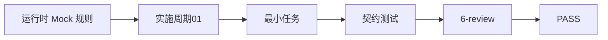
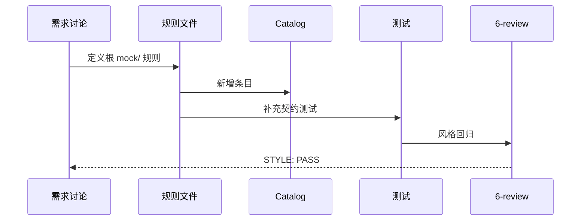

# 运行时 Mock 与测试 Mock 分离规则

结论：当前仓库规则只定义了测试 Mock（根 `test/` 源码镜像），缺少运行时 Mock（本地开发编译进主二进制替代不可用上游）的定义。本需求新增根 `mock/` 作为运行时 Mock 唯一合法目录，采用 `//go:build mock` 构建标签隔离，与现有 `test/` 规则对等且互不替代。
影响：Go 后端项目可通过根 `mock/` 按被测源码镜像路径存放运行时 Mock，不污染业务源码目录，不混入测试资产。
范围：`test-program-rules`、`artifact-storage-rules`、`test-strategy-rules`、`package-structure-rules` 的 SKILL.md 与 references，placement-catalog.yaml 新增条目，人工目录树更新，AGENTS.md/CLAUDE.md 与 PROJECT_MEMORY.md 同步，新增 runtime-mock-pattern.md 参考文档，新增契约测试。
非范围：不迁移现有业务项目的 mock 文件（提供迁移指南），不改动前端 `mocks/` 规则，不修改 `placement_catalog.py` 实现逻辑，不执行 Git 历史写入。
变化：新增根 `mock/` 目录规则，运行时 Mock 与测试 Mock 职责分离。
完成标准：SKILL.md 规则一致、Catalog 可查询、目录树可渲染、契约测试通过、6-review STYLE: PASS。
术语说明：运行时 Mock 是本地开发编译进主二进制、替代不可用上游的模拟实现；测试 Mock 是仅 `*_test.go` 使用的模拟实现。
验证状态：asset_location_test.py 13/13、package-structure-rules 全量回归 26/26、6-review STYLE: PASS。

## 文档信息

| 字段 | 内容 |
| --- | --- |
| 来源 | 用户需求讨论 |
| 关联需求 | 无 |
| 关联实施 | 2026-08-08_运行时Mock与测试Mock分离_实施周期01 |

## 需求来源与证据台账

| 来源 | 证据 | 用途 |
| --- | --- | --- |
| 用户讨论 | 项目仓库 `internal/business/scalp/api/mock_gateway.go` 存在运行时 Mock 混入源码目录 | 需求来源：运行时 Mock 无处安置 |

## 目标与非目标

### 目标

- 定义运行时 Mock 的唯一合法目录根 `mock/`。
- 明确运行时 Mock 与测试 Mock 的职责分离。
- 补充构建标签 `//go:build mock` 的使用规范。
- 同步所有相关 SKILL.md、references、Catalog、目录树、四件套。

### 非目标

- 不迁移现有业务项目的 mock 文件。
- 不改动前端 `mocks/` 规则。
- 不修改 `placement_catalog.py` 实现逻辑。
- 不执行 Git 历史写入。

## 功能需求与规则要求

### REQ-01：根 mock/ 目录

- 根 `mock/` 是运行时 Mock 唯一合法目录，与根 `test/` 对等，按被测源码相对路径镜像。
- 文件必须以 `//go:build mock` 开头，包名约定 `mock_<源包名>`。
- 构建标签传递：`go run -tags mock .`、`go build -tags mock .`。

### REQ-02：规则同步

- 同步 `test-program-rules`、`artifact-storage-rules`、`test-strategy-rules`、`package-structure-rules` 的 SKILL.md。
- Catalog 新增 2 个条目标识。
- 人工目录树更新。
- AGENTS.md/CLAUDE.md 与 PROJECT_MEMORY.md 同步。

## 数据与外部契约

N/A + 原因 + 证据：本需求为仓库规则修订，不涉及数据库、API 或外部服务。

## 风险、假设、依赖与阻断

| 风险 | 概率 | 影响 | 缓解措施 |
| --- | --- | --- | --- |
| 根 `mock/` 被误认为前端 `mocks/` | 低 | 低 | 目录树中明确标注单数/复数区别 |
| 构建标签误用 | 低 | 中 | 提供完整迁移指南和示例 |

## 决策冻结

- 根 `mock/` 是运行时 Mock 唯一合法目录，与根 `test/` 对等，按被测源码相对路径镜像。
- 运行时 Mock 文件必须以 `//go:build mock` 开头，包名约定 `mock_<源包名>`。
- 构建标签传递：`go run -tags mock .`、`go build -tags mock .`。
- 运行时 Mock 与测试 Mock 职责分离，互不替代。
- 前端既有 `mocks/`（复数）保持不变，后端 `mock/`（单数）与其理念一致。

## 普通模型零决策执行契约

N/A + 原因 + 证据：本需求为仓库规则修订，不涉及业务代码实现，不产生 DTO、API、数据库、迁移或外部调用。

## 追踪契约

图形目的：展示需求到实施到测试到风格回归的追踪链；关联 ID：REQ-RUNTIME-MOCK-20260808-01

图形目的：展示需求讨论到规则文件到Catalog到测试到风格回归的协作流程；关联 ID：REQ-RUNTIME-MOCK-20260808-01

图片资产决策：N/A + 原因 + 证据：本需求文档使用 Mermaid 图示，不需要位图资产。

## 执行附录

### 主追踪矩阵

| ID | 类型 | 描述 | 实施 | 测试 | 证据 |
|---|---|---|---|---|---|
| REQ-RUNTIME-MOCK-20260808-01 | 需求 | 运行时 Mock 根目录规则 | CYCLE-RUNTIME-MOCK-01 | TEST-RUNTIME-MOCK-001 | 6-review PASS |
| REQ-01 | 规则 | 根 mock/ 目录定义 | 规则文件 | asset_location_test.py |  |
| REQ-02 | 规则 | 规则同步 | 6 个 SKILL.md | 跨 Skill 一致性测试 |  |

## 追踪附录

`REQ-RUNTIME-MOCK-20260808-01` -> `CYCLE-RUNTIME-MOCK-01` -> `TASK-RUNTIME-MOCK-01` -> `TEST-RUNTIME-MOCK-001` -> `STYLE: PASS`。
