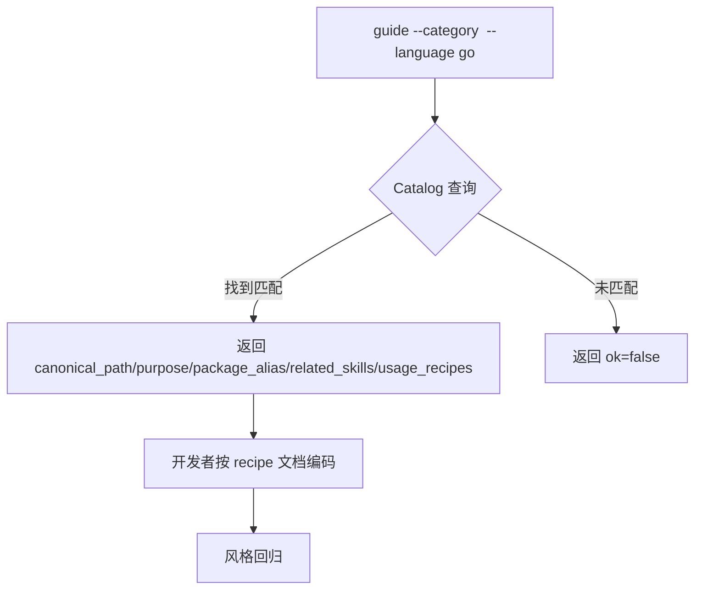
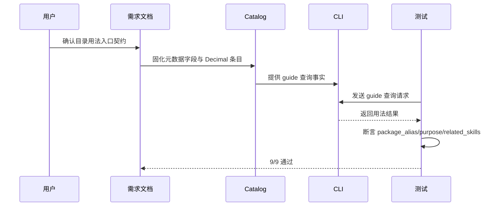

# 目录用法入口升级

结论：目录位置规则升级为目录驱动的用法入口，让 Catalog 每个目录节点都能关联代码风格、工具包写法、实用 recipe 和相关 skill。影响：编码时从目录查询直接获得用法指引，不再需要分别查多个 skill。范围：Catalog Schema 扩展元数据字段、guide CLI 子命令、索引文档、recipe 文档（含 Decimal 目录）。非范围：不改动其他 skill 的 SKILL.md 正文，不改动既有 CLI 子命令行为。变化：新增 guide 子命令、新增 4 个 Catalog 元数据字段、新增 Decimal 目录规则。完成标准：guide 子命令对七类 recipe 正确输出，九个契约测试全绿，字典生成退出码 0。术语说明：guide 是 CLI 用法查询子命令；recipe 是跨 skill 的代码用法示例。验证状态：全部实施周期已完成，Decimal 目录规则收录完成，全部测试通过。

## 文档信息

| 项目 | 内容 |
|---|---|
| 文档编号 | `REQ-PSR-DIR-USAGE-001` |
| 归属实施周期 | `CYCLE-01/02/03/04` |
| 状态 | accepted |
| unresolved_decisions | 无；Decimal 目录收录的落点、包别名和关联 skill 三个决策已由用户源码确认 |

## 需求来源与证据台账

| 来源 ID | 来源 | 事实 | 证据 |
|---|---|---|---|
| `SRC-PSR-DIR-USAGE-001` | 用户本轮确认 | 用户要求 package-structure-rules 从目录树入口关联代码风格、工具包写法和相邻 skill | 用户消息 |
| `CHG-PSR-DIR-USAGE-DECIMAL-001` | 用户本轮确认 | 用户要求将 F:\\binance-wangge-go\\utils\\decimal\\decimal.go 收录到目录树 Skill 规则 | 用户消息，源码文件 |
| `CHG-PSR-DIR-USAGE-DECIMAL-001` | 当前项目事实 | Decimal 源码包含 sql.Scanner、driver.Valuer、四则运算、比较、构造函数等完整能力 | `decimal.go` 源码 |

## 目标与非目标

| 类别 | 内容 |
|---|---|
| 目标 | Catalog 可查询工具包目录用法，含 Decimal 目录收录 |
| 非目标 | 不改动其他 skill 的 SKILL.md 正文，不改动既有 CLI 子命令行为，不修改 F:\\binance-wangge-go 源码，不执行 Git 提交 |

## 决策冻结

| ID | 决策 | 结论 |
|---|---|---|
| `DEC-DIR-USAGE-001-A` | 实现方式 | 在 `package-structure-rules` 内补强，不新增独立 Skill |
| `DEC-DIR-USAGE-001-B` | 元数据范围 | 4 个 optional 字段：related_skills、usage_recipes、package_alias、example_scope |
| `DEC-DIR-USAGE-001-C` | Go 包别名 | decimalUtil，与 timeUtil/jsonUtil/logUtil/httpUtil 风格一致 |
| `DEC-DIR-USAGE-001-D` | 关联 skill | common-util-rules、database-query-rules、database-schema-rules |

## 功能需求与规则要求

| 规则 ID | 规则 | 验证 |
|---|---|---|
| `REQ-GUIDE-001` | Schema 新增 related_skills、usage_recipes、package_alias、example_scope 四个 optional 字段 | Schema 语法校验、guide 查询测试 |
| `REQ-GUIDE-002` | Catalog 中所有 utils 条目都标注元数据字段 | 全部 utils 条目检查测试 |
| `REQ-GUIDE-003` | guide CLI 子命令支持按 category/technology/language 查询目录用法 | 5 个 guide 查询测试 |
| `REQ-GUIDE-004` | 首批 Go recipe 覆盖 convert/time/cache/redis/json/log/http 六类 | recipe 文档检查 |
| `REQ-GUIDE-005` | 目录用法索引文档 directory-usage-routing.md 作为文档索引入口 | 格式检查 |
| `CHG-DECIMAL-001` | `backend.utils.decimal` 条目唯一可查，guide 返回 decimalUtil 别名 | guide 查询测试 |
| `CHG-DECIMAL-002` | project-layout-v2.md 后端目录树包含 utils/decimal/ | 目录树检查测试 |
| `CHG-DECIMAL-003` | usage-recipes-go.md 包含 decimal recipe 小节 | recipe 文档检查测试 |
| `CHG-DECIMAL-004` | directory-usage-routing.md 包含 utils/decimal 索引 | 索引检查测试 |

## 非功能要求、风险与阻断

- 所有行为测试使用本地 Python 与临时目录，不连接外部服务。
- 风险：guide 新增 Decimal 分类可能影响既有输出；缓解：仅 backend 条目启用，不改变其他分类行为。
- 阻断：无。

## 完成条件

| AC | 完成条件 | 证据 |
|---|---|---|
| `AC-GUIDE-001` | guide --category time --language go 返回 timeUtil 别名 | `backend_utils_usage_routing_test.py` |
| `AC-GUIDE-002` | guide --category conversion --language go 返回 utils/convert | `backend_utils_usage_routing_test.py` |
| `AC-GUIDE-003` | guide --category cache --technology redis --language go 返回 utils/cache/redis | `backend_utils_usage_routing_test.py` |
| `AC-GUIDE-004` | 所有 utils 条目标注 related_skills | `backend_utils_usage_routing_test.py` |
| `AC-GUIDE-005` | backend-util-layout.md 中每个目录在 Catalog 中有对应条目 | `backend_utils_usage_routing_test.py` |
| `AC-DECIMAL-001` | guide --category decimal --language go 返回 decimalUtil 别名 | `backend_utils_usage_routing_test.py` |
| `AC-DECIMAL-002` | project-layout-v2.md 后端目录树包含 utils/decimal/ | `backend_utils_usage_routing_test.py` |
| `AC-DECIMAL-003` | usage-recipes-go.md 包含 decimal recipe 小节 | `backend_utils_usage_routing_test.py` |
| `AC-DECIMAL-004` | directory-usage-routing.md 包含 utils/decimal 索引 | `backend_utils_usage_routing_test.py` |

## 追踪矩阵

| SRC/DEC | RULE | AC | CYCLE/TASK | 文件/符号 | TEST | EVIDENCE |
|---|---|---|---|---|---|---|
| `SRC-PSR-DIR-USAGE-001` / `DEC-DIR-USAGE-001-A/B` | `REQ-GUIDE-001/002` | `AC-GUIDE-004/005` | `CYCLE-01/T01-01/02/03` | placement-catalog.yaml、placement-catalog.schema.json、backend-util-layout.md | Schema 校验、Catalog 查询 | 测试文件 |
| `SRC-PSR-DIR-USAGE-001` / `DEC-DIR-USAGE-001-A` | `REQ-GUIDE-003/004/005` | `AC-GUIDE-001/002/003` | `CYCLE-02/T02-01/02/03` | directory-usage-routing.md、placement_catalog.py、usage-recipes-go.md | guide 五类 recipe 测试 | 测试文件 |
| `CHG-PSR-DIR-USAGE-DECIMAL-001` / `DEC-DIR-USAGE-001-C/D` | `CHG-DECIMAL-001/002/003/004` | `AC-DECIMAL-001/002/003/004` | `CYCLE-04/T04-01/02/03` | placement-catalog.yaml、project-layout-v2.md、usage-recipes-go.md、directory-usage-routing.md | 4 个 decimal 专项测试 | 测试文件 |

## 判定流程

图形目的：说明目录用法入口从查询到编码的判定顺序。关联 ID：`REQ-GUIDE-001` 至 `REQ-GUIDE-005`。

## 规则与验证顺序

图形目的：说明需求文档、Catalog、CLI 与测试之间的端到端关系。关联 ID：`AC-GUIDE-001` 至 `AC-DECIMAL-004`。

## 普通模型零决策执行契约

| 项目 | 冻结内容 |
|---|---|
| 新代码落点 | `utils/decimal/` 是 Decimal 高精度数值类型封装唯一目录 |
| 职责 | Catalog 只做索引和转发，不复制专业 skill 编码规则 |
| 数据边界 | 项目无关、可独立复制的技术工具包进入根 `utils/<package>/` |
| 初始化 | 条件提交，不为 Decimal 创建占位文件 |
| 免测 | N/A + 原因：CLI 判定行为必须真实运行测试 + 证据：`TEST-PSR-DIR-USAGE-001` |

## 追踪契约

- 链路必须保持 `SRC/DEC -> RULE -> AC -> CYCLE/TASK -> 文件/符号 -> TEST -> EVIDENCE`。
- 每个 AC 必须有正向或反向真实测试，不得以静态阅读替代行为证据。
- 本需求无图片资产：N/A + 原因：不涉及界面或截图 + 证据：两张 Mermaid 图表达全部判定关系。

## 图片资产决策

图片资产决策：N/A + 原因：本需求不涉及界面、截图或视觉验收对象 + 证据：判定流程与端到端顺序已由两张 Mermaid 图表达。

## 约束

- 真实测试只使用本地 Python 和临时目录，不连接数据库、缓存、消息队列或外部服务。
- 免测：N/A + 原因：本次修改 CLI 可执行判定，必须运行行为测试；静态阅读不能替代真实测试。
- 提交边界：本需求不授权 commit、push、rebase、merge 或其它 Git 历史写入。

## 变更历史

| 版本 | 日期 | 变更 | 来源 |
|---|---|---|---|
| v1.0 | 2026-08-08 | 初始版本 | 目录用法入口升级 |
| v1.1 | 2026-08-09 | 新增 Decimal 目录规则收录 | CHG-PSR-DIR-USAGE-DECIMAL-001 |
