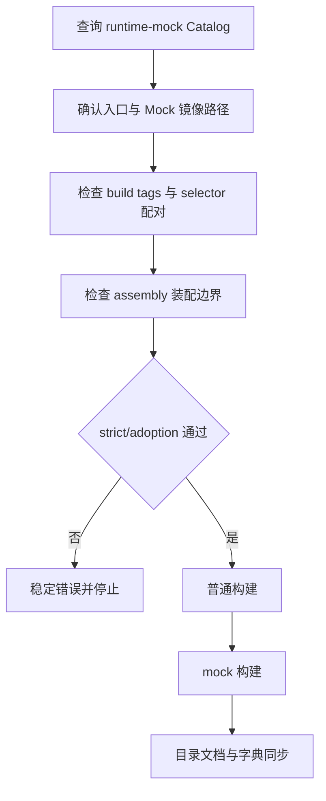
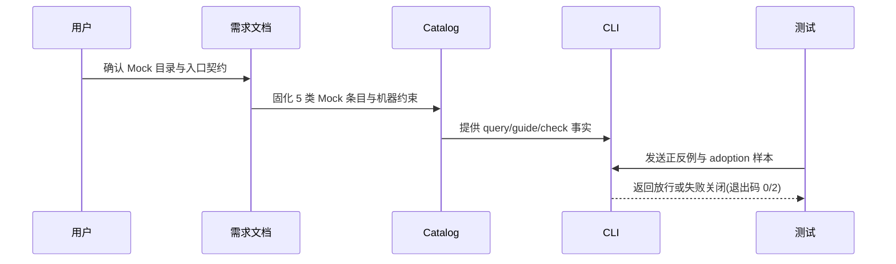

# 代码位置目录规则 V2：运行时 Mock 目录树 Skill 升级

结论：把 `package-structure-rules` 从"声明 `mock/` 是合法目录"升级为"Catalog 可查询、CLI 可检查、Go 后端可验证"的运行时 Mock 规范；影响：后端入口、Mock 装配、目录归位和本地调试；范围：Go 后端及前后端同仓后端的运行时 Mock；非范围：前端 `mocks/`、Java/Node/Python Mock、测试专用 Mock、业务 Mock 行为设计和 testnet/live 连接；变化：新增专项 reference、5 类 Catalog 元数据、Schema 约束、CLI 只读检查与正反例测试；完成标准：Catalog 查询唯一、合法样例通过、违规样例稳定失败、双构建通过、目录文档与字典一致；术语说明：`selector` 指 `main_mock.go` / `main_real.go`，`assembly` 指 Mock 装配桥接包；验证状态：计划已执行完毕，新增测试全部通过，真实项目双构建通过。

## 文档信息

| 项目 | 内容 |
|---|---|
| 文档编号 | `REQ-PSR-MOCK-UPGRADE-001` |
| 归属实施周期 | `CYCLE-PSR-MOCK-UPGRADE-001` |
| 状态 | accepted |
| unresolved_decisions | 无；升级深度、语言范围、入口强度三个决策已由用户选定 |

## 需求来源与证据台账

| 来源 ID | 来源 | 事实 | 证据 |
|---|---|---|---|
| `SRC-PSR-MOCK-UPGRADE-001` | 用户本轮确认 | 用户提交《运行时 Mock 目录树 Skill 升级计划》，要求将目录规则升级为 Catalog 可查询、CLI 可检查、Go 后端可验证 | 粘贴计划文件 |
| `SRC-PSR-MOCK-UPGRADE-001` | 当前项目事实 | `F:\binance-wangge-go` 已存在 `mock/assembly`、`main_mock.go`、`main_real.go` 和镜像实现 | 当前目录树、入口文件 |
| `SRC-PSR-MOCK-UPGRADE-001` | 当前 Catalog | 只有 backend/fullstack 各 1 个 mock root 条目，缺少 selector/assembly/implementation 分类与机器约束 | `placement-catalog.yaml` |

## 目标与非目标

| 类别 | 内容 |
|---|---|
| 目标 | `mock/` 的目录镜像、selector 配对、build tag、assembly 包名和入口导入边界形成机器可验证闭环 |
| 非目标 | 不迁移真实业务 Mock、不改变前端 `mocks/`、不扩展 Java/Node/Python Mock 规则、不写入 Git 历史 |

## 决策冻结

| ID | 决策 | 结论 |
|---|---|---|
| `DEC-PSR-MOCK-UPGRADE-001-A` | 实现方式 | 在 `package-structure-rules` 内补强，不新增独立 Skill |
| `DEC-PSR-MOCK-UPGRADE-001-B` | 代码落点 | Go 后端先行；`mock/` 按 `internal/` 相对路径镜像 |
| `DEC-PSR-MOCK-UPGRADE-001-C` | 入口强度 | 每个可替换根依赖由 `newXxx()` 选择器接线，`main_mock.go` 与 `main_real.go` 成对 |
| `DEC-PSR-MOCK-UPGRADE-001-D` | 检查策略 | strict/adoption 只读检查；adoption 不扩大旧项目遗留快照 |

## 功能需求与规则要求

| 规则 ID | 规则 | 验证 |
|---|---|---|
| `RULE-MOCK-DIR-001` | `mock/` 是运行时 Mock 唯一根，按 `internal/` 相对路径镜像；`mock/assembly/` 是唯一装配桥 | Catalog 查询、reference 一致性测试 |
| `RULE-MOCK-DIR-002` | selector 必须成对存在，`main_mock.go` 使用 `//go:build mock`，`main_real.go` 使用 `//go:build !mock` | strict 正反例测试 |
| `RULE-MOCK-DIR-003` | Mock 实现和 assembly 必须带 `mock` 标签；assembly 包名固定为 `assembly`；Mock 包名为 `mock_<源包名>` | strict 反例测试 |
| `RULE-MOCK-DIR-004` | 入口只能导入 `mock/assembly`，生产代码不得导入运行时 Mock | 入口导入边界测试 |
| `RULE-MOCK-DIR-005` | 目录树、Catalog、CLI、测试和 Skill 字典保持一致 | 全量回归、字典脚本、文档门禁 |

## 非功能要求、风险与阻断

- 目录检查只读；所有行为测试使用本地 Python 与临时目录，不连接外部服务。
- 风险 1：既有 mock root 条目的 `owner_skill` 变更会影响查询结果；缓解：统一为 `package-structure-rules` 并在测试中断言。
- 风险 2：`guide` 新增 fullstack 分支可能扩大既有输出；缓解：仅 `runtime-mock` 分类启用 fullstack，其他分类保持 backend-only。
- 阻断：`F:\binance-wangge-go` adoption 检查报告两个测试 Mock 文件不在既有 `test/` 遗留快照；这是既有快照与新加测试文件的不一致，按计划不扩大豁免，记录阻断证据。

## 完成条件

| AC | 完成条件 | 证据 |
|---|---|---|
| `AC-MOCK-DIR-001` | backend/fullstack 各 5 类 Mock 条目唯一可查；`guide --category runtime-mock --language go` 返回 10 条配方 | `runtime_mock_layout_test.py` 契约用例 |
| `AC-MOCK-DIR-002` | 合法 backend/fullstack Mock 结构通过 strict；8 类违规均退出码 2 且目录哈希不变 | `runtime_mock_layout_test.py` 行为用例 |
| `AC-MOCK-DIR-003` | adoption 对遗留 Mock 快照跳过新规则，对新增/已采纳 Mock 执行新规则 | adoption 分流测试 |
| `AC-MOCK-DIR-004` | 真实项目 `go build -mod=vendor .` 与 `go build -tags mock -mod=vendor .` 均通过 | 双构建命令输出 |
| `AC-MOCK-DIR-005` | 目录树、Catalog、reference、CLI 和字典一致；字典生成退出码 0；文档 profile PASS | 字典脚本、文档门禁 |

## 追踪矩阵

| SRC | DEC | RULE | AC | CYCLE/TASK | 文件/符号 | TEST | EVIDENCE |
|---|---|---|---|---|---|---|---|
| `SRC-PSR-MOCK-UPGRADE-001` | `DEC-PSR-MOCK-UPGRADE-001-A/B` | `RULE-MOCK-DIR-001` | `AC-MOCK-DIR-001` | `CYCLE-PSR-MOCK-UPGRADE-001/TASK-1/2` | runtime-mock-layout-go.md、placement-catalog.yaml | Catalog 查询测试 | 新增测试文件 |
| `SRC-PSR-MOCK-UPGRADE-001` | `DEC-PSR-MOCK-UPGRADE-001-C/D` | `RULE-MOCK-DIR-002/003` | `AC-MOCK-DIR-002/003` | `CYCLE-PSR-MOCK-UPGRADE-001/TASK-3` | placement_catalog.py | strict/adoption 正反例测试 | 新增测试文件 |
| `SRC-PSR-MOCK-UPGRADE-001` | `DEC-PSR-MOCK-UPGRADE-001-C` | `RULE-MOCK-DIR-004` | `AC-MOCK-DIR-002` | `CYCLE-PSR-MOCK-UPGRADE-001/TASK-3` | placement_catalog.py | 入口导入检查 | 新增测试文件 |
| `SRC-PSR-MOCK-UPGRADE-001` | `DEC-PSR-MOCK-UPGRADE-001-A/B/C/D` | `RULE-MOCK-DIR-005` | `AC-MOCK-DIR-004/005` | `CYCLE-PSR-MOCK-UPGRADE-001/TASK-4` | project-layout-v2.md、SKILL.md、字典.md | 双构建、字典、文档门禁 | 真实命令输出 |

## 判定流程

图形目的：说明 Mock 检查从查询到构建验证的判定顺序。关联 ID：`RULE-MOCK-DIR-001` 至 `RULE-MOCK-DIR-005`。

## 规则与验证顺序

图形目的：说明规则文档、Catalog、CLI 与测试之间的端到端关系。关联 ID：`AC-MOCK-DIR-001`、`AC-MOCK-DIR-005`。

## 普通模型零决策执行契约

| 项目 | 冻结内容 |
|---|---|
| 新代码落点 | `mock/` 根、`mock/assembly/`、`main_mock.go`、`main_real.go`；同仓后端 selector 位于 `backend/` |
| 职责 | `main.go` 只调用 `newXxx()`；`main_mock.go` 装配 Mock；`main_real.go` 装配真实实现 |
| 数据边界 | Mock 实现镜像 `internal/` 相对路径，包名 `mock_<源包名>`；assembly 包名固定 `assembly` |
| 初始化 | 条件提交，`init_policy: forbidden`，目录工具不得自动创建入口或 Mock 实现 |
| 免测 | N/A + 原因：CLI 判定行为必须真实运行测试 + 证据：`TEST-PSR-MOCK-UPGRADE-001` |

## 追踪契约

- 链路必须保持 `SRC -> DEC -> RULE -> AC -> CYCLE/TASK -> 文件/符号 -> TEST -> EVIDENCE`。
- 每个 AC 必须有正向或反向真实测试，不得以静态阅读替代行为证据。
- 本需求无图片资产：N/A + 原因：不涉及界面或截图 + 证据：两张 Mermaid 图表达全部判定关系。

## 图片资产决策

图片资产决策：N/A + 原因：本需求不涉及界面、截图或视觉验收对象 + 证据：判定流程与端到端顺序已由两张 Mermaid 图表达。

## 约束

- 真实测试只使用本地 Python、临时目录和本地 Go 项目，不连接数据库、缓存、消息队列或外部服务。
- 免测：N/A + 原因：本次修改 CLI 可执行判定，必须运行行为测试；静态阅读不能替代真实测试。
- 提交边界：本需求不授权 commit、push、rebase、merge 或其它 Git 历史写入。
