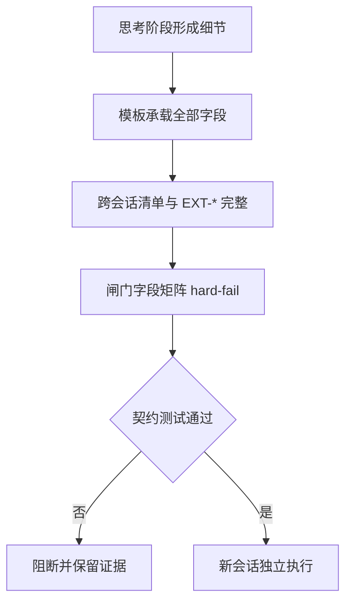
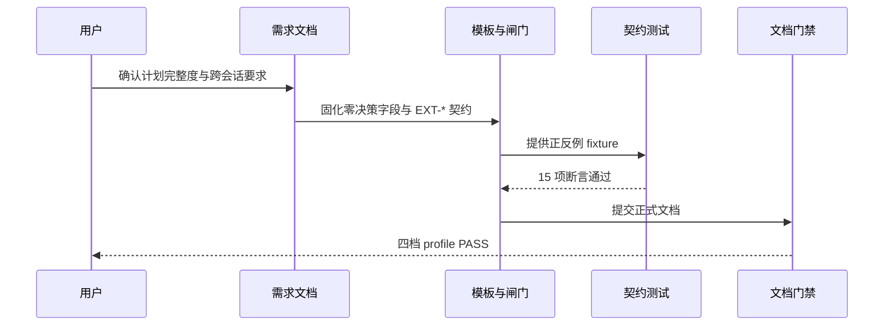

# 计划输出完整性与跨会话独立执行需求

结论：正式实施计划必须完整承载思考阶段的全部细节，并且脱离当前会话后仍可由新会话独立执行；影响：所有 Plan Mode 输出的计划不再丢失文件落点、命令、断言、清理、回滚和停止边界，跨项目代码引用必须给出可复现地址；范围：`implementation-planning-rules` 的模板、闸门、自审清单、契约、Agent 提示词、回归测试与正式文档落盘；非范围：相邻 skill 核心行为、Codex Desktop 产品源码、真实业务项目源码和 Git 历史写入；变化：计划从"章节标题骨架"升级为"零决策、跨会话可执行"的完整任务卡；完成标准：规则文件、模板、闸门、测试、正式文档和项目记忆全部同步，机器校验全 PASS；术语说明：`EXT-*` 是外部项目代码引用的稳定标识，跨会话独立执行表示计划不依赖当前对话、思考过程、悬浮窗或隐含工作目录；验证状态：规则与测试已实施，文档门禁与最终回归待收口。

## 文档信息

| 项目 | 内容 |
|---|---|
| 文档编号 | `REQ-PLAN-DETAIL-COMPLETE-002` |
| 归属实施周期 | `CYCLE-PD-02` |
| 状态 | confirmed，实施中 |
| 基线提交 | `32c1e32e98f08f1ec9250264073e6b7d72df07aa` |
| 图片资产 | `N/A`：本需求只涉及文本规则、测试 fixture 和文档，不需要位图 |

## 需求来源与证据台账

| 来源 ID | 来源 | 事实 | 证据 |
|---|---|---|---|
| `SRC-PD-001` | 用户反馈 | 思考阶段已考虑细节，但输出计划时大量细节被省略，导致计划粗糙 | 原始会话计划输出样本 |
| `SRC-PD-002` | 用户要求 | 计划必须完整详细，交给新会话也能独立执行 | 用户明确指令 |
| `SRC-PD-003` | 用户要求 | 引用其他项目代码时必须指明项目地址，避免新会话无法识别路径 | 用户明确指令 |

## 目标与非目标

| 类别 | 内容 |
|---|---|
| 目标 | 计划正文完整承载思考细节；新会话按计划可独立识别主项目、基线、当前任务、local 入口和中断点；外部项目引用逐项提供可复现地址与验证回指 |
| 非目标 | 不修改相邻 skill 的核心行为；不修改 Codex Desktop 产品源码；不写入 Git 历史；不触碰其它会话的 `package-structure-rules` 改动 |

## 决策冻结

| ID | 决策 | 结论 |
|---|---|---|
| `DEC-PD-001` | 细节落盘 | 思考中已形成的文件/符号、命令、断言、清理、回滚和完成条件必须完整写入计划正文，禁止合并或省略 |
| `DEC-PD-002` | 跨会话自包含 | 正式计划必须冻结主项目地址、仓库类型、代码基线、新会话第一步、当前周期/任务、local 环境入口和中断点核验顺序 |
| `DEC-PD-003` | 外部引用契约 | 引用其他项目代码时逐项提供 `EXT-*`、地址、版本、相对路径、符号、用途、许可证边界、可达性检查与验证回指；无引用写 `N/A + 原因 + 证据` |
| `DEC-PD-004` | 闸门硬失败 | `plan-output-gate.md` 正式字段矩阵补充跨会话清单与外部引用两行，缺字段直接 hard-fail |
| `DEC-PD-005` | 测试迁移 | 历史可执行测试资产迁至根 `test/implementation-planning-rules/`，`doc/5-tests/` 只保留 README 与证据 |

## 功能需求与规则要求

| 规则 ID | 规则 | 验证 |
|---|---|---|
| `REQ-PD-001` | 计划正文开头先写"当前计划最终方案的简要说明"，思考细节不得省略 | 模板与闸门静态检查、正例 fixture |
| `REQ-PD-002` | 正式计划必须包含跨会话独立执行清单（主项目地址、仓库类型、基线、第一步、当前任务、local 入口、中断点核验顺序） | `plan-output-gate.md` 字段矩阵、契约测试 |
| `REQ-PD-003` | 引用其他项目代码必须逐项写 `EXT-*` 全字段；无引用写 `N/A + 原因 + 证据` | 契约测试正例与缺失地址负例 |
| `REQ-PD-004` | 总览、周期、入口清单、Agent 提示词与契约文件口径一致 | 15 项契约测试静态断言 |
| `REQ-PD-005` | 阶段字段不残留跨会话前置检查与外部引用 ID，避免字段错位 | 模板静态断言 |
| `REQ-PD-006` | 测试资产迁移到根 `test/implementation-planning-rules/`，历史目录只保留 README | 测试运行与目录检查 |
| `REQ-PD-007` | 正式需求、实施总览、实施周期、测试 README 与 6-review 文档落盘并通过对应 profile | `validate_engineering_docs.py` 四档 profile |
| `REQ-PD-008` | 项目记忆与历史记录同步，临时投影输入清理 | 文件回读与 `git diff --check` |

## 非功能要求、风险与阻断

- 全部验证使用本地工作树与本地 Python，不连接数据库、缓存、消息队列、HTTP/RPC 上游或 test/prod 环境。
- 风险 1：历史实施文档引用旧测试路径；缓解：历史文档按只读保留，历史目录 README 更新为活动测试入口，正式文档统一引用新入口。
- 风险 2：另一会话存在 `package-structure-rules` 未提交改动；缓解：本任务只改 `implementation-planning-rules` 与项目记忆相关文件，禁止触碰其它会话写集。
- 阻断：文档 profile 失败、测试断言失败、`git diff --check` 报错或发现敏感信息时停止并保留证据。

## 完成条件

| AC | 完成条件 | 证据 |
|---|---|---|
| `AC-PD-001` | 15 项契约测试全部通过，包含跨会话清单、外部引用正负例与模板静态断言 | `TEST-PD-09-01` |
| `AC-PD-002` | 既有永久等待状态模型 10 项回归通过 | `TEST-PD-09-02` |
| `AC-PD-003` | 需求、实施总览、实施周期、测试 README 与 6-review 五份文档落盘 | `TEST-PD-10-01` |
| `AC-PD-004` | 四档文档 profile（requirement / implementation_overview / implementation_cycle / style_regression）全部 PASS | `TEST-PD-10-02` |
| `AC-PD-005` | 字典生成退出码 0，项目记忆与历史记录同步，`git diff --check` 无错误 | `TEST-PD-10-03` |
| `AC-PD-006` | 临时投影输入 `.codex-plan-projection-input.json` 已清理 | `TEST-PD-10-04` |

## 普通模型零决策执行契约

| 项目 | 冻结内容 |
|---|---|
| 新代码落点 | `implementation-planning-rules/references/` 下 6 个模板与契约文件、`agents/openai.yaml`、`test/implementation-planning-rules/` |
| 职责 | 普通模型只按实施周期当前任务执行，不自行补默认值、异常处理、文件落点、测试断言或回滚 |
| 数据边界 | fixture 使用脱敏样本，不包含凭证、token、连接串或用户私密数据 |
| 免测 | `N/A + 原因`：本需求修改的是规则与测试资产，必须运行真实测试验证 `+ 证据`：`TEST-PD-09-01` 与 `TEST-PD-09-02` |

## 追踪矩阵

| SRC | DEC | REQ/RULE | AC | CYCLE/TASK | 文件/符号 | TEST | EVIDENCE |
|---|---|---|---|---|---|---|---|
| `SRC-PD-001/002` | `DEC-PD-001/002/003` | `REQ-PD-001/002/003` | `AC-PD-001` | `CYCLE-PD-02/TASK-PLAN-DETAIL-08` | cross-session-plan-execution-contract.md、plan-output-gate.md、plan-structure-template.md | `TEST-PD-09-01` | `EVD-TASK-PLAN-DETAIL-08-TEST-01` |
| `SRC-PD-002/003` | `DEC-PD-004` | `REQ-PD-004/005` | `AC-PD-001` | `CYCLE-PD-02/TASK-PLAN-DETAIL-09` | 六份模板与 Agent 提示词、契约测试 | `TEST-PD-09-01` | `EVD-TASK-PLAN-DETAIL-09-TEST-01` |
| `SRC-PD-001` | `DEC-PD-005` | `REQ-PD-006` | `AC-PD-002` | `CYCLE-PD-02/TASK-PLAN-DETAIL-09` | `test/implementation-planning-rules/` | `TEST-PD-09-01/02` | `EVD-TASK-PLAN-DETAIL-09-TEST-02` |
| `SRC-PD-001/002/003` | `DEC-PD-001..005` | `REQ-PD-007/008` | `AC-PD-003..006` | `CYCLE-PD-02/TASK-PLAN-DETAIL-10` | 五份正式文档、PROJECT_MEMORY.md、PROJECT_HISTORY.md | `TEST-PD-10-01..04` | `EVD-TASK-PLAN-DETAIL-10-TEST-01`、`EVD-TASK-PLAN-DETAIL-10-TEST-02`、`EVD-TASK-PLAN-DETAIL-10-TEST-03`、`EVD-TASK-PLAN-DETAIL-10-TEST-04` |

## 垂直切片与追踪契约

链路必须保持 `SRC -> DEC -> REQ/RULE -> AC -> CYCLE/TASK -> 文件/符号 -> TEST -> EVIDENCE` 双向回指；每个 AC 必须有真实测试证据，不得以静态阅读替代行为证据。

## 判定流程

图形目的：说明计划从"思考细节"到"跨会话可执行"的判定顺序。关联 ID：`REQ-PD-001..008`。

## 规则与验证顺序

图形目的：说明模板、闸门、测试与文档门禁之间的端到端关系。关联 ID：`AC-PD-001..006`。

## 图片资产决策

图片资产决策：`N/A + 原因`：本需求不涉及界面、截图或视觉验收对象 `+ 证据`：两张 Mermaid 图已表达判定与验证顺序。

## 约束

- 真实测试只使用本地工作树和本地 Python，不连接数据库、缓存、消息队列或外部服务。
- 提交边界：本需求不授权 commit、push、rebase、merge 或其它 Git 历史写入。
