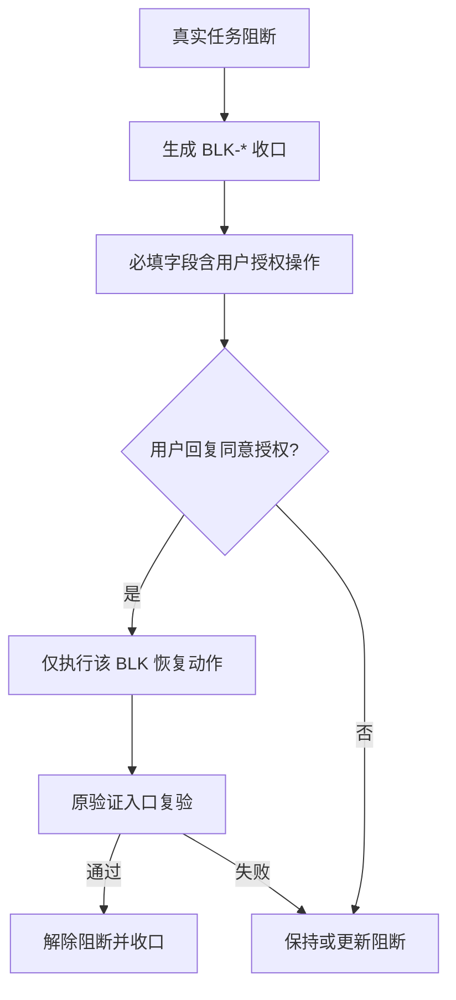
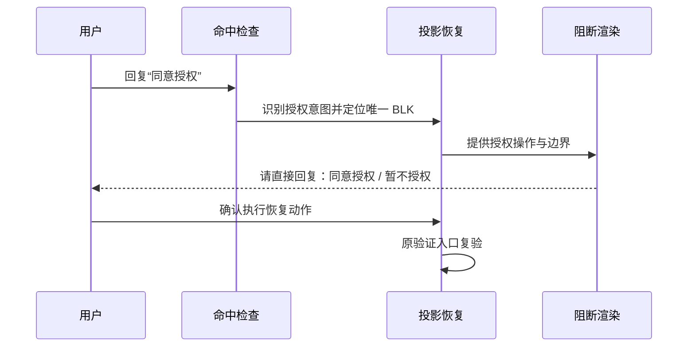

# 任务阻断授权操作提示需求

结论：真实任务阻断时必须直接告诉用户“如何恢复”，而不是只说明阻断原因；影响：所有使用本规则仓库的任务在进入任务阻断收口时，用户能一眼看到“请直接回复：`同意授权`”或“请直接回复：`暂不授权`”，并清楚授权范围；范围：阻断契约、文档质量 profile、机器校验器、最终阻断渲染、命中检查、投影恢复与根 `test/` 授权契约测试；非范围：Codex Desktop 产品源码、真实业务项目源码、Git 历史写入和其它会话的既有未提交改动；变化：阻断收口从“只说明原因”升级为“说明原因 + 给出明确授权动作 + 授权边界”；完成标准：所有真实阻断收口必须包含“用户授权操作”字段，校验器与契约测试覆盖有效授权、范围隔离、过期/多阻断拒绝和验证失败后保持阻断；术语说明：`BLK-*` 是任务阻断记录的稳定标识，`同意授权` 表示允许执行该条记录列明的恢复动作，`暂不授权` 表示保持阻断；验证状态：规则、校验器与契约测试已按本需求实施，文档门禁与最终回归待收口。

## 文档信息

| 项目 | 内容 |
|---|---|
| 文档编号 | `REQ-BLK-AUTH-001` |
| 归属实施周期 | `CYCLE-BLK-01` |
| 状态 | confirmed，实施完成 |
| 基线提交 | 当前工作树未提交基线，以 `git status` 实测为准；本需求不执行 Git 历史写入 |
| 图片资产 | `N/A`：本需求只涉及规则文本、校验逻辑和测试，不需要位图 |

## 需求来源与证据台账

| 来源 ID | 来源 | 事实 | 证据 |
|---|---|---|---|
| `SRC-BLK-001` | 用户反馈 | 执行过程出现阻断时，规则只说明“为什么阻断”，没有告诉用户如何解决 | 用户提供的截图 `codex-clipboard-2fd78dd3-8aa7-4fae-a086-eed5ae1463c1.png` |
| `SRC-BLK-002` | 用户要求 | 如果只需要回复“授权”，应该直接告诉用户，用户只要回答“同意授权”即可 | 用户本轮明确指令 |
| `SRC-BLK-003` | 决策确认 | 授权回复固定为“同意授权”，拒绝回复固定为“暂不授权”；授权仅作用于最近一条、唯一有效、仍未解除的 `BLK-*` 记录列明的恢复动作 | 需求收敛结论与实施计划 |

## 目标与非目标

| 类别 | 内容 |
|---|---|
| 目标 | 阻断收口统一展示“用户授权操作”；授权边界明确（仅最近唯一有效未解除的 `BLK-*` 恢复动作）；授权后必须执行原恢复步骤并通过原验证入口，验证失败保持阻断；命中检查与投影恢复能识别“同意授权 / 暂不授权”意图 |
| 非目标 | 不修改 Codex Desktop 产品源码；不修改真实业务项目源码；不写入 Git 历史；不触碰其它会话的既有未提交改动；不把授权解释为跨任务、跨会话或未来任意写入的通用许可 |

## 决策冻结

| ID | 决策 | 结论 |
|---|---|---|
| `DEC-BLK-001` | 授权展示范围 | 所有真实 `blocked` / `manual_handoff` 阻断收口都必须展示授权操作；`limited`、`not_applicable`、正常通过不得生成阻断收口 |
| `DEC-BLK-002` | 授权回复文案 | 明确授权回复固定为“同意授权”，拒绝/保持阻断回复固定为“暂不授权” |
| `DEC-BLK-003` | 授权作用域 | “同意授权”仅授权最近一条、唯一有效、仍未解除的 `BLK-*` 记录中列明的恢复动作；多条或过期记录时拒绝授权并提示用户确认 |
| `DEC-BLK-004` | 授权后验证 | 授权后必须执行原恢复步骤并通过原验证入口；验证失败则保持或更新阻断，不能直接解除 |
| `DEC-BLK-005` | 授权边界 | 授权不是跨任务、跨会话或未来任意写入的通用许可，不扩大编码、文件写入、外部副作用、Git 或其它权限 |

## 功能需求与规则要求

| 规则 ID | 规则 | 验证 |
|---|---|---|
| `REQ-BLK-001` | `task-blocker-closure-contract.md` 正文模板新增必填字段“用户授权操作”，并写明“请直接回复：`同意授权`”与“请直接回复：`暂不授权`” | 契约静态断言与校验器测试 |
| `REQ-BLK-002` | `document-quality-profiles.yaml` 的 `task_blocker_closure.required_fields` 同步新增“用户授权操作” | profile 读取断言 |
| `REQ-BLK-003` | `validate_engineering_docs.py` 在真实阻断时强制校验“用户授权操作”字段非空 | 缺失字段输出 `blocker.closure_invalid` |
| `REQ-BLK-004` | `reasoning-summary-structure-rules` 的最终阻断渲染必须突出显示“请直接回复：`同意授权`”，并说明授权范围边界 | 模板与条件规则静态断言 |
| `REQ-BLK-005` | `skill-hit-check-rules` 首轮命中检查识别用户“同意授权 / 暂不授权”意图并路由到恢复流程 | 命中检查规则静态断言 |
| `REQ-BLK-006` | `task-plan-rehydration-rules` 投影恢复与阻断展示必须包含授权操作和边界说明 | 投影恢复规则静态断言 |
| `REQ-BLK-007` | 根 `test/` 授权契约测试覆盖：有效授权、范围隔离、过期/多阻断拒绝、验证失败后保持阻断 | `TEST-BLK-*` 全部通过 |

## 非功能要求、风险与阻断

- 全部验证使用本地工作树与本地 Python，不连接数据库、缓存、消息队列、HTTP/RPC 上游或 test/prod 环境。
- 风险 1：阻断契约字段变化可能影响历史阻断文档；缓解：机器校验只在 `status: blocked`、审查结论“阻断”或最终验收“不通过/待重验”时启用，历史已通过文档不受影响。
- 风险 2：多 skill 同时渲染授权操作可能产生两套口径；缓解：面向用户的阻断渲染唯一由 `reasoning-summary-structure-rules` 负责，其它 skill 只提供或校验结构化事实。
- 阻断：文档 profile 失败、契约测试断言失败、`git diff --check` 报错或发现敏感信息时停止并保留证据。

## 完成条件

| AC | 完成条件 | 证据 |
|---|---|---|
| `AC-BLK-001` | 阻断契约与 profile 的必填字段包含“用户授权操作” | `TEST-BLK-001` |
| `AC-BLK-002` | 校验器在阻断文档缺少“用户授权操作”时输出 `blocker.closure_invalid` | `TEST-BLK-002` |
| `AC-BLK-003` | 最终阻断渲染模板包含“请直接回复：`同意授权`”突出提示及授权边界 | `TEST-BLK-003` |
| `AC-BLK-004` | 命中检查规则包含“同意授权 / 暂不授权”意图识别 | `TEST-BLK-004` |
| `AC-BLK-005` | 投影恢复规则包含授权操作与边界说明 | `TEST-BLK-005` |
| `AC-BLK-006` | 根 `test/` 授权契约测试四类场景全部通过 | `TEST-BLK-006` |
| `AC-BLK-007` | 需求、实施总览、实施周期与 6-review 文档落盘，对应 profile 校验全部 PASS | `TEST-BLK-007` |

## 普通模型零决策执行契约

| 项目 | 冻结内容 |
|---|---|
| 新代码落点 | `artifact-delivery-gate-rules/references/task-blocker-closure-contract.md`、`document-quality-profiles.yaml`、`scripts/validate_engineering_docs.py`、`reasoning-summary-structure-rules/`、`skill-hit-check-rules/SKILL.md`、`task-plan-rehydration-rules/SKILL.md`、根 `test/artifact-delivery-gate-rules/` |
| 职责 | 普通模型只按实施周期当前任务执行，不自行补默认值、异常处理、文件落点、测试断言或回滚 |
| 数据边界 | fixture 使用脱敏样本，不包含凭证、token、连接串或用户私密数据 |
| 免测 | `N/A + 原因`：本需求修改的是规则与校验逻辑，必须运行真实测试验证 `+ 证据`：`TEST-BLK-001..006` |

## 追踪矩阵

| SRC | DEC | REQ/RULE | AC | CYCLE/TASK | 文件/符号 | TEST | EVIDENCE |
|---|---|---|---|---|---|---|---|
| `SRC-BLK-001/002` | `DEC-BLK-001/002` | `REQ-BLK-001/002/003` | `AC-BLK-001/002` | `CYCLE-BLK-01/TASK-BLK-02` | task-blocker-closure-contract.md、document-quality-profiles.yaml、validate_engineering_docs.py | `TEST-BLK-001/002` | `EVD-TASK-BLK-02-TEST-01` |
| `SRC-BLK-001/002/003` | `DEC-BLK-002/003/004/005` | `REQ-BLK-004/005/006` | `AC-BLK-003/004/005` | `CYCLE-BLK-01/TASK-BLK-03` | reasoning-summary-structure-rules、skill-hit-check-rules、task-plan-rehydration-rules | `TEST-BLK-003/004/005` | `EVD-TASK-BLK-03-TEST-01` |
| `SRC-BLK-003` | `DEC-BLK-002..005` | `REQ-BLK-007` | `AC-BLK-006` | `CYCLE-BLK-01/TASK-BLK-04` | 根 `test/artifact-delivery-gate-rules/blocker_authorization_contract_test.py` | `TEST-BLK-006` | `EVD-TASK-BLK-04-TEST-01` |
| `SRC-BLK-001/002/003` | `DEC-BLK-001..005` | `REQ-BLK-001..007` | `AC-BLK-007` | `CYCLE-BLK-01/TASK-BLK-05` | 五份正式文档、PROJECT_MEMORY.md、PROJECT_HISTORY.md | `TEST-BLK-007` | `EVD-TASK-BLK-05-TEST-01` |

## 垂直切片与追踪契约

链路必须保持 `SRC -> DEC -> REQ/RULE -> AC -> CYCLE/TASK -> 文件/符号 -> TEST -> EVIDENCE` 双向回指；每个 AC 必须有真实测试证据，不得以静态阅读替代行为证据。

## 阻断授权判定流程

图形目的：说明阻断收口从“只说明原因”到“用户可一键授权恢复”的判定顺序。关联 ID：`REQ-BLK-001..007`。

## 授权意图识别与渲染顺序

图形目的：说明“同意授权 / 暂不授权”在命中检查、投影恢复与最终渲染之间的责任边界。关联 ID：`AC-BLK-003..006`。

## 图片资产决策

图片资产决策：`N/A + 原因`：本需求不涉及界面、截图或视觉验收对象 `+ 证据`：两张 Mermaid 图已表达判定与渲染顺序。

## 约束

- 真实测试只使用本地工作树和本地 Python，不连接数据库、缓存、消息队列或外部服务。
- 提交边界：本需求不授权 commit、push、rebase、merge 或其它 Git 历史写入。
