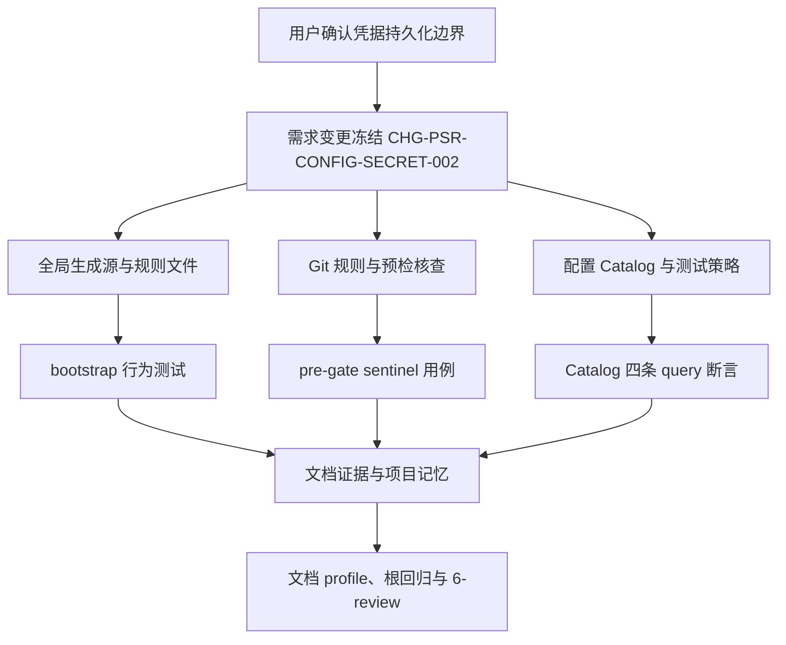
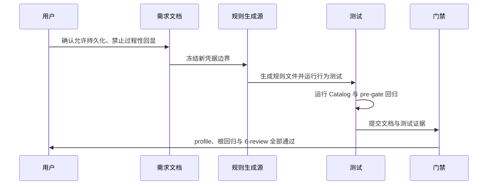

# 凭据持久化与输出脱敏变更

结论：允许将真实 API key、token、密码、私钥、连接串原值有意写入代码、配置、普通维护文档和对应 Git 提交；禁止在日志、错误信息、测试报告与证据、终端输出、Agent 中间/最终回复、会话交接、执行失败案例、自动知识摘要等过程性输出中回显原值。影响：父级全局规则、本仓库规则文件、bootstrap 生成源、Git 预检人工核查清单、配置目录规则、测试策略规则和项目记忆。范围：上述规则资产及对应本地测试；非范围：外部传输、鉴权头、非 local 环境、test/prod 连接和真实密钥读取。变化：取代此前「YAML 禁止秘密原值」和全局「禁止写入代码、文档、日志、输出或 Git 提交」口径。完成标准：bootstrap 行为测试、Git pre-gate 允许用例、Catalog 四条查询统一返回允许原值策略、五档文档 profile 和 6-review 全部通过。术语说明：凭据原值指真实 API key、token、密码、私钥、连接串；过程性输出指日志、错误信息、测试报告与证据、终端输出、Agent 回复、会话交接、执行失败案例、自动知识摘要。验证状态：本轮实施周期全部任务完成，测试与门禁全部通过。

## 文档信息

| 字段 | 内容 |
|---|---|
| 文档 ID | `REQ-PSR-CONFIG-SECRET-002` |
| 来源 | 用户确认的凭据持久化边界 |
| 变更 ID | `CHG-PSR-CONFIG-SECRET-002` |
| 当前周期 | `CYCLE-PSR-24-001` |
| 取代关系 | 部分取代 `REQ-PSR-CONFIG-SECRET-001` 的 YAML 秘密边界 |
| unresolved_decisions | 无；原因：持久化允许范围与过程性输出禁止范围均已由用户确认，无未决决策 |

图片资产决策：N/A + 原因：无视觉验收 + 证据：本文 Mermaid 流程和时序图覆盖关系。

## 普通模型零决策执行契约

- 允许将真实 API key、token、密码、私钥、连接串原值有意写入：代码、配置、普通维护文档和对应 Git 提交。
- 禁止在以下过程性输出中回显原值：日志、错误信息、测试报告与证据、终端输出、Agent 中间/最终回复、会话交接、执行失败案例、自动知识摘要、项目记忆和知识库笔记。
- 配置 Catalog 的 `secret_policy` 统一为 `allow_plain_secret`；`source_policy`、Schema、CLI 参数和返回结构保持不变。
- 不读取真实密钥，不连接外部服务，不改变 local 连接红线，不放宽 test/prod 连接限制。
- 本轮不执行 Git 历史写入；改动停在已改动未提交状态。

## 需求来源与证据台账

| 来源 ID | 已确认事实 | 规则落点 | 证据 |
|---|---|---|---|
| `SRC-PSR-CONFIG-SECRET-002` | 用户允许将真实凭据原值写入代码、配置、普通维护文档和 Git 提交。 | 父级全局规则、仓库规则、bootstrap 生成源、Git 核查清单 | 当前用户消息 |
| `REQ-PSR-CONFIG-SECRET-001` | CYCLE-19 曾将 YAML 秘密边界冻结为禁止原值。 | 旧需求文档、Catalog、测试 | 2026-08-02 需求与周期文档 |
| `CHG-PSR-CONFIG-SECRET-002` | 用户仅禁止日志、输出等过程性回显，不禁止持久化原值。 | 全部规则资产与测试 | 当前用户消息 |

## 变更范围

| 分类 | 内容 |
|---|---|
| 变更目标 | 将凭据边界从「禁止写入代码/文档/日志/输出/Git」收敛为「允许持久化、禁止过程性输出回显」。 |
| 旧值 | 全局规则禁止将真实凭据原值写入代码、文档、日志、输出或 Git 提交；YAML 配置禁止秘密原值。 |
| 新值 | 允许写入代码、配置、普通维护文档和对应 Git 提交；YAML 与 embedded 配置均允许原值；日志、错误信息、测试报告与证据、终端输出、Agent 回复、会话交接、失败案例、知识摘要禁止回显。 |
| 保持不变 | local 连接红线、test/prod 连接限制、外部传输与鉴权头边界、Catalog `source_policy`、Schema、CLI 参数和返回结构。 |
| 非范围 | 不修改真实后端加载器，不接入外部服务，不读取真实密钥，不迁移业务项目，不执行 Git 提交。 |

## 目标与非目标

| 分类 | 内容 |
|---|---|
| 目标 | 全局规则与生成源统一为「允许持久化、禁止过程性输出回显」。 |
| 目标 | 配置 Catalog 四条查询统一返回 `allow_plain_secret`。 |
| 目标 | Git pre-gate 人工核查与测试策略 Skill 同步新口径。 |
| 非目标 | 不实现通用密钥管理系统。 |
| 非目标 | 不迁移真实后端项目，不读取真实秘密，不执行 Git 历史写入。 |

## 决策冻结

| 决策 ID | 结论 |
|---|---|
| `DEC-PSR-CONFIG-SECRET-005` | 真实凭据原值允许有意写入代码、配置、普通维护文档和对应 Git 提交。 |
| `DEC-PSR-CONFIG-SECRET-006` | 日志、错误信息、测试报告与证据、终端输出、Agent 回复、会话交接、执行失败案例、自动知识摘要禁止回显原值。 |
| `DEC-PSR-CONFIG-SECRET-007` | backend/fullstack 的 YAML 与 embedded 配置条目统一 `secret_policy=allow_plain_secret`。 |
| `DEC-PSR-CONFIG-SECRET-008` | 不因本轮放宽 local 连接红线、test/prod 连接限制、外部传输与鉴权头边界。 |

## 规则与验收

| ID | 要求 | 验收 |
|---|---|---|
| `RULE-PSR-CONFIG-SECRET-005` | 父级全局规则与本仓库规则允许凭据原值持久化，禁止过程性输出回显。 | 规则文件与 bootstrap 生成源一致，行为测试通过。 |
| `RULE-PSR-CONFIG-SECRET-006` | Git pre-gate 人工核查允许代码/配置/普通文档中的凭据原值，输出不得回显。 | sentinel 允许用例与输出扫描通过。 |
| `RULE-PSR-CONFIG-SECRET-007` | Catalog 四条配置查询统一返回 `allow_plain_secret`。 | query 断言与配置回归测试通过。 |
| `RULE-PSR-CONFIG-SECRET-008` | 测试策略 Skill 只禁止输出回显与记忆存原值，不禁止配置/代码持久化。 | SKILL.md 正文与测试断言一致。 |

- `AC-PSR-CONFIG-SECRET-007`：bootstrap 临时仓库生成内容包含新凭据边界，不含旧禁句。
- `AC-PSR-CONFIG-SECRET-008`：Git pre-gate 对含 sentinel 的代码/配置/普通文档放行，且输出不含 sentinel。
- `AC-PSR-CONFIG-SECRET-009`：backend/fullstack 的 YAML/embedded 四条 Catalog 查询均返回 `allow_plain_secret`。
- `AC-PSR-CONFIG-SECRET-010`：配置 reference、目录树与 Catalog 口径一致。
- `AC-PSR-CONFIG-SECRET-011`：测试报告、文档与 Agent 输出不含真实凭据原值。
- `AC-PSR-CONFIG-SECRET-012`：四档文档 profile、根回归、Skill 合规和 6-review 全部通过。

## 功能需求

本需求只改变凭据治理语义：持久化落点（代码、配置、普通维护文档、Git 提交）允许真实原值；过程性输出（日志、错误、测试证据、终端、回复、交接、失败案例、知识摘要）禁止回显；配置 Catalog 统一放行原值策略，且不改变 `source_policy`、Schema、CLI 参数和返回结构。

## 数据与外部契约

- Catalog 继续使用 JSON 兼容 YAML，`secret_policy` 四条配置条目统一为 `allow_plain_secret`；`source_policy` 枚举和 Schema 结构不变。
- CLI 继续使用既有 `query`、`render`、`check` 和 `init` 命令，不新增参数。
- 测试只使用本地 Python、Git Bash、脱敏 sentinel 和临时目录，不连接数据库、缓存、HTTP/RPC 上游或 test/prod 环境。

## 风险、假设、依赖与阻断

| 类型 | 内容 | 处理 |
|---|---|---|
| 风险 | 「允许持久化」被误解为允许日志或 Agent 输出泄露。 | 规则文件、测试与 6-review 固化过程性输出禁止边界。 |
| 风险 | YAML 与 embedded 策略字段漂移。 | 四条 query、Schema 和专项断言同时校验。 |
| 风险 | bootstrap 生成源与规则文件正文不一致。 | 行为测试真实运行 bootstrap 并回读生成文件。 |
| 假设 | 本仓库只维护规则资产，不拥有具体后端加载器。 | 将运行时实现列为非范围。 |
| 阻断 | 需要真实密钥或外部服务才能验证。 | 立即停止，改用脱敏 sentinel 与 local fixture。 |

## 垂直切片与追踪契约

需求冻结 -> 全局生成源与规则文件 -> Git 规则与测试 -> 配置与测试策略 -> 文档证据 -> 项目记忆与最终门禁。每个 CYCLE-24 任务均登记 IMPL、TEST、STYLE 三类证据。

## 主追踪矩阵

| 上游 | 规则 | AC | 周期/任务 | 文件/符号 | 测试/证据 |
|---|---|---|---|---|---|
| `SRC-PSR-CONFIG-SECRET-002` | `RULE-PSR-CONFIG-SECRET-005..008` | `AC-PSR-CONFIG-SECRET-007..012` | `CYCLE-PSR-24-001/TASK-24-01..06` | 全局规则、bootstrap 脚本、Git 核查清单、Catalog、测试策略 Skill | `TEST-PSR-CONFIG-SECRET-005..010` |

## 流程图

图形目的：表达需求变更到规则、测试和收口的闭环。关联 ID：`REQ-PSR-CONFIG-SECRET-002`、`RULE-PSR-CONFIG-SECRET-005..008`。

## 时序图

图形目的：表达变更从需求到验证的事件顺序。关联 ID：`CHG-PSR-CONFIG-SECRET-002`、`TASK-24-01..06`。

## 追踪附录

| 影响对象 | 失效旧结论 | 本轮新结论 | 重验 Owner |
|---|---|---|---|
| `AGENTS.md`/`CLAUDE.md` | 禁止写入代码、文档、日志、输出或 Git 提交 | 允许持久化原值，禁止过程性输出回显 | TASK-24-02 |
| `bootstrap_agents.sh` | BODY_NOTICE 含旧禁句 | BODY_NOTICE 写新边界 | TASK-24-02 |
| `staged-review-and-evidence.md` | 安全核查按旧禁句理解 | 核查允许代码/配置/文档原值，输出不回显 | TASK-24-03 |
| `placement-catalog.yaml` | YAML `forbid_plain_secret` | 四条配置条目 `allow_plain_secret` | TASK-24-04 |
| `test-strategy-rules/SKILL.md` | 明文密钥不得写入文档、README、提交 | 允许持久化原值，禁止过程性输出回显 | TASK-24-04 |
