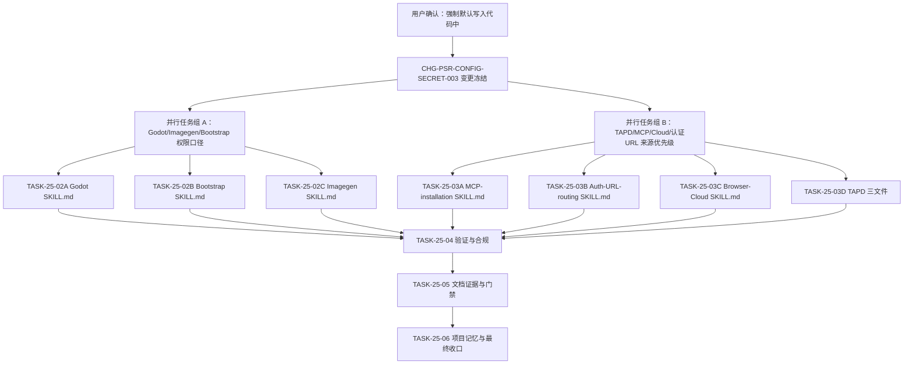
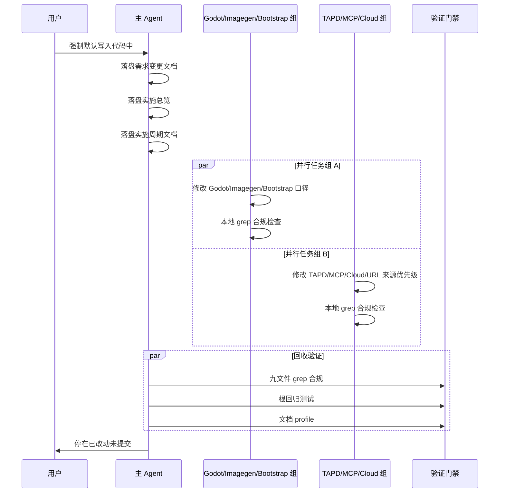

# 凭据默认代码持久化与来源优先级统一

结论：在之前已完成的"允许凭据持久化"基础上，进一步强化为"项目代码/配置为凭据默认来源，环境变量仅作运行时适配层覆盖"；影响：多个 Skill 的旧口径（"不得写入真实密钥""环境变量唯一来源""必须留空由用户填写"）需要统一修改为"项目代码/配置默认，运行时可适配到 env；禁止聊天粘贴与输出回显"；范围：godot、bootstrap、imagegen、mcp、认证 URL、browser cloud、tapd 等九个 Skill 的 SKILL.md/references/scripts；非范围：真实后端加载器、真实密钥读取、外部服务、test/prod 连接、Git 历史写入；变化：不再要求凭据来源必须经过环境变量，项目代码/配置成为默认持久化位置，环境变量只作为运行时覆盖方案；完成标准：九个 Skill 全部修改并通过本地测试与 grep 合规检查，五档文档 profile 通过；术语说明：凭据原值指真实 API key、token、密码、私钥、连接串；项目代码/配置指项目仓库内的源码、配置文件、普通维护文档；验证状态：计划已冻结，等待实施。

## 文档信息

| 字段 | 内容 |
|---|---|
| 文档 ID | `REQ-PSR-CONFIG-SECRET-003` |
| 来源 | 用户确认的"强制默认写入代码中" |
| 变更 ID | `CHG-PSR-CONFIG-SECRET-003` |
| 当前周期 | `CYCLE-25` |
| 取代关系 | 在 CYCLE-24 基础上追加"默认来源"与"来源优先级"约束 |
| unresolved_decisions | 无；原因：持久化范围、禁止回显范围、来源优先级均已由用户确认 |

图片资产决策：N/A + 原因：纯规则与文档变更，无视觉产物 + 证据：本文 Mermaid 流程图与时序图覆盖关系。

## 决策冻结

- `DEC-PSR-CONFIG-SECRET-001`：项目代码/项目配置是凭据的默认来源和默认持久化位置。
- `DEC-PSR-CONFIG-SECRET-002`：环境变量只能作为明确的运行时覆盖或适配层来源，不再作为治理层唯一默认来源。
- `DEC-PSR-CONFIG-SECRET-003`：凭据原值允许有意持久化到：项目代码、项目配置、普通维护文档、对应 Git 提交。
- `DEC-PSR-CONFIG-SECRET-004`：禁止凭据原值出现在：日志、错误信息、测试报告与证据、终端输出、Agent 中间/最终回复、会话交接、执行失败案例、自动知识摘要、项目记忆和知识库笔记。

## 普通模型零决策执行契约

- 项目代码/项目配置是凭据的默认来源和默认持久化位置。
- 环境变量只能作为明确的运行时覆盖或适配层来源，不再作为治理层唯一默认来源。
- 凭据原值允许有意持久化到：项目代码、项目配置、普通维护文档、对应 Git 提交。
- 禁止凭据原值出现在：日志、错误信息、测试报告与证据、终端输出、Agent 中间/最终回复、会话交接、执行失败案例、自动知识摘要、项目记忆和知识库笔记。
- 不读取真实密钥，不连接外部服务，不改变 local 连接红线，不放宽 test/prod 连接限制。
- 本轮不执行 Git 历史写入；改动停在已改动未提交状态。

## 需求来源与证据台账

| 来源 ID | 已确认事实 | 规则落点 | 证据 |
|---|---|---|---|
| `SRC-PSR-CONFIG-SECRET-003` | 用户要求"强制默认写入代码中"，项目代码/配置是默认来源，环境变量只作运行时覆盖 | 九个 Skill 的 SKILL.md/references/scripts | 当前用户消息 |
| `REQ-PSR-CONFIG-SECRET-002` | CYCLE-24 已允许凭据持久化，但未明确来源优先级 | 父级全局规则、仓库规则、bootstrap 生成源 | 2026-08-09 需求与周期文档 |
| `CHG-PSR-CONFIG-SECRET-003` | 来源优先级：项目代码/配置 > 环境变量（运行时覆盖） | 全部规则资产与测试 | 当前用户消息 |

## 范围与边界

| 项目 | 内容 |
|---|---|
| 范围 | godot-project-bootstrap-rules、project-rule-file-bootstrap-rules、imagegen、mcp-installation-rules、authenticated-url-routing-rules、browser-use-cloud-rules、tapd-addcomment、tapd-cli、tapd-openapi 的 SKILL.md/references/scripts |
| 非范围 | 真实后端加载器、真实密钥读取、外部服务、test/prod 连接、Git 历史写入 |
| 保护边界 | 不修改 CYCLE-24 已确认的禁止原值规则对象（agent-runtime-recovery-rules、execution-failure-learning-rules、session-handoff-rules 等） |

## 功能需求与规则要求

- `AC-PSR-CONFIG-SECRET-013`：九个 Skill 的 SKILL.md 中不再出现"不得写入真实密钥""环境变量唯一来源""必须留空由用户自行填写"等旧口径。
- `AC-PSR-CONFIG-SECRET-014`：九个 Skill 的 SKILL.md 中按各自场景明确"项目代码/配置默认，环境变量仅作运行时覆盖"的来源优先级。
- `AC-PSR-CONFIG-SECRET-015`：九个 Skill 的 SKILL.md 中保留"禁止在过程性输出中回显凭据原值"的安全边界。
- `AC-PSR-CONFIG-SECRET-016`：不修改 CYCLE-24 已确认的禁止原值规则对象（agent-runtime-recovery-rules、execution-failure-learning-rules、session-handoff-rules 等）。

## 业务规则与优先级

| 规则 | 默认 | 覆盖条件 |
|---|---|---|
| 凭据持久化位置 | 项目代码/项目配置/普通维护文档 | 无 |
| 凭据来源 | 项目代码/配置 | 环境变量仅作运行时覆盖或适配层 |
| 过程性输出 | 禁止回显凭据原值 | 无 |

## 数据与外部契约

- 不读取真实密钥，不调用外部服务。
- 不改变 local 连接红线，不放宽 test/prod 连接限制。
- 不执行 Git 历史写入；改动停在已改动未提交状态。

## 非功能要求、风险与阻断

- 风险：规则改动可能影响多个 Skill 的既有行为；通过逐文件回读和 grep 合规检查验证。
- 阻断：若目标文件不存在或当前内容与预期不一致，停止并记录 `GAP-*`。
- 依赖：本地 Python 测试环境、文档 profile 校验器。

## 追踪矩阵

| 来源 | 决策 | 需求/规则 | 验收 | 周期 | 任务 | 测试 | 证据 |
|---|---|---|---|---|---|---|---|
| `SRC-PSR-CONFIG-SECRET-003` | `DEC-PSR-CONFIG-SECRET-001` | `REQ-PSR-CONFIG-SECRET-003` | `AC-PSR-CONFIG-SECRET-013` | `CYCLE-25` | `TASK-25-02A` | `TEST-PSR-CONFIG-SECRET-011` | `EVIDENCE-PSR-CONFIG-SECRET-011` |
| `SRC-PSR-CONFIG-SECRET-003` | `DEC-PSR-CONFIG-SECRET-002` | `REQ-PSR-CONFIG-SECRET-003` | `AC-PSR-CONFIG-SECRET-014` | `CYCLE-25` | `TASK-25-03A` | `TEST-PSR-CONFIG-SECRET-012` | `EVIDENCE-PSR-CONFIG-SECRET-012` |
| `SRC-PSR-CONFIG-SECRET-003` | `DEC-PSR-CONFIG-SECRET-003` | `REQ-PSR-CONFIG-SECRET-003` | `AC-PSR-CONFIG-SECRET-015` | `CYCLE-25` | `TASK-25-04` | `TEST-PSR-CONFIG-SECRET-013` | `EVIDENCE-PSR-CONFIG-SECRET-013` |
| `SRC-PSR-CONFIG-SECRET-003` | `DEC-PSR-CONFIG-SECRET-004` | `REQ-PSR-CONFIG-SECRET-003` | `AC-PSR-CONFIG-SECRET-016` | `CYCLE-25` | `TASK-25-05` | `TEST-PSR-CONFIG-SECRET-014` | `EVIDENCE-PSR-CONFIG-SECRET-014` |

## 追踪契约

- 每个最小任务必须单独完成"实现 -> 真实测试 -> 6-review 风格回归"后才进入下一个任务。
- 每个最小任务必须写清文件落点、测试入口、断言、失败预期、清理、回滚和完成/停止条件。
- 文档落盘后必须运行 `validate_engineering_docs.py` 对应 profile；机器校验失败不得用最终回复口头说明替代。

## 需求 Mermaid 流程图

图形目的：说明需求变更冻结、并行任务组、验证门禁和最终收口的顺序。关联 ID：`REQ-PSR-CONFIG-SECRET-003`、`CYCLE-25`、`TASK-25-02A..06`。

## 需求 Mermaid 时序图

图形目的：说明用户确认、需求落盘、并行任务组、验证门禁和最终收口的时序。关联 ID：`REQ-PSR-CONFIG-SECRET-003`、`CYCLE-25`、`TASK-25-02A..06`。

